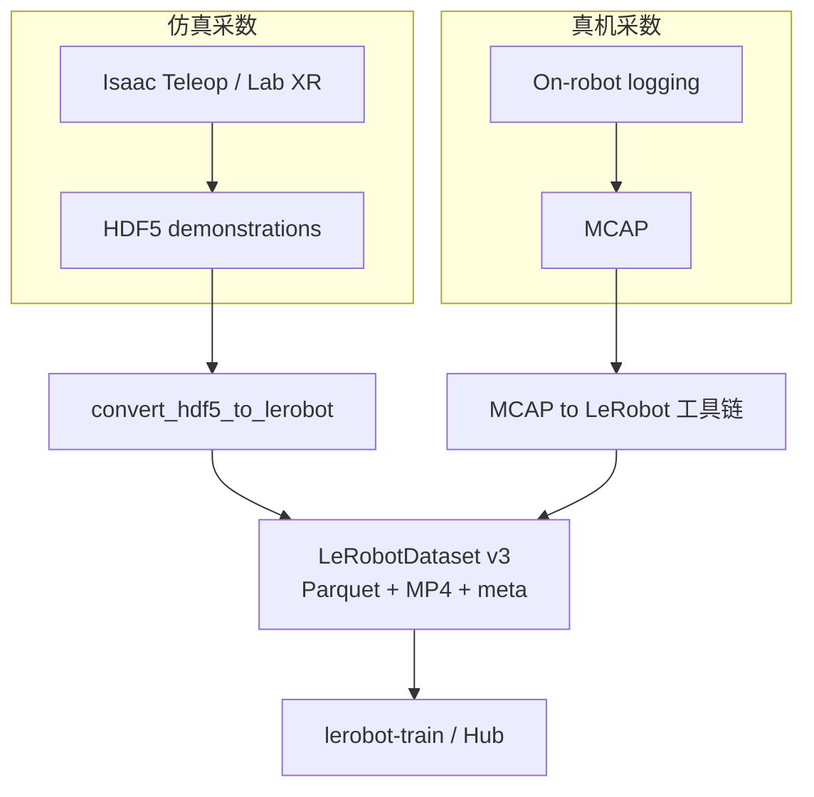

# HDF5 vs MCAP vs LeRobot 数据集格式

三种格式在具身数据管线中 **常串联出现**，但 **设计目标不同**：HDF5 是 **通用科学数组容器**；MCAP 是 **多通道时间序列日志**；LeRobot v3 是 **面向 IL/RL 训练与 Hub 分发** 的 **Parquet + MP4 + meta** 约定。

## 一句话概括

- **HDF5**：Group/Dataset **层次存储** + chunk/压缩；schema **项目自定义**；仿真 teleop、MimicGen 等 **中间/训练源** 常见。  
- **MCAP**：**Serialization-agnostic** pub/sub **日志**；Schema/Channel/Message + 可选 **索引**；真机录制与 Foxglove 复盘。  
- **LeRobot v3**：**训练 API 统一**（`LeRobotDataset`）；Parquet 表 + MP4 视频 + **`meta/`**；Hub **流式** 与 v2.1 **迁移工具**。

## 英文缩写速查

| 缩写 | 英文全称 | 简要说明 |
|------|----------|----------|
| HDF5 | Hierarchical Data Format 5 | 数组与 group 容器 |
| MCAP | — | Foxglove 日志容器格式 |
| IL | Imitation Learning | 三种格式的常见下游任务 |
| Parquet | Apache Parquet | LeRobot v3 表数据 |
| Hub | Hugging Face Hub | LeRobot 数据集托管 |
| MP4 | MPEG-4 Part 14 | LeRobot v3 视频 shard |

## 一手规范入口

| 格式 | 权威来源 | 本库归档 |
|------|----------|----------|
| HDF5 | [HDF Group Introduction](https://support.hdfgroup.org/documentation/hdf5/latest/_intro_h_d_f5.html) | [hdf-group-hdf5-intro.md](../../sources/sites/hdf-group-hdf5-intro.md) |
| MCAP | [mcap.dev/spec](https://mcap.dev/spec) | [mcap-spec.md](../../sources/sites/mcap-spec.md) |
| LeRobot v3 | [HF docs lerobot-dataset-v3](https://huggingface.co/docs/lerobot/lerobot-dataset-v3) | [lerobot-dataset-v3-docs.md](../../sources/sites/lerobot-dataset-v3-docs.md) |

## 核心差异

| 维度 | HDF5 | MCAP | LeRobotDataset v3 |
|------|------|------|-------------------|
| **主要角色** | 数组/episode **文件容器** | **日志**（多 topic 时间序列） | **训练数据集** + Hub 资产 |
| **逻辑单元** | Group / Dataset | Channel / Message | Episode（meta offset 进 shard） |
| **视频** | Dataset 数组或 **外挂** | 常作 **Message 字节流**（编码自定） | **MP4 shard**  per camera |
| **表数据** | 多维数组 / compound | 每条 Message payload | **Parquet** 列（state/action/…） |
| **Schema** | **无统一机器人标准** | Schema 记录 per encoding | **`meta/info.json`** features |
| **时间索引** | 应用约定（数组下标） | **log time** + Summary/Chunk Index | 帧索引 + **`delta_timestamps`** |
| **随机读** | chunk 设计相关 | **Footer/Summary** 优化 | 本地 cache / 流式 |
| **典型写入** | h5py / C API | mcap Writer / ROS 桥 | `lerobot-record` |
| **开源实现** | HDF Group / h5py | foxglove/mcap | huggingface/lerobot |

## 在管线中的位置（NVIDIA 示例）

（真机 MCAP → LeRobot 见 [Isaac GR00T](../entities/isaac-gr00t.md) 与 Isaac ROS 参考工作流；仿真 HDF5 见同页 **`convert_hdf5_to_lerobot.py`**。）

## 选型建议

### 优先 HDF5

- 仿真里已有 **robomimic / MimicGen / 自定义 numpy** 流水线  
- 需要 **compound 表** 或 **单文件多 episode group**  
- 短期 **不** 上 Hub，只在本地 IL 代码读数组

### 优先 MCAP

- **多传感器 topic** 长时间录制、需 **Foxglove/PlotJuggler 时间轴**  
- 载荷已是 **ROS 2 / Protobuf** 等消息流  
- 要先 **日志归档**，再异步转训练集

### 优先 LeRobot v3

- 目标 **`lerobot-train`**、π0/SmolVLA 等 **LeRobot 策略**  
- 需要 **Hub 共享**、**StreamingLeRobotDataset**、社区数据集互操作  
- 已确定 **v3 meta/stats/tasks** 工作流（含 **`finalize()`** 推送）

## 常见误区

- **「MCAP 可以直接 lerobot-train」** — 通常需 **转换** 与字段映射；LeRobot 读的是 v3 目录布局。  
- **「HDF5 与 LeRobot 键名一致」** — HDF5 键 **项目自定义**；转换靠 YAML（如 GR00T config）。  
- **「v2.1 LeRobot 与 v3 相同」** — v2 **每 episode 单文件**；v3 **shard + meta offset**（见 [v3 概念页](../concepts/lerobot-dataset-v3.md)）。  
- **「三种互斥」** — 实际常 **MCAP/HDF5 → LeRobot** 两阶段。

## 关联页面

- [HDF5 文件格式](../concepts/hdf5-file-format.md)
- [MCAP](../entities/mcap-log-format.md)
- [LeRobotDataset v3.0](../concepts/lerobot-dataset-v3.md)
- [LeRobot（框架）](../entities/lerobot.md)
- [遥操作（Teleoperation）](../tasks/teleoperation.md)

## 参考来源

- [sources/sites/hdf-group-hdf5-intro.md](../../sources/sites/hdf-group-hdf5-intro.md)
- [sources/sites/mcap-spec.md](../../sources/sites/mcap-spec.md)
- [sources/sites/lerobot-dataset-v3-docs.md](../../sources/sites/lerobot-dataset-v3-docs.md)

## 推荐继续阅读

- [LeRobotDataset v3.0 官方文档](https://huggingface.co/docs/lerobot/lerobot-dataset-v3)
- [MCAP evaluation PDF（动机）](https://mcap.dev/files/evaluation.pdf)
