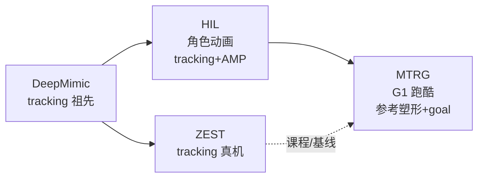

# HIL vs MTRG vs ZEST：跑酷模仿学习路线对比

同一作者群从 **物理角色动画跑酷**（[HIL](../methods/hil-hybrid-imitation-learning.md)）演进到 **人形 G1 箱式跑酷**（[GfR / MTRG](../methods/mtrg-reference-goal-driven-rl.md)，**RSS 2026**），并与工业侧极简 tracking 真机路线 [ZEST](../methods/zest.md) 形成对照。

三者都处理「像参考」与「能改目标/障碍」的张力，但 **参考是否进策略、是否用对抗、是否上硬件** 的分工截然不同。

## 英文缩写速查

| 缩写 | 英文全称 | 简要说明 |
|------|----------|----------|
| GfR | Generalizing from References | MTRG 方法的官方项目名（RSS 2026） |
| HIL | Hybrid Imitation Learning | 跟踪 + 对抗模仿的并行多任务框架 |
| MTRG | Multi-Task Reference and Goal-Driven RL | 本库对 GfR 的方法导航标签 |
| AMP | Adversarial Motion Prior | 判别器提供 style reward 的运动先验 |
| OOD | Out-of-Distribution | 训练分布外的初始位姿、距离与障碍布局 |
| MoCap | Motion Capture | walk-jump / climb 等技能的参考来源 |

## 核心对比

| 维度 | [HIL](../methods/hil-hybrid-imitation-learning.md) | [MTRG](../methods/mtrg-reference-goal-driven-rl.md) | [ZEST](../methods/zest.md) |
|------|---------------------------------------------------|-----------------------------------------------------|----------------------------|
| **载体** | 物理仿真角色（SMPL） | Unitree G1 人形 | 多形态硬件（含 G1） |
| **参考角色** | tracking + AMP 并行训练 | **仅训练奖励塑形**；部署只见 goal | **部署时跟下一步参考** |
| **对抗 / 判别器** | 是（场景条件 style） | 否 | 否 |
| **观测** | 状态 + 场景点云 + goal | 本体状态 + 2D goal | 状态 + 参考关节/相位 |
| **OOD 泛化** | 障碍布局/序列泛化（仿真） | beyond-nominal 位姿/箱高（论文 Table I） | 跨形态 + 课程辅助扳手 |
| **真机** | 否 | 是（MoCap 全局位姿） | 是（主推路线） |

## 何时选 HIL

- 目标是 **人–场景交互动画**（vault、plyo、障碍序列），不要求人形真机。
- 需要 **场景点云** 充当空间相位、统一 tracking 与 target-following 观测空间。
- 可接受 **对抗训练** 与判别器调参成本。

**瓶颈**：无硬件验证；对抗分支迁移到真机成本高——同人形跑酷主题应评估 MTRG/ZEST。

## 何时选 MTRG

- **G1 箱式跑酷**：walk-jump / walk-climb / climb-down 等需 **偏离参考仍能冲目标**。
- 希望 **部署接口极简**（仅 2D goal），参考轨迹不出现在推理时。
- 已有 ZEST 课程（λ、辅助扳手）经验，想叠加 **参考塑形 + 稀疏 goal** 多任务。

**瓶颈**：硬件实验依赖 **MoCap 全局位姿**；箱体精确位姿未给策略——与纯感知栈需额外模块。

## 何时选 ZEST

- 首要目标是 **跨形态真机 motion tracking**，参考质量高、部署时可逐步播放参考。
- 需要 **工业可复现** 的极简接口与已验证 sim2real 路径。
- OOD 以 **初始位姿偏离** 为主，可接受「硬跟参考」在极端偏离时的失败模式。

**瓶颈**：beyond-nominal 泛化弱于 MTRG（论文 walk-jump success 0.17 vs 0.62）；不适合「完全无参考部署」场景。

## 组合与演进关系

- **研究脉络**：HIL 验证混合模仿 + 场景条件 AMP → MTRG 去掉对抗、把人形跑酷做到 **goal-only 部署**。
- **工程脉络**：ZEST 提供 **tracking + 辅助扳手课程** 基线；MTRG 在其 λ 课程上扩展 **模仿/泛化任务采样**。
- **与 AMP 家族**：HIL 是 [AMP](../methods/amp-reward.md) 在人–场景跑酷的代表扩展；MTRG 刻意 **放弃对抗**，用多任务奖励分解。

## 关联页面

- [Humanoid Locomotion](../tasks/humanoid-locomotion.md) — 人形跑酷任务挂接
- [Locomotion](../tasks/locomotion.md) — 跑酷与障碍穿越总览
- [DeepMimic](../methods/deepmimic.md) — 显式 tracking 传统
- [AMP & HumanX](../methods/amp-reward.md) — style reward 来源
- [人形运动跟踪方法选型](../queries/humanoid-motion-tracking-method-selection.md) — 更广 WBT 选型

## 参考来源

- [HIL: Hybrid Imitation Learning](../../sources/papers/hil_hybrid_imitation_learning_arxiv_2505_12619.md)
- [MTRG: Reference and Goal-Driven RL](../../sources/papers/mtrg_reference_goal_driven_rl_arxiv_2602_20375.md)
- [ZEST](../../sources/papers/zest.md)
