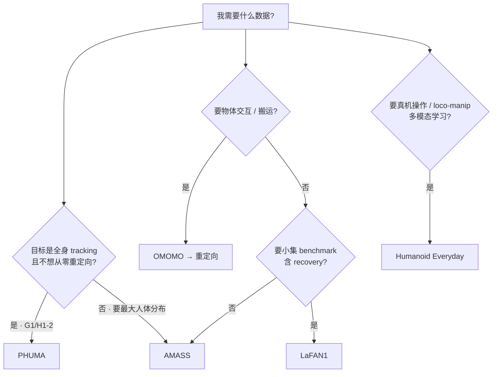

# 人形参考运动与操作数据集选型

> **对比问题**：做 humanoid motion tracking、loco-manipulation 或开放世界操作时，**AMASS、LaFAN1、OMOMO、PHUMA、Humanoid Everyday** 各解决什么缺口、能否直接训练、工程摩擦在哪？

## 英文缩写速查

| 缩写 | 英文全称 | 简要说明 |
|------|----------|----------|
| MoCap | Motion Capture | 动作捕捉，参考动作与演示数据的主要来源 |
| SMPL | Skinned Multi-Person Linear Model | 常见人体参数化模型与重定向源 |
| HOI | Human-Object Interaction | 人–物交互，操纵与接触丰富任务 |
| G1 | Unitree G1 Humanoid | 宇树教育科研人形实验平台 |
| WBT | Whole-Body Tracking | 全身关节/根轨迹跟踪类 RL 任务 |
| BFM | Behavior Foundation Model | 大规模行为数据预训练的可复用全身行为先验 |

## 一句话结论

| 数据集 | 一句话 |
|--------|--------|
| [AMASS](../entities/amass.md) | 最大宗 **SMPL 人体 MoCap 元库**；tracking 前必重定向 |
| [LaFAN1](../entities/lafan1-dataset.md) | 小规模高质量 **BVH 棚拍**；recovery / 步态基准；**NC-ND** 许可敏感 |
| [OMOMO](../entities/omomo-dataset.md) | **人–物交互** MoCap；loco-manipulation 重定向源 |
| [PHUMA](../entities/dataset-bfm-phuma.md) | **已 PhySINK 重定向到 G1/H1-2** 的 73 h locomotion；宇树友好 |
| [Humanoid Everyday](../entities/humanoid-everyday-dataset.md) | **真机人形操作** 多模态集；非 MoCap 参考库 |

## 对照表

| 维度 | AMASS | LaFAN1 | OMOMO | PHUMA | Humanoid Everyday |
|------|-------|--------|-------|-------|-------------------|
| **主体** | 人体 | 人体 | 人体 + 物体 | **机器人（G1/H1-2）** | **人形机器人** |
| **表示** | SMPL 参数 | BVH 骨架 | SMPL-H + 物体运动 | `root_*` + `dof_pos` | RGB-D-LiDAR-触觉+语言 |
| **规模量级** | 40+ h / 11k+ 动作 | ~4.6 h / 77 序列 | ~10 h / 15 物体 | ~73 h / 76k clips | 10.3k 轨迹 / 3M+ 帧 |
| **任务侧重** | 通用 locomotion / 风格 | 行走·恢复·舞蹈 | **操纵 / HOI** | **物理可信 locomotion** | **开放世界操作** |
| **预重定向** | 否 | 否 | 否 | **是（G1/H1-2）** | 不适用（已是机器人） |
| **典型下游** | AMP、GMT、BFM 蒸馏 | wbc_fsm、SD-AMP、SPRINT | OmniRetarget、ResMimic | ProtoMotions、LIMMT、BeyondMimic | VLA / 操作模仿、云端评测 |
| **许可注意** | 站点注册 | **CC BY-NC-ND** | SMPL 链条 | HF + 代码 LICENSE | 以项目页为准 |

## 选型决策（简图）

## 组合使用（常见管线）

1. **大规模 tracking**：AMASS（或 PHUMA 若接受其策展分布）→ GMR / PhySINK → WBT → sim2real。
2. **交互 loco-manipulation**：OMOMO（+ 自采 MoCap）→ [OmniRetarget](../entities/paper-hrl-stack-03-omniretarget.md) → G1 `qpos` → RL。
3. **轻量 recovery 原型**：LaFAN1 子集 → 重定向 → 单策略走/跑/起身（见 [SD-AMP](../entities/paper-unified-walk-run-recovery-sdamp.md)）。
4. **操作策略（非参考轨迹）**：Humanoid Everyday 真机轨迹 → 模仿 / VLA；与 MoCap 库 **互补而非替代**。

## 四段衔接：数据来源 → 质量评估 → 重定向 → 策略输入

本表只解决端到端链路的**第一段（数据来源）**。把视角拉远，一份参考运动要变成 RL/IL 能消费的训练输入，需要顺次过四道关：

| 段 | 视角 | 本表五集如何落位 | 主页面 |
|----|------|----------------|--------|
| ① 数据来源 | 选 MoCap / 视频 / 真机执行数据 | 上方对照表与决策树 | 本页 |
| ② 质量评估 | 物理可行性 / 接触一致性 / 形态差距 / 规模多样性 四轴体检 | AMASS 弱物理、PHUMA 已过滤、Humanoid Everyday 已消除形态差距 | [Motion Data Quality](../concepts/motion-data-quality.md) |
| ③ 重定向 | 形态差距大则几何映射 + 动力学一致化，差距可忽略则跳过 | AMASS/LaFAN1/OMOMO 必重定向；PHUMA 预重定向；Humanoid Everyday 免重定向 | [Motion Retargeting](../concepts/motion-retargeting.md) |
| ④ 策略输入 | 喂给 WBT / AMP / IL / VLA 的最终训练数据 | 见对照表「典型下游」行 | [人形训练数据管线选型指南](../queries/humanoid-training-data-pipeline.md) |

> 衔接判据由**第②段**给出：[四质量轴](../concepts/motion-data-quality.md) 按 **形态差距 → 接触 → 物理 → 规模** 顺序体检，决定第③段重定向**要不要做、要补几层**——这也是为什么 PHUMA / Humanoid Everyday 能跳过或简化重定向，而纯光学 MoCap 必须先过物理一致化层。整条链的端到端决策树见 [人形训练数据管线选型指南](../queries/humanoid-training-data-pipeline.md)。

## 常见误区

- **把 Humanoid Everyday 当 MoCap 重定向源**：它是 **机器人执行数据**，不解决「人体→机器人参考」问题。
- **忽视 PHUMA 与 AMASS 的重叠与差异**：PHUMA 策展自大规模互联网/Motion-X 系源，强调 **物理可信 + 已重定向**；AMASS 覆盖更广但 **伪影与重定向成本** 由用户承担。
- **LaFAN1 许可当 MIT**：**NC-ND** 限制衍生数据与商业再分发；OmniRetarget 因此 **不公开发布 LAFAN1 重定向结果**。

## 参考来源

- [AMASS 站点归档](../../sources/sites/amass-dataset.md)
- [LaFAN1 仓库归档](../../sources/repos/ubisoft-laforge-animation-dataset.md)
- [OMOMO 仓库归档](../../sources/repos/omomo_release.md)
- [PHUMA 仓库归档](../../sources/repos/phuma.md)
- [Humanoid Everyday 项目页归档](../../sources/sites/humanoideveryday.md)

## 关联页面

- [Motion Retargeting](../concepts/motion-retargeting.md)
- [Motion Data Quality（动作数据质量维度）](../concepts/motion-data-quality.md) — 把本表五集落到物理可行性/接触一致性/形态差距/规模多样性四个评估轴
- [人形训练数据管线选型指南](../queries/humanoid-training-data-pipeline.md) — 把本表作为「参考来源」第一层接入端到端三层决策树
- [Whole-Body Tracking Pipeline](../concepts/whole-body-tracking-pipeline.md)
- [OmniRetarget 数据集](../entities/omniretarget-dataset.md)
- [Unitree G1](../entities/unitree-g1.md)

## 推荐继续阅读

- [BFM 41 篇技术地图 § 数据集](../overview/bfm-41-papers-technology-map.md)
- [LIMMT（GQS 数据策展）](../methods/limmt-gqs-motion-curation.md) — AMASS / PHUMA 子集 plug-and-play 实验
