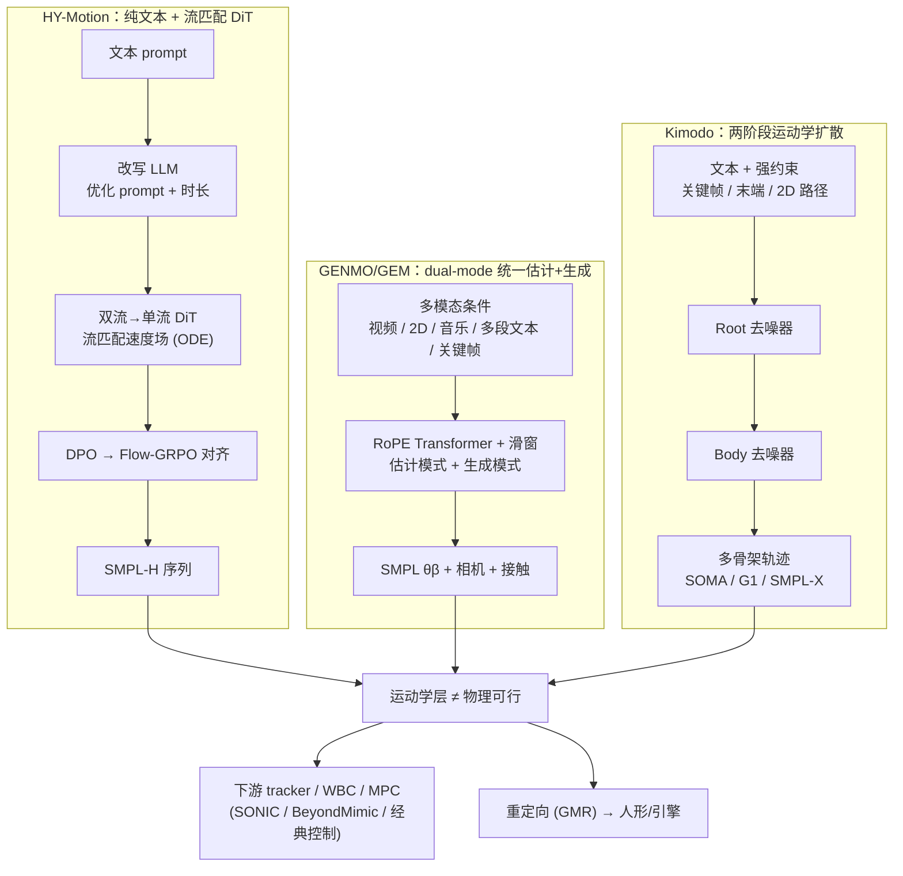

---

type: comparison
tags: [human-motion, text-to-motion, motion-generation, flow-matching, diffusion, smpl, hy-motion, genmo, kimodo, comparison, engineering-selection, nvidia]
status: complete
updated: 2026-06-05
sources:
  - ../../sources/papers/hy_motion_arxiv_2512_23464.md
  - ../../sources/repos/tencent_hunyuan_hy_motion_1_0.md
  - ../../sources/papers/genmo.md
  - ../../sources/repos/genmo.md
  - ../../sources/papers/kimodo_arxiv_2603_15546.md
  - ../../sources/repos/kimodo.md
  - ../../sources/sites/kimodo-project.md
related:
  - ../methods/hy-motion-1.md
  - ../methods/genmo.md
  - ../methods/diffusion-motion-generation.md
  - ../entities/kimodo.md
  - ../entities/awesome-text-to-motion-zilize.md
  - ../formalizations/probability-flow.md
  - ../methods/motion-retargeting-gmr.md
  - ../methods/sonic-motion-tracking.md
summary: "HY-Motion 1.0 / GENMO(GEM) / Kimodo 三条『文本·多模态 → 人体运动』生成式骨干对比：腾讯混元的十亿级流匹配 DiT（纯文本+时长、DPO/Flow-GRPO 对齐）vs NVIDIA 的 dual-mode 估计+生成统一扩散（视频/2D/音乐/关键帧多模态）vs NVIDIA 的两阶段 root/body 运动学扩散（文本+强约束、多骨架）；从生成范式、条件模态、运动表示、数据规模、对齐方式与机器人落地接口六个维度给出选型坐标。"
---

# HY-Motion vs GENMO/GEM vs Kimodo：三条「文本/多模态 → 人体运动」生成式骨干对比

**背景**：2025–2026 年「文本/多模态驱动人体运动生成」涌出一批大模型，它们都把一段语言/视频/约束变成 **SMPL 系骨架的时间序列**，但落点截然不同。本页对比三条代表性路线——腾讯混元 **[HY-Motion 1.0](../methods/hy-motion-1.md)**（十亿级 **流匹配 DiT**，纯文本 + 期望时长，全阶段对齐）、NVIDIA **[GENMO/GEM](../methods/genmo.md)**（**dual-mode** 把「估计」与「生成」统一进一套扩散，多模态条件）、NVIDIA **[Kimodo](../entities/kimodo.md)**（**两阶段 root/body 运动学扩散**，文本 + 强运动学约束，多骨架输出）。三者**不是同一道题的三个答案**：HY-Motion 押 **文本→运动的生成质量与 scaling**，GENMO 押 **视频估计与生成的同模型统一**，Kimodo 押 **可控/可编辑的约束生成**。它们共享一个硬约束——**输出都是运动学层，不等于物理可行的机器人指令**（落地仍需 [SONIC](../methods/sonic-motion-tracking.md) 类 tracker / WBC / MPC）。

> **一句话区分**：HY-Motion「**纯文本 + 时长，十亿级流匹配 DiT，靠数据 × 算力 × DPO/Flow-GRPO 把生成质量拉满**」；GENMO「**一套权重既做视频→SMPL 估计又做多模态生成，dual-mode 训练吃掉两套流水线**」；Kimodo「**文本 + 关键帧/末端/2D 路径强约束，两阶段 root/body 去噪压脚滑漂浮，直出 SOMA/G1/SMPL-X**」。

---

## 一句话定义

| 模型 | 一句话 | 厂商 / 论文 / 仓库 |
|------|--------|--------------------|
| **HY-Motion 1.0** | 十亿级 **DiT + 流匹配** 文本→**SMPL-H** 生成器 + 独立时长/改写 LLM + **DPO/Flow-GRPO** 对齐，在统一 SMPL-H 数据上做开源 SOTA 级文本驱动人体运动合成。 | 腾讯混元；[arXiv:2512.23464](https://arxiv.org/abs/2512.23464)；[Tencent-Hunyuan/HY-Motion-1.0](https://github.com/Tencent-Hunyuan/HY-Motion-1.0) |
| **GENMO / GEM** | 把**运动估计**重述为**带观测约束的扩散生成**，**dual-mode**（估计模式 + 生成模式）让同一权重在视频 / 2D / 文本 / 音乐 / 关键帧条件下同时做轨迹恢复与合成。 | NVIDIA（ICCV 2025 Highlight）；[arXiv:2505.01425](https://arxiv.org/abs/2505.01425)；[NVlabs/GENMO](https://github.com/NVlabs/GENMO) |
| **Kimodo** | **运动学空间**对骨架序列做**两阶段 root/body 扩散去噪**，约 **700h** Rigplay 训练，支持文本 + 全身关键帧 / 末端 / 2D 路点 / 稠密路径约束，落 **SOMA / G1 / SMPL-X**。 | NVIDIA；[arXiv:2603.15546](https://arxiv.org/abs/2603.15546)；[Kimodo 项目页](https://research.nvidia.com/labs/sil/projects/kimodo/docs) |

---

## 核心维度对比

| 维度 | **HY-Motion 1.0** | **GENMO / GEM** | **Kimodo** |
|------|--------------------|------------------|-------------|
| **生成范式** | DiT 双流→单流 + **流匹配**（OT 线性桥常数速度场，ODE 采样） | 扩散（DDPM/DDIM）+ RoPE Transformer + 滑窗，**dual-mode 训练** | **运动学空间扩散**，**两阶段 root → body** 去噪器 |
| **任务重心** | **文本→运动「生成」**，冲 SOTA + 验证 scaling | **估计 + 生成「统一」**（视频→SMPL 估计是一等任务） | **可控/可编辑「生成」**（导演式关键帧 + 约束跟随） |
| **条件模态** | **纯文本 + 期望时长**（另训改写 LLM 把口语映射到训练域） | **多模态**：视频特征 / 2D 关键点 / 相机 / 音乐 / **多段文本(窗口)** / 3D 关键帧 | **文本 + 运动学约束**：全身关键帧 / 稀疏关节 / 末端手脚 / 2D 路点 / 稠密路径 |
| **运动表示** | **SMPL-H 201 维/帧**（6D 旋转 + 局部位置）；**刻意弃用 HumanML3D 263 维**；**不显式建模足接触/速度通道** | SMPL θβ + gravity-view 轨迹 + 相机外参 + **手脚接触标签**（估计/生成共享） | **平滑 root + 全局关节旋转/位置**；约束与噪声**同表示**覆写 + mask；**多骨架**（somaskel77 / G1 / SMPL-X） |
| **训练数据** | **>3000h** 预训练 + **~400h** 高质量微调（野外视频 GVHMR→SMPL-X + 动捕 + 3D 资产，统一 SMPL-H 强过滤） | 强条件（视频/2D）跑估计+生成；弱条件（文本/音乐）只跑生成；**野外 2D 弱监督**扩宽生成分布 | 约 **700h** Bones Rigplay 光学动捕（另有 **288h** 公开 SEED 变体供公平对比） |
| **对齐 / 后训练** | **DPO**（人类成对偏好，约 4 万对筛 9228 高信息对）→ **Flow-GRPO**（显式物理/语义奖励） | **dual-mode** 本身即「估计 ↔ 生成」双向收益；estimation-guided 2D 弱监督扩多样性 | 约束**覆写** + 推理后处理（脚滑/约束修正，可 `--no-postprocess` 关） |
| **参数 / scaling 叙事** | **>1B**（领域内首次把流匹配 DiT 推到 B 级，给 T2M scaling 提供正样本） | 不主打参数规模，主打**统一估计+生成**的范式收益 | 主打**大规模工作室数据 + 可控性**，而非纯参数堆叠 |
| **开源形态** | 代码 + 权重（HF `tencent/HY-Motion-1.0`） | 代码 [NVlabs/GENMO](https://github.com/NVlabs/GENMO)（Apache-2.0）+ 权重 `nvidia/GEM-X`；全身扩展 [GEM-X](https://github.com/NVlabs/GEM-X) | HF 权重（多变体）+ [Benchmark](https://huggingface.co/datasets/nvidia/Kimodo-Motion-Gen-Benchmark) + 时间线 Demo |
| **机器人落地接口** | SMPL-H 序列 → [GMR](../methods/motion-retargeting-gmr.md) 重定向到人形/引擎 | SMPL 序列 → [SONIC](../methods/sonic-motion-tracking.md) token 化跟踪；视频→运动是「像素→控制」中枢 | 直出 **G1 变体 → MuJoCo qpos CSV**；NPZ → [ProtoMotions](../entities/kimodo.md) / GEAR-SONIC 闭环 |
| **核心假设** | 数据 × 模型 × 算力 + 偏好对齐单调改善「指令跟随 × 运动质量」 | 估计与生成**共享时间动力学/运动学表示**，可由一种带约束生成范式统一吸收 | **root/body 分解** + 约束同表示覆写，比单阶段更能压漂浮脚滑且保多约束可控 |

---

## 数据流对比（Mermaid）

把三条路线放进同一张「**条件 → 生成骨干 → 运动学输出 → 机器人**」坐标里，差异主要在**吃什么条件**与**生成范式**：



要点：
- **HY-Motion** 的差异在**生成端**——把流匹配 DiT 推到十亿级并叠人类偏好对齐，但条件最窄（**只吃文本 + 时长**）；
- **GENMO** 的差异在**输入端**——**视频估计与多模态生成共用一套权重**，是「像素/音乐/文本 → 运动」的统一 I/O；
- **Kimodo** 的差异在**可控端**——把**关键帧/末端/2D 路径**当一等约束，两阶段去噪保证 root 轨迹与 body 细节解耦；
- 三者**汇到同一条机器人落地约束**：运动学序列必须再过物理跟踪/重定向才能上实机。

---

## 适用场景

### 选 HY-Motion 的场景

1. **输入就是自然语言**（"一个人慢跑然后左转挥手"），要的是**高质量、可控时长**的人体运动片段，且偏好**开源权重**；
2. 想要一个**经过人类偏好对齐**（DPO + Flow-GRPO）的生成器，缓解「似然最优 ≠ 观感最优」；
3. 关心 **T2M 的 scaling 证据**：需要一个把流匹配 DiT 做到 B 级的正样本做对照（与机器人侧 VLA 动作头、[Diffusion-based Motion Generation](../methods/diffusion-motion-generation.md) 路线对比）；
4. 下游接受 **SMPL-H → [GMR](../methods/motion-retargeting-gmr.md) 重定向** 的工程落点。

> **避坑**：表示是 SMPL-H 201 维且**不显式建模足接触**，要对齐 HumanML3D 263 维经典基准需显式转换或重训评估头；**不能直接驱动实机足式控制**，论文语境是数字人/动画级。

### 选 GENMO / GEM 的场景

1. **输入含视频/单目**：要从野外或生成视频**估计**时间一致的全身 SMPL，再顺手做生成式补全（遮挡/截断帧靠生成先验修补）；
2. 需要**多模态混合可编辑**：在时间轴上拼视频片段 + 多段文本 + 音乐 + 关键帧，接 LLM/VLA/视频生成当上游；
3. 想用**一套权重**替掉「估计一套 + 生成一套」两条流水线；
4. 已在 NVIDIA 人形栈（[SONIC](../methods/sonic-motion-tracking.md) / ProtoMotions / GEM-X）内，要标准化「视频/音乐/文本 → 人体运动」I/O。

> **避坑**：dual-mode 有效性建立在「**视频条件下扩散首步方差极低**」的观察上；用极抽象语言直接驱动估计会回退到生成方差。命名迁移：论文叫 GENMO、权重以 **GEM** 发布，检索两关键词都要试。

### 选 Kimodo 的场景

1. **约束是一等需求**：要**导演式关键帧**、末端手/脚定位、**2D 路点/稠密地面路径**精确跟随，而不只是「文本生成一段就好」；
2. 要**直出机器人骨架**：Kimodo-G1 变体可**快于遥操作**生成参考轨迹，直接出 **MuJoCo qpos**，或 NPZ 进 ProtoMotions 训物理策略；
3. 在意**漂浮/脚滑伪影**：两阶段 root/body 分解 + 后处理专治这两类常见扩散运动 artifact；
4. 需要**可复现评测**：有官方 Benchmark + SEED 公平对比变体。

> **避坑**：SEED（288h）变体能力弱于 Rigplay 全量，主要用于基准对比；**运动学轨迹 ≠ 物理可行**，进 ProtoMotions/SONIC 前仍需接触/平衡/跟踪策略。

---

## 常见误判

1. **「三者可互换」**：错。HY-Motion **只吃文本**，做不了视频估计；GENMO 把**视频→SMPL 估计**当一等任务；Kimodo 强在**关键帧/路径约束编辑**。条件模态决定了它们解的是不同的题。
2. **「都是 SMPL，表示通用」**：错。HY-Motion 用 **SMPL-H 201 维**（弃 HumanML3D 263 维、无显式足接触）；GENMO 把 **SMPL + 相机外参 + 接触标签**拼进同一向量（估计需相机对齐）；Kimodo 是**多骨架**（SOMA/G1/SMPL-X）的平滑 root + 全局关节表示。直接对接会维度/语义错位。
3. **「流匹配 vs 扩散是范式鸿沟」**：夸大。两者同属 [probability flow](../formalizations/probability-flow.md) 家族，工程差异在**采样桥/ODE 步数**而非本质——HY-Motion 用 OT 线性桥流匹配，GENMO/Kimodo 用 DDPM/DDIM 式扩散，可比但不构成不可逾越的分界。
4. **「生成即可驱动机器人」**：错且关键。三者**全是运动学层**，输出不含扭矩/接触可行性；上实机要再过 tracker（[SONIC](../methods/sonic-motion-tracking.md) / BeyondMimic）或经典 WBC/MPC。Kimodo/GENMO 的项目页与本仓 [Diffusion-based Motion Generation](../methods/diffusion-motion-generation.md) 都反复强调这一点。
5. **「Kimodo = GENMO」**（同属 NVIDIA 易混）：错。GENMO 侧重**单目视频→SMPL 估计/生成**；Kimodo 侧重**文本 + 运动学约束→骨架合成**，二者在 NVIDIA 栈中**互补**（项目页互列为相邻工作）。
6. **「数据规模决定排名」**：维度不同。HY-Motion >3000h 押生成质量 scaling，Kimodo ~700h 押可控性，GENMO 押**估计+生成共享**带来的弱监督杠杆——三者优化目标不同，不能只比小时数。

---

## 决策矩阵

```
你的输入与诉求是什么？
│
├── 输入是纯文本 + 想要开源 SOTA 级生成质量/可控时长 → HY-Motion 1.0
├── 输入含视频/单目，要估计 + 多模态(音乐/关键帧)统一 I/O → GENMO / GEM
├── 要导演式关键帧 / 末端 / 2D 路径强约束编辑 → Kimodo
├── 要直出 Unitree G1 / SOMA 骨架 + 进 ProtoMotions 训练 → Kimodo（G1 变体）
├── 关心「T2M 吃不吃 scaling law」的正样本对照 → HY-Motion（十亿级流匹配 DiT）
├── 已在 NVIDIA 人形栈、要标准化「像素/音乐/文本 → 运动」中枢 → GENMO/GEM
└── 无论选哪个，要上实机 → 任一生成 + 下游 tracker(SONIC/BeyondMimic) / WBC / MPC
```

---

## 与其它对比页 / 方法页的区别

- 本页对比的是 **「条件 → 人体运动序列」的生成式骨干**（生成范式 + 条件模态 + 表示 + 落地接口），三者都在**运动学层**；
- [SONIC vs BeyondMimic vs SD-AMP vs Heracles](./sonic-vs-beyondmimic-vs-sdamp-vs-heracles.md) 对比的是 **WBT「策略学习」阶段**（把参考动作训成真机可执行的物理 tracker），是本页输出的**下游消费方**；
- [GMR vs NMR vs ReActor](./gmr-vs-nmr-vs-reactor.md) 对比 **重定向算法**（把 SMPL 系运动映射到机器人骨架），是本页输出到实机之间的**中间环节**；
- [Diffusion-based Motion Generation](../methods/diffusion-motion-generation.md) 给出扩散/流匹配生成范式的**概念入口**（含 Heracles 控制环内中间件），本页是其在「文本/多模态人体运动」赛道的**三模型横切面**；
- [Awesome Text-to-Motion（Zilize）](../entities/awesome-text-to-motion-zilize.md) 是 T2M 文献/数据/模型的**拓扑索引**，本页提供其中三条代表骨干的**选型叙事**。

---

## 英文缩写速查

| 缩写 | 英文全称 | 简要说明 |
|------|----------|----------|
| DiT | Diffusion Transformer | 以 Transformer 为骨干的扩散生成架构 |
| SMPL | Skinned Multi-Person Linear Model | 常见人体参数化模型与重定向源 |
| WBC | Whole-Body Control | 协调全身关节满足多任务/约束的控制基础设施 |
| MPC | Model Predictive Control | 滚动时域内优化控制序列的预测控制 |
| G1 | Unitree G1 Humanoid | 宇树入门级教育科研人形平台 |
| LLM | Large Language Model | 大语言模型，常作高层任务/语言接口 |
| SOTA | State of the Art | 当前最优水平 |
| GMR | General Motion Retargeting | 把人体/视频动作重定向为机器人可执行参考 |
| MuJoCo | Multi-Joint dynamics with Contact | 接触丰富的刚体物理仿真引擎 |
| VLA | Vision-Language-Action | 视觉-语言-动作多模态基础策略方向 |
| AMP | Adversarial Motion Prior | 用对抗判别约束状态转移接近专家运动分布的先验 |
| WBT | Whole-Body Tracking | 全身参考运动跟踪控制 |

## 参考来源

- [hy_motion_arxiv_2512_23464.md](../../sources/papers/hy_motion_arxiv_2512_23464.md) — HY-Motion 1.0 arXiv 摘要、流匹配 DiT 与全阶段训练
- [tencent_hunyuan_hy_motion_1_0.md](../../sources/repos/tencent_hunyuan_hy_motion_1_0.md) — HY-Motion 1.0 代码/权重仓库归档
- [genmo.md（paper）](../../sources/papers/genmo.md) — GENMO 论文摘录、dual-mode 训练与多模态条件
- [genmo.md（repo）](../../sources/repos/genmo.md) — NVlabs/GENMO 代码仓与 GEM 权重发布
- [kimodo_arxiv_2603_15546.md](../../sources/papers/kimodo_arxiv_2603_15546.md) — Kimodo arXiv：两阶段 root/body 与 700h Rigplay scaling
- [kimodo.md（repo）](../../sources/repos/kimodo.md) — Kimodo 代码/权重/Benchmark 工程归档
- [kimodo-project.md](../../sources/sites/kimodo-project.md) — Kimodo 官方项目页与生态互操作

---

## 关联页面

- [HY-Motion 1.0](../methods/hy-motion-1.md) — 十亿级流匹配 DiT 文本→SMPL-H 生成（腾讯混元）
- [GENMO / GEM（统一人体运动估计与生成）](../methods/genmo.md) — dual-mode 估计 + 生成统一扩散（NVIDIA）
- [Kimodo（可控人体与人形运动扩散）](../entities/kimodo.md) — 两阶段 root/body 运动学扩散 + 强约束（NVIDIA）
- [Diffusion-based Motion Generation](../methods/diffusion-motion-generation.md) — 扩散/流匹配生成范式概念入口
- [Awesome Text-to-Motion（Zilize）](../entities/awesome-text-to-motion-zilize.md) — T2M 文献/数据/模型拓扑索引
- [Probability Flow](../formalizations/probability-flow.md) — 流匹配与扩散共同的数学基础
- [GMR: 通用动作重定向](../methods/motion-retargeting-gmr.md) — SMPL 系运动 → 机器人骨架的工程落点
- [SONIC（规模化运动跟踪）](../methods/sonic-motion-tracking.md) — 生成运动 → 真机物理跟踪的下游消费方
- [SONIC vs BeyondMimic vs SD-AMP vs Heracles](./sonic-vs-beyondmimic-vs-sdamp-vs-heracles.md) — 下游 WBT 策略学习路线对比
- [GMR vs NMR vs ReActor](./gmr-vs-nmr-vs-reactor.md) — 重定向算法谱系对比

---

## 推荐继续阅读

- [HY-Motion 1.0 论文（arXiv:2512.23464）](https://arxiv.org/abs/2512.23464) / [GitHub](https://github.com/Tencent-Hunyuan/HY-Motion-1.0)
- [GENMO 论文（arXiv:2505.01425）](https://arxiv.org/abs/2505.01425) / [项目页 GEM](https://research.nvidia.com/labs/dair/gem/)
- [Kimodo 技术报告 / 项目页](https://research.nvidia.com/labs/sil/projects/kimodo/docs) / [arXiv:2603.15546](https://arxiv.org/abs/2603.15546)
- Lipman et al., *Flow Matching for Generative Modeling* — HY-Motion 流匹配目标的背景

---

## 一句话记忆

> **HY-Motion 押「文本 + 流匹配 + 偏好对齐」的生成质量**、**GENMO 押「视频估计 + 多模态生成」的同模型统一**、**Kimodo 押「关键帧/路径强约束」的可控编辑**——三者吃不同的条件、解不同的题，但都止步于运动学层，上实机都要再过物理 tracker。
