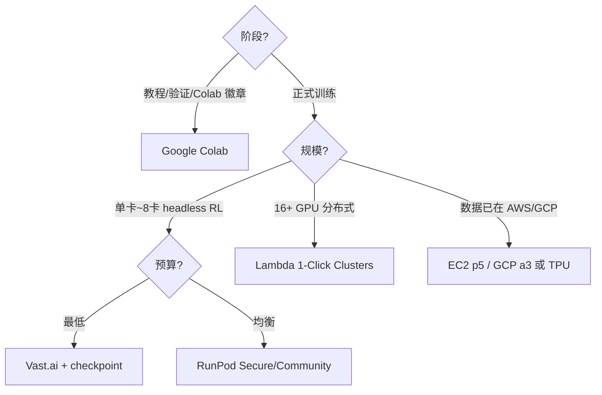

# 国外 GPU 云平台选型（机器人学习与仿真）

无法使用国内平台或数据已在海外时，研究者常在 **neocloud**（RunPod / Vast / Lambda）与 **超大规模云**（AWS / GCP）之间选型。本页并列六个主流入口；国内平台见 [国内 GPU 云平台选型](china-gpu-cloud-platforms.md)。

## 英文缩写速查

| 缩写 | 英文全称 | 简要说明 |
|------|----------|----------|
| GPU | Graphics Processing Unit | 租用核心 |
| TPU | Tensor Processing Unit | GCP 专用加速器 |
| IB | InfiniBand | Lambda/AWS 多机训练网络 |
| SLA | Service Level Agreement | 生产级可用性承诺 |
| Spot | Preemptible/Spot Instance | 可中断低价算力 |
| RL | Reinforcement Learning | 高算力常见场景 |
| egress | Data Egress | 跨云传数费用陷阱 |

## 平台速览

| 平台 | 实体页 | 定位关键词 |
|------|--------|------------|
| **RunPod** | [runpod](../entities/runpod.md) | 按秒、Pods+Serverless、Secure/Community |
| **Vast.ai** | [vast-ai](../entities/vast-ai.md) | P2P 市场、最低价、可中断 |
| **Lambda Cloud** | [lambda-cloud](../entities/lambda-cloud.md) | Lambda Stack、**16+ GPU 集群** |
| **Google Colab** | [google-colab](../entities/google-colab.md) | 浏览器 Notebook、教程/原型 |
| **AWS EC2 GPU** | [aws-ec2-gpu](../entities/aws-ec2-gpu.md) | 企业 AWS 栈、p5 H100、EFA |
| **Google Cloud GPU** | [google-cloud-gpu](../entities/google-cloud-gpu.md) | GCS/Vertex、**TPU**、L4 推理 |

## 核心特性对比

| 维度 | RunPod | Vast.ai | Lambda | Colab | AWS EC2 | GCP |
|------|--------|---------|--------|-------|---------|-----|
| **形态** | Docker Pod / Serverless | P2P 市场实例 | VM/裸金属 | 托管 Notebook | EC2 VM | GCE VM / Vertex |
| **计费** | 按秒 | 按秒/时 | 按分/时 | 月订阅+免费 | 按秒 | 按秒 |
| **低价档** | Community Cloud | 全场最低 | 预留实例 | 免费档 | Spot | Preemptible |
| **多机训练** | 单机多卡为主 | 单机为主 | **16–2000+ IB** | 单卡 | p4d/p5 + EFA | a3 + TPU pods |
| **环境** | 200+ 模板 | 市场模板 | Lambda Stack | 预装但不自控 | 自选 AMI | 自选镜像/Vertex |
| **可靠性** | Secure=SLA | 因主机而异 | 高（预留） | 会话易断 | 极高 | 极高 |
| **典型价级** | 中 | **最低** | 中高 | 低月费 | **最高** | 高（TPU 另计） |

## 如何选型？

### 决策树

### 场景对照

| 情况 | 推荐 |
|------|------|
| 跑本库 MuJoCo/Brax/TSIL Colab 教程 | [Google Colab](../entities/google-colab.md) |
| 个人 4090 级 PPO 数天训练 | [RunPod](../entities/runpod.md) Secure 或 [Vast.ai](../entities/vast-ai.md) |
| 超参 sweep、可中断 | [Vast.ai](../entities/vast-ai.md) |
| 8×H100 一周长跑 | [Lambda Cloud](../entities/lambda-cloud.md) 预留 |
| S3 上 PB 级数据 + 合规 | [AWS EC2 GPU](../entities/aws-ec2-gpu.md) |
| GCS + JAX TPU 大模型 | [Google Cloud GPU](../entities/google-cloud-gpu.md) |
| 国内访问 / 支付 | [国内 GPU 云平台选型](china-gpu-cloud-platforms.md) |

## 机器人 RL 工程注意

1. **Isaac Lab / Omniverse**：neocloud 上多为 **headless**；GUI 仿真需验证显示与 RT 核心，国内 [算力自由](../entities/gpufree.md) 文档更直白。
2. **Checkpoint**：Vast/Spot/Colab 会话中断是常态；`rsl_rl` / `wandb` artifact 养成习惯。
3. **Egress**：权重与数据集在 AWS 却用 RunPod 训练，传数费可能吞掉租卡节省。
4. **实验追踪**：与租卡平台正交，仍用 [TensorBoard](../entities/tensorboard.md) / [W&B](../entities/weights-and-biases.md)。

## 常见误区

- **「Vast 最便宜所以总选 Vast」**：无 checkpoint 的 3 天训练被中断一次就亏光。
- **「Colab Pro = 生产训练云」**：适合试错，不适合多机 scaling。
- **「AWS 最贵所以永远不选」**：数据与合规已在 AWS 时，迁出往往更贵。

## 关联页面

- [国内 GPU 云平台选型](china-gpu-cloud-platforms.md)
- [仿真器选型指南](../queries/simulator-selection-guide.md)
- [Isaac Lab](../entities/isaac-lab.md)

## 参考来源

- [RunPod](../../sources/sites/runpod.md)
- [Vast.ai](../../sources/sites/vast-ai.md)
- [Lambda Cloud](../../sources/sites/lambda-cloud.md)
- [Google Colab](../../sources/sites/google-colab.md)
- [AWS EC2 GPU](../../sources/sites/aws-ec2-gpu.md)
- [Google Cloud GPU](../../sources/sites/google-cloud-gpu.md)
