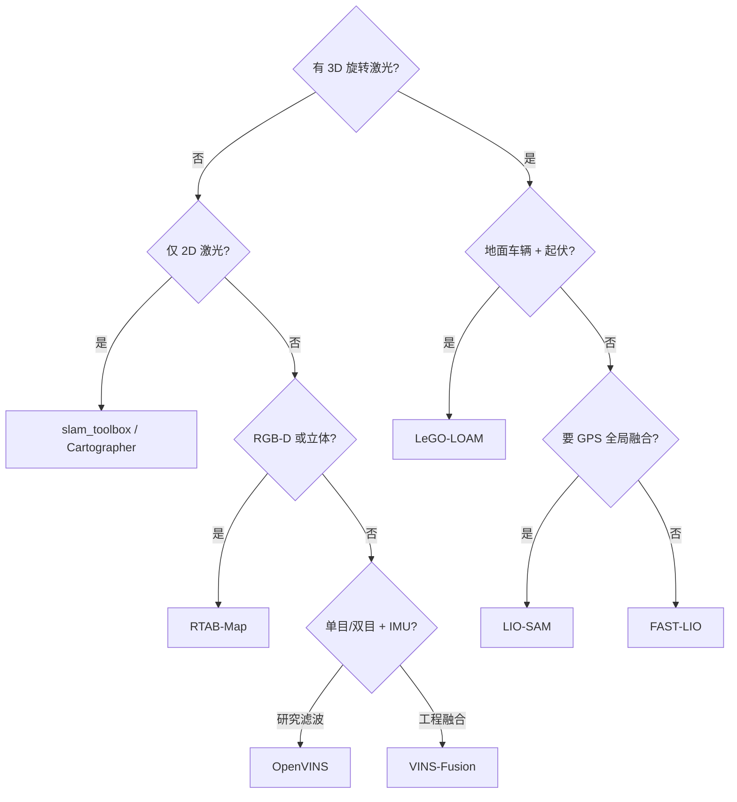

# LiDAR / LIO / VIO 开源选型对比

> **本页回答：** 给定传感器配置（2D 激光、3D 旋转激光、RGB-D、单目+IMU），应优先哪类 **里程计/SLAM** 开源实现？与 [导航栈总览](../overview/navigation-slam-autonomy-stack.md) 中 Nav2 如何衔接？

## 一句话总结

**要快且稳的 3D LIO** 选 **FAST-LIO**；要 **因子图 + GPS/回环** 选 **LIO-SAM**；要 **地面车辆起伏地形** 选 **LeGO-LOAM**；**视觉惯性** 工程常用 **VINS-Fusion**，研究滤波器对比用 **OpenVINS**，多地图视觉 SLAM 用 **ORB-SLAM3**；**RGB-D 一体** 用 **RTAB-Map**。

## 对比表

| 系统 | 主传感器 | 后端 | ROS 2 | 强项 | 弱项/注意 |
|------|----------|------|-------|------|-----------|
| **FAST-LIO** | 3D LiDAR + IMU | 迭代 ESKF + ikd-Tree | 社区移植多 | 低延迟、鲁棒 | 全局一致性依赖外部位姿图 |
| **LIO-SAM** | 3D LiDAR + IMU (+GPS) | GTSAM 因子图 | 有 | 回环、GPS、可解释图优化 | 算力与调参高于 FAST-LIO |
| **LeGO-LOAM** | 3D LiDAR | 地面优化 LOAM 系 | ROS1 为主 | 多变地形、轻量 | 非地面场景假设失效 |
| **hdl_graph_slam** | 3D LiDAR | NDT + g2o | ROS1 | 室外大场景图 SLAM | 维护与 ROS2 迁移成本 |
| **Cartographer** | 2D/3D 激光 | 子图 + PG | cartographer_ros | 2D 工业成熟 | 3D 配置复杂 |
| **slam_toolbox** | 2D 激光 | Karto | 原生 ROS2 | lifelong、大地图 | 非 3D 导航 |
| **ORB-SLAM3** | 单/双目/RGB-D + IMU | 非线性优化 | 需桥接 | 多地图、精度 | 工程集成工作量 |
| **VINS-Fusion** | 单/双目 + IMU (+GPS) | 滑动窗口 BA | ROS 包 | 多传感器融合成熟 | 标定敏感 |
| **OpenVINS** | 单/双目 + IMU | MSCKF 系 | ROS | 研究友好、可配置 | 极端运动需调参 |
| **OpenVSLAM** | 单/双目/RGB-D | 特征 SLAM | 有 | 模块化 | 主线迁移 stella_vslam |
| **Kimera** | 立体 + IMU | VIO + RPGO + 语义 | ROS | 语义度量地图 | 组件多、学习曲线陡 |
| **RTAB-Map** | RGB-D/立体/激光 | 记忆管理 | ROS/ROS2 | 一套 GUI 走通 | 高动态需额外处理 |
| **voxgraph** | 深度/TSDF | 位姿图 + Voxblox | ROS | 多会话子图 | 生态小于 LIO 系 |
| **Isaac cuVSLAM** | 多相机 | GPU | Isaac ROS | Jetson 部署 | 绑定 NVIDIA 栈 |

## 决策流（简图）

## 与 Nav2 的衔接要点

1. **发布 `map`→`odom`→`base_link` TF** 与 **里程计话题**（`nav_msgs/Odometry`），频率与延迟满足 controller 要求。
2. **2D 导航**：将 3D 点云 **投影为激光扫描** 或直接使用 2D SLAM 产物；勿把未滤波的 3D 障碍直接塞进 2D 层。
3. **3D 避障**：考虑 [nvblox](../entities/isaac-ros-nvblox.md) 等与 Nav2 3D costmap 插件配合。

## 常见误区

- **混淆里程计与 SLAM**：FAST-LIO 等偏 **odometry**；全局一致需回环/图优化模块或上层融合。
- **忽略 IMU 内参标定**：VIO/LIO 性能上限常由 **时间同步与 IMU 噪声** 决定，而非换算法。
- **在 Lie 群上乱线性化**：位姿估计与优化宜在 **SE(3)** 上处理，参见 [李群刚体运动](../formalizations/lie-group-rigid-body-motions.md)。

## 参考来源

- [navigation_slam_autonomy_stack_catalog.md](../../sources/repos/navigation_slam_autonomy_stack_catalog.md)
- 各对比对象 `sources/repos/*.md`

## 关联页面

- [导航·SLAM·自动驾驶栈总览](../overview/navigation-slam-autonomy-stack.md)
- [Navigation2](../entities/navigation2.md)
- [LingBot-Map](../methods/lingbot-map.md) — 学习型流式建图对照

## 推荐继续阅读

- [FAST-LIO 论文与仓库](https://github.com/hku-mars/FAST_LIO)
- [LIO-SAM IROS 2020](https://github.com/TixiaoShan/LIO-SAM)
