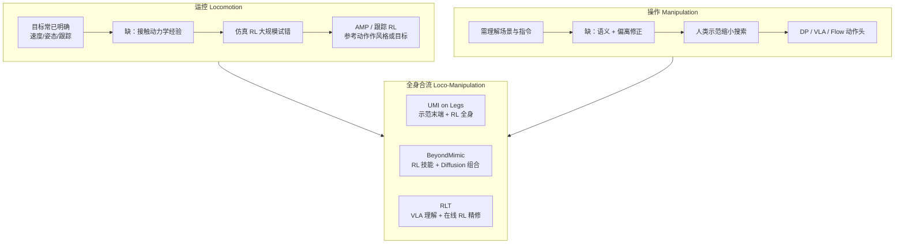

# 运控 RL vs 操作 IL/VLA：为什么「走路」和「干活」算法栈不同？

## 一句话定义

**运控与操作的学习栈分化**，不是因为「腿/hand 属于两个世界」，而是因为两类任务在 **训练数据已覆盖的知识**、**仍需外部注入的知识** 与 **获取该知识的成本** 上结构不同——运控目标常已明确、缺的是仿真里可大规模试错的动力学经验；操作还需视觉–语言–任务理解，从零 RL 探索往往不如人类示范与 VLA 预训练划算。

## 英文缩写速查

| 缩写 | 英文全称 | 简要说明 |
|------|----------|----------|
| RL | Reinforcement Learning | 从环境交互奖励优化策略；运控侧常配合仿真并行采样 |
| IL | Imitation Learning | 从专家示范学习；操作侧常用遥操作轨迹初始化 |
| AMP | Adversarial Motion Prior | 用判别器从参考动作学风格奖励，再与任务奖励联合 RL |
| ACT | Action Chunking Transformer | 一次预测连续动作块，缓解逐步误差累积 |
| VLA | Vision-Language-Action | 视觉、语言与动作统一的条件策略 |
| DP | Diffusion Policy | 学习动作分布的生成式模仿策略 |
| WBC | Whole-Body Control | 协调多关节满足平衡与跟踪的全身控制 |

## 为什么重要

- **破除误解**：AMP 与 ACT 最终都可输出关节目标；差别不在「高层 vs 底层」二分，而在 **学习信号从哪来、试错是否可承受**。
- **选型补维**：相对 [RL vs IL](./rl-vs-il.md) 的范式对照与 [五大学习范式](./robot-learning-five-paradigms-taxonomy.md) 的信号 taxonomy，本页按 **任务形态（loco / manip / loco-manip）** 解释当代工程栈为何分化。
- **合流导航**：UMI on Legs、BeyondMimic、RLT 等系统展示 **各段算法做自己最便宜的一段** 的分层趋势。

## 三个引导问题

| 问题 | 运控读法 | 操作读法 |
|------|----------|----------|
| 数据已告诉什么？ | 参考动作/姿态「应该像什么样」 | 示范轨迹「成功时怎么做」 |
| 还缺什么？ | 接触、平衡、扰动下的闭环实现 | 物体/指令语义；偏离后的修正 |
| 外部注入怎样最划算？ | 仿真 RL + 风格先验（AMP 等） | 示范 + 生成模型（DP）+ VL 预训练（VLA） |

## 流程总览：知识缺口 → 算法分工

## 运控：为什么有人类动作还要 RL？

- **参考动作 ≠ 控制程序**：视频/动捕给出姿态序列，不直接给出力矩、接触恢复与机–人形态差下的可行解。
- **AMP 分工**：判别器学「什么样算自然」，RL 学「怎样才能做到」——数据与试错回答不同子问题。
- **BeyondMimic 分工**：参考 → 跟踪目标，仿真 RL 练习；高动态技能依赖失败率加权采样与适度域随机（详见 [BeyondMimic](../methods/beyondmimic.md)）。
- **试错经济学**：目标可评价、失败可在仿真重复 → RL 适合寻找难手工编写的全身协调。

## 操作：为什么常从示范与生成模型出发？

- **稀疏奖励信息不足**：「没插进去」难以告诉机器人是抓偏、朝向错还是接触力不对。
- **ALOHA + [ACT](../methods/action-chunking.md)**：遥操作记录成功路线，比从零探索更高效。
- **分布偏移**：测试状态偏离示范分布时误差累积；常见路径是 **示范初始化 + RL/在线校正**（见 [DAgger](../methods/dagger.md)）。
- **多解性**：[Diffusion Policy](../methods/diffusion-policy.md) 建模动作分布，避免对多条合理轨迹取平均产生穿障解。

## 概念层澄清（常被混用）

| 名称 | 解决什么 | 不是什么 |
|------|----------|----------|
| Diffusion | 如何从分布采样动作 | 不等于 VLA |
| Transformer | 组织序列/多模态的计算图 | ACT 用 Transformer 但不是 LLM |
| VLA | 图像+语言→任务相关行为 | 不自动替代低层跟踪/WBC |
| Flow Matching（π₀） | 连续动作生成模块 | 可与 VLM 表征分工组合 |

开放任务上，[VLA](../methods/vla.md) 借用互联网 VL 先验；固定窄任务上专用 DP 仍可能更优——OpenVLA 文内对比即此逻辑。

## 全身合流：三类接口范式

| 系统 | 便宜信号在上层 | 便宜信号在下层 | 连接接口 |
|------|----------------|----------------|----------|
| **UMI on Legs** | 真实示范 → 末端轨迹 | 仿真 RL → 腿+臂协调 | 末端轨迹 |
| **BeyondMimic** | Diffusion 组织技能 | RL 跟踪练技能库 | 潜运动表示 + 引导代价 |
| **RLT** | 冻结 VLA 语义表征 | 在线 RL 打磨对准/插入 | VLA 特征 → RL token |

共同原则：**不要让一种算法同时承担「理解任务」与「维持全身平衡」两件训练信号都贵的事**。

## 选型速查

| 你的情况 | 优先倾向 |
|----------|----------|
| 速度/姿态目标清晰，可仿真并行 | RL（± AMP/跟踪参考） |
| 奖励难写、示范易得、需精细接触 | IL → DP / ACT |
| 多物体、开放语言指令 | VLA（± 在线 RL 精修） |
| 移动底盘 + 手臂操作 | 分层：示范或 VLA 上层 + RL/WBC 下层 |
| 既要动态技能又要任务组合 | RL 技能库 + 生成模型组织（BeyondMimic 路线） |

## 常见误区

- **「运控=RL、操作=大模型」**：两者都可到关节层；差别在知识缺口与数据经济学。
- **「示范够就不需要 RL」**：示范多覆盖成功分布；扰动与偏差仍要 RL 或在线校正。
- **「VLA 可以端到端替代 WBC」**：全身平衡与低延迟跟踪仍常需专用运控层（见 [Loco-Manipulation](../tasks/loco-manipulation.md)）。

## 参考来源

- [都是机器人控制，为什么「走路」用 RL，「干活」却用 Transformer？](../../sources/blogs/wechat_shenlan_locomotion_rl_vs_manipulation_il_vla.md) — 深蓝具身智能《具身智能基础》专栏第 12 篇（2026-09-12 入库）
- Peng et al., *AMP: Adversarial Motion Priors for Stylized Physics-Based Character Control* (2021)
- Chi et al., *Diffusion Policy: Visuomotor Policy Learning via Action Diffusion* (2023)
- Kim et al., *OpenVLA: An Open-Source Vision-Language-Action Model* (2024)
- Ha et al., *UMI on Legs: Making Manipulation Policies Mobile with Manipulation-Centric Whole-body Controllers*

## 关联页面

- [RL vs IL](./rl-vs-il.md) — 监督信号与典型失败模式的双主干对照
- [机器人学习五大范式](./robot-learning-five-paradigms-taxonomy.md) — 按学习信号划分的 taxonomy
- [Reinforcement Learning](../methods/reinforcement-learning.md) — RL 方法展开
- [Imitation Learning](../methods/imitation-learning.md) — IL 方法展开
- [BeyondMimic](../methods/beyondmimic.md) — RL 跟踪 + 扩散组合技能
- [Diffusion Policy](../methods/diffusion-policy.md) — 操作多解性
- [VLA](../methods/vla.md) — 语义条件执行层
- [Loco-Manipulation](../tasks/loco-manipulation.md) — 全身任务域
- [《具身智能基础》专栏地图](../overview/shenlan-embodied-ai-fundamentals-series.md) — 深蓝专栏父节点

## 推荐继续阅读

- 深蓝具身智能原文：<https://mp.weixin.qq.com/s/9prT5Ds0paBthAiupFQTqA>
- [人形训练数据管线](../queries/humanoid-training-data-pipeline.md) — 从数据到范式分流的 checklist 视角

## 一句话记忆

> 走路常缺「怎么在接触里做出来」，干活还缺「看懂要做什么」——算法栈跟着 **知识缺口** 走，全身系统再用分层接口把 RL、示范与 VLA 各就各位。
