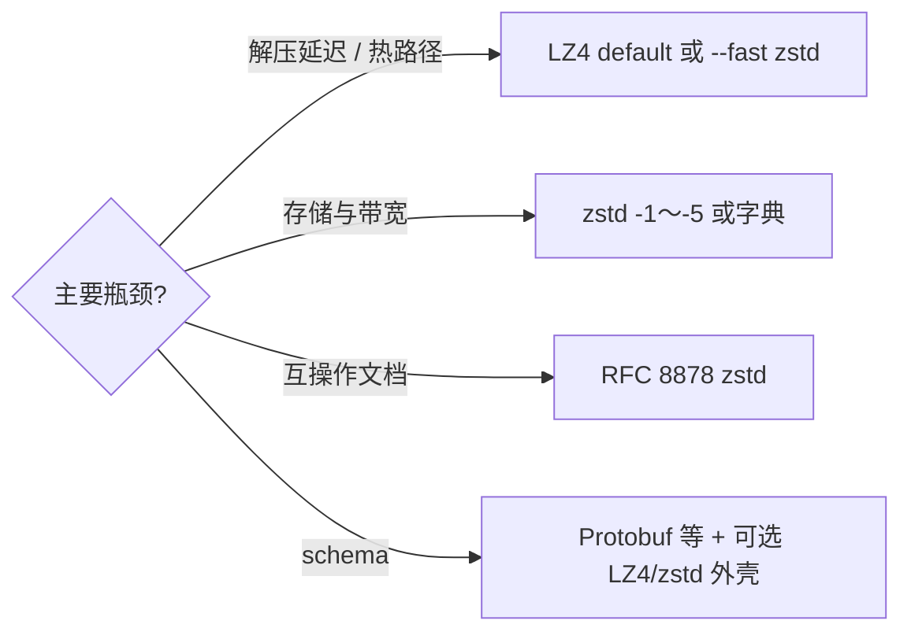

# LZ4 vs Zstandard（zstd）

两者均为 **Yann Collet** 主导的无损压缩栈，常一同出现在 **日志、数据集、Python joblib、对象存储** 选型中；差异在 **默认平衡点** 与 **格式标准化**，而非「能否无损」。

## 一句话概括

- **LZ4**：**解压与默认压缩极快**，压缩比约 **~2.1×**（Silesia，官方 README 表），格式见 GitHub `doc/`。
- **Zstandard**：**zlib 级或更好压缩比**（`-1` 约 **~2.9×**）且 **数百 MB/s 级** 压缩，**RFC 8878** 格式 + **字典训练** 对小记录友好。

## 英文缩写速查

| 缩写 | 英文全称 | 简要说明 |
|------|----------|----------|
| LZ4 | Lempel-Ziv 4 | 极速 LZ 实现 |
| zstd | Zstandard | 本对比中的「标准」档算法 |
| RFC 8878 | — | zstd 格式 IETF Informational 规范 |
| HC | High Compression | LZ4_HC 高压缩变体 |
| Silesia | Silesia Compression Corpus | 两项目 README 共用基准语料 |
| lzbench | — | 社区 in-memory 压缩基准工具 |

## 核心差异（一手 README / RFC）

| 维度 | LZ4 | Zstandard（zstd） |
|------|-----|-------------------|
| **参考仓库** | [lz4/lz4](https://github.com/lz4/lz4) | [facebook/zstd](https://github.com/facebook/zstd) |
| **许可** | BSD 2-Clause | BSD **OR** GPLv2 |
| **格式规范** | 项目 `doc/lz4_*_format.md` | **[RFC 8878](https://datatracker.ietf.org/doc/html/rfc8878)** + README |
| **设计重心** | 压缩/解压 **极限吞吐** | **实时场景** 下 **比 zlib 更好** 的 **比–速** 曲线 |
| **档位** | default / **LZ4_HC** / acceleration | **`-1…`**、**`--fast`** 负档、高等级慢压 |
| **解压速度随档位** | HC 与 default **相同** | 各档解压 **大致稳定** |
| **字典** | 支持；末 **64KB**；可与 zstd 字典 builder 联用 | **`--train`** + **`-D`**；小数据收益大 |
| **典型 Silesia 一行**（zstd README 表） | **2.101** / 675 / **3850** MB/s | **2.896** / 510 / 1550 MB/s（`-1`） |
| **互操作 CLI** | `lz4` | `zstd` 亦支持 **`.lz4`** 读写 |

数值来源：两仓库 **dev README** 中 lzbench + Silesia 表（同代硬件 i7-9700K 类）；实际 payload（浮点数组、protobuf、文本 JSON）会偏离，**应用自己的块做 A/B**。

## 选型建议（机器人研发栈）

### 更倾向 LZ4

- **环外低延迟**：仿真步进间写轨迹、**joblib+LZ4** 运动包（[关键帧工具](../entities/robot-motion-keyframe-editors.md)）、进程间 **大块 numpy** 临时压缩。
- **解压 CPU 预算极紧**：需要 **接近内存带宽** 的解压吞吐。
- **可接受 ~2.1×**：带宽仍充足，优先 **尾延迟**。

### 更倾向 Zstandard

- **数据集发布 / OTA / 云存储**：默认 **`-1`～`-3`** 常是 **存储费 vs CPU** 甜点。
- **大量小消息**：遥测 batch、JSONL、小型 record → **字典训练**（README Small Data）。
- **需要规范引用**：合同/互操作文档写 **RFC 8878**、HTTP **`Content-Encoding: zstd`**。
- **同一工具链压多格式**：`zstd` CLI 处理 `.zst`/`.gz`/`.lz4`。

### 都不是

- **结构化 schema 与 RPC**：用 [Protocol Buffers](../entities/protocol-buffers.md) / ROS msg / Cap'n Proto；压缩是 **外层**。
- **1 kHz 关节原始流**：优先 **无压缩** 或 **专用量化**；通用 LZ 不适合环内逐 sample。

## 常见误区

- **「zstd 总是比 LZ4 慢」**：`zstd --fast=4` 在官方表中 **压缩 665 MB/s、比 2.15×**，与 LZ4 **同量级速度** 但比仍可能低于 LZ4 default；应 **按级别实测**。
- **「LZ4_HC 免费提高比还不慢解压」**：HC **压缩** 可降至 **~41 MB/s**（LZ4 README），仅适合 **离线**。
- **「有 RFC 就是 IETF 强制标准」**：RFC 8878 为 **Informational**，Abstract 已声明非 Standards Track。

## 关联页面

- [LZ4（实体）](../entities/lz4.md)
- [Zstandard（实体）](../entities/zstandard.md)
- [Protocol Buffers](../entities/protocol-buffers.md)
- [系统工程知识链](../overview/hub-systems-engineering.md)

## 参考来源

- [sources/repos/lz4.md](../../sources/repos/lz4.md)
- [sources/repos/zstd.md](../../sources/repos/zstd.md)
- [sources/sites/rfc-8878-zstandard.md](../../sources/sites/rfc-8878-zstandard.md)

## 推荐继续阅读

- [inikep/lzbench](https://github.com/inikep/lzbench) — 自测语料与级别曲线
- [Zstd Small Data compression（README 节）](https://github.com/facebook/zstd#the-case-for-small-data-compression)
