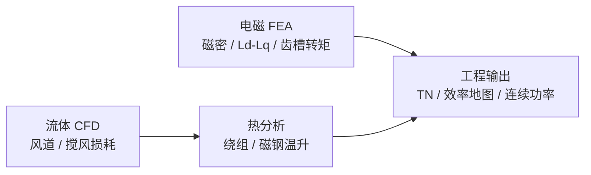

# 电机电磁与多物理场仿真软件选型

> 对比轴：**人形/腿足关节电机预研**、**汽车电驱量产**、**高校多物理场研究** 三类典型需求。

## 英文缩写速查

| 缩写 | 英文全称 | 简要说明 |
|------|----------|----------|
| FEA | Finite Element Analysis | 有限元分析，电磁/结构/热场常用数值方法 |
| CFD | Computational Fluid Dynamics | 计算流体力学，用于风冷与散热设计 |
| FOC | Field-Oriented Control | 无刷电机的磁场定向控制 |
| MTPA | Maximum Torque Per Ampere | 单位电流最大转矩控制策略 |
| IPM | Interior Permanent Magnet | 内置式永磁电机，弱磁与效率优化常见 |
| NVH | Noise, Vibration, Harshness | 噪声、振动与声振粗糙度 |

## 一句话结论

- **最快出 TN/效率/温升结果、电驱与关节模组预研**：优先 **Motor-CAD**。
- **电磁精度与行业标准、磁场/齿槽/反电势细节**：**Ansys Maxwell**。
- **高端伺服与 IPM、日系汽车供应链**：**JMAG**。
- **电磁+热+流体+结构一套耦合、研究院所**：**COMSOL Multiphysics**。
- **机器人关节厂常见组合**：**Maxwell（电磁）+ Motor-CAD（热与效率地图）**。

## 三类仿真与典型输出

| 物理域 | 典型可视化 | 工程问题 |
|--------|------------|----------|
| **电磁 FEA** | 磁密云图、磁力线、气隙场 | 转矩、反电势、齿槽转矩、Ld/Lq、MTPA、弱磁、[TN 曲线](../concepts/motor-torque-speed-curve.md) |
| **流体 CFD** | 速度流线 | 风冷效果、转子搅风、散热器与风道 |
| **热分析** | 温度云图 | 绕组/磁钢温升、绝缘寿命、连续功率能力 |

## 核心对比表

| 软件 | 定位 | 强项 | 弱项 / 边界 |
|------|------|------|-------------|
| **Motor-CAD** | 电机专用快速设计 | TN 曲线、效率地图、温升与散热流程上手快；新能源车/电驱广泛使用 | 复杂结构应力等非电机专项能力弱 |
| **Ansys Maxwell** | 电磁 FEA 行业标准 | 磁场分布、齿槽转矩、反电势、Ld/Lq；精度与通用性高 | 热-流体需与 Motor-CAD / Fluent / Icepak 等配合 |
| **JMAG** | 日系高端电机仿真 | IPM/伺服性能、电磁+热+NVH；丰田等汽车链成熟 | 许可与生态偏汽车/日系厂 |
| **Altair Flux** | 通用电磁 FEA | PMSM、BLDC、SRM、感应电机；学术界常见 | 机器人厂曝光度低于 Maxwell/Motor-CAD |
| **COMSOL** | 多物理场耦合平台 | 电磁-热-流体-结构同一环境；适合研究院 | 电机专用模板与产业工作流不如 Motor-CAD 快 |

## 行业典型工作流

### 方案 A：机器人关节 / 人形模组厂（最常见）

| 阶段 | 工具 | 产出 |
|------|------|------|
| 电磁设计 | Maxwell | 磁路、齿槽转矩、反电势、Ld/Lq |
| 热与效率 | Motor-CAD | 效率地图、温升、连续/峰值功率边界 |

对话中提及的宇树、傅利叶、达闼及众多关节模组厂多采用类似 **电磁 + 热** 分拆流程（具体栈因团队而异，以实测与供应商为准）。

### 方案 B：汽车电驱量产

**JMAG + Motor-CAD** — 电磁性能、NVH 与热管理一体化要求高；比亚迪、汇川、精进电动等团队常见类似组合。

### 方案 C：高校 / 研究所

**COMSOL** — 单环境完成多物理场探索；适合论文级耦合机理，量产迭代速度通常慢于 Motor-CAD 专用流程。

### 截图三类图的可能来源

| 图类型 | 常见来源 |
|--------|----------|
| 磁场分布 / 磁力线 | Maxwell、JMAG、Flux |
| 气流速度流线 | Ansys Fluent、Motor-CAD 散热、COMSOL 流体 |
| 温度云图 | Motor-CAD、Icepak、JMAG 热、COMSOL |

也可由 **JMAG** 等一体化套件覆盖电磁+热+部分流体，取决于模块许可。

## 人形关节电机学习顺序（建议）

1. **Motor-CAD** — 最快得到 TN、效率地图与温升直觉。
2. **Maxwell** — 理解电磁细节与行业默认工作流。
3. **JMAG** — 进阶 IPM、伺服与 NVH。

掌握后可分析：TN/[TI](../concepts/motor-torque-current-curve.md) 曲线、MTPA、齿槽转矩、反电势、效率与连续/峰值功率边界，并与 [热学与力矩控制](../overview/humanoid-actuator-102-thermal-and-control.md) 中的散热目标对照。

## 常见误判

| 误判 | 实际情况 |
|------|----------|
| 只做电磁 FEA 就够 | 连续功率由热与散热决定，需热/CFD 或 Motor-CAD 热模块 |
| COMSOL 可完全替代 Motor-CAD | COMSOL 灵活但电机专用效率与模板不如 Motor-CAD 快 |
| 仿真 TN 等于整机 TN | 关节含减速器、驱动限流与整机散热，需台架验证 |
| 选一个「最全」软件即可 | 产业界常见 **分工组合**（如 Maxwell + Motor-CAD） |

## 关联页面

- [电机转矩-转速曲线（TN 曲线）](../concepts/motor-torque-speed-curve.md)
- [电机转矩-电流曲线（TI 曲线）](../concepts/motor-torque-current-curve.md)
- [Humanoid 执行器 102 技术地图](../overview/humanoid-actuator-102-technology-map.md)
- [Humanoid Hardware 101 · 集成执行器](../overview/humanoid-hardware-101-integrated-actuators.md)
- [执行器驱动链选型闭环知识链](../queries/actuator-drive-chain-selection-loop.md) — 本页电磁仿真选型服务于①层驱动板/电机设计的标称参数验证，是驱动链的仿真校核入口

## 参考来源

- [motor_curves_and_em_simulation_faq.md](../../sources/personal/motor_curves_and_em_simulation_faq.md)

## 推荐继续阅读

- [Ansys Motor-CAD](https://www.ansys.com/products/electronics/ansys-motor-cad)
- [Ansys Maxwell](https://www.ansys.com/products/electronics/ansys-maxwell)
- [JMAG 官网](https://www.jmag-international.com/)
