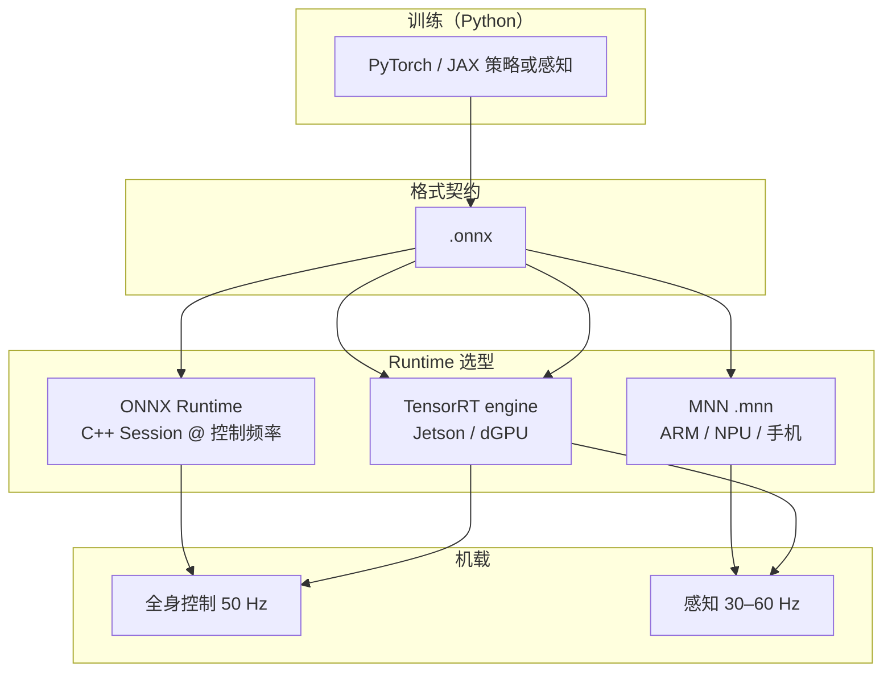

# ONNX Runtime vs MNN vs TensorRT（机载推理 Runtime 选型）

机器人学习管线里，**训练框架**（PyTorch/JAX）与 **机载执行**（C++/Rust @ 50–1000 Hz）之间通常插入 **[ONNX](../entities/onnx.md) 格式** 作为契约。真正决定延迟、功耗与集成难度的是 **推理 runtime**。

本页先对比本库 **人形/四足 onboard 最常见三条主线**：[ONNX Runtime（ORT）](../entities/onnxruntime.md)、[TensorRT](../entities/tensorrt.md)、[MNN](../entities/mnn.md)；再给出 **延伸 runtime 一览**（OpenVINO、ncnn、LiteRT、ExecuTorch 等）。

> **前提**：多数 runtime 消费 **ONNX** 或框架原生图；[ONNX](../entities/onnx.md) 是 **格式规范**，其余是 **执行引擎**。

## 英文缩写速查

| 缩写 | 英文全称 | 简要说明 |
|------|----------|----------|
| ONNX | Open Neural Network Exchange | 跨框架模型交换格式 |
| ORT | ONNX Runtime | 微软开源 ONNX 推理引擎 |
| TRT | TensorRT | NVIDIA 推理优化 SDK |
| MNN | Mobile Neural Network | 阿里轻量边端推理引擎 |
| EP | Execution Provider | ORT 的后端插件机制 |
| INT8 | 8-bit Integer Quantization | 整数量化，降体积与延迟 |
| Jetson | NVIDIA 嵌入式 AI 平台 | Orin/Thor 等人形机载常见算力 |

## 核心特性对比

| 维度 | ONNX Runtime | TensorRT | MNN |
|------|--------------|----------|-----|
| **维护方** | Microsoft + 社区 | NVIDIA | 阿里巴巴 |
| **首要场景** | 跨平台生产推理（云/边/移动/Web） | NVIDIA GPU 极致性能 | 移动端 / ARM / NPU / IoT |
| **输入格式** | `.onnx`（原生） | `.onnx` 等 → TRT engine | `.mnn`（常由 ONNX 转换） |
| **语言** | Python、C++、C#、Java、JS… | C++、Python | C++、Python（PyMNN） |
| **机器人出现频率（本库）** | **高** — G1 WBC、AMP、Open Duck | **高** — Jetson 感知、Humanoid-GPT、Booster demo | **中** — 边端/移动备选，ONNX 入口 |
| **量化** | 支持（含 ORT 量化工具） | INT8/FP16 强 | **权重量化 / 离线量化** 文档完善 |
| **浏览器** | ORT Web（WASM/WebGPU） | 否 | 否 |
| **开源许可** | MIT | Apache 2.0（OSS 子集）+ SDK 许可 | BSD-3（PyPI 标注） |

## 延伸 Runtime 一览（同类工具，分工不同）

除上表三线外，机器人栈还常遇到以下推理后端。**是否单列 wiki 实体** 见右栏。

| Runtime | 维护方 | 典型硬件 | 本库角色 | 实体页 |
|---------|--------|----------|----------|--------|
| [OpenVINO](../entities/openvino.md) | Intel | Intel CPU/GPU/NPU | ORT 的 EP；Physical AI / VLA on Intel | ✅ |
| [ncnn](../entities/ncnn.md) | 腾讯 | ARM 移动/嵌入式 | 极轻量 **视觉 CNN**；零依赖 | ✅ |
| **LiteRT / TFLite** | Google | ARM、Edge TPU、部分 Jetson | [htwk-gym](../methods/htwk-gym.md) 四足 **TFLite 量化** 部署 | 见 [TensorFlow](../entities/tensorflow.md) |
| **ExecuTorch** | Meta / PyTorch | Arm CPU/NPU、移动 | PyTorch 原生边端栈；见 [PyTorch](../entities/pytorch.md) 部署叙事 | 见 [PyTorch](../entities/pytorch.md) |
| **LibTorch / TorchScript** | Meta / PyTorch | 任意（含 C++ 集成） | 不经过 ONNX 的 C++  Torch 推理路径 | 见 [PyTorch](../entities/pytorch.md) |
| **CoreML / NNAPI** | Apple / Android | iOS / 手机 NPU | ORT EP；移动机器人 App 少见作控制环 | — |
| **RKNN / SNPE 等** | 芯片厂 | 国产 NPU / 高通 | 特定 SoC 绑定；本库暂无深读实体 | — |

**选型口诀**：先锁 **板卡厂商（NVIDIA / Intel / 纯 ARM / 手机）** 与 **任务（50 Hz 策略 vs 30 Hz 感知）**，再选 runtime；勿在训练框架层与 runtime 层混谈。

## 如何选型？

### 何时优先 ONNX Runtime？

1. **同一份 ONNX 要跑仿真机 + 真机 + 多种 CPU/GPU**：ORT + EP 组合最省事。
2. **纯 C++ 人形控制环（50–500 Hz）**：本库 [wbc-fsm](../../sources/repos/wbc_fsm.md)、[AMP_mjlab](../entities/amp-mjlab.md) 等已验证 **aarch64/x64 ORT** 路径。
3. **需要 Web 演示**： [BotLab MotionCanvas](../entities/botlab-motioncanvas.md) 类 **WASM/WebGPU** 场景。
4. **希望保留 EP 回退**：CUDA EP 失败时可回 CPU，利于开发期调试。

### 何时优先 TensorRT？

1. **算力固定在 NVIDIA**（桌面 4090、Jetson Orin/Thor）：要把 Transformer/CNN **融合、FP16/INT8** 榨到毫秒级（见 [Humanoid-GPT](../entities/paper-humanoid-gpt.md)、[TensorRT 实体](../entities/tensorrt.md)）。
2. **感知网络机载实时**：检测/分割头 + `trtexec` 或 ORT **TensorRT EP**。
3. **可接受 NVIDIA 绑定**：换 GPU 架构常需 **重编 engine**。

### 何时优先 MNN？

1. **目标硬件是手机、平板、低成本 ARM 或国产 NPU**，且体积/功耗极敏感。
2. **已有 ONNX**，希望 **`mnnconvert` + 8bit 量化** 一步到位缩小 75% 量级体积（官方快速开始示例）。
3. **端侧 LLM / 扩散实验**：MNN-LLM、MNN Diffusion 子项目（与机载 VLA 探索相关，非人形控制默认栈）。
4. **不需要 x86/Jetson 上极致 CUDA 优化**。

### 何时看延伸表？

- **Intel 工控 / Physical AI VLA** → [OpenVINO](../entities/openvino.md)
- **ARM 视觉极轻量、零依赖** → [ncnn](../entities/ncnn.md)（与 MNN 二选一）
- **Booster 等已有 TFLite 管线** → [TensorFlow / LiteRT](../entities/tensorflow.md)
- **坚持 PyTorch 图、不愿导出 ONNX** → LibTorch / ExecuTorch（[PyTorch](../entities/pytorch.md)）

## 典型机器人流水线中的位置

## 与本库实体的挂接示例

| 实体 / 来源 | Runtime 选择 | 备注 |
|-------------|--------------|------|
| [wbc-fsm](../../sources/repos/wbc_fsm.md) | ORT 1.22, x64/aarch64 | G1 纯 C++ WBC |
| [AMP_mjlab](../entities/amp-mjlab.md) | ONNX → C++ ORT | Sim2Real 部署章节 |
| [Booster RoboCup demo](../entities/booster-robocup-demo.md) | 仿真 ORT / 真机 TensorRT | 同一策略两种后端 |
| [Humanoid-GPT](../entities/paper-humanoid-gpt.md) | ONNX + TensorRT | 低延迟 tracker |
| [RF-DETR](../entities/rf-detr.md) | ONNX → TensorRT FP16 | 感知机载 |
| [Open Duck Mini Runtime](../entities/open-duck-mini-runtime.md) | ONNX on Pi | 极端低成本 ARM |

## 常见组合与误区

- **ORT + TensorRT EP**：在 ORT 内启用 TensorRT 后端，兼顾统一 API 与 NVIDIA 优化；与 **独立 TRT engine** 仍可能在延迟与调试体验上不同。
- **「导出 ONNX 就完事」**：须固定 **opset、输入 shape、观测构造**；见 [robot-policy-debug-playbook](../queries/robot-policy-debug-playbook.md)。
- **量化先后**：TensorRT INT8 与 MNN `weightQuantBits` 校准数据需求不同；闭环 locomotion 必须 **吊架回归**。
- **MNN 不是人形 WBC 默认答案**：本库人形高频栈文献更多写 **ORT/TRT**；MNN 是边端补充选项。

## 关联页面

- [ONNX](../entities/onnx.md)
- [ONNX Runtime](../entities/onnxruntime.md)
- [TensorRT](../entities/tensorrt.md)
- [MNN](../entities/mnn.md)
- [OpenVINO](../entities/openvino.md)
- [ncnn](../entities/ncnn.md)
- [Sim2Real](../concepts/sim2real.md)
- [Whole-Body Tracking Pipeline](../concepts/whole-body-tracking-pipeline.md)
- [PyTorch](../entities/pytorch.md)

## 参考来源

- [ONNX 官方站点与规范索引](../../sources/repos/onnx-official.md)
- [ONNX Runtime 官方站点与文档索引](../../sources/repos/onnxruntime-official.md)
- [MNN 官方文档与仓库索引](../../sources/repos/mnn-official.md)
- [NVIDIA TensorRT 官方站点与文档索引](../../sources/repos/tensorrt-official.md)
- [Intel OpenVINO 官方文档索引](../../sources/repos/openvino-official.md)
- [ncnn 官方仓库索引](../../sources/repos/ncnn-official.md)

## 推荐继续阅读

- [ONNX Runtime Execution Providers](https://onnxruntime.ai/docs/execution-providers/)
- [TensorRT 文档](https://docs.nvidia.com/deeplearning/tensorrt/latest/)
- [OpenVINO 文档](https://docs.openvino.ai/)
- [MNN 模型转换工具](https://mnn-docs.readthedocs.io/en/latest/tools/convert.html)
- [Tencent/ncnn](https://github.com/Tencent/ncnn)
