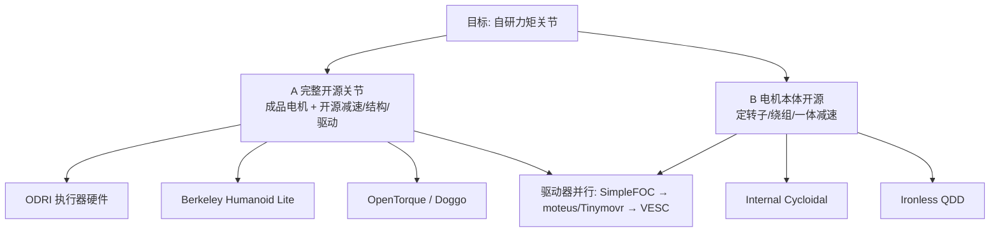

# 开源 QDD / 力矩关节执行器项目对比与学习路线

> 对比轴：**完整开源关节（电机采购）** vs **电机本体也开源**；附驱动器配套与建议学习顺序。

## 英文缩写速查

| 缩写 | 英文全称 | 简要说明 |
|------|----------|----------|
| QDD | Quasi-Direct Drive | 准直驱：低减速比、高背驱动性的作动方案 |
| FOC | Field-Oriented Control | 无刷电机的磁场定向控制 |
| BLDC | Brushless DC Motor | 无刷直流电机 |
| CAN | Controller Area Network | 电机/关节常用的现场总线通信协议 |
| BOM | Bill of Materials | 物料清单，硬件零部件列表 |
| ODRI | Open Dynamic Robot Initiative | 开源力控腿足与执行器硬件倡议 |

## 一句话结论

- **学完整力控关节体系**：优先 [ODRI open_robot_actuator_hardware](../entities/odri-solo-and-bolt.md)。
- **学执行器如何进人形 + RL**：优先 [Berkeley Humanoid Lite](../entities/berkeley-humanoid-lite.md)。
- **学外转子电机 + 减速器一体**：优先 [Internal Cycloidal Actuator](../entities/internal-cycloidal-actuator.md)。
- **现实起步**：成品定子/外转子电机 + 自研减速器/结构/驱动；不要第一步就从硅钢片模具开干。

## 为什么重要

人形/腿足想自研力矩关节时，网上「开源执行器」混杂：有的只开 CAD，有的只开固件，几乎没有同时公开电磁设计、加工图、驱动 PCB、固件与可靠性测试的工业级方案。按**开放粒度**和**学习目标**分类，比按「星标高低」扫仓库更有效。

## 核心对比：两类开源

| 维度 | A. 完整开源关节 | B. 电机本体也开源 |
|------|-----------------|-------------------|
| 电机 | 通常采购成品无刷外转子 | 自绕/自制转子或完整定转子设计 |
| 常开源部分 | 减速器、结构、驱动、控制、装配测试 | 电磁结构、绕组、中空集成减速器、CAD/BOM |
| 成熟度 | 相对更高（ODRI、BHL、Doggo） | 通常更低（个人原型为主） |
| 适合学 | 系统集成、力控、双编码器、热与测试台 | 气隙半径、槽极绕组、电机—减速器同轴 |
| 代表 | ODRI、BHL、OpenTorque、Doggo、Urs 论文 | Internal Cycloidal、Ironless QDD |

## 项目对照表

| 项目 | 类别 | 传动 | 驱动侧 | 成熟度 / 局限 | wiki |
|------|------|------|--------|------------------|------|
| **ODRI Actuator HW** | A | 行星或皮带，低减速 QDD | 自研驱动 PCB + 电流/力矩环 | 学术成熟；**无完整电磁设计** | [ODRI](../entities/odri-solo-and-bolt.md) |
| **Berkeley Humanoid Lite** | A + 整机 | ~15:1 3D 打印摆线 | 公开电流/位置/速度环参数 | 人形链路完整；打印摆线**高性能易脆** | [BHL](../entities/berkeley-humanoid-lite.md) |
| **Internal Cycloidal** | B | 8:1 内嵌双摆线 | ODrive S1 | 最佳电机本体教材之一；**个人原型** | [ICA](../entities/internal-cycloidal-actuator.md) |
| **OpenTorque** | A | 同步带低减速 | VESC | 快速样机；体积/抗冲击不足人形量产 | [OpenTorque](../entities/opentorque-actuator.md) |
| **Stanford Doggo** | A | 同步带 QDD | ODrive + Teensy | 高动态跳跃参考；四足非人形 | [Doggo](../entities/stanford-doggo-and-pupper.md) |
| **Urs et al. 2022** | A（教材型） | 7.5:1 行星 / ~15:1 bilateral | moteus r4.5 | 热/寿命/背隙测全；公开仓链接待核实 | [论文页](../entities/paper-3d-printed-open-source-actuators-legged.md) |
| **Cycloidal QDD (Jeong)** | A（减速侧重） | 双摆线 180° 相位 | — | 与 BHL 对照学平衡与背隙 | [sources](../../sources/repos/quasi_direct_drive_actuator.md) |
| **Ironless QDD** | B（低成本） | 摆线—行星 | 集成驱动 + 磁编 | BOM&lt;$75；**~30 N·m 是静态保持** | [sources](../../sources/repos/ironless_qdd_actuator.md) |

## 驱动器配套（与电机不可分）

| 项目 | 适合学什么 | 不适合什么 |
|------|------------|------------|
| [SimpleFOC](../entities/simplefoc.md) | Clarke/Park、dq 电流、编码器对齐 | 人形高功率最终驱动 |
| [moteus](../entities/moteus.md) | 关节驱动 PCB、FOC、CAN-FD、力矩模式 | —（优先关节向开源驱动） |
| [Tinymovr](../entities/tinymovr.md) | 小型驱动原理图/PCB/固件与上位机 | 大电流腿关节峰值 |
| VESC（[bldc](../../sources/repos/vesc_bldc.md)） | 大电流功率级 | 专为高频关节协议优化的假设 |

## 建议学习顺序

| 阶段 | 项目 | 主要目标 |
|------|------|----------|
| 1 | SimpleFOC | 理解 FOC 与编码器 |
| 2 | moteus / Tinymovr | 关节驱动 PCB 与固件 |
| 3 | OpenTorque | 做出第一个低减速比关节 |
| 4 | ODRI | 成熟力控执行器体系 |
| 5 | Berkeley Humanoid Lite | 执行器装进人形 + RL 部署 |
| 6 | Internal Cycloidal | 外转子电机与减速器一体 |
| 7 | 自研 | 电磁、机械、驱动、热联合设计 |

与纵深路线 [力矩电机设计](../../roadmap/depth-torque-motor-design.md) 的对应：阶段 1–2 ≈ Stage 3–4；阶段 3–5 ≈ Stage 1+6 的开源样机；阶段 6–7 ≈ Stage 2 电磁。

## 工程实践：读指标时的硬规则

| 误读 | 正确读法 |
|------|----------|
| 宣传峰值力矩 = 可用力矩 | 看**热限制连续力矩**与温升曲线（Urs 论文：散热可使热限力矩接近翻倍） |
| 静态保持力矩 = 行走力矩 | Ironless 的 ~30 N·m 保持 ≠ 连续动态/冲击/额定 |
| 开源 CAD = 可量产关节 | 还要冲击、寿命、热循环与驱动一致性 |
| 第一步自制硅钢片 | 先成品电机 + 自研减速/驱动/结构 |

## 局限与风险

- 本页是**学习选型图**，不是采购合格证；各项目许可、加工公差与安全等级需自行核验。
- 「电机本体开源」项目缺工业验证时，只宜作电磁与集成教材，不宜直接拷进重型人形。
- Urs et al. 论文宣称开源，但截至入库日未在 arXiv HTML 中钉死稳定 GitHub——以论文评测方法为主、复现仓待跟进。

## 关联页面

- [开源人形硬件方案对比](../entities/open-source-humanoid-hardware.md)
- [执行器驱动链选型闭环](../queries/actuator-drive-chain-selection-loop.md)
- [Actuator 102 · 减速与反射惯量](../overview/humanoid-actuator-102-gear-reflected-inertia.md)
- [力矩电机设计纵深路线](../../roadmap/depth-torque-motor-design.md)
- [ODRI](../entities/odri-solo-and-bolt.md) · [BHL](../entities/berkeley-humanoid-lite.md) · [Internal Cycloidal](../entities/internal-cycloidal-actuator.md) · [moteus](../entities/moteus.md)

## 参考来源

- [开源 QDD 执行器学习策展](../../sources/personal/open_source_qdd_actuator_learning_curator.md)
- [open_robot_actuator_hardware](../../sources/repos/open_robot_actuator_hardware.md)
- [Berkeley-Humanoid-Lite](../../sources/repos/berkeley_humanoid_lite.md)
- [Internal-Cycloidal-Actuator](../../sources/repos/internal_cycloidal_actuator.md)
- [OpenTorque-Actuator](../../sources/repos/opentorque_actuator.md)
- [StanfordDoggoProject](../../sources/repos/stanford_doggo_project.md)
- [moteus](../../sources/repos/moteus.md)
- [3D Printed Open-Source Actuators 论文](../../sources/papers/3d_printed_open_source_actuators_legged_arxiv_2202_12395.md)

## 推荐继续阅读

- ODRI 执行器仓：<https://github.com/open-dynamic-robot-initiative/open_robot_actuator_hardware>
- BHL 门户：<https://lite.berkeley-humanoid.org/>
- Urs et al., arXiv:2202.12395：<https://arxiv.org/abs/2202.12395>
