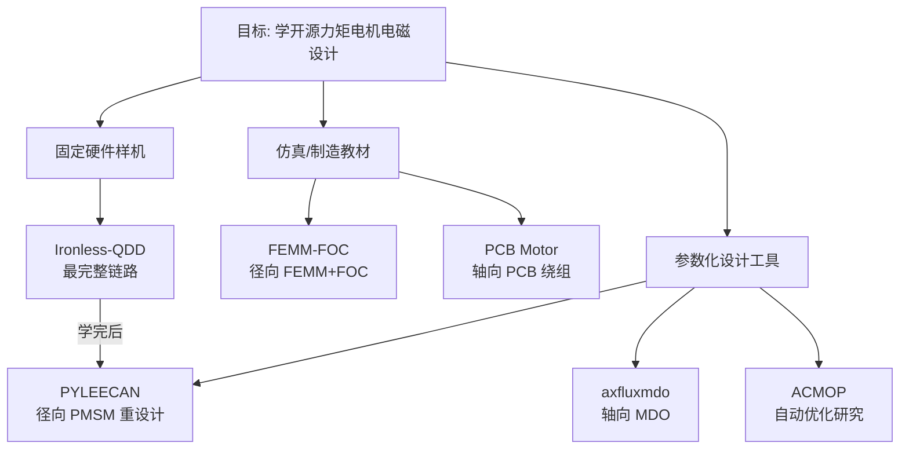

# 开源机器人力矩电机：电磁设计完整度对比

> 对比轴：**定转子几何 · 槽极/绕组 · 磁钢 · 电磁仿真文件 · 可制造结构 · 实物验证**。与 [开源 QDD 关节项目对比](./open-source-qdd-actuator-projects.md)（系统/驱动侧）互补。

## 英文缩写速查

| 缩写 | 英文全称 | 简要说明 |
|------|----------|----------|
| FEMM | Finite Element Method Magnetics | 开源 2D 电磁有限元工具 |
| FOC | Field-Oriented Control | 磁场定向控制 |
| PMSM | Permanent Magnet Synchronous Motor | 永磁同步电机 |
| QDD | Quasi-Direct Drive | 准直驱低减速比作动 |
| Halbach | Halbach Array | 单侧聚磁的永磁阵列 |
| MDO | Multidisciplinary Design Optimization | 多学科设计优化 |

## 一句话结论

- **要复现「电磁 → 绕线 → 转子 → FEM → 减速 → 驱动 → 台架」整条链**：优先 [Ironless-QDD-Actuator](../entities/ironless-qdd-actuator.md)。
- **要学 FEMM + FOC 扫角入门**：用 [FEMM-FOC-Simulation](../entities/femm-foc-simulation.md)。
- **要学 PCB 轴向绕组可制造文件**：用 [PCB Motor](../entities/pcb-motor.md)（WIP，偏小关节）。
- **要自己重设人形外转子径向磁通**：用 [PYLEECAN](../entities/pyleecan.md)；轴向磁通早期权衡用 [axfluxmdo](../entities/axfluxmdo.md)；自动优化研究用 [ACMOP](../entities/acmop.md)（非入门）。

## 为什么重要

网上「开源电机」多数只开 CAD 或只开固件；同时公开 **槽极绕组 + 磁钢磁化 + 可打开的 FEM 文件 + 可造结构** 的项目极少。人形髋/膝还要看连续温升与冲击寿命——多数开源仓到不了工业验证，但仍是学电磁设计最稀缺的教材。

## 完整度对照

| 项目 | 几何 | 绕组 | 磁钢 | FEM/仿真 | CAD/制造 | 实物 | 人形适用 |
|------|------|------|------|----------|----------|------|----------|
| [Ironless-QDD](../entities/ironless-qdd-actuator.md) | ✅ 采购 10010 定子 + 自研转子 | ✅ 36N42P | ✅ Halbach | ✅ 多方案 FEMM | ✅ STEP/打印/BOM | ✅ 保持力矩 | 学习向较高 |
| [PCB Motor](../entities/pcb-motor.md) | ✅ PCB 轴向 | ✅ 多拓扑 | ✅ 可 Halbach | 部分 | ✅ KiCad | 部分/WIP | 手指腕等小型 |
| [FEMM-FOC](../entities/femm-foc-simulation.md) | ✅ DXF | ✅ | ✅ | ✅ .fem+Lua | DXF | 弱 | 教学 |
| [axfluxmdo](../entities/axfluxmdo.md) | 参数化 | 参数化 | 参数化 | Gmsh/GetDP | 3D 生成 | 无固定样机 | 设计工具 |
| [PYLEECAN](../entities/pyleecan.md) | 参数化 | ✅ | 参数化 | 自动 FEMM | 可导出 | 非固定样机 | 设计工具 |
| [ACMOP](../entities/acmop.md) | 参数化 | ✅ | 参数化 | FEMM/JMAG | 有限 | 研究案例 | 优化工具 |

## 核心对比说明

### Ironless：最完整的「样机级」开源

仓库根目录直接给 `FEMM/`、`CAD/`、`36N42P Winding Scheme.png`、BOM 与驱动配置。定子是采购 **10010**（非自研硅钢模具），但 **绕组方案、Halbach 转子几何、磁钢尺寸、有/无铁与 Halbach 对照 FEMM、摆线—行星结构与样机保持力矩测试** 均公开。读指标时：**~29.4 N·m 是含减速的静态保持**，不是裸电机连续力矩。

相邻开源：[Internal Cycloidal](../entities/internal-cycloidal-actuator.md) 同样是 10010 + 自绕 36N42P + 一体摆线，但公开 FEMM 资产与 Halbach 对照不如 Ironless 仓完整；系统侧更多项目见 [QDD 对比页](./open-source-qdd-actuator-projects.md)。

### 教材与工具：各补一块短板

| 缺口 | 用什么补 |
|------|----------|
| FEMM 建模步骤不会 | FEMM-FOC：DXF → 材料 → 绕组 → FOC 电流 → 扫角转矩 |
| 想用 PCB 代替漆包线 | PCB Motor：层数/铜厚/气隙/绕组拓扑 |
| 要优化人形外转子径向方案 | PYLEECAN：自定外径、槽极、磁钢、匝数、48 V 低 KV |
| 要扫轴向磁通薄型关节权衡 | axfluxmdo：力矩密度/质量/温升/轴向力 Pareto |
| 要研究自动改槽宽齿宽跑 FEA | ACMOP（环境旧，勿作第一课） |

## 工程实践：建议学习顺序

| 阶段 | 做什么 | 产出 |
|------|--------|------|
| 1 | 打开 Ironless `FEMM/`，复现有/无铁、Halbach 对照 | 理解气隙磁密与静态转矩差 |
| 2 | 对照 `36N42P` 图与绕线记录，理解外转子极槽 | 能画一相绕组连接 |
| 3 | 跑 FEMM-FOC Lua，改电流角看转矩脉动 | 建立 FOC–转矩直觉 |
| 4 | （可选）读 PCB Motor KiCad，或用 PYLEECAN 建 36/42 外转子 | 一版可扫参的自研电磁方案 |
| 5 | 回 [力矩电机纵深 Stage 2](../../roadmap/depth-torque-motor-design.md) 补热与连续区 | 连续力矩预算，而非只抄保持力矩 |

## 局限与风险

- **开源完整 ≠ 工业电机**：Ironless/PCB 等缺连续温升、退磁、涡流、超速、疲劳与人形冲击体系验证。
- **采购定子 ≠ 硅钢模具开源**：10010 类定子公开的是槽数与绕线，不是冲片模具图。
- **工具仓不会替你定规格**：PYLEECAN/axfluxmdo/ACMOP 需要你自己给外径、槽极、KV、电流密度与冷却。
- **轴向磁通**：力矩半径大、轴向薄，但气隙公差、轴向磁拉力、散热与多气隙装配通常更难。

## 关联页面

- [开源 QDD / 力矩关节执行器项目对比](./open-source-qdd-actuator-projects.md)
- [电机电磁与多物理场仿真软件选型](./motor-em-simulation-software.md)
- [电机设计流程](../overview/motor-design-workflow.md)
- [力矩电机设计纵深](../../roadmap/depth-torque-motor-design.md)
- [执行器驱动链选型闭环](../queries/actuator-drive-chain-selection-loop.md)

## 参考来源

- [开源力矩电机电磁设计完整度策展](../../sources/personal/open_source_torque_motor_em_design_curator.md)
- [Ironless-QDD-Actuator](../../sources/repos/ironless_qdd_actuator.md)
- [FEMM-FOC-Simulation](../../sources/repos/femm_foc_simulation.md)
- [pcb-motor](../../sources/repos/pcb_motor.md)
- [axfluxmdo](../../sources/repos/axfluxmdo.md)
- [pyleecan](../../sources/repos/pyleecan.md)
- [ACMOP](../../sources/repos/acmop.md)

## 推荐继续阅读

- Ironless 项目长文：<https://cadenkraft.com/ironless-cycloidal-planetary-actuator/>
- PYLEECAN：<https://www.pyleecan.org/>
- axfluxmdo 文档：<https://jman4162.github.io/axfluxmdo/>
