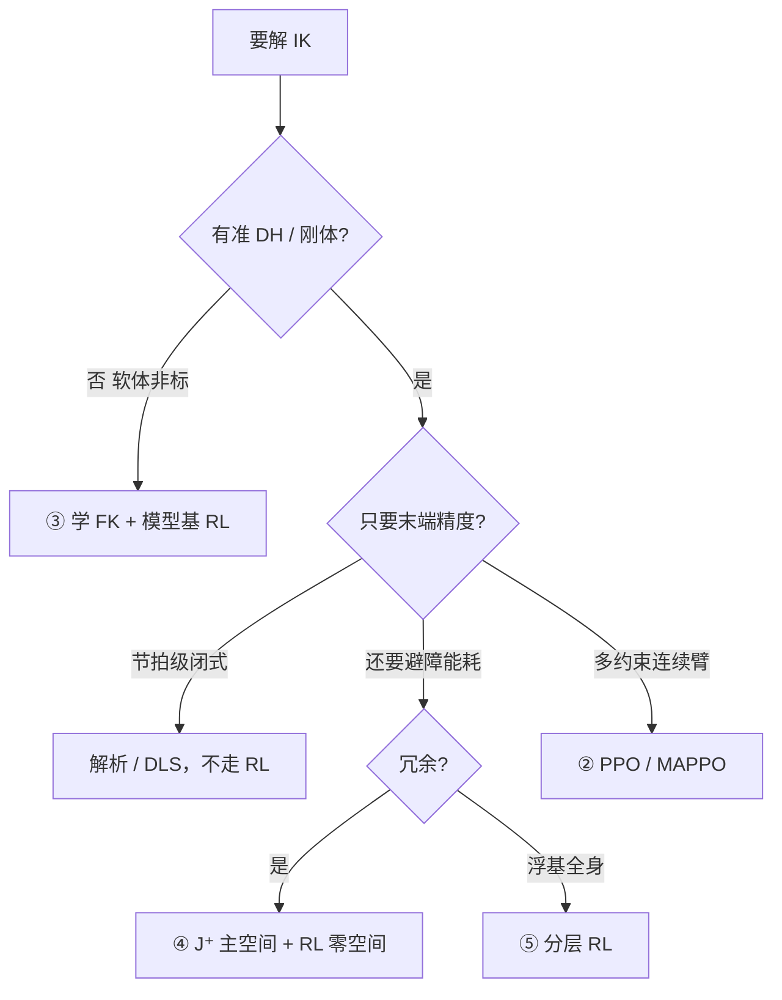

# RL 求解逆运动学：五类方案怎么选

**一句话选型：** 固定构型、要微秒级精度 → 解析/[数值 IK](../formalizations/inverse-kinematics.md)；冗余避障、非标软体、浮基全身 → 在传统 $J$ 旁边加 RL。RL **不替代** 雅可比精度兜底。

## 英文缩写速查

| 缩写 | 英文全称 | 简要说明 |
|------|----------|----------|
| IK | Inverse Kinematics | 目标位姿反求关节角 |
| DDPG | Deep Deterministic Policy Gradient | 连续动作 off-policy；早期单臂 RL-IK |
| PPO | Proximal Policy Optimization | clip 稳定更新；多约束单臂 |
| MAPPO | Multi-Agent PPO | 双臂拆成两个智能体协同 IK |
| FK | Forward Kinematics | 正模型；模型基 RL 先学它再反传 |

## 为什么 IK 吃 RL、FK 基本不吃

[FK](../formalizations/forward-kinematics.md) 是固定几何映射，DH/PoE 一次算完。例外只有软体连续体、磨损到没准 DH 的非标臂，才用网络拟合正模型。

[IK](../formalizations/inverse-kinematics.md) 则同时撞上：

1. **多解** — 7 轴 / 双臂局部数值解不够；
2. **多约束** — 限位、自碰、障碍、平滑可写进奖励，不必手工堆公式；
3. **奇异** — $\det(J)=0$ 时伪逆停滞，策略可绕行；
4. **工况漂移** — 标定/磨损后闭式公式过时，策略可在线微调。

## 五类方案对比

| 类 | 骨架 | 模型依赖 | 适合 | 别用在 |
|----|------|----------|------|--------|
| 1 DDPG 单臂 | 端到端连续策略，奖励 = 位姿误差 + 限位软约束 | 无显式 $J$ | 固定自由度工业臂入门 | 要可证明精度的节拍线 |
| 2 PPO / MAPPO | clip 稳训练；MAPPO 拆双臂 | 弱 | 多约束单臂、桌面双臂协同 | 把耦合当两个独立臂硬拆且无共享 critic |
| 3 模型基 | 浅网拟合 $\hat f(q)\approx T$，再沿模型反传 | 学来的可微 FK | 软体 / 无 DH 非标 | 刚体工业臂（闭式 FK 更便宜） |
| 4 混合 | $J^+$ 走主空间，RL 调零空间权重 | 强（保留伪逆） | 高精度 + 要避障/节能 | 非冗余 6 轴（没有零空间可调） |
| 5 分层全身 | 上层笛卡尔轨迹，下层分肢 IK | 中 | 浮基人形手脚复合 | 固定基单臂（杀鸡用牛刀） |

口诀：单臂 DDPG → 多约束 PPO → 双臂 MAPPO → 非标模型基 → 精度+灵活选混合 → 人形分层。

## 工程实践

- **先把传统 IK 跑通** — 混合类（④）的主空间仍是 $J^+$；没有几何 IK 的「纯 RL 替代」只适合研究或非标。
- **奖励** — 位姿误差用 SE(3) 误差（位置 + 轴角），不要对旋转矩阵做欧式减；限位/碰撞用惩罚而不是事后裁剪。
- **部署** — 工业抓取优先 [Pink](../entities/pink-ik.md) / [Mink](../entities/mink-ik.md) / 解析库；RL 放在零空间或非标正模型。
- **和 WBC 的边界** — 要力矩和接触约束时升级到 [TSID](../concepts/tsid.md)，不要把全身 QP 误写成「更大的 RL-IK」。

## 局限与风险

1. **样本换约束** — 能把避障写进奖励，不代表比 QP 约束更安全。
2. **DDPG 早期方案** — 训练震荡；多约束场景应默认 PPO。
3. **「RL 已解决 IK」** — 文内明确反对：雅可比该用还得用。
4. **浮基人形** — 直接端到端全身 IK 易解空间坍塌，必须分层。

## 关联页面

- [逆运动学](../formalizations/inverse-kinematics.md) — 解析 / DLS / 零空间基本功
- [雅可比矩阵](../formalizations/robot-jacobian.md) — 混合方案的主空间
- [PPO](../methods/ppo.md)
- [《具身智能基础》专栏](../overview/shenlan-embodied-ai-fundamentals-series.md) — 本篇为专栏 07

## 参考来源

- [深蓝具身智能：RL 求解 IK 五类方案](../../sources/blogs/wechat_shenlan_rl_inverse_kinematics.md)
- [抓取落盘](../../sources/raw/wechat_shenlan_rl_inverse_kinematics_2026-07-09.md)

## 推荐继续阅读

- Lynch & Park, *Modern Robotics* Ch 6
- [专栏 09 逆运动学五个关键点](../formalizations/inverse-kinematics.md)
