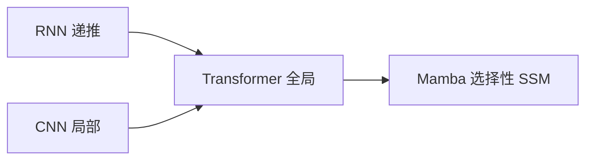

# RNN vs CNN vs Transformer vs Mamba

## 一句话定义

从 **递推状态（RNN）**、**局部卷积（CNN）**、**全局注意力（Transformer）** 到 **选择性状态空间（Mamba）**，在长程建模能力、训练并行度与推理复杂度三维上做骨干选型对照。

## 英文缩写速查

| 缩写 | 英文全称 | 简要说明 |
|------|----------|----------|
| RNN | Recurrent Neural Network | 隐状态递推序列模型 |
| CNN | Convolutional Neural Network | 局部核视觉/时序模型 |
| MHA | Multi-Head Attention | Transformer 核心 |
| SSM | State Space Model | 连续/离散状态空间 |
| Mamba | Mamba | 选择性 SSM 架构 |

## 为什么重要

- 课程 7.1.1：进入 Mamba 前先统一「旧结构优劣」叙事。
- 机器人既有图像骨干也有历史观测序列，架构选择影响延迟与记忆长度。

## 核心原理（对比）

| 维度 | RNN | CNN | Transformer | Mamba |
|------|-----|-----|-------------|-------|
| 长程依赖 | 弱/梯度难 | 需深堆叠 | 强（O(1) 路径） | 强（状态压缩） |
| 训练并行 | 差 | 好 | 好 | 好（扫描实现） |
| 推理复杂度 | O(n) | ~线性 | O(n²) 注意力 | 近线性 |
| 归纳偏置 | 时间因果 | 局部性 | 弱 | 选择性记忆 |

## 工程实践

| 场景 | 倾向 |
|------|------|
| 高分辨率密集视觉实时 | CNN / 高效 ViT / 窗口注意力 |
| 长上下文语言/动作历史 | Transformer 或 Mamba |
| 中小数据图像分类 | CNN 仍强 |

## 局限与风险

Benchmark 赢不等于机载赢；Mamba 生态与算子成熟度仍低于 Transformer。混合架构（卷积+注意力+SSM）常见。

## 关联页面

- [SSM](../concepts/state-space-model-ssm.md)
- [Transformer](../concepts/transformer.md)
- [Vision Mamba](../entities/vision-mamba-vim.md)
- [Transformer CV 课程策展](../entities/transformer-cv-curriculum.md)

## 参考来源

- [Transformer 视觉应用课程大纲](../../sources/courses/transformer_cv_applications_syllabus.md)

## 推荐继续阅读

- [Mamba: Linear-Time Sequence Modeling (arXiv:2312.00752)](https://arxiv.org/abs/2312.00752)
