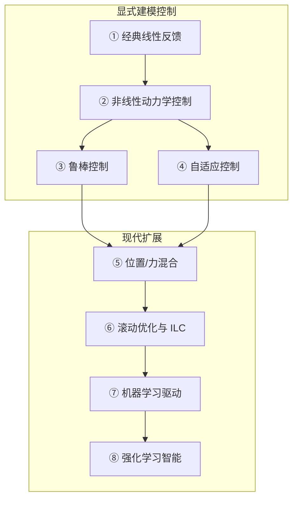

# 八大机器人控制体系分类

从机器人 **任务规划 → 控制算法 → 伺服执行** 的分层闭环出发，控制算法层可划分为 **八大体系**；前四类侧重 **显式建模**，后四类分别面向 **接触作业、约束优化、数据补偿与自主习得**。

## 一句话定义

**八大控制体系** 是按建模方式、抗扰能力、数据依赖度对控制算法层的结构化分类：从 PID 等线性伺服，经 CTC/MPC 等模型方法，到阻抗/力控、ILC、神经网络补偿与 RL，形成 **经典→现代、解析→数据** 的递进关系。

## 英文缩写速查

| 缩写 | 英文全称 | 简要说明 |
|------|----------|----------|
| PID | Proportional–Integral–Derivative | 经典线性反馈，伺服底层 |
| CTC | Computed Torque Control | 基于动力学模型的前馈+反馈 |
| MPC | Model Predictive Control | 滚动时域约束优化 |
| SMC | Sliding Mode Control | 滑模鲁棒控制 |
| RL | Reinforcement Learning | 环境交互试错学习策略 |

## 为什么重要

- **选型框架**：项目常混用 PID、MPC、RL 等名词；厘清体系边界才能判断该从哪类算法入手。
- **融合设计**：工业臂常见「CTC + SMC + ILC」、人形常见「MPC + RL」——理解单类边界是系统集成前提。
- **与具身智能衔接**：上层 VLA/模仿学习仍依赖底层伺服稳定；无 PID 电流环与中层动力学补偿，RL 难以收敛。

## 体系总览与演进

| 序 | 体系 | 代表算法 | 独立节点 |
|----|------|----------|----------|
| 1 | [经典线性反馈](../overview/robot-control-paradigm-classical-linear-feedback.md) | [PID](../methods/pid-control.md)、[LQR](../methods/lqr-ilqr.md)、[极点配置](../methods/pole-placement-control.md) | ✓ |
| 2 | [非线性动力学控制](../overview/robot-control-paradigm-model-based-nonlinear-dynamics.md) | [CTC](../methods/computed-torque-control.md)、[IDC](../methods/inverse-dynamics-control.md)、[反馈线性化](../methods/feedback-linearization-control.md) | ✓ |
| 3 | [鲁棒控制](../overview/robot-control-paradigm-robust-control.md) | [SMC](../methods/sliding-mode-control.md)、[H∞](../methods/h-infinity-control.md)、[μ 综合](../methods/mu-synthesis-control.md) | ✓ |
| 4 | [自适应控制](../overview/robot-control-paradigm-adaptive-control.md) | [MRAC](../methods/mrac.md)、[A-CTC](../methods/adaptive-computed-torque-control.md)、[RLS](../methods/recursive-least-squares-control.md) | ✓ |
| 5 | [位置/力混合](../overview/robot-control-paradigm-hybrid-position-force.md) | [阻抗](../concepts/impedance-control.md)、[导纳](../methods/admittance-control.md)、[力位混合](../concepts/hybrid-force-position-control.md)、[直接力反馈](../methods/direct-force-feedback-control.md) | ✓ |
| 6 | [滚动优化与 ILC](../overview/robot-control-paradigm-receding-horizon-ilc.md) | [MPC](../methods/model-predictive-control.md)、[ILC](../methods/iterative-learning-control.md) | ✓ |
| 7 | [机器学习驱动](../overview/robot-control-paradigm-ml-driven-control.md) | [NN 补偿](../methods/neural-network-compensation-control.md)、[GP](../methods/gaussian-process-control.md)、[模糊逻辑](../methods/fuzzy-logic-control.md)、[聚类故障补偿](../methods/unsupervised-clustering-fault-compensation.md) | ✓ |
| 8 | [强化学习智能](../overview/robot-control-paradigm-rl-intelligent-control.md) | [值函数 RL](../methods/value-based-reinforcement-learning.md)、[策略梯度](../methods/policy-optimization.md)、[MBRL](../methods/model-based-rl.md)、[HRL](../methods/hierarchical-reinforcement-learning.md)、[模仿学习](../methods/imitation-learning.md) | ✓ |

## 统一术语（文内）

- **系统状态**：关节角/速度/加速度、末端位姿等可量化运动量。
- **误差**：期望与实际状态之差，反馈控制核心输入。
- **扰动**：碰撞、负载变化、摩擦漂移等非预期因素。
- **前馈 / 反馈**：模型预补偿 vs 基于实时误差修正。

## 典型融合架构

- **工业机械臂**：CTC 动力学前馈 + SMC 鲁棒修正 + ILC 重复轨迹优化。
- **人形机器人**：MPC 约束步态 + RL 步态/技能优化；底层仍依赖 PD/PID 伺服。

## 常见误区

1. **「RL 可替代一切传统控制。」** 成功 RL 部署通常建立在稳定电流环与合理被控对象之上。
2. **「八类完全平行。」** 实为递进与互补；同一系统常多级联。
3. **「力控 = 阻抗。」** 阻抗、导纳、力位混合、直接力反馈适用场景不同。

## 关联页面

- [PID Control](../methods/pid-control.md)
- [Humanoid Model-based Control Stack](../overview/humanoid-model-based-control-stack.md)
- [Control Architecture Comparison](../queries/control-architecture-comparison.md)
- [WBC vs RL](../comparisons/wbc-vs-rl.md)

## 参考来源

- [wechat_shenlan_robot_control_eight_paradigms.md](../../sources/blogs/wechat_shenlan_robot_control_eight_paradigms.md) — 深蓝具身智能《机器人控制算法八大体系详解：从 PID 到强化学习》（<https://mp.weixin.qq.com/s/Kp12BMBiC7YiIiDPi_P8-g>）

## 推荐继续阅读

- [depth-classical-control](../../roadmap/depth-classical-control.md)
- [Humanoid RL Cookbook](../queries/humanoid-rl-cookbook.md)
