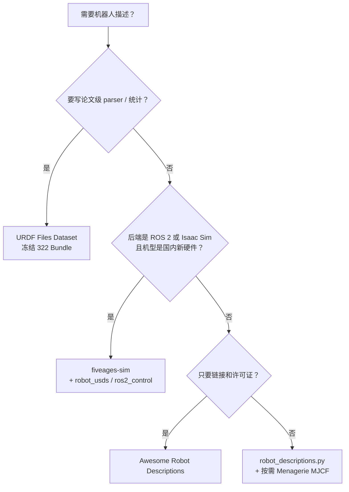

# 机器人描述目录选型

四份公开入口解决同一问题的不同切片：**发现、Python 加载、ROS 2/Isaac 国内机型、冻结研究语料**。

> **对比问题：** 要一份能跑的 URDF/MJCF 时，该用 **Awesome 列表、Python 包、fiveages-sim ROS 2 仓，还是 URDF Files Dataset？**

## 英文缩写速查

| 缩写 | 英文全称 | 简要说明 |
|------|----------|----------|
| URDF | Unified Robot Description Format | 跨栈最常见的连杆-关节描述 |
| MJCF | MuJoCo XML Format | MuJoCo 原生模型；Menagerie 的主交付 |
| ROS 2 | Robot Operating System 2 | fiveages-sim 的分发形态 |
| USD | Universal Scene Description | fiveages `robot_usds` 给 Isaac Sim 的格式 |

## 一句话结论

| 入口 | 一句话 |
|------|--------|
| [Awesome Robot Descriptions](../entities/awesome-robot-descriptions.md) | **发现层**：看链接、许可证、visual/inertia/collision 勾选 |
| [robot_descriptions.py](../entities/robot-descriptions-py.md) | **Python 加载层**：`pip` 后按名取 Pinocchio/MuJoCo/PyBullet 模型 |
| [fiveages-sim/robot_descriptions](../entities/fiveages-sim-robot-descriptions.md) | **ROS 2 + 国内新机**：轮式人形 / Piper / EngineAI；下游接 Isaac USD |
| [URDF Files Dataset](../entities/urdf-files-dataset.md) | **冻结语料**：322 Bundle 做 parser/重复分析，不当日常仿真源 |
| [MuJoCo Menagerie](../entities/mujoco.md) | **MJCF 权威资产**（本库不另建实体，挂在 MuJoCo 页） |

## 决策路径

## 对照表

| 维度 | Awesome | robot_descriptions.py | fiveages-sim | URDF Dataset |
|------|---------|----------------------|--------------|--------------|
| **角色** | 策展目录 | Python 模块 + loader | ROS 2 包树 | 研究快照 |
| **格式** | 链到 URDF/Xacro/MJCF | URDF + MJCF（Xacro 透明展开） | URDF 包；USD 在姊妹仓 | URDF Bundle |
| **新鲜度** | 持续 PR（与 py 仓同日更新） | 持续发版（PyPI 3.1.0） | 持续（2026-08 仍推） | **2024-04 冻结** |
| **机型重心** | 国际学术 + 工业经典 | 覆盖 Awesome 大多数 | 国内人形/臂/轮式 | ROS-I / MATLAB / Drake 等 |
| **运行方式** | 无代码 | `pip` / `uvx` | `colcon` + submodule | 分析脚本 |
| **许可（集合）** | CC0 列表 | Apache-2.0 包 | Apache-2.0 仓 | MIT 仓 |
| **许可（成员）** | 表内逐条 | README 逐条 | 厂商网格可能更严；G2 未公开 | 原源条款 |
| **典型下游** | 人工选型 | Pinocchio / MuJoCo / PyBullet | ros2_control / Isaac Sim | urdfdom 回归 |

## 常见误判

- **把 Awesome 当数据包：** clone 列表得不到 mesh；要跑就用 Python 包或 ROS 2 包。
- **把 Dataset 当最新 G1 模型：** 语料停在 2024，且工业臂占比高；宇树 G1 走 py 仓或 fiveages。
- **假设包许可证覆盖网格：** `robot_descriptions` 是 Apache-2.0，表内仍有 NC 与厂商图形条款。
- **混用两个 G1 URDF：** fiveages 与 `g1_description` 模块可能网格/关节名不同；一个实验只钉一个来源。
- **重绘当标定：** fiveages 的 Blender repaint 服务可视化，不替代 [URDF](../concepts/urdf-robot-description.md) 惯量核对。

## 与 URDD / 编辑器的关系

[URDD](../entities/paper-urdd-universal-robot-description-directory.md) 解决「各栈重复从 URDF 派生凸分解/DOF 映射」；本页四个入口解决「**原始描述从哪来**」。编辑与导出走 [URDF-Studio](../entities/urdf-studio.md)；浏览器检视走 [Robot Viewer](../entities/robot-viewer.md)；论文级离线渲染走 [APOLLO Blender](../entities/paper-apollo-blender.md)。

## 工程实践

1. **学习动力学：** `robot_descriptions.loaders.pinocchio` + [Pinocchio 快速上手](../queries/pinocchio-quick-start.md)。
2. **MuJoCo RL：** 优先 Menagerie MJCF，或 py 仓 `*_mj_description`，避免 URDF→MJCF 静默丢执行器。
3. **真机 ROS 2：** fiveages 主树 + `arms_ros2_control`；缺 submodule 先修克隆，再查代码。
4. **写 URDF 工具：** 用 Dataset 的 11 个 `urdfdom` 失败样本当夹具，再用 Awesome 抽新机做冒烟。

## 局限与风险

四份材料 **都不是** 真机数字孪生。接触、柔性、执行器动力学仍在 URDF 标准字段之外。活目录会跟上游断裂；冻结目录会过时。选型先定 **后端与许可证**，再定仓。

## 关联页面

- [Awesome Robot Descriptions](../entities/awesome-robot-descriptions.md)
- [robot_descriptions.py](../entities/robot-descriptions-py.md)
- [fiveages-sim robot_descriptions](../entities/fiveages-sim-robot-descriptions.md)
- [URDF Files Dataset](../entities/urdf-files-dataset.md)
- [URDF](../concepts/urdf-robot-description.md)
- [MuJoCo](../entities/mujoco.md)
- [Pinocchio](../entities/pinocchio.md)
- [Isaac Sim](../entities/isaac-sim.md)
- [URDD](../entities/paper-urdd-universal-robot-description-directory.md)
- [APOLLO Blender](../entities/paper-apollo-blender.md)

## 参考来源

- [Awesome 归档](../../sources/repos/awesome-robot-descriptions.md)
- [robot_descriptions.py 归档](../../sources/repos/robot-descriptions-py.md)
- [fiveages-sim 归档](../../sources/repos/fiveages-sim-robot-descriptions.md)
- [URDF Files Dataset 归档](../../sources/repos/urdf_files_dataset.md)
- [Understanding URDF 论文摘录](../../sources/papers/understanding_urdf_dataset_arxiv_2308_00514.md)
- [MuJoCo Menagerie 归档](../../sources/repos/mujoco-menagerie.md)

## 推荐继续阅读

- <https://github.com/robot-descriptions/awesome-robot-descriptions>
- <https://github.com/google-deepmind/mujoco_menagerie>
