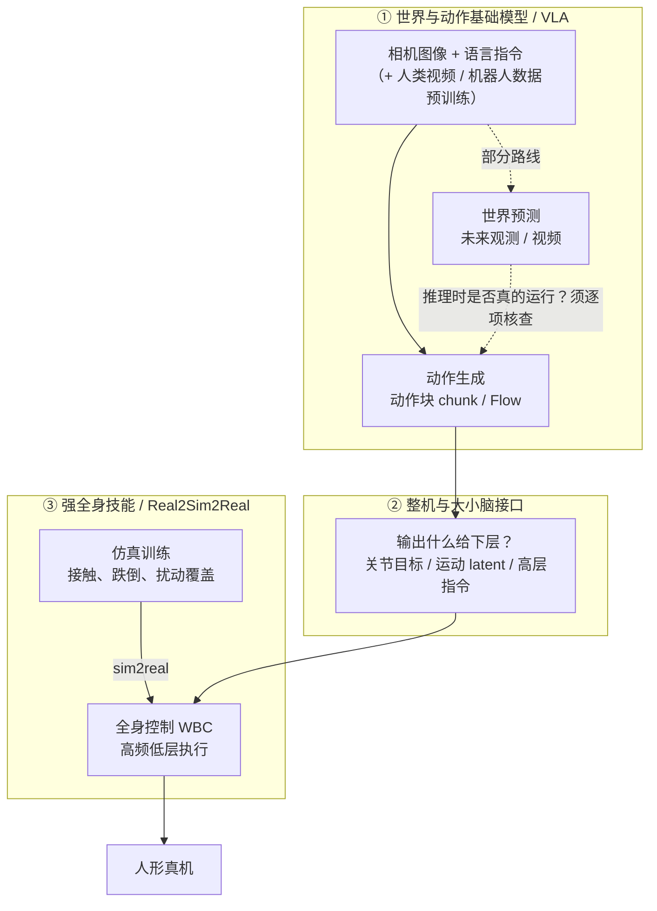
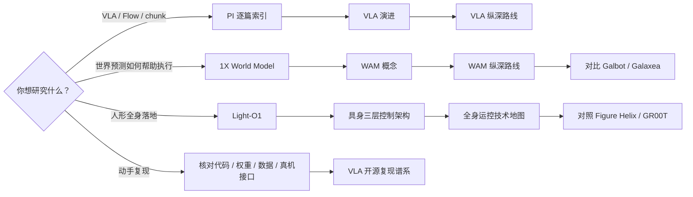

# 机器人基础模型与通用人形：公司技术路线对照（2026）

## 一句话定义

把公司技术分享按**世界与动作建模、整机层级控制、全身技能与仿真迁移**三种阅读视角组织，可以更快找到训练目标、动作接口和真机闭环的不同答案；一家公司可以同时出现在几条路线中。

## 英文缩写速查

| 缩写 | 英文全称 | 简要说明 |
| --- | --- | --- |
| VLA | Vision-Language-Action | 由视觉和语言条件生成机器人动作 |
| WAM | World-Action Model | 联合或级联建模世界后果与动作的模型族；须逐项目检验推理接口 |
| WBC | Whole-Body Control | 全身运动与接触约束的协调控制 |
| RTC | Real-Time Action Chunking | 在执行中衔接新旧动作块以减小推理停顿 |
| RL | Reinforcement Learning | 用交互反馈优化策略 |

## 30 秒读懂

- **三种视角对应机器人栈的三层**：上层“看懂世界、生成动作”（VLA / WAM），中层“大小脑怎么接”（整机接口），下层“身体怎么稳稳做出来”（WBC、仿真迁移）。见下方分层图。
- **公司不是互斥赛道**：1X、NVIDIA、Galbot、LimX、Unitree、德塔智能在矩阵里都横跨两列以上。
- **“有模型名” ≠ “能复现”**：开放程度差异很大，从“代码 + 权重”到“只有博客叙述”都有；复现前逐项核对代码、权重、数据、真机接口。
- **不能排名**：各家任务、本体、频率、测评环境不同，本页只做路线对照，不是基准测试。

## 一张图：三种视角落在机器人栈的哪一层

读图要点：

- **虚线是最常被宣传混淆的地方**：“有世界模型”不代表推理时走了“世界预测 → 动作”这条边；读每个项目时确认它实际用了哪条边。
- **第 ② 层决定延迟闭环**：上层模型慢、下层控制快，中间接口的形式决定谁负责高频稳定。
- **第 ③ 层的难点在仿真覆盖**：接触、跌倒、损伤能否在仿真中出现，决定策略能否上真机。

## 公司 × 视角矩阵

● = 本页主要代表作品落在此列；○ = 公开材料有涉及、可作补充对照；空 = 本页未归入该视角。依据为已收录的官方入口，**非完整业务盘点**。

| 公司 / 团队 | ① 世界与动作 / VLA | ② 整机与接口 | ③ 全身技能 / 仿真 | 代表作品 |
| --- | :---: | :---: | :---: | --- |
| [Physical Intelligence](../../sources/sites/pi-website-technical-articles.md) | ● |  |  | π₀→π₀.₇、FAST、Hi Robot、KI、RTC、π*₀.₆、MEM |
| [1X](../entities/1x-technologies.md) | ● | ● |  | [Redwood 策略](../entities/1x-redwood-policy.md)、World Model、NEO |
| Google DeepMind | ● |  |  | Gemini Robotics |
| Galaxea 星海图 | ● |  |  | G0、Fast-WAM |
| [AgiBot 智元](../../sources/sites/agibot-world.md) | ● |  |  | GO 系列、AgiBot World 数据 |
| [Galbot 银河通用](../entities/galbot-astrabrain.md) | ● |  | ● | AstraBrain-WAM、[WBC 0.5 / Humanoid-GPT](../entities/paper-humanoid-gpt.md)、GraspVLA |
| [Figure](../entities/figure-ai.md) |  | ● |  | Helix → [Helix 02](../entities/helix-02.md) → Helix 2.5 |
| [Skild AI](../entities/skild-ai.md) |  | ● |  | Skild Brain |
| [NVIDIA](../entities/isaac-gr00t.md) | ○ | ● | ● | GR00T、Cosmos、Isaac Lab、GR00T Control |
| LimX 逐际动力 |  | ● | ● | COSA、FluxVLA、腿足技能 |
| Unitree 宇树 |  | ● | ● | G1、UnifoLM、控制生态 |
| [Light Origins 亮源新创](../entities/light-o1.md) | ○ |  | ● | Light-O1、REACT、Parkour、Nav |
| [Delta Intelligence 德塔智能](../entities/delta-0-humanoid-foundation-model.md) | ● | ● | ○ | Δ₀（潜空间 world–action brain + 69-DoF 全身控制器） |
| [Robbyant 蚂蚁灵波](../entities/robbyant.md) | ● |  |  | LingBot-VLA 2.0、LingBot-VA、LingBot-World（另有 Vision / Depth / Map / Video 感知与预训练层） |
| [Reward AI 励元智能](../entities/reward-ai-robotics.md) | ● | ○ |  | OM-1（仅人类穿戴示范的通才操作策略 + Control Any Body 高频控制层） |
| [Symbiosis Robotics](../entities/paper-dpc.md) |  | ● | ○ | DPC（去掉运动 latent 接口，视觉 / 语言 / 本体直出 G1 关节 PD 目标） |

NVIDIA 的 ○ 对应 Cosmos 世界生成；Light Origins 的 ○ 对应 Light-O1 的视觉语言动作预训练（见[来源索引](../../sources/sites/robot-foundation-model-company-research-2026.md)）；德塔智能的 ○ 对应 Δ₀ 全身控制器的人体动作跟踪训练与 real-to-sim-to-real 评测（见 [deltai.com 归档](../../sources/sites/deltai-com.md)）；Reward AI 的 ○ 对应 OM-1 与仿真 RL 训练的异步高频控制层跨工业臂 / 人形部署（见 [rewardai.com 归档](../../sources/sites/rewardai.md)）；Symbiosis 的 ● 对应 DPC 对「VLA/WAM → 冻结全身跟踪器」接口的替代主张，○ 对应 DriftDistill 闭环恢复蒸馏（见 [DPC 项目页归档](../../sources/sites/symbiosis-robotics-dpc.md)）。

## 三种视角各自追问什么

| 阅读视角 | 核心追问 | 读完应能回答 |
| --- | --- | --- |
| ① 世界与动作基础模型 / VLA | 预测的是未来观测、未来动作还是二者？推理时真的运行世界预测吗？数据、权重和训练代码开放到哪一层？ | 训练目标是什么、动作以何种形式输出 |
| ② 整机与大小脑接口 | 视觉语言模块输出关节目标、运动 latent 还是高层指令？高频低层由谁执行？不同模块延迟如何闭环？ | 系统分几层、每层频率和接口 |
| ③ 强全身技能 / Real2Sim2Real | 人视频/动作先验如何变成可执行参考？仿真如何覆盖接触、跌倒、损伤？真机部署观察和动作频率是什么？ | 从动作先验到真机的完整链路 |

## 四组容易误读的对照

| 对照 | 左边公开的重点 | 右边公开的重点 | 常见误读 → 正确做法 |
| --- | --- | --- | --- |
| π 系 vs 1X 世界模型 | VLA 动作生成、动作块执行、记忆等多个独立研究问题 | 动作条件下未来视频/行为的建模 | “有世界模型” ⇒ “已公开 World Model→Policy 部署” ✗ → 查推理时是否运行世界预测 |
| Figure vs NVIDIA | Helix 在 Figure 机器人上的多系统全身闭环 | Cosmos、仿真、GR00T、端侧平台等多层资产 | 把两者当同类产品比较 ✗ → Figure 追系统接口，NVIDIA 追数据生成→训练→部署的模块边界 |
| Light Origins vs Galbot | 人类动作预训练、Real2Sim2Real、韧性控制 | 区分 AstraBrain-WAM 与 AstraBrain-WBC | “做 WBC” ⇒ “端到端 WAM” ✗ → 观察世界侧与执行侧如何连接 |
| 有 GitHub vs 真开放 | openpi、Light-O1 推理代码/预览权重、Isaac-GR00T 提供复现入口 | Figure / Skild 公开博客主要是方法与实验叙述 | “公司有 GitHub 账号” ⇒ “模型开源” ✗ → 以各项目资源页为准 |

## 开放程度速览

按[来源索引](../../sources/sites/robot-foundation-model-company-research-2026.md)“开放程度及核查入口”一列整理；✅ 有公开入口，🟡 部分公开，❌ 技术发布页未见，❓ 需逐项目核查。

| 公司 | 代码 | 权重 | 数据 | 备注 |
| --- | :---: | :---: | :---: | --- |
| Physical Intelligence | ✅ | ✅ | ❓ | [openpi](https://github.com/Physical-Intelligence/openpi)；不代表后续所有版本开放 |
| Light Origins | 🟡 | 🟡 | ❌ | [Light-O1](https://github.com/lightorigins/Light-O1) 推理代码与预览权重；完整预训练资产未公开 |
| NVIDIA | ✅ | ✅ | 🟡 | Isaac-GR00T N1.7 与多种 Cosmos 权重公开；数据/许可按模块核查，见 [GR00T 平台](../entities/isaac-gr00t.md) |
| AgiBot | ✅ | ✅ | ✅ | [Colosseo / GO-1](../entities/paper-sa-2503-06669-agibot-world-colosseo-a-large-scale-manipulation.md)、[Envisioner V1](../entities/paper-sa-2508-05635-genie-envisioner-a-unified-world-foundation-plat.md) 已有资产；不代表 GO-2、BFM-2、GE-Act 2 均完整开放 |
| 1X | 🟡 | ❓ | 🟡 | 早期 World Model 部分资产；[Redwood 策略](../entities/1x-redwood-policy.md)官方页未列代码/权重，不能混用同名模型状态 |
| Galaxea | ✅ | ✅ | 🟡 | [G0.5](../entities/paper-galaxea-g05.md)、[FastWAM](../entities/paper-fast-wam.md) 有代码/权重；全量预训练池与许可仍按项目核查 |
| LimX | 🟡 | ❓ | ❓ | FluxVLA 文档有可操作入口；COSA 以各发布页为准 |
| Unitree | ✅ | 🟡 | 🟡 | SDK、遥操作/仿真/LeRobot、部分 UnifoLM 资产公开；模型训练与全部数据不等于完整开放 |
| Figure | ❌ | ❌ | ❌ | [Helix / Helix 02 核查](../../sources/sites/figure-helix-models.md)：技术发布页未列模型代码、权重与数据 |
| Skild AI | ❓ | ❓ | ❓ | 以公开说明为主 |
| Google DeepMind | 🟡 | ❌ | ❓ | [Gemini Robotics](../entities/gemini-robotics.md)：编排样例开源，ER 提供 API；VLA 权重与训练代码未开放，API 不等于开源 |
| Galbot | 🟡 | 🟡 | 🟡 | [GraspVLA](../entities/cn-os-graspvla.md) 有代码/权重/合成数据；WBC 0.5 有推理/部署与 checkpoint，训练/数据待发布；WAM 完整资产未确认 |
| Delta Intelligence | ❌ | ❌ | ❌ | [Δ₀ 博客](https://deltai.com/en/blog/delta-0) 未列 GitHub / HF / 论文链接（[核查](../../sources/sites/deltai-com.md)） |
| Robbyant | ✅ | 🟡 | 🟡 | [github.com/robbyant](https://github.com/robbyant) 9 个模型仓；VA 2.0 仅技术报告、权重未确认；公开 LingBot-Depth 300 万 RGB-D 与 GM-100，VLA 预训练池未公开（[核查](../../sources/sites/robbyant_github.md)） |
| Reward AI | ❌ | ❌ | ❌ | [OM-1 博客](https://www.rewardai.com/blog/OM-1/) 未列 GitHub / HF / 数据下载；前序 DexCap 代码与数据开源，但非同一发布物（[核查](../../sources/sites/rewardai.md)） |
| Symbiosis Robotics | ❌ | ❌ | ❌ | [DPC 项目页](https://symbiosis-robotics.com/research/dpc/en/) 未列 GitHub / HF / 数据集 / arXiv，仅联系邮箱（[核查](../../sources/sites/symbiosis-robotics-dpc.md)） |

> ✅/🟡 只表示“存在公开入口”，不代表完整训练配方可复现；本表于 2026-10-05 补核薄弱项目，其余沿用各页注明日期的归档；公司有任一公开资产不表示所有版本均开放。

## 时间线与详情的读法

公司路线的日期对应技术发布月份；工程教程或阶段发布地图明确按该事件标注，**不冒充模型首次发布日**。空日期表示公司/工具聚合入口或尚未确认首发日期，由路线数据 `date_note` 与描述说明；不以 wiki 入库日填补。

共享详情页必须区分版本：Gemini Robotics 页有 1.0→1.5→2 沿革，Galaxea G0.5 页保存 G0 / G0Plus 历史 revision，Robbyant 家族页区分 VA 1.0 与 VA 2.0。Galbot WAM 的独立详情与 WBC 0.5 的 Humanoid-GPT 身份各有落点，避免公司节点回链此对照页。

路线覆盖的是已归档的代表性研究与工程入口，不能据此宣称公司全部资料或最新资产齐全；未公开/未确认项见各详情的局限与日期化核查。

## 建议阅读顺序

对应链接：

- **VLA / Flow / chunk：** [PI 逐篇索引](../../sources/sites/pi-website-technical-articles.md) → [VLA 演进](../overview/vla-evolution-lineage.md) → [VLA 纵深](../../roadmap/depth-vla.md)。
- **世界预测如何帮助执行：** [1X World Model 归档](../../sources/sites/1x-world-model-redwood.md) → [WAM 概念](../concepts/world-action-models.md) → [WAM 纵深](../../roadmap/depth-wam.md)；再比 Galbot / Galaxea 的最新发布。
- **人形全身落地：** [Light-O1](../entities/light-o1.md) → [具身三层控制架构](../concepts/embodied-three-layer-control-architecture.md) → [全身运控技术地图](../overview/humanoid-motion-cerebellum-technology-map.md)；对照 Figure Helix 和 GR00T。
- **动手复现：** 先用上方“开放程度速览”筛选，再按 [VLA 开源复现谱系](../overview/vla-open-source-repro-landscape-2025.md) 选与硬件匹配的项目。

## 局限与风险

- 此页比较的是**官方公开材料及已收录资料**，并非统一基准实验。
- 不同团队的任务、本体、频率和测评环境不同，不能从宣传演示直接排出性能名次。
- 矩阵和开放程度表是阅读辅助，1X 的世界模型、Figure 的 Helix 与各 WAM 的源码开放范围应按单篇项目页复核。

## 关联页面

- [WAM 概念与分类](../concepts/world-action-models.md)
- [VLA 方法总览](../methods/vla.md)
- [VLA 演进](../overview/vla-evolution-lineage.md)
- [具身三层控制架构](../concepts/embodied-three-layer-control-architecture.md)
- [人形运控小脑技术地图](../overview/humanoid-motion-cerebellum-technology-map.md)
- [具身大模型分类学选型闭环](../queries/embodied-fm-taxonomy-loop.md) — 按模型族选路线的知识链入口

## 参考来源

- [Galbot AstraBrain 官方补核](../../sources/sites/galbot-astrabrain.md)
- [Figure 两代 Helix 官方补核](../../sources/sites/figure-helix-models.md)
- [1X Redwood 策略补核](../../sources/sites/1x-redwood-policy.md)
- [Gemini Robotics 1.5 发布](../../sources/sites/gemini-robotics-15.md)

- [16 家公司官方技术入口与开放程度索引](../../sources/sites/robot-foundation-model-company-research-2026.md)
- [PI 官方技术文章逐篇索引](../../sources/sites/pi-website-technical-articles.md)
- [1X World Model / Redwood 项目归档](../../sources/sites/1x-world-model-redwood.md)
- [Light-O1 项目页及开源核查](../../sources/sites/light-o1.md)
- [Skild AI 官方站归档](../../sources/sites/skild-ai.md)
- [Delta Intelligence 官网归档与开源核查](../../sources/sites/deltai-com.md)
- [Robbyant GitHub / HF 组织开源核查](../../sources/sites/robbyant_github.md)
- [Reward AI 官网归档与开源核查](../../sources/sites/rewardai.md)
- [Symbiosis Robotics DPC 项目页归档与开源核查](../../sources/sites/symbiosis-robotics-dpc.md)
- [The Physical Intelligence Layer](../entities/pi-physical-intelligence-layer.md) — 伙伴现场部署，不是新模型发布

## 推荐继续阅读

- [Figure Helix 02 官方技术文章](https://www.figure.ai/news/helix-02)
- [Light Origins 官方技术博客](https://www.lightorigins.com/en/blog/)
- [Delta Intelligence 官方博客](https://deltai.com/en/blog)
- [Reward AI 官方博客](https://www.rewardai.com/blog/)
- [Symbiosis Robotics DPC 项目页](https://symbiosis-robotics.com/research/dpc/en/)
- [NVIDIA Robotics Blog](https://developer.nvidia.com/blog/tag/robotics/)
