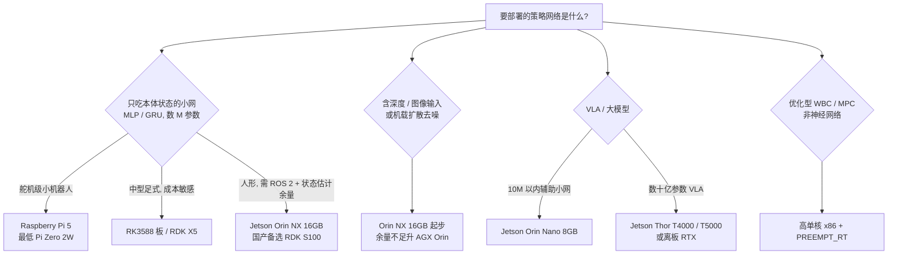

# 机器人运控开发板选型（按策略网络模型）

## 一句话定义

**先看策略网络的「FLOPs × 控制频率」和「权重占多少内存」，再选板：本体小网跑 CPU 就够，带视觉 / 扩散的低层策略从 Orin NX 起步，完整 VLA 要 Jetson Thor 或离板 GPU。模型文件统一先导出 `.onnx`，只在需要 GPU / NPU 加速时再编译成 TensorRT engine、`.rknn` 或 RDK `.bin`。**

> 证据等级约定：表中 **实测** = 本库已入库资料里有该板上的部署或延迟数据；**推断** = 维护者按官方算力 / 内存推算，**尚无本库实测**，选型前需自测。

## 英文缩写速查

| 缩写 | 英文全称 | 简要说明 |
|------|----------|----------|
| TOPS | Tera Operations Per Second | 每秒万亿次运算；厂商口径不同（稀疏 INT8 / INT8 等效 / FP4） |
| NPU / BPU | Neural / Brain Processing Unit | 专用神经网络加速器；BPU 为地瓜 RDK 的叫法 |
| SoM | System on Module | 可插拔计算模组（Jetson、Radxa CM5） |
| MLP | Multi-Layer Perceptron | 足式低层策略最常见的网络形态 |
| VLA | Vision-Language-Action | 视觉–语言–动作策略，参数量为数十亿级 |
| p95 | 95th Percentile Latency | 95 分位延迟，机载实时门禁常用指标 |
| RT | Real-Time | 实时；PREEMPT_RT 内核或独立 MCU 保证确定性 |
| CAN FD | Controller Area Network Flexible Data-rate | 关节 / 电机总线，RDK X5 板载 1 路 |
| ORT / TRT | ONNX Runtime / TensorRT | 通用 ONNX 推理引擎 / NVIDIA GPU 专属编译推理 |
| PTQ / QAT | Post-Training Quantization / Quantization-Aware Training | 训练后量化（需校准集）/ 量化感知训练 |

## 为什么重要

- **模型差 1000 倍，板子不能用一个答案：** 低层 locomotion MLP 前向约 1–5 MFLOPs（[神经反馈控制器](../concepts/neural-feedback-controller.md)），π₀.₅ 级 VLA 在 AGX Orin 上 BF16 单次要 **165.67 ms**（[APXInf](../entities/apxinf.md)）。按最大模型选板浪费功耗和成本，按最小模型选板则跑不动感知。
- **厂商 TOPS 口径不可横比：** Jetson Orin 标的是 **稀疏 INT8**，Thor 标的是 **FP4 稀疏 TFLOPS**，RDK 标的是 **INT8 等效**（见 [官方规格归档](../../sources/sites/robot-control-dev-board-official-specs.md)）。
- **本库已有「大脑」三分法（x86 / Jetson / 国产）**（[人形大脑选型](../entities/open-source-humanoid-brains.md)），但缺「按模型类型 → 具体型号 → 实测依据」的映射，本页补这一层。

## 核心原理

选板只看三个量：

1. **算力需求 ≈ 单次前向 FLOPs × 控制频率。** 3M 参数 MLP @100 Hz ≈ 2×3M×100 = **0.6 GFLOP/s**（推算），树莓派级 CPU 已有余量。
2. **内存需求 ≈ 参数量 × 每参数字节数 + 激活 / KV 缓存。** 3B 参数 BF16 权重约 **6 GB**（推算；π₀ 论文报告 3.3B），8 GB 板即使算力够也放不下全栈。
3. **延迟预算 ≈ 控制周期。** 50 Hz 策略要求 **p95 < 20 ms**（[PredActor](../entities/paper-predactor.md) 以此为门禁）；VLA 通常低频出 chunk，由高频控制器执行（[频率解耦](../concepts/control-inference-frequency-decoupling.md)）。

## 按策略模型推荐开发板

| # | 策略模型类型 | 典型规模 / 频率 | 最低可行 | 推荐型号 | 证据 | 依据 |
|---|--------------|-----------------|----------|----------|------|------|
| 1 | 小 MLP 速度跟踪（舵机 / 小型足式） | < 1M 参数；约 50 Hz | Raspberry Pi Zero 2W | **Raspberry Pi 5** | 实测 | [Open Duck Mini Runtime](../entities/open-duck-mini-runtime.md) 在 Pi Zero 2W 跑 ONNX 行走策略；[Pupper v3](../entities/stanford-doggo-and-pupper.md) 以 Pi 5 为主控 |
| 2 | 中型 MLP / GRU 历史编码策略（四足、人形 locomotion、AMP 蒸馏） | 1–13M 参数；50–100 Hz；约 0.1–2.6 GFLOP/s | RK3588 / RDK X5 的 CPU | **RK3588 板（Radxa CM5 / Rock 5）** 或 **RDK X5** | 推断 + 案例 | [神经反馈控制器](../concepts/neural-feedback-controller.md) 算力表（RK3588 跑 100 Hz policy「轻松」）；[Asimov v1](../entities/asimov-v1.md) 用 Radxa CM5（RK3588S2）承担运控侧 |
| 3 | 人形全身动作跟踪 / 多技能 MLP（G1 29 DoF、BeyondMimic 类） | 数 M 参数；50 Hz + ROS 2 + 状态估计 | RK3588 / RDK X5（推断） | **Jetson Orin NX 16GB**；国产替代 **RDK S100**（推断） | 实测 | [project-instinct](../entities/project-instinct.md)：instinct_onboard 在 G1 Orin NX 上跑 ONNX 策略；宇树官方称 G1 EDU 高算力模组可选 Orin 等型号 |
| 4 | 机载扩散 / 生成式低层策略（joint state–action diffusion） | 多步去噪；50 Hz，p95 < 20 ms | **Jetson Orin NX 16GB** | Orin NX 16GB；要留余量上 AGX Orin（推断） | 实测 | [PredActor](../entities/paper-predactor.md)：G1 Orin NX p50 **16.79 ms** / p95 **19.38 ms** |
| 5 | 感知型运动（深度 CNN + GRU + 本体；跑酷、楼梯） | 深度 20 Hz + 策略 50 Hz | Orin NX 16GB（推断） | **Jetson AGX Orin** | 实测 | [CReF](../entities/paper-cref.md)：AgiBot X2 Ultra + D435i + AGX Orin，控制 50 Hz、深度 64×48 @ 20 Hz |
| 6 | 轻量 action-chunk 预测器（与云端 VLA 交错） | 约 7.4M 参数 | **Jetson Orin Nano 8GB** | Orin Nano 8GB（Super） | 实测 | [VLA-ULAP](../entities/paper-vla-ulap.md)：Orin Nano **19.9 ms / 0.183 J** 每次 chunk |
| 7 | 完整 VLA（π₀.₅ 级，多相机 + 语言） | 数十亿参数；低频 chunk | AGX Orin 64GB（BF16 **165.67 ms**，约 6 Hz） | **Jetson Thor**（T5000 FP8 **41.16 ms**，加 onestep **26.32 ms**） | 实测 | [APXInf](../entities/apxinf.md) README：LIBERO-10 成功率 92.0–92.8% 基本不掉；RTX 4090 BF16 **31.38 ms** 可作离板对照 |
| 8 | 扩散导航先验（46M UNet，轨迹分布） | 5 DDIM + 5 DDPM 步 | — | **Jetson Thor** | 实测 | [EgoNav](../entities/paper-notebook-egonav.md)：Thor 上约 110 traj/s，系统约 1.7 Hz |
| 9 | 优化型 WBC / MPC（稀疏 QP，非网络） | 500–1000 Hz | — | **高单核 x86**（i7-13700H 级）+ PREEMPT_RT | 经验 | [人形大脑选型](../entities/open-source-humanoid-brains.md)：QP 分解难上 GPU，靠单核主频 |

**读法：** 第 1–3 行的瓶颈在 **CPU 调度与实时性**，不是 TOPS；第 4–8 行才开始吃 GPU / NPU 算力和内存带宽。

## 开发板指标对照（官方标称）

| 板卡 / 模组 | CPU | AI 加速（标称） | 内存 / 带宽 | 功耗 | 实时核 / 总线 | 参考价 |
|-------------|-----|-----------------|-------------|------|---------------|--------|
| **Raspberry Pi 5** | 4× A76 @ 2.4 GHz | 无 NPU（VideoCore VII GPU） | 1–16 GB LPDDR4X-4267 | 5 V / 5 A（27 W 电源） | 无；PCIe 2.0 x1 | 16 GB 版 $305 |
| **RK3588**（Radxa CM5 / Rock 5 等） | 4× A76 + 4× A55，8 nm | NPU **6 TOPS**（INT4/8/16、FP16、BF16） | 依板卡 | 依板卡（CM5 模组 3.6–5.2 V、典型 2 A） | 无独立 MCU | 依板卡 |
| **RDK X5** | 8× A55 @ 1.5 GHz | BPU **10 TOPS**；GPU 32 GFLOPS | 4 / 8 GB LPDDR4 | 5 V / 5 A | **1× CAN FD**；2× MIPI CSI | 官方页未列 |
| **RDK S100** | 6× A78AE @ 1.5 GHz | BPU **80 TOPS**（INT8 等效）；GPU 100 GFLOPS | 12 GB LPDDR5 96-bit | 12–20 V DC | **4× Cortex-R52+ MCU @ 1.2 GHz**；2× GbE | 官方页未列 |
| **RDK S100P** | 6× A78AE @ 2.0 GHz | BPU **128 TOPS** | 24 GB LPDDR5 96-bit | 12–20 V DC | 同 S100 | 官方页未列 |
| **Jetson Orin Nano 8GB**（Super） | 6× A78AE @ 1.7 GHz | **67 TOPS**（稀疏 INT8）；1024 CUDA + 32 Tensor Core | 8 GB / 102 GB/s | 7–25 W | 无独立 MCU | DevKit $249 |
| **Jetson Orin NX 16GB** | 8× A78AE @ 2.0 GHz | **157 TOPS**（稀疏 INT8）；1024 CUDA + 32 Tensor Core | 16 GB / 102.4 GB/s | 10–40 W | 无独立 MCU | 官方页未列 |
| **Jetson AGX Orin 64GB** | 12× A78AE @ 2.2 GHz | **275 TOPS**（稀疏 INT8）；2048 CUDA + 64 Tensor Core | 64 GB / 204.8 GB/s | 15–60 W | 无独立 MCU | 官方页未列 |
| **Jetson T4000**（Thor） | 12× Neoverse-V3AE | **1200 TFLOPS**（FP4 稀疏）；1536-core Blackwell | 64 GB LPDDR5X / 273 GB/s | 40–70 W | 无独立 MCU | 官方页未列 |
| **Jetson T5000**（Thor） | 14× Neoverse-V3AE | **2070 TFLOPS**（FP4 稀疏）；2560-core Blackwell | 128 GB LPDDR5X / 273 GB/s | 40–130 W | 无独立 MCU | 官方页未列 |

- 数据均来自 2026-09-26 抓取的官方产品页，逐项出处见 [官方规格归档](../../sources/sites/robot-control-dev-board-official-specs.md)；Orin 家族更多软件栈信息见 [NVIDIA Jetson](../entities/nvidia-jetson.md)。
- **Orin 与 Thor 的 AI 标称单位不同**（INT8 TOPS vs FP4 TFLOPS），比较 VLA 能力请看上一节的 **同模型实测延迟**，不要直接除。

## 各开发板推荐的策略模型文件格式

**总原则：训练侧统一导出 `.onnx` 作契约；只有要用 GPU / NPU 加速时，才在目标板上编译成厂商专属格式。** 厂商格式与芯片、工具链版本绑定，换板或升级 SDK 要重编（[TensorRT](../entities/tensorrt.md) engine 绑定 GPU SM 版本；RDK model zoo 建议排查精度问题时先确认板端 `libdnn.so` 与 OpenExplorer Docker 均为最新同期版本）。

| 开发板 | 小 MLP / GRU 低层策略（50–100 Hz） | 感知 CNN / 扩散 / 大模型 | 转换工具 → 板端 runtime | 精度建议 | 证据 |
|--------|-----------------------------------|--------------------------|--------------------------|----------|------|
| **Raspberry Pi 5 / Pi Zero 2W** | **`.onnx`** + [ONNX Runtime](../entities/onnxruntime.md) CPU | 视觉 CNN：[ncnn](../entities/ncnn.md) `.param` + `.bin`；已有 TF 管线可用 `.tflite`（LiteRT） | 无 NPU，全在 CPU | FP32 即可（小网无需量化） | 实测：[Open Duck](../entities/open-duck-mini-runtime.md) Pi Zero 2W 跑 ONNX |
| **RK3588**（Radxa CM5 / Rock 5） | **`.onnx`** + ORT CPU（A76 大核） | **`.rknn`**（NPU） | RKNN-Toolkit2 → RKNN Runtime `librknnrt.so`（C/C++）或 Toolkit-Lite2（Python） | NPU 走 **INT8**（需校准集）或 **FP16** | 格式为官方；小网放 CPU 为 **推断** |
| **RDK X5** | **`.onnx`** + ORT CPU（A55 较弱，需实测余量） | **`.bin`**（BPU） | OpenExplorer Docker：`hb_mapper makertbin` → 板端 BPU 推理库 | BPU 只走 **INT8 PTQ** | 格式为官方；小网放 CPU 为 **推断** |
| **RDK S100 / S100P** | **`.onnx`** + ORT CPU（A78AE） | **`.bin`（PTQ）/ `.hbm`（QAT）**（BPU；官方口径不一，见下） | OpenExplorer（S 系列）→ 板端 BPU 推理库 | INT8 PTQ；精度掉得多时改 QAT | 格式为官方；小网放 CPU 为 **推断** |
| **Jetson Orin Nano / NX / AGX** | **`.onnx`** + ORT（CPU 或 CUDA EP）即可 | **TensorRT engine（`.engine` / `.plan`）**，在目标板上由 `.onnx` 编译 | `trtexec` / TensorRT Builder；或 ORT 的 TensorRT EP | 感知 / 扩散 **FP16** 起步；INT8 需校准；**Orin 无 FP8** | 实测：instinct_onboard（G1 Orin NX 跑 ONNX）；[Booster demo](../entities/booster-robocup-demo.md) 真机 Orin 用 TensorRT、仿真用 ORT |
| **Jetson Thor** | 同上 | TensorRT engine；VLA 用专用引擎（[APXInf](../entities/apxinf.md)，Rust + 定制 CUDA 算子） | TensorRT / APXInf（在目标 GPU 上编译，`sm_110`） | **FP8** 最快（需校准）；BF16 为精度基线 | 实测：APXInf Thor FP8 41.16 ms / BF16 72.45 ms，LIBERO-10 成功率 92.2% / 92.8% |
| **x86 工控机** | **`.onnx`** + ORT CPU；或 LibTorch 加载 TorchScript `.pt` | Intel 核显 / NPU 用 [OpenVINO](../entities/openvino.md) IR（`.xml` + `.bin`） | ORT / OpenVINO | FP32 / FP16 | 实测：[wbc-fsm](../../sources/repos/wbc_fsm.md) 纯 C++ ORT（x64 / aarch64） |

**为什么小网默认 `.onnx` + CPU（维护者判断，非厂商结论）：**

1. **精度零损失：** FP32 CPU 推理与训练侧数值一致，不引入 INT8 量化后的闭环漂移；NPU 普遍只吃 INT8 / FP16。
2. **开销不划算：** 1–3M 参数 MLP 单次只有数 MFLOPs；而 RDK 官方说明 **即便纯 BPU 模型，输入 / 输出的量化 / 反量化也在 CPU 上做**，再加一次数据搬运，加速比有限。
3. **一份文件多端复用：** 同一 `.onnx` 可在 MuJoCo / Isaac 做 Sim2Sim 回放，再原样上真机，排障时少一个变量（见 [ORT vs MNN vs TensorRT](./onnxruntime-vs-mnn-vs-tensorrt.md)）。

**什么时候换成厂商格式：** 模型带图像 / 深度输入、扩散多步去噪、或 CPU 实测 p95 超出控制周期时，再编译 `.engine` / `.rknn` / `.bin`；换格式后必须用固定输入对拍 ONNX 输出，并做吊架闭环回归。

- **RDK S 系列格式口径：** 官方 FAQ 写「`.bin` 对应 PTQ、`.hbm` 对应 QAT」，`rdk_model_zoo_s` README 写部署 `*.bin`，第三方评测称 S 系列原生为 `.hbm`，以所用 OpenExplorer 版本为准（出处见 [官方规格归档](../../sources/sites/robot-control-dev-board-official-specs.md)）。
- **算子回落：** RDK 官方 FAQ 说明超出 BPU 约束的算子会在 CPU 上计算；GRU、Attention 等在 NPU 上的覆盖度需逐模型确认。

## 工程实践

| 环节 | 建议 |
|------|------|
| 先算再买 | 用「FLOPs × Hz」和「参数 × 字节」估一遍，再对照上表；小网不要为 TOPS 付费 |
| 推理后端 | 按上一节「各开发板推荐的策略模型文件格式」选；RDK 转换示例见 [rdk_model_zoo](../entities/cn-os-rdk-model-zoo.md)，runtime 横评见 [ORT vs MNN vs TensorRT](./onnxruntime-vs-mnn-vs-tensorrt.md) |
| 实时门禁 | 以 **完整回调 p95**（含观测构造、推理、下发）而非纯推理时间验收；换板或换导出都要重测 |
| 分层部署 | 力矩 / PD 环放实时侧（x86 PREEMPT_RT、RDK S100 的 R52+ MCU 或电机驱动板），策略与感知放推理侧；急停独立于 GPU 进程（见 [Jetson Orin NX](../entities/jetson-orin-nx.md)） |
| 量化回归 | INT8 / FP8 量化后必须吊架回归；Thor 的 FP8 需要校准数据，**Orin 无 FP8 Tensor Core**（[APXInf](../entities/apxinf.md)） |
| 散热与供电 | 机身封闭时持续推理会降频；记录 GPU 频率与延迟曲线，宽压供电避免电机启动压降导致重启 |

## 局限与风险

- **国产板缺本库实测：** RDK S100 / S100P 的「一板双脑」与 Orin NX 替代定位来自厂商与第三方评测，本库暂无人形策略实测延迟，表中相关推荐均为 **推断**。
- **NPU 算子覆盖有限：** GRU、Attention、扩散采样循环在 NPU 上可能部分回落 CPU，实际加速比需实测；这是维护者经验判断，非官方数据。
- **标称 TOPS 是峰值：** 小 batch、低层策略很难吃满 GPU / NPU，端到端延迟常由 CPU 端观测构造、ROS 2 通信和调度抖动决定。
- **规格会变：** Jetson 的 Super / MAXN 模式、RDK 新型号（如 S100P）都在一年内更新过标称，选型前以官方页当日数据为准。
- **价格未全列：** 除树莓派 5 与 Orin Nano Super DevKit 外，官方页多不标价，渠道价波动大，本页不给。

## 关联页面

- [NVIDIA Jetson](../entities/nvidia-jetson.md) — Orin / Thor 产品线与 JetPack 软件栈
- [Jetson Orin NX](../entities/jetson-orin-nx.md) — 四足 / 人形最常见的机载模组
- [开源人形机器人「大脑」选型](../entities/open-source-humanoid-brains.md) — x86 / Jetson / 国产平台三分法与双脑架构
- [ONNX Runtime vs MNN vs TensorRT](./onnxruntime-vs-mnn-vs-tensorrt.md) — 选好板之后的推理后端选型
- [神经反馈控制器](../concepts/neural-feedback-controller.md) — 低层策略 FLOPs 估算
- [人形策略网络架构](../concepts/humanoid-policy-network-architecture.md) — MLP / Transformer / 扩散 / VLA 的代际与规模
- [控制与推理频率解耦](../concepts/control-inference-frequency-decoupling.md) — 慢模型 + 快控制器的接口设计
- [边缘–云机器人](../concepts/edge-cloud-robotics.md) — 板子放不下时的离板方案

## 参考来源

- [机器人运控 / 机载推理开发板官方规格汇总](../../sources/sites/robot-control-dev-board-official-specs.md)
- [NVIDIA Jetson Embedded Systems 门户归档](../../sources/sites/nvidia-jetson-embedded-systems.md)
- [PredActor 论文归档](../../sources/papers/predactor_arxiv_2609_24840.md) — Orin NX 50 Hz 扩散策略延迟
- [APXInf-robo 仓库归档](../../sources/repos/apxinf-robo.md) — π₀.₅ 在 Thor / AGX Orin / RTX 4090 的延迟
- [VLA-ULAP 论文归档](../../sources/papers/vla-ulap_arxiv_2609_18663.md) — Orin Nano 上 7.4M chunk 预测器
- [CReF 论文归档](../../sources/papers/cref_arxiv_2603_29452.md) — AGX Orin 感知型运动部署
- [instinct_onboard 仓库归档](../../sources/repos/instinct-onboard.md) — G1 Orin NX ONNX 部署
- [Open Duck Mini Runtime 仓库归档](../../sources/repos/open_duck_mini_runtime.md) — Pi Zero 2W 策略部署
- [wbc-fsm 仓库归档](../../sources/repos/wbc_fsm.md) — G1 纯 C++ ONNX Runtime 部署（x64 / aarch64）

## 推荐继续阅读

- [NVIDIA Jetson Orin 模组对比](https://www.nvidia.com/en-us/autonomous-machines/embedded-systems/jetson-orin/)
- [NVIDIA Jetson Thor](https://www.nvidia.com/en-us/autonomous-machines/embedded-systems/jetson-thor/)
- [D-Robotics RDK S100](https://en.d-robotics.cc/rdks100) / [RDK X5](https://en.d-robotics.cc/rdkx5)
- [Rockchip RK3588](https://www.rock-chips.com/a/en/products/RK35_Series/2022/0926/1660.html)
- [Raspberry Pi 5](https://www.raspberrypi.com/products/raspberry-pi-5/)
- [RKNN-Toolkit2](https://github.com/airockchip/rknn-toolkit2) / [RKNN Model Zoo](https://github.com/airockchip/rknn_model_zoo)
- [D-Robotics rdk_model_zoo](https://github.com/D-Robotics/rdk_model_zoo) / [RDK S 工具链 FAQ](https://developer.d-robotics.cc/rdk_doc/en/rdk_s/FAQ/toolchain/)
