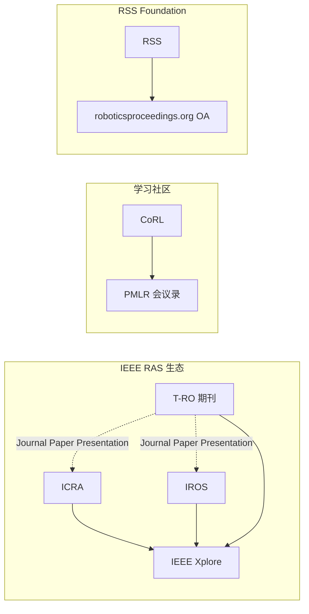

# 机器人顶会顶刊发表渠道对比

在机器人学习与系统方向投稿或引用时，**会议**（ICRA、IROS、CoRL、RSS）与 **期刊**（T-RO、IJRR、Science Robotics）的 **主办方、审稿节奏、论文集托管** 差异很大。本页依据各渠道 **官网一手介绍** 归纳，便于快速选型；具体截止日以当届 CFP 为准。

## 总览

| 简称 | 类型 | 主办方 / 生态 | 官方常设入口 | 典型论文集 / 发表 |
|------|------|---------------|--------------|-------------------|
| **ICRA** | 会议 | IEEE RAS 旗舰 | [IEEE RAS ICRA](https://www.ieee-ras.org/conferences-workshops/fully-sponsored/icra/) | IEEE Xplore |
| **IROS** | 会议 | IEEE RAS + RSJ 等 | [IEEE RAS IROS](https://www.ieee-ras.org/conferences-workshops/fully-sponsored/iros) | IEEE Xplore |
| **CoRL** | 会议 | Robot Learning 社区 | [corl.org](https://www.corl.org/) | PMLR 会议录 |
| **RSS** | 会议 | RSS Foundation | [roboticsconference.org](https://roboticsconference.org/) | [roboticsproceedings.org](https://www.roboticsproceedings.org/)（开放获取） |
| **T-RO** | 期刊 | IEEE RAS | [IEEE RAS T-RO](https://www.ieee-ras.org/publications/t-ro/) | IEEE Xplore |
| **IJRR** | 期刊 | SAGE | [SAGE IJRR](https://journals.sagepub.com/home/ijr) | SAGE Journals |
| **Sci. Robot.** | 期刊 | AAAS | [science.org/scirobotics](https://www.science.org/journal/scirobotics) | Science 平台 |

当届举办地、日期与投稿入口见 [原始资料索引](../../sources/sites/robotics-venues-primary-refs.md) 中的 **届次站** 链接（如 [ICRA 2026](https://2026.ieee-icra.org/)、[IROS 2026](https://2026.ieee-iros.org/)、[RSS 2026](https://roboticsconference.org/)）。

## 会议：定位与形态

### ICRA 与 IROS（IEEE 双旗舰）

- **ICRA**（IEEE International Conference on Robotics and Automation）由 **IEEE RAS 全额赞助**，官方称其为 RAS **旗舰会议**，覆盖机器人与自动化的 **广泛主题**（理论、系统、实验、产业应用等）。
- **IROS**（IEEE/RSJ International Conference on Intelligent Robots and Systems）自 **1988** 年创办，官方称其为全球 **最大型** 机器人研究会议之一；赞助方除 IEEE RAS 外，还包括 **RSJ、SICE、NTF、IEEE IES**。
- 二者均通过 **PaperPlaza**（[ras.papercept.net](https://ras.papercept.net/)）生态投稿，录用论文进入 **IEEE Xplore**。
- **选型提示**：若工作偏 **传统机器人、自动化、系统集成与实验验证**，ICRA/IROS 受众面最广；IROS 在历史与规模上常被视为与 ICRA 并列的「必投」会议，但具体录用率与主题匹配需结合当年 program committee 方向。

### CoRL（机器人 × 机器学习）

- **CoRL**（Conference on Robot Learning）自 **2017** 年起每年举办，官方聚焦 **机器人与机器学习交叉**。
- **单轨、高选择性、双盲**；论文集由 **PMLR** 出版，投稿经 **OpenReview**（见 [Instruction for Authors](https://www.corl.org/contributions/instruction-for-authors)）。
- **选型提示**：工作若核心是 **学习算法、数据驱动策略、Sim2Real 学习管线** 且希望与 ML 社区对话，CoRL 比 ICRA/IROS 更对口；篇幅与模板以当届 author kit 为准（常见为 9 页正文 + 参考文献等结构）。

### RSS（Science and Systems）

- **RSS**（Robotics: Science and Systems）由 **RSS Foundation** 组织，强调 **单轨** 深度报告与跨领域交流。
- 论文集在 **[roboticsproceedings.org](https://www.roboticsproceedings.org/)** **免费开放获取**，ISSN 2330-765X；与 IEEE 会议论文集托管方式不同。
- **选型提示**：偏 **基础科学问题、系统级创新、可复现的「science + systems」叙事** 时，RSS 定位与 ICRA/IROS 的「超大规模分会矩阵」不同；引用时可直接链到 proceedings 中的 PDF。

## 期刊：定位与周期

### T-RO（IEEE Transactions on Robotics）

- IEEE RAS 旗下 **Transactions**，发表机器人 **各领域重大进展**；接受理论、设计、实验、算法与集成案例的组合（[Information for Authors](https://www.ieee-ras.org/publications/t-ro/t-ro-information-for-authors/)）。
- **审稿周期长、修订轮次多**，适合 **体系完整、需长期存档** 的工作；录用 T-RO 论文可在 ICRA/IROS 等会做 **期刊论文报告**。
- 投稿：[ras.papercept.net/journals/tro](http://ras.papercept.net/journals/tro)。

### IJRR（The International Journal of Robotics Research）

- **SAGE** 出版，**1982** 年创刊，官方称其为 **首个** 机器人研究学术期刊。
- 强调 **档案级价值**（archival value）：原创、可被后续工作 **继续构建**；含综述、特刊、Data Papers 等类型。
- 投稿：[mc.manuscriptcentral.com/ijrr](https://mc.manuscriptcentral.com/ijrr)；与 RSS proceedings 曾有 **特刊联动** 传统（见 proceedings 页说明）。

### Science Robotics

- **AAAS** 旗下 **Science Robotics**（2016 创刊），多学科期刊，口号 **「Science for robotics and robotics for science」**。
- 官方范围覆盖 **机构、传感、学习、控制、导航** 及 **政策、伦理、社会** 议题；与 T-RO/IJRR 等工程期刊相比，更强调 **科学叙事、交叉学科与高水平展示**（参见 [创刊社论](https://www.science.org/doi/10.1126/scirobotics.aal2099) 与 [Grand Challenges](https://www.science.org/doi/10.1126/scirobotics.aar7650)）。
- 入口：[science.org/journal/scirobotics](https://www.science.org/journal/scirobotics)。

## 常见误区

| 误区 | 澄清 |
|------|------|
| 「RSS 是 IEEE 会议」 | RSS 独立于 IEEE RAS，论文集在 **roboticsproceedings.org** 开放获取，非 IEEE Xplore 默认路径。 |
| 「CoRL 与 ICRA 一样走 PaperPlaza」 | CoRL 使用 **OpenReview + PMLR**，审稿规则（双盲、页数）以 corl.org 为准。 |
| 「期刊论文 = 会议短文加长版」 | T-RO / IJRR / Science Robotics 要求 **实质性新贡献** 与完整实验/理论闭环，不能简单堆砌会议版。 |
| 「官网年份表 = 引用格式」 | 引用应以 **最终 PDF、IEEE Xplore / SAGE / Science 页码** 或 DBLP 为准；届次站仅作日程参考。 |

## 与本知识库其他页面的关系

- **[Reinforcement Learning](../methods/reinforcement-learning.md)**、**[Sim2Real](../concepts/sim2real.md)** — 大量近期学习类工作常见于 CoRL、RSS、ICRA/IROS 学习专题。
- **[Xue Bin Peng](../entities/xue-bin-peng.md)** 等学者页 — 个人主页列会刊时，应回查上述 **官方论文集** 核对最终版本。

## 推荐继续阅读

- [IEEE RAS 出版物总览](https://www.ieee-ras.org/publications) — RA-L、T-ASE 等与 T-RO 的区分
- [DBLP 机器人会议索引](https://dblp.org/db/conf/icra/index.html) — 历年论文书目（非官方，但便于检索）
- [OpenReview CoRL 组](https://openreview.net/group?id=robot-learning.org/CoRL/2026/Conference) — 当年投稿与开放评审状态

## 参考来源

- [机器人顶会顶刊官方一手资料索引](../../sources/sites/robotics-venues-primary-refs.md)
