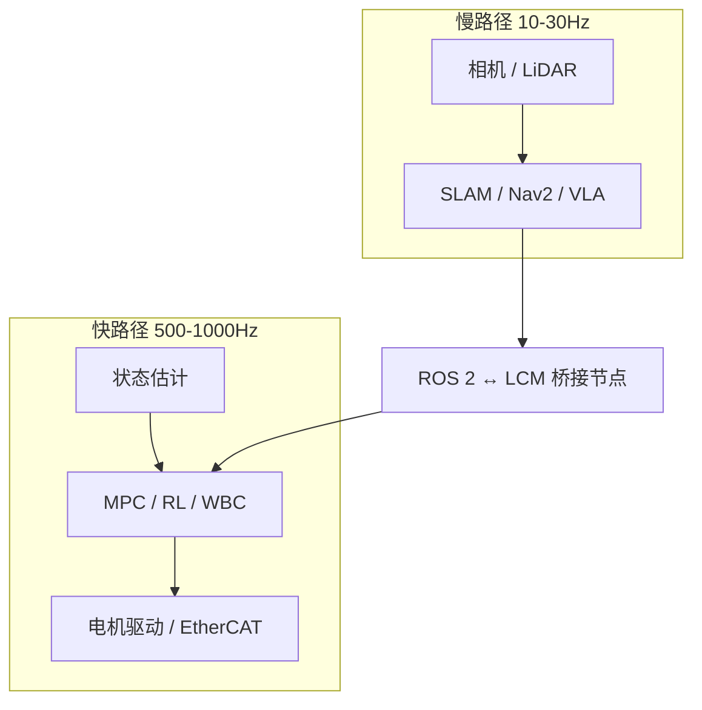

# ROS 2 vs LCM (机器人中间件选型)

**一句话结论：** 需要驱动/导航/规划/可视化生态与可靠工具链时选 **ROS 2**；需要跨进程或跨板的 **高频、低抖动、最新优先** 状态与力矩总线时选 **LCM**（同机极限路径优先共享内存）。人形/腿式先进栈几乎总是 **分层混合**，而不是二选一。

## 英文缩写速查

| 缩写 | 英文全称 | 简要说明 |
|------|----------|----------|
| ROS 2 | Robot Operating System 2 | 系统集成与生态中间件栈 |
| LCM | Lightweight Communications and Marshalling | 轻量 UDP 组播通信与编解码 |
| DDS | Data Distribution Service | ROS 2 默认底层通信标准 |
| QoS | Quality of Service | 可靠性与时效等策略 |
| RMW | ROS Middleware | ROS 与具体中间件实现的适配层 |
| IPC | Inter-Process Communication | 进程间通信 |
| UDP | User Datagram Protocol | LCM 默认传输 |
| EtherCAT | Ethernet for Control Automation Technology | 关节级工业以太网总线 |

## 为什么重要

真机上「策略对了但仍抽搐」往往是 **中间件与调度** 问题，不是算法本身。把 1 kHz 关节环塞进 DDS topic，或在无生态的 LCM 上重造 Nav2，都会付出不必要代价。

## 核心特性对比

| 维度 | ROS 2（DDS / RMW） | LCM |
|------|---------------------|-----|
| **官方定位** | 机器人应用库与工具的 meta OS | 高带宽低延迟实时系统的消息 + marshalling |
| **底层** | DDS（[Fast DDS](../entities/fast-dds.md) / [Cyclone](../entities/cyclone-dds.md) 等） | UDP Multicast |
| **拓扑** | 去中心发现；无 ROS 1 Master | 无 hub、无 daemon，对等直连 |
| **高频行为** | 吞吐可观，但 >500 Hz 易抖动 | 面向最新样本；控制环友好 |
| **工具 / 生态** | RViz、rosbag2、tf2、Nav2、MoveIt… | spy / logger / logplayer 等基础工具 |
| **QoS / 可靠** | 丰富策略 | 默认尽力而为，假设「新数据最重要」 |
| **依赖** | 重；常用发行版安装 | 少依赖；LGPL-2.1 开源库 |
| **上游入口** | [github.com/ros2](https://github.com/ros2)、[ros2/ros2](https://github.com/ros2/ros2) | [lcm-proj/lcm](https://github.com/lcm-proj/lcm)、[文档站](https://lcm-proj.github.io/lcm/) |

概念展开：[ROS 2 基础](../concepts/ros2-basics.md)、[LCM 基础](../concepts/lcm-basics.md)、[DDS](../concepts/dds-communication.md)。

## 适用场景

### 用 LCM：底层高频运控

双足/四足 locomotion 常以 **500–1000 Hz** 读 IMU/关节并下发力矩。偶发丢帧可接受，卡顿与尾延迟不可接受。LCM 官方强调 low-latency 与 UDP 组播广播，符合「只要最新」。同机优先共享内存；跨板再 LCM。细节：[实时运控中间件配置指南](../queries/real-time-control-middleware-guide.md)。

### 用 ROS 2：中高层感知与规划

SLAM、导航、点云/图像管线、MoveIt、多传感器 `tf2`、社区驱动——ROS 2 统治力来自生态而非微秒延迟。数据体量大、坐标系繁、要复用包时，用 LCM 造轮子不现实。

## 混合架构

- **大脑**：IPC / Jetson 上 ROS 2 输出路径或足端参考。
- **小脑/脊髓**：PREEMPT_RT 进程内推理 + **LCM**（或 EtherCAT 到驱动）。
- **桥接**：降频、类型转换、避免 DDS 抖动进入控制环。

框架级实例：[DimOS](../entities/dimensionalos-dimos.md) 以 Module/Blueprint 为应用层，默认 **LCMTransport**，并支持切换 SHM / DDS / ROS 2。

## 工程实践速查

| 决策 | 建议 |
|------|------|
| 同机 1 kHz 状态 | 共享内存 / 无锁队列 > LCM > ROS 2 |
| 跨板最新状态 | LCM 组播（先验证组播网络） |
| 导航 / 机械臂规划 | ROS 2 + 生态栈 |
| 可靠一次性命令 | ROS 2 Service/Action，或降频 Reliable topic |
| 关节总线 | CAN / EtherCAT；不要与中间件混为一谈 |

## 局限与误判风险

- **「ROS 2 也能 1 kHz」**：演示均值延迟 ≠ 尾延迟与抖动；真机以示波器/周期日志为准。
- **「LCM 可替代 ROS」**：丢失生态后，驱动与标定成本通常更高。
- **组播网络未验证**：交换机 IGMP、Wi-Fi、跨网段会使 LCM「偶发全挂」。
- **只比协议不比进程调度**：无 PREEMPT_RT / isolcpus 时，换中间件也救不了抖动。

## 关联页面

- [ROS 2 基础](../concepts/ros2-basics.md)
- [LCM 基础](../concepts/lcm-basics.md)
- [DDS 通信机制](../concepts/dds-communication.md)
- [Fast DDS](../entities/fast-dds.md) · [Cyclone DDS](../entities/cyclone-dds.md)
- [实时运控中间件配置指南](../queries/real-time-control-middleware-guide.md)
- [Locomotion 任务](../tasks/locomotion.md)
- [UDP 组播动力学](../formalizations/udp-multicast-dynamics.md)
- [技术地图：ROS 2](../../tech-map/modules/system/ros2.md)

## 参考来源

- [LCM 官方文档](../../sources/sites/lcm-proj-github-io.md) · [lcm-proj/lcm](../../sources/repos/lcm.md)
- [ROS 2 GitHub 组织](../../sources/sites/ros2-github-org.md) · [ros2/ros2 元仓](../../sources/repos/ros2.md)
- [ROS 2 官方文档（Humble）](../../sources/sites/ros2-official-documentation.md)
- [OMG DDS / RTPS](../../sources/sites/omg-dds-spec.md) · [Fast DDS](../../sources/repos/fast-dds.md) · [Cyclone](../../sources/repos/cyclonedds.md)

## 推荐继续阅读

- LCM Overview（IROS 2010 PDF，文档站 Publications）
- ROS 2 Design：https://design.ros2.org/
- LCM UDP Multicast Protocol：https://lcm-proj.github.io/lcm/content/lcm-udp-multicast-protocol-description.html
