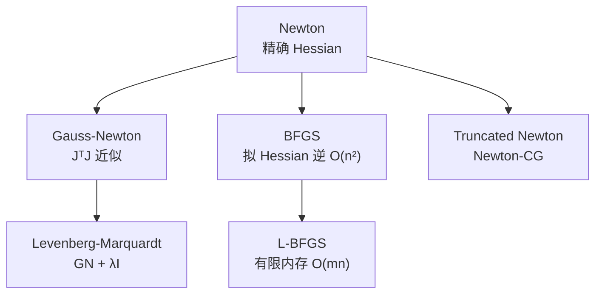

# Second-Order Optimizers：选型对比

**背景**：机器人 [Trajectory Optimization](../methods/trajectory-optimization.md)、IK、标定与 NMPC 打靶后，常归结为 **非线性规划（NLP）** 或 **非线性最小二乘（NLS）**。与一阶 SGD/Adam 不同，二阶与拟牛顿方法 **显式或近似利用曲率**，在中小规模、良好初值下收敛更快。详见 [数值优化方法选型](../queries/numerical-optimization-method-selection.md)。

## 一句话定位

> 最小二乘用 GN/LM；高维 TrajOpt 用 L-BFGS；要精确曲率且维度低用 Newton；可微大规模试 Truncated Newton。

## 英文缩写速查

| 缩写 | 英文全称 | 简要说明 |
|------|----------|----------|
| Newton | Newton's Method | 精确 Hessian 二阶迭代 |
| GN | Gauss-Newton | 最小二乘 $J^T J$ 曲率近似 |
| LM | Levenberg-Marquardt | 阻尼 GN，病态 NLS 默认 |
| BFGS | Broyden–Fletcher–Goldfarb–Shanno | 满内存拟牛顿 |
| L-BFGS | Limited-memory BFGS | 高维 TrajOpt 工业默认 |
| TN | Truncated Newton | Newton-CG 不精确内层 |

---

## 优化器族谱

---

## 机制对照表

| 优化器 | 独立节点 | 曲率来源 | 内存量级 | 全局 LR | 典型问题 |
|--------|---------|---------|---------|---------|---------|
| [Newton](../methods/newtons-method.md) | ✓ | $\nabla^2 f$ | $O(n^2)$ | 线搜索 | 低维光滑 NLP |
| [Gauss-Newton](../methods/gauss-newton.md) | ✓ | $J^T J$ | $O(n^2)$ 级 | 线搜索/LM | NLS、TrajOpt 打靶 |
| [Levenberg-Marquardt](../methods/levenberg-marquardt.md) | ✓ | $(J^T J + \lambda I)^{-1}$ | 同 GN | $\lambda$ 调度 | 病态 IK、标定 |
| [BFGS](../methods/bfgs.md) | ✓ | 梯度差分 | $O(n^2)$ | 线搜索 | 中低维 NLP |
| [L-BFGS](../methods/l-bfgs.md) | ✓ | 最近 $m$ 步梯度差分 | $O(mn)$ | 线搜索 | 高维 TrajOpt |
| [Truncated Newton](../methods/truncated-newton.md) | ✓ | HVP + CG | $O(n)$ | 线搜索 | 大规模可微 NLP |

> 表中「全局 LR」一列均为 **线搜索**——这些方法共享同一套 [下降方向 + 线搜索骨架](../methods/line-search-steepest-descent.md)（Armijo/Wolfe 步长），区别只在曲率来源。把 [最速下降 + 线搜索](../methods/line-search-steepest-descent.md) 当作一阶 NLP baseline，再按下表升级到二阶/拟牛顿。

---

## 机器人场景选型

| 场景 | 推荐起点 | 备选 | 避免 |
|------|---------|------|------|
| 轨迹打靶 / shooting | L-BFGS | Gauss-Newton | 纯梯度下降无调度 |
| 冗余 IK / 标定 | Levenberg-Marquardt | Gauss-Newton | 病态时纯 GN |
| cuRobo 类 GPU motion gen | [L-BFGS](../methods/l-bfgs.md) | 并行多 seed | 满 BFGS |
| 低维 OCP 验证 | Newton / iLQR | Truncated Newton | 高维满牛顿 |
| 可微仿真 TrajOpt 研究 | Truncated Newton | L-BFGS | 未验证的 exotic |
| 深度学习策略训练 | Adam（见 [Deep Learning Optimizers 对比](./deep-learning-optimizers.md)） | — | 把 TrajOpt 优化器当 RL 默认 |

---

## 与一阶优化器的分层

| 层级 | 代表 | 典型用途 |
|------|------|---------|
| **一阶（神经网络）** | SGD、Adam、AdamW | RL 策略、VLA、感知网络 |
| **二阶/拟牛顿（NLP）** | L-BFGS、GN、LM | TrajOpt、IK、标定 |
| **结构利用（OCP）** | iLQR、DDP | 含动力学的轨迹优化 |

一阶与二阶 **不互斥**：同一机器人栈里，规划用 L-BFGS，策略学习用 Adam。

---

## 常见误区

| 误区 | 澄清 |
|------|------|
| 「L-BFGS 是二阶方法」 | 严格说是 **拟牛顿**（近似曲率），非精确 Hessian |
| 「GN 永远比 L-BFGS 快」 | 高维、约束罚化后 GN 矩阵可能病态；L-BFGS 更稳 |
| 「LM 只用于神经网络」 | LM 是 **非线性最小二乘** 标准，与深度学习无关 |
| 「共轭梯度 = 二阶优化器」 | CG 解线性子问题；[Truncated Newton](../methods/truncated-newton.md) 才是外层二阶 |

---

## 关联页面

- [Line Search & Steepest Descent](../methods/line-search-steepest-descent.md) — 一阶 NLP baseline 与共享的线搜索骨架
- [Newton](../methods/newtons-method.md) · [Gauss-Newton](../methods/gauss-newton.md) · [LM](../methods/levenberg-marquardt.md)
- [BFGS](../methods/bfgs.md) · [L-BFGS](../methods/l-bfgs.md) · [Truncated Newton](../methods/truncated-newton.md)
- [Quasi-Newton BFGS 总览](../methods/quasi-newton-bfgs.md)
- [Deep Learning Optimizers 对比](./deep-learning-optimizers.md) — 一阶（SGD/Adam）分层
- [Trajectory Optimization](../methods/trajectory-optimization.md)
- [Numerical Optimization Method Selection](../queries/numerical-optimization-method-selection.md)
- [cuRobo](../entities/curobo.md)

## 参考来源

- [Second-Order Optimizers 论文摘录](../../sources/papers/second_order_optimizers.md)
- [数值优化基础课程](../../sources/courses/numerical_optimization_foundations_robotics.md)

## 推荐继续阅读

- Nocedal & Wright, *Numerical Optimization* (2nd ed.)
- [Numerical Optimization Method Selection](../queries/numerical-optimization-method-selection.md)
