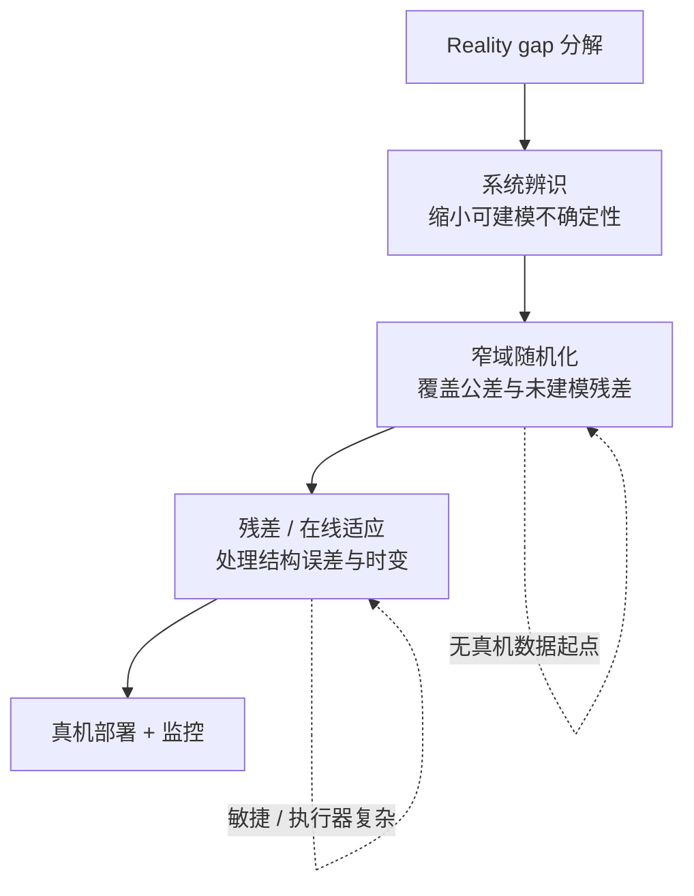

# Sim2Real 四条路线：可辨识性视角

仿真里优化 $J_{\mathrm{sim}}(\pi)$，真机却要 $J_{\mathrm{real}}(\pi)$ 高——**系统辨识、域随机化、在线适应、残差学习**出自不同传统，却都在回答同一组问题：**参数能不能辨？辨不出来的误差怎么处理？** 本页把四条路线放在可辨识性坐标下比较，并给出工程组合顺序。

## 一句话定义

> **先判断 gap 里有多少能靠参数辨识吃掉，再用窄 DR 覆盖公差，最后用适应或残差处理结构误差；四条路线是立场分工，不是四选一。**

## 英文缩写速查

| 缩写 | 英文全称 | 简要说明 |
|------|----------|----------|
| Sim2Real | Simulation to Real | 仿真策略迁移真机 |
| SysID | System Identification | 用真机数据校准仿真/执行器参数 |
| DR | Domain Randomization | 训练时随机化参数以扩分布 |
| RMA | Rapid Motor Adaptation | 从历史隐式估计环境上下文并在线适应 |
| PD | Proportional–Derivative | 腿足 RL 常输出关节位置 setpoint，底层 PD 闭环 |
| CMA-ES | Covariance Matrix Adaptation Evolution Strategy | PACE 等无梯度执行器辨识常用优化器 |
| OOD | Out-of-Distribution | 部署状态超出训练/辨识覆盖时的失配 |

## 为什么重要

- **工具选错会白付成本：** 不辨识就上宽 DR，等于给已知量也买保险；该做 SysID 时去调 PPO 奖励，常见且昂贵。
- **在线适应会静默失败：** 离线辨识秩亏会立刻报错；在线适应在激励不足时**无告警地退化成 DR**，易被误判为网络或超参问题。
- **残差有分布边界：** 不要求参数可辨，但只在 rollout 覆盖的状态上成立；与 SysID 承担的是不同风险。
- **敏捷任务更吃名义模型：** 为覆盖执行器 gap 的 DR 范围随步频快速增长；PACE 类结果表明**先把执行器模型做准**再谈随机化，在高动态段更划算。

## 核心原理

### 四条路线的立场

| 路线 | 立场 | 真机数据（典型） | 产物 | 部署额外模块 |
|------|------|------------------|------|--------------|
| **系统辨识** | 正面求解可建模参数 | 固定基座 chirp / 主动激励 | 有效惯量、摩擦、延迟等 | 通常无 |
| **域随机化** | 放弃单点辨识，优化分布下期望回报 | 训练期零；反馈式 DR 需少量轨迹 | 鲁棒策略 | 无 |
| **在线适应** | 推迟辨识，只要求历史能区分**控制相关上下文** | 训练期特权教师；部署期学生前向 | 基策略 + 适应模块 | 有（运行时） |
| **残差学习** | 承认辨不全，直接学 sim–real 差 | 真机 rollout / 轨迹配对 | 力矩或动作层修正 | 视方案（ASAP 微调后丢弃） |

### 流程总览

成熟组合读法：**先把能辨的辨出来 → 对剩余不确定性买保险（窄 DR）→ 再处理辨不出的部分（残差或适应）**。顺序反了会过度保守或重复付费。

### 与「三大类」对比页的关系

[Sim2Real Approaches](./sim2real-approaches.md) 按 **DR / Domain Adaptation / Real Fine-tuning** 分；本页按 **辨识立场** 分。DA 中的系统辨识落入「正面辨识」；Real Fine-tuning 与「残差 / 适应」有交集但不等同——残差可在训练期进入仿真（执行器网络），适应可在部署期运行（RMA）。

### 辨识深读入口

单关节 PD 闭环下惯量、延迟、摩擦如何在**同一条阶跃曲线**上纠缠，以及分级实验如何拆开，见姊妹篇提炼的 [关节动力学辨识实验设计](../methods/sim2real-joint-sysid-experiment-design.md)（[自由度FreeDof 公众号](../../sources/blogs/wechat_freedof_sim2real_dynamics_identification.md)）。

## 工程实践

### 分层组合（参考表）

| 方法 | 立场 | 真实数据用途 | 部署额外模块 |
|------|------|--------------|--------------|
| [PACE](../entities/paper-pace-sim2real-legged-robots.md) | 正面辨识 | 固定基座多关节 chirp | 无 |
| SimOpt / BayesSim（文内） | 放弃辨识 + 反馈 | 少量轨迹更新参数分布 | 无 |
| PolySim（文内） | 放弃辨识 | 无（多引擎结构随机化） | 无 |
| 执行器网络 / UAN | 辨识↔残差边界 | 响应轨迹匹配 | 训练期进仿真 |
| [ASAP](../entities/paper-hrl-stack-25-asap.md) | 承认辨不出 | 真机 rollout 学 delta action | 微调后通常无 |
| [RMA](../entities/paper-rma-rapid-motor-adaptation.md) | 推迟辨识 | 训历史编码器 | 有，在线运行 |

### 症状 → 路线（节选）

| 症状 | 建议顺序 |
|------|----------|
| 固定基座关节响应对不上 | 校验时间同步、控制周期、单位 → **闭环执行器 SysID**（勿先调 PPO） |
| 回差、迟滞、柔性显著 | 可解释物理主效应 → **力矩层残差**或灰盒（[Actuator Network](../methods/actuator-network.md)） |
| 固定基座吻合、落地即失败 | 接触参数、状态估计、时延；固定基座实验**辨不了足地接触** |
| 换负载 / 地面后失败 | 名义模型 + 合理 DR + **在线适应**；单独测适应延迟与 OOD |
| 敏捷动作跟不上 | 名义模型做准 → **动作层残差**；可达步频是 gap 敏感代理 |
| 无真机数据 | 宽 DR、ADR、教师–学生、多引擎；**仍需真机验收** |
| 换背景 / 光照后视觉失败 | 观测层（视觉 DR / 仿真渲染），**不要继续拟合动力学** |

### 读论文六条判据（文内）

1. **真实数据边界** — 零样本 ≠ 全流程未用真机（辨识阶段可能已用）。
2. **基线是否充分** — 应对标「仅 DR」「仅辨识」「辨识 + 窄 DR」等组合。
3. **未见轨迹与新任务** — 辨识拟合好 ≠ 新策略可迁移。
4. **变化覆盖** — 负载、地面、温度、电池、个体差异、磨损。
5. **任务指标** — 除成功率外看真机数据量与部署算力。
6. **离线指标脱钩** — 仿真跟踪误差不是部署充分条件（接口 gap 实证）。

## 局限与风险

- **四路线非互斥，但组件越多故障定位越难** — 按实际 gap **逐个添加**，避免一次堆满。
- **DR 的保守性是结构性的** — 优化分布期望 ≠ min-max；尾部需鲁棒/对抗训练。
- **残差外推风险** — 未跑过的动作没有保证；与 SysID「参数边界清楚」互补。
- **在线适应静默失效** — 需部署期监控（文内 RAPT 等）与分层安全，独立于策略。
- **训练成本下降改变性价比** — 低敏捷任务上「多跑 DR」可能与「做辨识」竞争；高敏捷仍倾向先标定执行器。

## 关联页面

- [Sim2Real](../concepts/sim2real.md) — 概念总览
- [System Identification](../concepts/system-identification.md) — 可建模参数校准
- [Domain Randomization](../concepts/domain-randomization.md) — 随机化范围与课程
- [关节动力学辨识实验设计](../methods/sim2real-joint-sysid-experiment-design.md) — 单关节实验如何拆开纠缠参数
- [Sim2Real 闭环误差分层工程](../queries/sim2real-closed-loop-engineering.md) — 从 SysID 到部署的持续校准叙事
- [Sim2Real Approaches](./sim2real-approaches.md) — DR / DA / Real Fine-tuning 三大类
- [Residual Policy Learning](../methods/residual-policy-learning.md) — 动作层残差谱系
- [PACE](../entities/paper-pace-sim2real-legged-robots.md) — 执行器 SysID 代表实现
- [Hub: Sim2Real](../overview/hub-sim2real.md) — 知识链导航

## 参考来源

- [wechat_freedof_sim2real_four_routes_dr_to_residual_2026-08-23.md](../../sources/blogs/wechat_freedof_sim2real_four_routes_dr_to_residual_2026-08-23.md)
- [wechat_freedof_sim2real_dynamics_identification.md](../../sources/blogs/wechat_freedof_sim2real_dynamics_identification.md)（姊妹篇：单关节实验设计）

## 推荐继续阅读

- [自由度FreeDof 原文：四条路线梳理](https://mp.weixin.qq.com/s/K_6MibGXWwh9OL9eSZxOMg)
- [PACE（RSS 2023）](https://arxiv.org/abs/2307.11497) — 执行器辨识与零样本腿足部署
- [Da et al. Sim2Real Survey（2025）](https://arxiv.org/abs/2502.13187) — 四要素分类与 `LongchaoDa/AwesomeSim2Real` 资源索引
