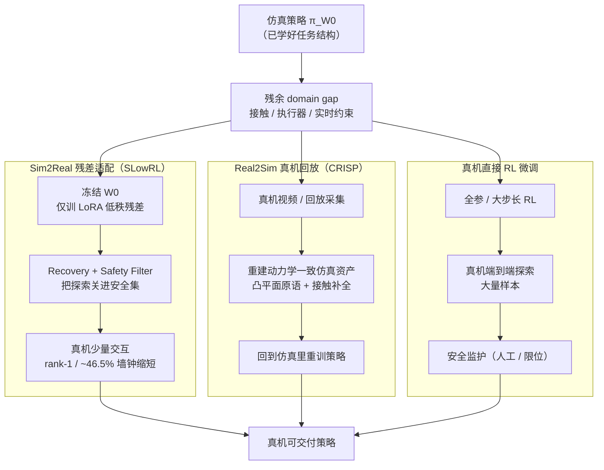

# Sim2Real 残差适配 vs Real2Sim 真机回放 vs 真机直接 RL 微调

**背景**：当一台机器人已经在仿真里训出可用策略、但真机上还差最后几成性能时，[Sim2Real](../concepts/sim2real.md) 链路的**最后一公里**有三种本质不同的修补思路。它们都想消掉同一个 **domain gap**，但**把代价付在不同地方**：

- **Sim2Real 残差适配**：承认 gap 存在，在**真机上**用最小代价（低秩残差 + 安全层）把残差吸收掉，仿真策略权重基本冻结；
- **Real2Sim 真机回放**：不在真机上训练，而是用真机采集的数据**反向修正仿真**，让 gap 在仿真侧缩小后回到仿真里重训；
- **真机直接 RL 微调**：直接在真实机器人上跑 RL 探索，用真机样本端到端地把 gap 学掉。

> **一句话区分**：残差适配「**在真机上抠残差，但把探索关进安全集**」；Real2Sim「**把真机变成修仿真的数据源，训练仍回仿真**」；真机直接微调「**真机即训练场，样本最贵、最不安全、但最直接**」。

本页是 [真机安全 RL 微调](../concepts/safe-real-world-rl-fine-tuning.md) 的**选型横切面**：那一页讲「在真机上微调时如何保证安全」，本页则在更上一层回答「**到底要不要在真机上微调、还是绕到仿真侧修**」。

---

## 一句话定义

| 策略 | 一句话 | 代表工作 |
|------|--------|----------|
| **Sim2Real 残差适配** | 冻结仿真策略 $W_0$，只在真机上训一个低秩残差 $\frac{\alpha}{r}BA$，叠加 Recovery / Safety Filter 安全层吸收残差。 | [SLowRL](../entities/paper-slowrl-safe-lora-locomotion-sim2real.md)（arXiv:2603.17092） |
| **Real2Sim 真机回放** | 用真机视频 / 回放重建动力学一致的仿真资产与参考运动，gap 在仿真侧被修掉后回到仿真里重训。 | [CRISP](../methods/crisp-real2sim.md)（ICLR 2026） |
| **真机直接 RL 微调** | 在真实机器人上直接跑 RL（全参或大步长），用真机样本端到端吸收 gap。 | 经典 Real-World RL / FFT 真机微调基线 |

---

## 核心维度对比

| 维度 | **Sim2Real 残差适配** | **Real2Sim 真机回放** | **真机直接 RL 微调** |
|------|------------------------|------------------------|------------------------|
| **代价主要付在哪** | 真机侧（少量、受控交互） | 资产 / 仿真侧（重建 + 重训） | 真机侧（大量、高风险交互） |
| **训练在哪发生** | 真机（仅低秩残差） | 仿真（修完资产后重训） | 真机（策略主体） |
| **是否改仿真策略权重** | 是（仅 LoRA 低秩） | 否（重训新策略） | 是（全参 / 大步长） |
| **真机数据需求** | 少（吸收低维残差） | 中（采集回放 / 视频） | 多（端到端探索） |
| **训练期硬件风险** | 低（探索被安全集约束） | **极低**（真机不参与训练） | **高**（前期易摔倒损坏） |
| **仿真保真度要求** | 中（残差越小越省真机） | **高**（修完的仿真要可信） | 低（仿真只给初始策略） |
| **样本效率（真机侧）** | 高（rank-1 即可，~46.5% 墙钟缩短） | N/A（真机不训练） | 低（接触 RL 梯度噪声大） |
| **遗忘风险** | 低（$W_0$ 冻结） | 无（重训但有仿真锚点） | 高（脆弱预训练策略上探索易遗忘） |
| **gap 假设** | 残差低维、可被小扰动吸收 | gap 来自仿真资产 / 几何 / 接触失真 | gap 复杂、需端到端真机信号 |
| **典型代码产物** | 冻结骨干 + LoRA 残差 + Recovery/Filter | 重建管线（视频→仿真资产）+ 重训脚本 | 真机 RL 训练栈 + 安全监护 |
| **失败模式** | 残差不止低维时吸收不全 | 仿真修偏 → 回训策略带错先验 | 摔坏硬件 / 收敛慢 / 灾难性遗忘 |

---

## 数据流对比（Mermaid）

三条路线放进同一张「**仿真策略 → gap → 部署**」坐标，差异在 **gap 在哪被消化**：



要点：
- **残差适配** 在 **真机侧** 消化 gap，但把代价压到「低维残差 + 安全层」；
- **Real2Sim** 把 gap **移回仿真侧** 消化（修资产而非修策略），真机零训练风险；
- **直接微调** 在 **真机侧** 端到端消化 gap，最直接也最贵、最危险。

---

## 三维深读：成本 / 安全 / 数据效率

### 成本

- **残差适配**：仿真侧已沉没（一次性预训练），真机侧只付**少量受控交互**；工程上要实现 LoRA 注入 + Recovery 策略 + Safety Filter，复杂度中等。
- **Real2Sim**：真机零训练成本，但**资产重建管线很重**（视频→几何→接触补全→可仿真资产）且要重训策略；适合「**资产可复用、要批量生产场景**」的规模化诉求。
- **直接微调**：仿真侧可以很轻（仿真只给初始策略），但真机侧**墙钟与硬件损耗都最贵**——接触 RL 在真机上每个样本都可能伴随磨损。

### 安全（训练期硬件风险）

- **Real2Sim 最安全**：真机**根本不参与训练**，只做被动采集，硬件零探索风险；
- **残差适配次之**：真机参与训练，但探索被 Recovery + Safety Filter **关进安全集**，训练期摔倒近零；
- **直接微调最危险**：在脆弱预训练策略上做全参探索，前期极易摔倒损坏关节 / 电池 / 外壳——这正是 [真机安全 RL 微调](../concepts/safe-real-world-rl-fine-tuning.md) 要解决的核心矛盾。

### 数据效率（真机样本利用率）

- **残差适配**：把策略约束在冻结骨干的低维残差子空间，固定真机时间预算下 **rank-1 往往最优**，真机样本利用率最高（见 [安全 LoRA 投影更新形式化](../formalizations/safe-lora-update-projection.md)）；
- **Real2Sim**：真机数据用来**修仿真**而非直接训练，单位真机数据撬动的是「整套可复用资产」，杠杆方向不同；
- **直接微调**：真机样本直接喂 RL，但接触梯度噪声大、需要的样本最多，真机侧效率最低。

---

## 适用场景

### 选 Sim2Real 残差适配的场景

1. 仿真策略已经**基本能跑**，只差最后几成性能，且 gap 判断为**低维残差**（接触求解器 / 执行器滞后 / 实时约束）；
2. 真机时间预算紧、不想冒摔坏硬件的风险，但又必须在真机上抠性能；
3. 不想丢掉仿真里学到的鲁棒行为（冻结 $W_0$ 避免遗忘）；
4. 硬件相对固定（如 Unitree Go2/G1），愿意为 Recovery + Safety Filter 付一次工程成本。

> **避坑**：只低秩适配 Actor 不收敛——Critic 仍活在源仿真分布会给错 advantage，**Actor 与 Critic 都要**低秩适配。残差超出低维假设时（如换了完全不同地形 / 负载），残差适配会吸收不全，应回退到 Real2Sim 或重训。

### 选 Real2Sim 真机回放的场景

1. **绝对不能在真机上冒训练风险**（贵重 / 易损 / 不可逆硬件），但又要缩小 gap；
2. gap 主要来自**仿真资产 / 几何 / 接触失真**（而非纯执行器残差），修资产比修策略更对症；
3. 有**批量生产可仿真资产**的规模化诉求（互联网视频 → 仿真场景），资产可被多个下游策略复用；
4. 接受「先离线修仿真、再回仿真重训」的较长链路，换取真机零探索。

> **避坑**：Real2Sim 的风险是**仿真修偏**——重建出的资产若动力学不可信，回训策略会带错先验，比不修还糟。务必用接触 / 物理一致性闭环校验（CRISP 用 RL 人形控制器把「人 + 场景」压到物理可行域，正是为此）。

### 选真机直接 RL 微调的场景

1. gap **复杂且高维**，残差适配吸收不全、Real2Sim 也难以在仿真里复现（如复杂柔性接触、难建模的真实扰动）；
2. 硬件**廉价 / 鲁棒 / 可大量并行**，摔倒损耗可接受；
3. 有成熟的真机安全监护（人工接管 / 物理限位 / 实时 CBF 安全壳），能压住前期探索风险；
4. 追求**端到端真机信号**，不愿被仿真先验束缚。

> **避坑**：直接微调最容易踩「真机微调 = 真机从头训」的误区——多数情况下 gap 并不需要端到端真机探索，残差适配 + 安全层已经够。直接微调应是**前两条都不适用时的兜底**，而非默认起点。

---

## 常见误判

1. **「Real2Sim 和 Sim2Real 是对立的两条路」**：不对。它们**正交互补**——Real2Sim 先在仿真侧把 gap 修小，Sim2Real 残差适配再在真机侧吸收**剩下**的残差。CRISP 一类 Real2Sim 减少的恰恰是 SLowRL 一类残差适配要在真机上吸收的量。
2. **「残差适配就是普通 LoRA 微调」**：错。区别在**安全层**——SLowRL 的核心不只是低秩，而是「冻结骨干 + 低秩残差 + Recovery/Safety Filter 把探索关进安全集」三件套，缺安全层在真机上一样摔。
3. **「Real2Sim 真机零成本」**：真机不**训练**不等于真机零成本——仍要采集回放 / 视频，且**资产重建管线**本身是重工程。它省的是真机**探索风险**，不是真机**数据**。
4. **「直接微调最强因为最端到端」**：端到端在真机上往往意味着**样本最贵、最不安全、最易遗忘**。除非 gap 真的高维到前两条都失效，否则它不是首选。
5. **「三选一」**：实际系统常**串联**——先 Real2Sim 把仿真资产修真（缩小 gap）→ 仿真里重训 → 真机上残差适配吸收剩余残差（安全收尾）→ 仅在残差吸收不全时才上有安全监护的直接微调。三者在「**gap 在哪被消化**」这条轴上是连续谱。

---

## 决策矩阵

```
你的主要约束是什么？
│
├── 仿真策略基本能跑 + gap 是低维残差 + 真机时间紧 → Sim2Real 残差适配（SLowRL）
├── 真机绝对不能冒训练风险 + gap 来自仿真资产/几何 → Real2Sim 真机回放（CRISP）
├── 要批量生产可复用仿真资产（视频→场景） → Real2Sim 真机回放
├── gap 复杂高维 + 硬件廉价鲁棒 + 有安全监护 → 真机直接 RL 微调
├── 既想缩 gap 又想真机零探索风险 → Real2Sim 先修，再回仿真重训
├── 想在真机上抠性能但不想摔硬件 / 不想遗忘 → 残差适配（冻结 W0 + 安全层）
└── 想要最稳的全链路 → Real2Sim 修资产 → 仿真重训 → 真机残差适配收尾
```

---

## 与其它对比页 / 概念页的区别

- 本页关注**真机适配「最后一公里」的三条策略选型**（残差吸收 / 反修仿真 / 真机直训）；
- [Sim2Real 方法横向对比](./sim2real-approaches.md) 在更前置的迁移阶段对比 **Domain Randomization / Domain Adaptation / Real Fine-tuning** 三大类，颗粒度更粗、不含 Real2Sim 反修路线；
- [真机安全 RL 微调](../concepts/safe-real-world-rl-fine-tuning.md) 聚焦「**已经决定在真机上微调后**，如何用低秩残差 / 生成兜底 / CBF 安全壳保证安全」，是本页「残差适配」分支的展开；
- [CRISP vs GS-Playground（Real2Sim）](./crisp-vs-gs-playground-real2sim.md) 对比的是**两种 Real2Sim 实现**，是本页「Real2Sim」分支内部的进一步选型；
- [安全 LoRA 投影更新形式化](../formalizations/safe-lora-update-projection.md) 给出本页「残差适配」分支的数学形式。

---

## 英文缩写速查

| 缩写 | 英文全称 | 简要说明 |
|------|----------|----------|
| Sim2Real | Simulation to Real | 把仿真中学到的策略迁移落地真机的工程主线 |
| RL | Reinforcement Learning | 通过与环境交互最大化长期回报来学习策略的范式 |
| LoRA | Low-Rank Adaptation | 低秩增量微调，低成本适配大模型 |
| G1 | Unitree G1 Humanoid | 宇树入门级教育科研人形平台 |
| CBF | Control Barrier Function | 用前向不变集保证安全约束的控制屏障函数 |
| DR | Domain Randomization | 训练时随机化仿真参数以提升跨域鲁棒迁移 |

## 参考来源

- [SLowRL（arXiv:2603.17092）](../../sources/papers/slowrl_arxiv_2603_17092.md) — 冻结策略 + rank-1 LoRA + Recovery/Safety Filter 真机残差适配
- [CRISP（Real2Sim 方法页）](../methods/crisp-real2sim.md) — 单目视频反修仿真资产，真机零训练风险
- [Sim2Real 论文归档](../../sources/papers/sim2real.md) — Sim2Real 迁移与残差来源背景

---

## 关联页面

- [真机安全 RL 微调](../concepts/safe-real-world-rl-fine-tuning.md) — 本页「残差适配」分支的安全机制展开
- [Sim2Real](../concepts/sim2real.md) — 残差来源与整条迁移链总览
- [CRISP（Real2Sim）](../methods/crisp-real2sim.md) — Real2Sim 真机回放的代表实现
- [SLowRL（安全 LoRA 真机微调）](../entities/paper-slowrl-safe-lora-locomotion-sim2real.md) — 残差适配的代表实现
- [安全 LoRA 投影更新形式化](../formalizations/safe-lora-update-projection.md) — 残差适配的约束策略优化形式
- [Sim2Real 方法横向对比](./sim2real-approaches.md) — 更前置的 DR / DA / Real Fine-tune 三类对比
- [CRISP vs GS-Playground（Real2Sim）](./crisp-vs-gs-playground-real2sim.md) — Real2Sim 分支内部的实现选型
- [Reinforcement Learning](../methods/reinforcement-learning.md) — 三条路线共同的策略学习底座
- [Query：如何缩小 sim2real gap](../queries/sim2real-gap-reduction.md) — gap 缩小的更宽视角

---

## 一句话记忆

> **残差适配在真机抠残差（省样本、要安全层）**、**Real2Sim 把真机当修仿真的数据源（零真机风险、重资产工程）**、**直接微调真机端到端（最贵最危险、兜底用）**——三者按「gap 在真机侧 / 仿真侧 / 真机侧端到端消化」分占谱系，工程上往往串联而非三选一。
