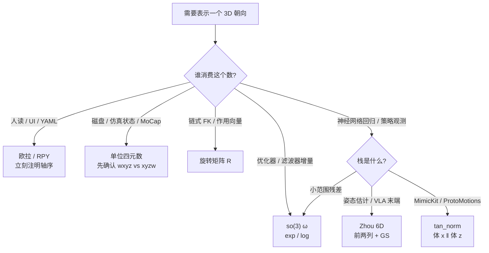

# 旋转表示方法对比（SO(3)）

**一句话选型：** 同一旋转属于流形 $SO(3)$，工程上用 **多种坐标** 各干各的——**欧拉角**给人看，**单位四元数**做存储与 SLERP，**旋转矩阵**做链式复合，**so(3) / 轴角**做优化增量，**6D / tan_norm** 给网络无约束回归。把一种表示硬套全栈，会同时踩万向锁、双覆盖和不正交。

## 一句话定义

**三维旋转的合法对象是李群 $SO(3)$；欧拉角、四元数、旋转矩阵、轴角/指数映射、6D 连续表示都是它的参数化，差别在维度、奇异、唯一性与是否适合神经网络回归。**

## 英文缩写速查

| 缩写 | 英文全称 | 简要说明 |
|------|----------|----------|
| SO(3) | Special Orthogonal Group in 3D | 三维旋转群：$R^\top R=I$，$\det R=1$ |
| RPY | Roll–Pitch–Yaw | 最常见的 Tait–Bryan 欧拉角顺序（约定因库而异） |
| SLERP | Spherical Linear Interpolation | 单位四元数球面上的恒定角速度插值 |
| 6D | 6D continuous rotation | Zhou CVPR 2019：取 $R$ 前两列再 Gram–Schmidt |
| IMU | Inertial Measurement Unit | 姿态输出多为四元数或 RPY |

## 为什么重要

机器人栈里「同一个朝向」会在 **UI、磁盘、仿真状态、优化器、策略网络** 之间换格式。选错的典型后果：

- 欧拉角插值 → 中间姿态拧、万向锁丢自由度；
- 四元数直接 L2 → $q$ 与 $-q$ 被当成两种答案；
- 旋转矩阵逐元素平均 → 跳出 $SO(3)$；
- 网络回归欧拉/四元数 → 参数空间不连续，梯度在跳变点炸掉。

本页只对比 **旋转（SO(3)）**；位姿 $T=(R,t)$ 见 [SE(3) 位姿表示](../formalizations/se3-representation.md)。四元数公式与 scalar 顺序见 [单位四元数](../formalizations/unit-quaternion-so3.md)；exp/log 链路见 [李群专页](../formalizations/lie-group-rigid-body-motions.md)。

## 核心原理

### 合法对象 vs 参数化

$$
SO(3)=\bigl\{R\in\mathbb{R}^{3\times 3}\ \big|\ R^\top R=I,\ \det R=1\bigr\}
$$

$SO(3)$ 是 **3 维流形**。任何 $\mathbb{R}^n$ 参数化要么 **冗余**（$n>3$ 加约束），要么 **有奇异/不连续**（$n=3$ 无法全局光滑覆盖）。这是选型的几何根因，不是实现偏好。

### 七种常用表示

| 表示 | 维数 | 约束 / 歧义 | 奇异或不连续 | 复合 / 插值 | 优势 | 劣势 | 默认场景 |
|------|------|-------------|--------------|-------------|------|------|----------|
| **旋转矩阵** $R$ | 9 | $R^\top R=I$，$\det=1$（6 约束） | 无拓扑奇异；数值会漂出正交 | 矩阵乘；逐元素 lerp **非法** | 作用向量 $Rv$ 直接；链式 FK 自然 | 冗余、需正交化、占带宽 | 运动学复合、图形管线、测地误差 $\arccos((\mathrm{tr}R^\top\hat R-1)/2)$ |
| **欧拉 / RPY** | 3 | 12 种轴序；同一姿态可多组角 | **万向锁**（中间轴 $\pm 90^\circ$ 丢 1 DoF）；绕 $2\pi$ 不连续 | 分通道 lerp **不保持刚体旋转** | 人读、3 个数、UI / 日志 | 约定爆炸；大范围姿态与自动微分危险 | 仅人机接口；内部立刻转四元数或 $R$ |
| **轴角 / 旋转向量** $\theta n$ | 3 | $\theta$ 与 $\theta+2\pi$ 同旋转；$\theta=0$ 轴任意 | $\theta=\pi$ 附近对数奇异；过 $2\pi$ 多值 | Rodrigues / exp；小角近似好 | 无单位约束；直觉「绕哪转多少」 | 大角不稳定；不宜当长期全局坐标积分 | 小扰动、IMU 增量、论文里的 rotation vector（Diebel） |
| **so(3) 指数映射** $\omega$ | 3 | 与旋转向量同一 $\mathbb{R}^3$；经 $\exp([\omega]_\times)$ 回群 | 同轴角：$\|\omega\|=\pi$ 附近 log 奇异 | $R\leftarrow R\exp([\delta\omega]_\times)$ | **无约束优化变量**；与 twist / PoE 统一 | 表示的是 **增量**，不是长期存储格式 | 位姿图、TO、WBC/MPC 线性化 |
| **单位四元数** $q$ | 4 | $\|q\|=1$；**$q\equiv -q$ 双覆盖** | 无万向锁；$\mathbb{R}^4\to SO(3)$ 映射不连续（Zhou） | Hamilton 积；**SLERP** | 紧凑、数值稳、动画/MoCap 标准 | scalar 顺序；模长漂移；勿无约束回归 | 仿真浮动基、IMU 状态、关键帧存储 |
| **Zhou 6D** | 6 | 无单位球约束；decode 时 Gram–Schmidt | 连续满射（除测度零）；两列共线时 decode 不稳 | 先正交化成 $R$ 再复合 | 网络在 $\mathbb{R}^6$ 上回归 **连续** | 多 2 维；需正交化；语义是「任意前两列」 | 姿态估计、VLA 末端朝向头 |
| **tan_norm** | 6 | 同 6D 连续族；$[R t_0\| R n_0]$ | 同 6D；参考轴固定 | 先还原 $R$ | 无 $q\equiv -q$；体 x/z 轴可读 | 术语非文献通用；与 Zhou 6D **不要混用** | [MimicKit](../entities/mimickit.md) / ProtoMotions 观测块 |

轴角、旋转向量与 so(3) 在坐标上常是 **同一个 3 维向量**；差别是 **语义**：当全局姿态用会撞 $2\pi$ 多值，当 **局部增量** 用则是优化默认。

### 选型决策

### 连续性（为什么 DL 不爱欧拉和四元数）

Zhou et al. CVPR 2019：若 $f:\mathbb{R}^n\to SO(3)$ 在欧氏参数空间 **不连续**，网络输出的微小变化可对应姿态突变。

| 参数化 | $\mathbb{R}^n\to SO(3)$ 连续？ | 根因 |
|--------|-------------------------------|------|
| 欧拉角 | 否 | 万向锁 + 角度周期折返 |
| 四元数 | 否 | 双覆盖：对径点映同一 $R$ |
| 轴角（全局） | 否 | $2\pi$ 多值；$\pi$ 处 log 奇异 |
| 旋转矩阵 / 6D / tan_norm | 是（decode 后） | 用多余维度换连续性，再正交化回群 |

**损失仍建议在群上算**：测地距离 $\arccos((\mathrm{tr}(R\hat R^\top)-1)/2)$，而不是直接 L2 欧拉角或未对齐符号的四元数。

## 工程实践

### 全栈默认分工

| 层 | 推荐 | 原因 |
|----|------|------|
| 配置文件 / RViz / 论文表格 | RPY，**写明轴序**（如 ZYX intrinsic） | 人读 |
| MuJoCo / Pinocchio / Isaac 浮动基 | 四元数；注意 $n_q\neq n_v$ | 紧凑、无万向锁；角速度不是 $\dot q_{quat}$ |
| FK / 点变换 | $R$ 或 $T\in SE(3)$ | 一次矩阵乘 |
| Ceres / g2o / Ipopt / MPC | so(3) 或 se(3) 增量 | 无约束、雅可比在切空间 |
| 关键帧动画 | 四元数 SLERP | 恒定角速度、保持 $\|q\|=1$ |
| 学习型姿态头 | 6D 或 tan_norm | 连续回归；decode 后算测地损失 |

### 实现检查清单

1. **轴序**：`xyz` / `zyx` / intrinsic vs extrinsic 必须写进接口；Diebel 列了 12 组，不要凭「RPY」猜。
2. **四元数顺序**：Diebel / DeepMimic 常用 $(w,x,y,z)$；Pinocchio / scipy `Rotation` 常用 $(x,y,z,w)$。
3. **双覆盖**：SLERP 前若 $q_1\cdot q_2<0$，翻转一侧；回归损失用 $\min(\|q-\hat q\|,\|q+\hat q\|)$ 或改 6D。
4. **积分后投影**：四元数 `normalize`；矩阵 SVD / Gram–Schmidt 拉回 $SO(3)$。
5. **观测维数**：球形关节若用 tan_norm，每关节是 **6** 不是 4。

## 局限与风险

- **没有「最好的一种」**：3 维全局坐标必有奇异；连续回归必冗余。选型是 **按层换表示**，不是宗教战争。
- **6D 不取代李代数**：6D 解决 **回归连续性**；约束优化、twist、PoE 仍在 so(3)/se(3)。见 [李群专页常见误区](../formalizations/lie-group-rigid-body-motions.md)。
- **tan_norm ≠ 论文 6D**：同属连续 6 维族，编码轴与正交化不同；混 decode 会得到错误 $R$。
- **欧拉角「小范围够用」**：演示可以；一旦 pitch 近 $\pm 90^\circ$ 或网络反传，万向锁会突然出现。
- **旋转矩阵相加 / 平均**：结果一般不正交。姿态平均用四元数（同半球）或在切空间 $\exp(\frac1N\sum\log)$。

## 关联页面

- [SE(3) 位姿表示](../formalizations/se3-representation.md) — 位置 + 姿态；本页只拆旋转
- [单位四元数与 SO(3)](../formalizations/unit-quaternion-so3.md) — Hamilton 积、SLERP、scalar 顺序
- [李群、李代数与刚体旋转](../formalizations/lie-group-rigid-body-motions.md) — exp/log 与存储/优化分工
- [tan_norm 旋转观测](../formalizations/tan-norm-rotation.md) — MimicKit 默认 6D 观测
- [齐次坐标变换](../formalizations/homogeneous-coordinates-transform.md) — $T$ 里的 $R$
- [Floating Base Dynamics](../concepts/floating-base-dynamics.md) — $n_q=7$、$n_v=6$
- [Modern Robotics 教材](../entities/modern-robotics-book.md) — Ch 3

## 参考来源

- [Diebel 2006 姿态参数化](../../sources/papers/diebel_2006_representing_attitude_quaternions.md) — 欧拉 / 四元数 / 旋转向量转换表
- [Shoemake 1985 SLERP](../../sources/papers/shoemake_1985_quaternion_curves_siggraph.md)
- [Zhou et al. CVPR 2019](../../sources/papers/zhou_2019_cvpr_continuity_rotation_representations.md) — 连续 6D
- [Modern Robotics Ch 3 四元数摘录](../../sources/papers/modern_robotics_ch3_unit_quaternion.md)
- [深蓝具身智能：李群、李代数、四元数](../../sources/blogs/wechat_shenlan_lie_group_lie_algebra_quaternion.md)
- [MimicKit tan_norm 摘录](../../sources/repos/mimickit_tan_norm.md)

## 推荐继续阅读

- [Diebel attitude PDF](https://www.astro.rug.nl/software/kapteyn-beta/_downloads/attitude.pdf) — 12 组欧拉角与求导
- [Zhou et al., CVPR 2019](https://arxiv.org/abs/1812.07035) — 网络旋转表示连续性证明
- [Modern Robotics Ch 3 PDF](https://hades.mech.northwestern.edu/images/7/7f/MR.pdf) — 与 twist / PoE 统一的群论语言
- [运动控制路线 L0](../../roadmap/motion-control.md) — 「矩阵指数 / 欧拉 / 四元数优劣」自测题的对照页
