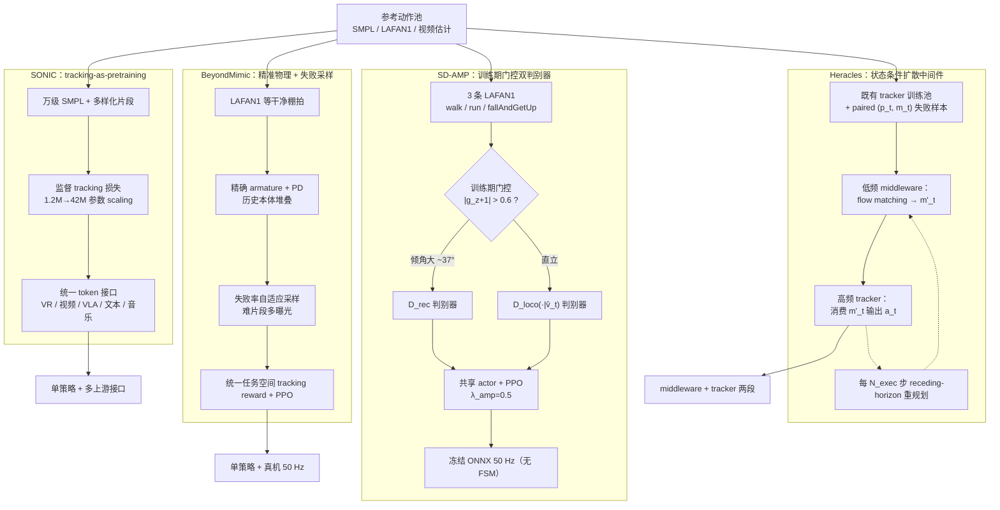

# SONIC vs BeyondMimic vs SD-AMP vs Heracles：四条 WBT 方法谱系对比

**背景**：当一段参考动作（MoCap、视频估计、生成模型）落到一台真实人形机器人上时，[Whole-Body Tracking Pipeline](../concepts/whole-body-tracking-pipeline.md) 的「策略学习」阶段是工程系统里 **奖励、数据与算力** 三者博弈最激烈的一段。围绕「**像不像参考**」与「**OOD 怎么活下来**」两条评价线，2024–2026 年间涌现出四条代表性路线——以 **SONIC** 为代表的**规模化监督预训练**、以 **BeyondMimic** 为代表的**精准物理建模 + 失败率自适应采样**、以 **SD-AMP** 为代表的**状态门控双判别器 AMP**、以及以 **Heracles** 为代表的**状态条件扩散中间件**。四者**并非互斥**：SONIC 与 BeyondMimic 共享 motion tracking 基本范式，SD-AMP 与 Heracles 都把「OOD 怎么活下来」当一等问题但落在**奖励层**与**参考层**两个不同抽象——选型的关键不是「谁更先进」，而是 **「你愿意把代价付在数据、参考、策略还是中间件」**。

> **一句话区分**：SONIC「**把 tracking 当预训练任务，靠数据 + 算力 scaling**」；BeyondMimic「**精确 armature + 失败率采样，让简单 PPO 也能干掉复杂参考**」；SD-AMP「**训练期投影重力门控切两个 AMP 判别器，部署期单网络无 FSM**」；Heracles「**在高层参考与底层 tracker 之间插状态条件 flow matching，名义区透传、OOD 区改参考**」。

---

## 一句话定义

| 方法 | 一句话 | 论文 / 仓库 |
|------|--------|-------------|
| **SONIC**（Supersizing Motion Tracking） | 万级 SMPL + 上亿帧 MoCap + 约 2.1 万 GPU 小时把 tracking 当预训练任务训出**单一统一控制策略**，统一 token 接口接 VR / 视频 / 文本 / 音乐 / VLA。 | [arXiv:2511.07820](https://arxiv.org/abs/2511.07820)；[GEAR-SONIC 项目页](https://nvlabs.github.io/GEAR-SONIC/) |
| **BeyondMimic** | 精确 armature + 历史本体堆叠 + 失败率驱动的自适应重采样，让简单 PPO 在 Isaac Lab 上把长 horizon 模仿做到真机可交付。 | [arXiv:2508.08241](https://arxiv.org/abs/2508.08241)；[HybridRobotics/whole_body_tracking](https://github.com/HybridRobotics/whole_body_tracking) |
| **SD-AMP**（State-Dependent AMP） | 训练期投影重力门控 \|g_z+1\|>0.6 切 **recovery / locomotion 两个 AMP 判别器**；3 条 LAFAN1 即覆盖走 / 跑 / 起身，部署冻结 ONNX 50 Hz 无 FSM。 | [arXiv:2605.18611](https://arxiv.org/abs/2605.18611) |
| **Heracles** | 在高层参考 m_t 与底层物理 tracker 之间插入 **状态条件 flow matching 中间件**：近参考时近似恒等映射保 tracking 精度，大偏差时生成类人恢复关键帧 + receding-horizon 闭环重规划。 | [arXiv:2603.27756](https://arxiv.org/abs/2603.27756)；[项目页](https://heracles-humanoid-control.github.io/) |

---

## 核心维度对比

| 维度 | **SONIC**（规模化预训练） | **BeyondMimic**（精准物理 + 失败采样） | **SD-AMP**（双判别器门控 AMP） | **Heracles**（扩散中间件） |
|------|---------------------------|------------------------------------------|----------------------------------|------------------------------|
| **范式定位** | 把 tracking 当大规模监督预训练 | 显式 tracking reward + RL | 对抗式 motion prior + 任务 RL | tracker 不变，只在参考层插生成中间件 |
| **典型参考池** | 万级 SMPL（Motion-X 等约 700 小时） | 干净棚拍（LAFAN1 等中小规模） | **仅 3 条 LAFAN1**（walk / run / fallAndGetUp） | 复用既有 tracker 训练池；中间件需 paired (p_t, m_t) 数据 |
| **训练目标** | 密集 tracking 损失（监督式 BC + RL） | 统一任务空间 tracking reward + PPO | $R_t + \lambda_{\mathrm{amp}} R_{\mathrm{AMP}}$，$\lambda_{\mathrm{amp}}=0.5$ | flow matching 速度场 MSE + 既有 tracker reward 不变 |
| **何时切换行为** | 隐式：由数据多样性 + 单策略容量内化 | 隐式：单策略 + 失败率采样把难片段曝光 | **训练期** \|g_z+1\|>0.6 → recovery；否则 loco（部署不读 g_z） | **运行时隐式**：偏差小 → 近恒等；偏差大 → 生成恢复关键帧 |
| **跨任务一般化** | ✅✅ 单策略 + 多上游 token 接口 | ✅ 同平台多参考 | ✅ 单策略覆盖走 / 跑 / 起身 + 任意速度命令 | ✅ tracker 内化的行为集 + 中间件 OOD 修补 |
| **OOD / 强扰动行为** | 中（依赖参考池覆盖） | 中（失败采样曝光但仍是显式 tracking） | 中–高（recovery 判别器专管跌倒态转移） | **高**（生成式中间件改写参考缓冲，多步协调恢复） |
| **训练成本** | **极高**：约 1.2M→42M 参数 + 上亿帧 + 约 2.1 万 GPU 小时 | 中：单平台 PPO，数小时—数天可收敛 | 中：Isaac Lab + PPO，3 条参考 retarget | 中–高：tracker + flow matching 两阶段；flow 训练数据需 paired 失败样本 |
| **推理成本** | 单一统一策略前向；token 编码器侧轻量 | 单一 PPO 前向；50 Hz | 单一 PPO 前向；ONNX 50 Hz | **两段**：低频 middleware（ODE 多步）+ 高频 tracker；warm start 减步数 |
| **跨具身能力** | 多具身联合训练 + 统一 token；后接 [Any2Any](../entities/paper-any2any-cross-embodiment-wbt.md) ~1% LoRA 迁移 | 单具身重训为主 | 单具身重训（Unitree G1） | 跟随底层 tracker 的迁移路径 |
| **真机交付形态** | 单 policy + 编码器栈（VR / 视频 / VLA 多上游） | 单 policy（部署时观测→动作映射） | 冻结 ONNX 50 Hz，无运行时门控 | middleware + tracker 两段堆叠 |
| **核心假设** | 数据 × 模型 × 算力三轴 scaling 单调改善 tracking | 缩小 armature / PD 等确定性 gap > 加大盲目域随机 | recovery 与 locomotion 先验**结构分离**比参考多样性更关键 | tracking 精度由近恒等性保证，OOD 由生成先验补 |
| **典型代码产物** | 统一 tracking policy + 编码器栈 + 模型卡 | Isaac Lab task + PPO checkpoint + 评测脚本 | 冻结 ONNX + PD 接口 | flow matching 模型 + tracker checkpoint + receding-horizon 调度 |

---

## 数据流对比（Mermaid）

把四条路线放进同一张「**参考 → 训练 → 部署**」坐标里，差异主要在 **OOD 怎么被吸收**：



要点：
- **SONIC** 的 OOD 修补**靠数据池规模**（用「见过」对冲 OOD）；
- **BeyondMimic** 的 OOD 修补**靠失败率自适应采样 + 精确动力学**（把难点曝光 + 缩小 sim-to-real 物理 gap）；
- **SD-AMP** 的 OOD 修补**靠训练期判别器结构分离**（recovery 与 locomotion 各管一段，部署无 FSM）；
- **Heracles** 的 OOD 修补**靠参考层生成中间件**（在物理 tracker 之外**改写参考缓冲**，强行把状态拉回名义区）。

---

## 适用场景

### 选 SONIC 的场景

1. **你有 / 能拿到** 万级 SMPL 数据与大规模 GPU 集群（约 2.1 万 GPU 小时量级），且希望投资一个 **多上游可复用** 的统一策略；
2. 想给下游 **VLA**、**VR 遥操作**、**视频驱动控制** 统一一份 token 接口（GR00T N1.5 + SONIC 演示式分层控制）；
3. 跨具身路线已经规划好——SONIC 在源机训完，再接 [Any2Any](../entities/paper-any2any-cross-embodiment-wbt.md) 用 **~1% 算力 LoRA** 迁到 LimX Oli / Luna；
4. **目标是 tracker 即基础模型**：希望后续行为都通过「参考池追加 + 再训练」而不是「每个行为重写 reward」演化。

> **避坑**：极端杂技 / 强接触任务（手部精细操作、连续翻滚）仍可能掉出训练分布；公开演示突出系统集成，**可重复协议、随机种子与定量对比** 仍以论文与开源脚本为准。SONIC 的 **OOD 兜底** 也并非天然——按工程经验仍可叠 Heracles 风中间件。

### 选 BeyondMimic 的场景

1. **预算有限**：单台人形 + 小时—天级 PPO 训练；
2. **想跑通一条「最小可交付」WBT 基线**：LAFAN1 / 干净 MoCap + Isaac Lab，标准 PPO 配方；
3. **下游需要 sim-to-real 实战参考**：BeyondMimic 路线在 Hybrid Robotics / Unitree 等真机上有大量复现；
4. **参考池规模小 / 行为集明确**（如做一个稳健的「走 + 跑 + 简单舞蹈」单平台落地）；
5. **想以「精确物理建模替代盲目域随机」** 验证 sim-to-real gap 的归因（看 armature / PD 偏差远比加网络层数有效）。

> **避坑**：参考从「干净 MoCap」换到「视频估计 / 生成」时，failure-driven 采样会被噪声放大，需要把 contact phase 监督 / 关键点重定向再做一遍；长 horizon 上 RSI 仍可能把策略宠坏（建议从 RSI 渐变到长 rollout 课程）。

### 选 SD-AMP 的场景

1. **参考稀缺**：只有 walk / run / fallAndGetUp 三条片段，但行为集要覆盖**走 / 跑 / 起身 + 任意速度**；
2. **想消灭部署期 FSM**：把行为切换内化到训练期判别器路由，真机 rollout 展示 **recovery → walk → run 连续序列**；
3. **明确知道 recovery 是独立的先验**（跌倒态转移与正常 locomotion 风格分布差异显著），愿意为「先验结构分离」付出双判别器的额外训练复杂度；
4. **硬件目标固定**（如 Unitree G1 29 DoF + PD），不打算频繁换机型；
5. **与 mjlab / Isaac Lab 工程线匹配**：训练后冻结 ONNX，50 Hz 推理。

> **避坑**：式 (5) 的固定阈值 \|g_z+1\|>0.6 仅是**训练期判别器路由**，不是运行时模式 ID——别误以为部署期需要读重力。三条参考是「先验来源」而非「能力上限」，换平台仍需 retarget 与任务 reward 调参。

### 选 Heracles 的场景

1. **OOD / 强扰动是核心评测维度**：希望在 tracker 即将产生「非类人、不可恢复扭矩模式」时**强行改参考**而非加重 tracking 权重；
2. **已经有一个不错的物理 tracker**（SONIC / BeyondMimic / 自训），不想推翻重训，只想在**参考层**插一层 middleware；
3. **接受两段堆叠**的部署成本（低频 middleware + 高频 tracker），愿意为 ODE 多步推理做工程优化（directional warm start / SDEdit 启发）；
4. **行为编辑 / 隐式模式切换** 是产品需求：不希望维护手调阈值的状态机，而希望条件 flow 自动在「名义区近恒等 / OOD 区生成恢复」之间过渡；
5. **与 BFM 路线正交而非替代**：保留专用 tracker，生成层只在偏差大时介入。

> **避坑**：Heracles **不直接输出扭矩**，物理可行性仍由 RL tracker 保证；不要拿它和「开环 MDM」（如 HY-Motion）类比——开环扩散缺接触与扭矩约束。与 BeyondMimic 测试时 guidance 也不是同一件事：Heracles 是 **独立 middleware + 状态条件 flow**，按 $\mathbf{p}_t$ 实时改参考缓冲。

---

## 常见误判

1. **「SONIC 取代 BeyondMimic」**：维度不同。SONIC 强调 **规模化预训练 + 多上游接口** 的体系叙事；BeyondMimic 强调 **精确物理建模 + 失败采样** 在 **小数据 + 单平台** 上跑出强 tracking。两者在「**愿意付多大代价拿多大泛化**」轴上是连续谱；很多工程系统是 BeyondMimic 风的本地 tracker 加 SONIC 风的上游接口。
2. **「SD-AMP = Selective AMP」**：错。[Selective AMP](../../sources/papers/multi-gait-learning.md) 按**步态周期 vs 高动态**决定是否加 AMP；SD-AMP 按**机体是否跌倒**切换**不同判别器**。两者门控量与门控对象都不同。
3. **「Heracles 取代 tracker」**：错。Heracles 输出**残差参考**进 closed-loop MDP，**不直接输出扭矩**；物理可行性仍由 RL tracker 保证。
4. **「SD-AMP 与 Heracles 重叠」**：两者都解「OOD 怎么活下来」但抽象层不同——SD-AMP 在 **奖励层** 用判别器路由（**单策略**），Heracles 在 **参考层** 用扩散中间件（**两段堆叠**）。生产系统里它们可并存（SD-AMP 风 tracker + Heracles 风 middleware）。
5. **「四选一」**：实际系统常 **串联 / 组合**：BeyondMimic 风本地 tracker（基线）→ 加 SD-AMP 风 recovery 判别器（OOD 训练）→ 上 Heracles 风 middleware（部署期 OOD 兜底）→ 接 SONIC 风 token 接口（多上游 / VLA）。四条路线在「**OOD 修补位置**」这条轴上是连续谱，而非二元对立。
6. **「数据规模决定一切」**：SD-AMP 用 **3 条 LAFAN1** 即覆盖完整行为集——证明 **先验结构分离** 在某些任务上比参考多样性更关键。规模化（SONIC）只是一条主流路线，不是唯一答案。

---

## 决策矩阵

```
你的主要约束是什么？
│
├── 有万级 SMPL + 大规模 GPU 集群 + 想做"基础模型"叙事 → SONIC
├── 单平台 / 小数据 / 想跑通最小可交付 sim-to-real 基线 → BeyondMimic
├── 参考稀缺（< 10 条）+ 想消灭部署期 FSM → SD-AMP
├── 已有 tracker + OOD / 抗扰是核心评测 → Heracles middleware
├── 想给下游 VLA / VR / 视频统一一份 token 接口 → SONIC（必要时叠 Heracles）
├── 跨具身迁移是首要诉求 → SONIC + Any2Any LoRA（不是 SD-AMP / Heracles）
├── 行为集明确「走/跑/起身」+ Unitree G1 + ONNX 50 Hz → SD-AMP
├── 想保留既有 tracker 不重训，但要补 OOD → Heracles middleware
└── 想验证 sim-to-real gap 的归因（armature / PD vs 域随机） → BeyondMimic 路线最直接
```

---

## 与其它对比页 / 流水线页的区别

- 本页关注 **WBT「策略学习」阶段的四种主流路线对比**（监督式预训练 / 显式 tracking + 失败采样 / 双判别器 AMP / 扩散中间件）；
- [Whole-Body Tracking Pipeline](../concepts/whole-body-tracking-pipeline.md) 给出包含「参考采集 → 重定向 → 训练数据 → 策略学习 → 跨具身迁移 → 真机部署」**完整 6 阶段** 的端到端视角，本页是其中阶段 4 的横切面；
- [GMR vs NMR vs ReActor](./gmr-vs-nmr-vs-reactor.md) 对比的是 **重定向算法** 谱系（WBT 流水线的阶段 2），与本页不在同一阶段；
- [RL vs IL](./rl-vs-il.md) 在 **策略学习范式** 层面对比，颗粒度更粗；
- [MPC vs RL](./mpc-vs-rl.md) 与 [WBC vs RL](./wbc-vs-rl.md) 在 **控制范式** 层面对比，与本页「同范式内的四条 WBT 路线」抽象层不同；
- [人形运动跟踪方法选型指南](../queries/humanoid-motion-tracking-method-selection.md) 给出可执行的选型决策树，本页提供其背后的方法谱系叙事。

---

## 参考来源

- [SONIC（规模化人体运动跟踪驱动的人形全身控制）](../../sources/repos/sonic-humanoid-motion-tracking.md) — SONIC 项目页与代码入口
- [bfm_awesome_sonic_arxiv_2511_07820.md](../../sources/papers/bfm_awesome_sonic_arxiv_2511_07820.md) — SONIC arXiv 摘要与方法栈
- [humanoid_rl_stack_17_sonic_supersizing_motion_tracking_for_natural_hu.md](../../sources/papers/humanoid_rl_stack_17_sonic_supersizing_motion_tracking_for_natural_hu.md) — SONIC 在 42 篇 HRL 栈中的策展条目
- [bfm_awesome_beyondmimic_arxiv_2508_08241.md](../../sources/papers/bfm_awesome_beyondmimic_arxiv_2508_08241.md) — BeyondMimic arXiv 摘要
- [humanoid_rl_stack_15_beyondmimic_from_motion_tracking_to_versatile_hu.md](../../sources/papers/humanoid_rl_stack_15_beyondmimic_from_motion_tracking_to_versatile_hu.md) — BeyondMimic 在 42 篇 HRL 栈中的策展条目
- [unified_walk_run_recovery_sdamp_arxiv_2605_18611.md](../../sources/papers/unified_walk_run_recovery_sdamp_arxiv_2605_18611.md) — SD-AMP arXiv 摘要、双判别器与门控
- [heracles_humanoid_diffusion_arxiv_2603_27756.md](../../sources/papers/heracles_humanoid_diffusion_arxiv_2603_27756.md) — Heracles arXiv 摘要与 flow matching 训练
- [humanoid_rl_stack_40_heracles_bridging_precise_tracking_and_generativ.md](../../sources/papers/humanoid_rl_stack_40_heracles_bridging_precise_tracking_and_generativ.md) — Heracles 在 42 篇 HRL 栈中的策展条目
- [heracles-humanoid-control.md](../../sources/sites/heracles-humanoid-control.md) — Heracles 项目页归档

---

## 关联页面

- [Whole-Body Tracking Pipeline（全身运动跟踪流水线）](../concepts/whole-body-tracking-pipeline.md) — 本页四条路线的 6 阶段端到端宿主
- [Motion Retargeting Pipeline（动作重定向流水线）](../concepts/motion-retargeting-pipeline.md) — WBT 流水线的上游
- [Whole-Body Control (WBC)](../concepts/whole-body-control.md) — 一帧内的全身协调（与 WBT 是两层抽象）
- [Behavior Foundation Model](../concepts/behavior-foundation-model.md) — 与 SONIC 同构的「身体基础模型」叙事
- [SONIC（规模化运动跟踪）](../methods/sonic-motion-tracking.md) — 规模化 tracking 预训练
- [BeyondMimic](../methods/beyondmimic.md) — 精准物理 + 失败率自适应采样
- [SD-AMP](../entities/paper-unified-walk-run-recovery-sdamp.md) — 双判别器门控 AMP
- [Heracles](../entities/paper-heracles-humanoid-diffusion.md) — 状态条件扩散中间件
- [AMP & HumanX](../methods/amp-reward.md) — SD-AMP 的方法基线
- [DeepMimic](../methods/deepmimic.md) — 显式 tracking reward 的经典前置
- [Diffusion Motion Generation](../methods/diffusion-motion-generation.md) — Heracles flow matching 的背景
- [Any2Any（跨具身 WBT 后训练）](../entities/paper-any2any-cross-embodiment-wbt.md) — SONIC 风骨干的跨具身迁移
- [人形运动跟踪方法选型指南](../queries/humanoid-motion-tracking-method-selection.md) — 决策树式选型
- [Balance Recovery](../tasks/balance-recovery.md) — SD-AMP / Heracles 的核心评测任务

---

## 推荐继续阅读

- [GEAR-SONIC 项目页](https://nvlabs.github.io/GEAR-SONIC/) — SONIC 规模化 tracking 的工程实现与多上游演示
- [HybridRobotics/whole_body_tracking](https://github.com/HybridRobotics/whole_body_tracking) — BeyondMimic 上游开源实现
- [SD-AMP arXiv HTML](https://arxiv.org/html/2605.18611v1) — 训练期门控与硬件 Fig.2
- [Heracles 项目页](https://heracles-humanoid-control.github.io/) — 演示视频与 BibTeX
- Lipman et al., *Flow Matching for Generative Modeling* — Heracles 中间件训练目标背景
- Peng X. B., et al. *AMP: Adversarial Motion Priors* — SD-AMP 的方法基线

---

## 一句话记忆

> **SONIC 数据**、**BeyondMimic 物理**、**SD-AMP 先验**、**Heracles 中间件**——四者按「OOD 修补发生在数据池 / 训练物理 / 训练判别器 / 部署参考层」分占谱系四端，工程系统往往不是四选一而是按需串联。
