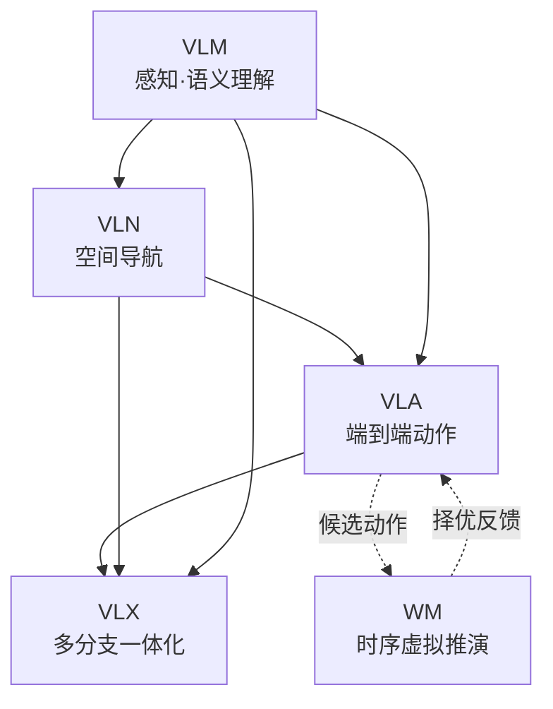

# 五大具身模型分类：VLM、VLN、VLA、VLX 与世界模型

## 一句话定义

**五大具身模型** 是 2025–2026 年产业报告与论文中高频出现的 **功能分层缩写**：共享 **Transformer + 多模态编码** 底座，按 **跨模态理解 → 空间导航 → 动作执行 → 一体化多任务 → 时序推演** 递进分工；理解其 **输入/输出边界** 比死记缩写更能指导系统拆分与选型。

## 英文缩写速查

| 缩写 | 英文全称 | 简要说明 |
|------|----------|----------|
| VLM | Vision-Language Model | 视觉–语言跨模态理解与语义解析 |
| VLN | Vision-Language Navigation | 视觉–语言条件下的空间导航决策 |
| VLA | Vision-Language-Action | 视觉–语言–动作端到端执行策略 |
| VLX | Vision-Language X | 融合感知/导航/执行的多分支通用架构（X=可扩展任务） |
| WM | World Model | 环境时序动态建模与虚拟推演，不直接驱动物理执行 |

## 为什么重要

- **术语爆炸**：VLM/VLN/VLA 常被混用或「端到端一体化」叙事掩盖模块边界，导致架构设计与数据接口错位。
- **系统拆分**：真实机器人栈常需 **感知塔（VLM）→ 导航/操作头（VLN/VLA）→ 仿真预演（WM）** 分层部署；厘清 I/O 有助于 Sim2Real 与延迟预算。
- **趋势判断**：分立专精模型、VLX 式统一大模型、WM 赋能三条路线并行——本分类是阅读 [VLA 开源谱系](../overview/vla-open-source-repro-landscape-2025.md) 与 [世界模型地图](../overview/world-models-15-open-source-technology-map.md) 的前置框架。

## 统一技术底座

五类模型 **不存在本质架构割裂**：

1. **多模态混合编码**：图像、文本、深度/空间、本体状态、时序信息 → 专属编码器 → 共享隐向量空间对齐。
2. **Transformer 主干**：自注意力完成全局关联；差异来自 **模态配比、任务头、时序跨度、分支配置**。
3. **WM 特殊定位**：技术栈与其余四类一致，但 **运行方式** 为虚拟推演，输出不直接下发硬件。

## 递进关系与能力边界

| 模型 | 核心 I/O | 能力边界 | 典型下游 |
|------|----------|----------|----------|
| **VLM** | 图像/视频 + 语言 → 语义、物体关系、指令解析 | **无动作、无轨迹**；纯认知层 | VLN、VLA 视觉塔、[3D VQA](../concepts/3d-spatial-vqa.md) |
| **VLN** | VLM 输入 + 深度/拓扑 → 路径、避障、目标坐标 | **仅底盘移动**；无力控/操作分支 | 室内/户外 [VLN 任务](../tasks/vision-language-navigation.md) |
| **VLA** | 全模态 + 本体状态 → 关节/底盘/末端控制量 | 感知–决策–执行 **单网闭环** | [manipulation](../tasks/manipulation.md)、[loco-manip](../tasks/loco-manipulation.md) |
| **VLX** | 同 VLA 输入 → **并行** 感知/导航/动作三路输出 | 单模型多任务；可按场景启停分支 | 通用人形「一脑多能」叙事 |
| **WM** | 观测 + 候选动作 → 未来多帧状态/物理反馈 | **长时序推演**；不即时执行 | [生成式世界模型](../methods/generative-world-models.md)、Sim 数据增强 |

### VLN ⊂ VLA（文内强调）

- **共享**：视觉编码器、语言编码器、跨模态融合主干。
- **VLN**：仅空间移动分支，训练目标为路径与避障。
- **VLA**：完整搭载 VLN 导航能力，并扩展机械臂、力控、全身协同等 **物理交互** 分支。

## VLA × 世界模型：决策–预演闭环

行业常见组合（与 [World Action Models](../concepts/world-action-models.md) 的联合建模路线不同，属 **级联** 范式）：

1. **VLA** 基于当前观测生成多组 **瞬时** 可执行动作候选。
2. **WM** 在虚拟空间对每组候选 **逐帧推演** 环境变化与风险。
3. 筛选最优方案后在真机执行，降低长流程任务试错成本。

二者 **多模态编码与物理规律学习可互通**，便于特征与数据协同；WM 也可独立服务数据生成、策略评估与 [Sim2Real](../concepts/sim2real.md) 闭环。

## 常见误区或局限

1. **「VLA 已包含一切，VLN/VLM 过时。」** 工程上仍常 **冻结 VLM 骨干**、单独训导航头或分层部署以满足延迟与可解释性。
2. **「WM = 仿真器。」** WM 是学习得到的 **可微/可生成** 动态模型，可与传统物理引擎互补，而非简单替代。
3. **「VLX 已量产。」** VLX 多为 **架构愿景**；当前开源主力仍是分立 VLA + 专用 WBC/导航模块。
4. **术语融合加速**：WAM（[World Action Models](../concepts/world-action-models.md)）等新概念把 WM 与动作生成 **耦合**，与本页「分立 WM + VLA」级联叙事并存——选型时需看清 **联合训练 vs 事后串联**。

## 与其他页面的关系

- [Query：具身大模型分类学选型闭环知识链](../queries/embodied-fm-taxonomy-loop.md)：把本页五大家族沉淀为「感知 → 导航 → 执行 → 扩展 → 推演」的端到端选型决策链，逐层给出 I/O 边界、数据需求与实时性/泛化取舍。
- [VLA 方法页](../methods/vla.md)：执行层代表方法与训练数据。
- [VLN 任务页](../tasks/vision-language-navigation.md)：导航基准与开源复现范式。
- [统一多模态 token](../methods/unified-multimodal-tokens.md)：VLX/端到端大模型的表征接口。
- [人形策略网络架构](../concepts/humanoid-policy-network-architecture.md)：全身控制与高层 VLA 分层。

## 推荐继续阅读

- 深蓝具身智能原文（微信公众号）：<https://mp.weixin.qq.com/s/xj-rc6v64Ge6onoUPvkHLg>
- [VLA Open-Source Landscape 2025](../overview/vla-open-source-repro-landscape-2025.md)
- [世界模型 15 项开源技术地图](../overview/world-models-15-open-source-technology-map.md)
- [具身大模型分类学选型闭环（专题枢纽）](../overview/topic-embodied-foundation-model.md) — 把本页五大家族沉淀为一条贯通的选型链

## 参考来源

- [wechat_shenlan_five_embodied_model_taxonomy.md](../../sources/blogs/wechat_shenlan_five_embodied_model_taxonomy.md) — 深蓝具身智能《五大具身模型详解：VLM、VLA、VLN、VLX、世界模型》（<https://mp.weixin.qq.com/s/xj-rc6v64Ge6onoUPvkHLg>）
