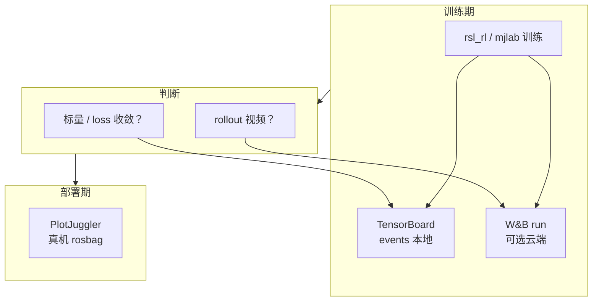

# Weights & Biases vs TensorBoard（训练实验监控选型）

在机器人强化学习工程里，**TensorBoard** 与 **Weights & Biases（W&B）** 都回答「训练进行得怎样」，但默认假设不同：前者是 **本机 event 文件 + 浏览器**，后者是 **云端（或企业私有）项目 + 团队可见的 run 与制品**。

## 英文缩写速查

| 缩写 | 英文全称 | 简要说明 |
|------|----------|----------|
| W&B | Weights & Biases | 云端实验追踪与 Artifacts 平台 |
| TB | TensorBoard | 本地 event 可视化套件 |
| RL | Reinforcement Learning | 两工具最主要的使用场景 |
| PPO | Proximal Policy Optimization | 常见 loss 曲线来源 |
| ONNX | Open Neural Network Exchange | W&B Artifacts 常托管的部署格式 |
| SaaS | Software as a Service | W&B 默认托管模式 |
| GPU | Graphics Processing Unit | 多卡训练时的日志汇聚需求 |
| HPC | High Performance Computing | 内网集群常优先 TB + 端口转发 |

## 核心特性对比

| 维度 | TensorBoard | Weights & Biases |
|------|-------------|------------------|
| **部署** | 完全本地；`tensorboard --logdir` | 默认 SaaS；支持 dedicated / customer-managed |
| **账号 / 网络** | 无需账号；可断网 | 通常需 `wandb login` 与出站网络（私有部署除外） |
| **数据落盘** | `events.out.tfevents.*` 在训练机 | 云端 + 可选本地缓存 |
| **标量曲线** | 强；Scalars / HPARAMS | 强；表格 + 并行坐标 + Reports |
| **分项 reward / loss** | rsl_rl、mjlab 默认写入，tag 见 [AMP_mjlab](../entities/amp-mjlab.md) | 需框架集成；tag 可自定义 |
| **模型 / checkpoint** | 不原生版本化；文件在 `logs/` | **Artifacts** 版本化与 lineage |
| **视频 / 媒体** | 支持 image/audio；RL rollout 视频较少用 | 常用 `wandb.log({"video": ...})` |
| **团队协作** | 需自行共享 log 目录 | 项目成员默认可见 run |
| **真机调试** | 不负责 | 不负责（均见 [PlotJuggler](../entities/plotjuggler.md)） |
| **许可 / 成本** | Apache 2.0 开源 | 免费档 + 企业付费 |

## 如何选型？

### 何时优先 TensorBoard？

1. **单机 / 小团队快速迭代**：个人工作站或单节点 A100，`logs/rsl_rl` 即可判断 `mean_reward` 是否出现 Recovery Jump。
2. **内网 / 保密环境**：无法或将出站流量限制在防火墙内；README 明确 **offline-first**。
3. **阅读本库既有判据**：AMP_mjlab、BeyondMimic 等页以 **TB tag 命名空间** 写成文档案；照表读曲线成本最低。
4. **HPC 登录节点**：`ssh -L 6006:localhost:6006` 转发即可，无需第三方服务。

### 何时优先 Weights & Biases？

1. **多机并行 sweep**：需要一张表对比数十个 run 的超参与最终 reward。
2. **跨成员共享 checkpoint**：Holosoma、motion_tracking、SMP G1 等支持 **`--wandb-run-path`** 拉权重或 ONNX。
3. **rollout 视频留档**：排查「reward 升但步态怪」时，视频与标量同页回顾。
4. **组织已采购 W&B 企业版**：合规、权限与私有 Registry 已就绪。

### 常见实践：两者并行

许多训练脚本提供 **双 logger** 或环境变量切换（如 MimicKit `logger_type` 为 `"tb"` / `"wandb"`）：

- **TB**：开发者本机实时盯 `Loss/amp_policy_pred` 与 `Episode_Reward/*`。
- **W&B**：夜间长 run 自动上传，次日团队 Review Reports。

不必强行二选一，除非存储或合规约束只允许一种出口。

## 与本库实体的工作流挂接

## 关联页面

- [TensorBoard 实体页](../entities/tensorboard.md)
- [Weights & Biases 实体页](../entities/weights-and-biases.md)
- [AMP_mjlab](../entities/amp-mjlab.md) — TB 曲线判据
- [mjlab](../entities/mjlab.md) — W&B 集成
- [RL 策略真机调试 Playbook](../queries/robot-policy-debug-playbook.md) — 训练监控 vs 部署 log
- [强化学习](../methods/reinforcement-learning.md)

## 推荐继续阅读

- [TensorBoard 官方文档](https://www.tensorflow.org/tensorboard)
- [W&B 文档 — 快速开始](https://docs.wandb.ai/quickstart)

## 参考来源

- [sources/sites/weights-and-biases.md](../../sources/sites/weights-and-biases.md)
- [sources/repos/tensorboard.md](../../sources/repos/tensorboard.md)
