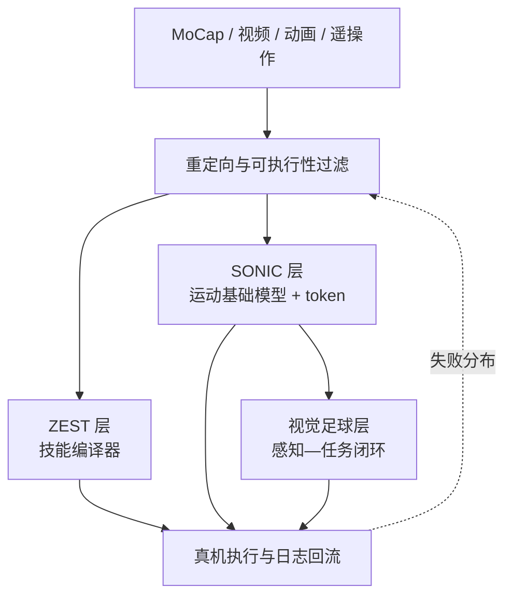

# ZEST vs SONIC vs 视觉足球：人形学习控制三层对比

*Science Robotics* 11(117) 同期发表 [ZEST](../entities/paper-zest.md)、[SONIC](../methods/sonic-motion-tracking.md) 与 [视觉驱动反应式足球](../entities/paper-hrl-stack-26-learning_vision_driven_reactive_socc.md)。具身智能研究室把它们读成**同一条身体栈上的三个层级**，而不是「谁是更好的全身跟踪器」。本页只保留这条选型坐标；方法细节与数字以各实体/方法页为准。

## 一句话定义

> **ZEST 编译技能，SONIC 预训练身体接口，视觉足球把感知噪声写进任务环。** 三者互补：缺可复用配方走 ZEST，缺上层可调用的运动 token 走 SONIC，缺「看不准仍能踢」走视觉足球。

## 英文缩写速查

| 缩写 | 英文全称 | 简要说明 |
|------|----------|----------|
| ZEST | Zero-shot Embodied Skill Transfer | 参考跟踪配方；zero-shot 指仿真策略不经真机微调 |
| SONIC | Supersizing Motion Tracking for Natural Humanoid WBC | 规模化运动跟踪预训练 + 共享动作 token |
| VLA | Vision-Language-Action | SONIC 用 token 当身体接口的上层模型 |
| AMP | Adversarial Motion Prior | 视觉足球用来约束踢球动作自然性的风格先验 |
| SciRob | Science Robotics | 三篇正式发表渠道（11(117) 同期） |
| Sim2Real | Simulation to Real | 三篇都走仿真训练后真机部署 |

## 为什么重要

- 把三篇都叫「通用运动跟踪」会选错层：ZEST 主要是**一项技能一个策略**，SONIC 才是**一个策略覆盖大规模分布**，视觉足球甚至**不以参考动作为条件**。
- 工程上这对应三种交付物：技能生产流水线、可被 VLA/VR 调用的低层 API、感知不确定下的任务控制器。
- 与已有对比正交：[SONIC vs BeyondMimic vs SD-AMP vs Heracles](./sonic-vs-beyondmimic-vs-sdamp-vs-heracles.md) 比的是 **WBT 方法族**；[HIL vs MTRG vs ZEST](./hil-vs-mtrg-vs-zest-parkour-imitation.md) 比的是 **跑酷模仿里参考是否进部署**。本页比的是 **系统层级**。

## 核心原理

### 三层对照

| 维度 | [ZEST](../methods/zest.md) | [SONIC](../methods/sonic-motion-tracking.md) | [视觉足球](../entities/paper-hrl-stack-26-learning_vision_driven_reactive_socc.md) |
|------|---------------------------|---------------------------------------------|--------------------------------------------------------|
| **主要问题** | 参考如何高效变成真机技能 | 跟踪是否随数据/模型/算力持续变好，并形成统一接口 | 视觉噪声、延迟、漏检下如何连续搜球–踢球 |
| **策略条件** | 下一步参考姿态 + 本体 | 机器人/人体/混合动作命令 → 共享 token | 结构化视觉观测 + 本体 + 历史 |
| **真机策略范围** | 主要一项技能一个策略 | 一个策略覆盖大规模运动 | 一个连续足球任务策略 |
| **平台** | Atlas、G1、Spot | Unitree G1 | Booster T1 |
| **开源（2026-08-27）** | **确认未开源** | **已开源**（GR00T-WBC + HF 权重） | **部分开源**（Zenodo 仿真；真机未发布） |

「统一」在三篇里不是同一个词：ZEST 统一的是**训练配方**；[HOVER](../entities/paper-bfm-14-hover.md) 统一的是控制命令；SONIC 统一的是**动作表示**；[BFM-Zero](../entities/paper-bfm-zero.md) 统一的是目标/奖励提示空间。

### 分层会怎么接

- **ZEST 层**：快速把一条参考编成可部署策略；自适应采样 + 辅助外力解决难片段，执行器建模解决 Sim2Real。
- **SONIC 层**：把大量技能压进共享运动空间；上层只预测 token / 关键帧，不直接出几十维关节。
- **任务层**：参考不再是输入；策略必须处理过时检测、主动转头、短暂丢球。与 [Project Instinct](../entities/paper-amp-survey-19-embrace_collisions.md) 的地形几何感知互补——一个盯地面能不能踩，一个盯球/门等动态目标。

## 工程实践

**缺可复用技能产线 → ZEST 配方**

- 手头有 MoCap / 手机视频 / 动画，要在 **G1 或四足** 上当天出一条高动态、多接触技能。
- 能接受部署时**继续播放参考**，也能接受一项技能重训一次。
- 不要期待仓库：无项目页、无代码。对照数字与 Atlas 多接触证据见 [论文实体](../entities/paper-zest.md)。

**缺上层可调用的身体 API → SONIC**

- 需要 VR / 视频 / 文本 / 音乐 / VLA 共用一个低层控制器。
- 有 GPU 预算吃规模化权重，或准备在公开 [GR00T-WholeBodyControl](../entities/gr00t-wholebodycontrol.md) 上做后训练（如 [SONIC-Transfer](../entities/paper-sonic-transfer.md)、[GenTrack](../entities/paper-gentrack.md)）。
- 不要把「124 段真机 123 成功」读成接触问题已解决：足部误差仍显著大于仿真。

**缺感知不确定性下的任务闭环 → 视觉足球**

- 检测器已经能出球/门的结构化位置，卡在「看见了但踢晚了」或短暂漏检。
- 仿真里必须把**检测概率、距离相关噪声、帧率、延迟、漏检**拟合成虚拟感知，而不是把真值球位交给 Actor。
- 复现预期：Zenodo 可跑仿真；真机感知与里程计要自研。踢球精度路线另见 [PAiD](../methods/paid-framework.md) / [RoboNaldo](../entities/paper-robonaldo-humanoid-soccer-shooting.md)。

**不要用错的对比表**

- 比跟踪精度、失败率采样、扩散中间件 → 用 [SONIC vs BeyondMimic 四族](./sonic-vs-beyondmimic-vs-sdamp-vs-heracles.md)。
- 比跑酷里参考是否进推理 → 用 [HIL vs MTRG vs ZEST](./hil-vs-mtrg-vs-zest-parkour-imitation.md)。
- 比「系统缺哪一层」→ 用本页。

## 局限与风险

- **跨本体仍是配方复用。** ZEST 在三种机器人上证明同一方法，BFM-Zero 在 G1/T1 共用超参，都不是同一组权重直接换身体。
- **规模不是定律。** SONIC 报告 scaling 趋势，但未验证更大模型或其他本体；对照 GMT / BeyondMimic 时数据管线并不对齐。
- **视觉足球不是像素端到端。** 策略上限绑在检测与几何定位质量上；DeepMind 小型双足 RGB 足球是另一条平台与任务尺度。
- **评测口径仍是「成功过」。** 文内提醒下一阶段瓶颈是重复可靠性、失败类型分解、跨实验室协议——单次后空翻或 90% 前场射门不能当量产验收。
- **开源不对称。** 只有 SONIC 能当公共基础设施直接改；ZEST 提供概念与 Atlas 证据；视觉足球提供仿真包。影响力不完全等于期刊排名。

## 关联页面

- [ZEST 论文实体](../entities/paper-zest.md) / [ZEST 方法](../methods/zest.md) — 技能编译器层
- [SONIC](../methods/sonic-motion-tracking.md) — 运动基础模型层
- [Vision-Driven Reactive Soccer](../entities/paper-hrl-stack-26-learning_vision_driven_reactive_socc.md) — 感知任务层
- [SONIC vs BeyondMimic vs SD-AMP vs Heracles](./sonic-vs-beyondmimic-vs-sdamp-vs-heracles.md) — WBT 方法族
- [HIL vs MTRG vs ZEST](./hil-vs-mtrg-vs-zest-parkour-imitation.md) — 跑酷模仿对照
- [人形运动跟踪方法选型](../queries/humanoid-motion-tracking-method-selection.md)
- [人形足球技能学习方法选型](../queries/humanoid-soccer-skill-learning-method-selection.md)
- [Humanoid Soccer](../tasks/humanoid-soccer.md)
- [人形 RL 身体系统栈](../overview/humanoid-rl-motion-control-body-system-stack.md)
- [Behavior Foundation Model](../concepts/behavior-foundation-model.md)
- [具身大模型分类学选型闭环](../queries/embodied-fm-taxonomy-loop.md) — SONIC token 作为 VLA 身体接口时，先看上层选哪一类模型
- [BeyondMimic](../methods/beyondmimic.md) / [GMT](../entities/paper-gmt.md) / [BFM-Zero](../entities/paper-bfm-zero.md)

## 参考来源

- [wechat_embodied_ai_lab_scirobotics_three_humanoid_papers_2026.md](../../sources/blogs/wechat_embodied_ai_lab_scirobotics_three_humanoid_papers_2026.md) — 本次 ingest 的公众号编译
- [zest.md](../../sources/papers/zest.md)
- [sonic-humanoid-motion-tracking.md](../../sources/repos/sonic-humanoid-motion-tracking.md)
- [humanoid_rl_stack_26_learning_vision_driven_reactive_soccer_skills_fo.md](../../sources/papers/humanoid_rl_stack_26_learning_vision_driven_reactive_soccer_skills_fo.md)
- [humanoid-kick-vision-driven-soccer.md](../../sources/sites/humanoid-kick-vision-driven-soccer.md)

## 推荐继续阅读

- [公众号原文](https://mp.weixin.qq.com/s/UC-LTs_E83ssuImnXusQGA)
- [ZEST DOI](https://doi.org/10.1126/scirobotics.aec7695) · [SONIC DOI](https://doi.org/10.1126/scirobotics.aed4592) · [视觉足球 DOI](https://doi.org/10.1126/scirobotics.aed1152)
- [GEAR-SONIC 项目页](https://nvlabs.github.io/GEAR-SONIC/)
- [humanoid-kick 项目页](https://humanoid-kick.github.io/)
