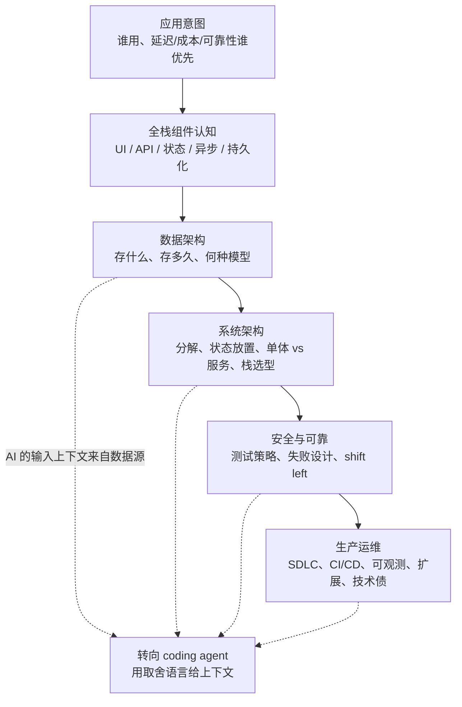

# Agentic Coding 时代的软件工程基础

**AI Engineering Skills Map: Software Engineering Fundamentals**

## 一句话定义

即便 coding agent 写完全部代码，软件工程基础仍是 **转向（steer）取舍** 的前提：不会用延迟 / 可用 / 一致 / 可靠 / 可维护 / 简洁 / 成本这些语言给上下文，agent 就会替你做坏选择。

## 英文缩写速查

| 缩写 | 英文全称 | 简要说明 |
|------|----------|----------|
| SE | Software Engineering | 本页五项基础技能的总称；不是「会写语法」 |
| SDLC | Software Development Lifecycle | 构建/测试之外还含部署环境、发布策略、CI/CD、IaaS |
| CI/CD | Continuous Integration / Continuous Delivery | 生产运维技能里的部署自动化 |
| IaaS | Infrastructure as a Service | 把运行环境当可配置基础设施，而不是本机脚本 |
| API | Application Programming Interface | 全栈技能中的接口选择与设计，决定前后端边界 |

## 为什么重要（对本知识库读者）

- **本库已有「agent 怎么干活」的页，缺「人还该懂什么」。** [mattpocock/skills](../entities/mattpocock-skills.md) 与 [Superpowers](../entities/superpowers-obra.md) 给的是 **技能文件与流程契约**；本页给的是 **判断框架**：没有取舍语言，那些 skill 只会加快产出坏架构。
- **真机 / 仿真闭环同构。** [ENPIRE](../methods/enpire.md) 与 [autoresearch harness](../queries/real-robot-policy-autoresearch-harness.md) 反复强调：有 coding agent **不能**跳过环境工程。吴恩达把同一句话写到通用软件：有 agent **不能**跳过对 latency、可靠性、数据生命周期的理解。
- **数据是难改的地基，也是模型的上下文。** 机器人侧的轨迹集、回放缓冲、[数据飞轮](./data-flywheel.md) 一旦 schema 选错，后续策略与评测都在错误上下文上训练——对应原文「AI doesn’t know what it doesn’t know」。
- **语法记忆正在过时，原理没有。** 过时的是背 API 签名；没过时的是知道原型架构、首版生产架构、规模化架构是三个不同目标。

## 核心原理

吴恩达团队把 AI 工程技能图拆成四支柱：**构建与部署 AI 应用 / 软件工程基础 / 使用 coding agents / 塑造构建（shaping the build）**。本页对应第二支柱（2026-08-28 长文）。主张可以压成一句：

> Agent 改变 **如何写** 软件（包括不含 AI 的软件）；人仍要决定 **哪些取舍存在、当前该选哪一边**。

五项技能不是并列课程清单，而是一条从「能改全栈」到「能上生产」的能力链：

| 技能 | 人必须保留的判断 | Agent 容易代劳、却容易代劳错的部分 |
|------|------------------|--------------------------------------|
| **全栈** | 前后端边界、认证与会话、缓存该不该有 | 补你不熟的那一层样板代码 |
| **数据** | 访问模式、保留策略、一致性/新鲜度、治理 | schema 迁移脚本、CRUD |
| **架构** | 当前阶段（原型 / 首版生产 / 规模）该多复杂 | 框架脚手架、微服务拆分冲动 |
| **安全可靠** | 测什么、失败时降级到哪、爆炸半径 | 扫漏洞、补测试文件 |
| **生产运维** | 发布策略、告警阈值、真实负载、技术债优先级 | CI YAML、扩容模板 |

关键机制：**转向语言**。不会说「这里要牺牲一点延迟换一致性」的人，无法给 agent 正确上下文；agent 默认优化的是「看起来能跑」，不是你的约束。

## 工程实践（映射到机器人栈）

不要把五项读成 Web 课表。对训练 / 仿真 / 真机栈，对应关系大致是：

| 技能 | 机器人研究与工程里的读法 |
|------|--------------------------|
| **全栈** | 训练脚本、日志/可视化、评测面板、机器人 API、异步采集与回放是同一系统；只会写 `train.py` 或只会改前端 dashboard，都无法转向 agent 改另一层。 |
| **数据** | 轨迹格式、保留多久、train/eval 泄漏、sim 日志 vs 真机日志、谁有权看相机流。schema 选错会污染整个 [数据飞轮](./data-flywheel.md)。面向 agent 的数据基础设施（让 agent 自己读 trace / 写评测）仍在快速变。 |
| **架构** | 单机 Isaac 实验 ≠ 机队采集服务 ≠ 云端训练 + 边缘推理。原型用单体 notebook 没问题；把同一结构直接「agent 拆成微服务」通常是错阶段。 |
| **安全可靠** | 单测脚本 + 集成 sim rollout；真机失败要 **优雅停机 / 缩小爆炸半径**（坏策略不要扩散到整机队）。「先写策略再补安全」等于没做 shift left。 |
| **生产运维** | 策略发布、checkpoint 版本、CI（本库是 `make ci-preflight`）、机队可观测与事故。技术债是训练配方与数据管道的老化，不只是代码风格。 |

落地时优先做三件事：

1. **先写约束，再让 agent 写代码。** 延迟预算、失败时允许的行为、数据保留与隐私，写进 prompt / `CONTEXT.md` / 评测，而不是事后抱怨 agent「乱选」。
2. **用评测闭环代替语感。** 与 [autoresearch harness](../queries/real-robot-policy-autoresearch-harness.md) 一致：没有自动 verify，agent 只能 vibe。软件侧对应单测/集成/负载；真机侧对应 reset + 自动判分。
3. **架构按阶段换，不按潮流换。** 原型简单、生产加可观测与降级、规模化再动数据分片与服务边界。让 agent 「按大厂模板生成」往往跳阶段。

## 局限与风险

- **误区：会用 Cursor / Claude Code = 具备软件工程基础。** 工具降低的是击键成本；取舍识别仍是人的技能。吴恩达原文把「语法记忆」标为过时，把「软件如何工作」标为拉开差距的部分。
- **误区：本页五项可以替代「用 coding agent」与「塑造构建」。** 它们是四支柱里的一根；后两篇尚未 ingest。不要把本页读成完整 AI 工程课表。
- **误区：SWE 基础 = 能做机器人科研。** [AI Auto-Research](./ai-auto-research.md) 已区分 SWE-bench 高分与研究级实验；本页解决的是 **应用/栈层的取舍**，不是假设质量或论文论证。
- **商业语境。** 技能图来自职位与招聘访谈，也服务 DeepLearning.AI 的教育叙事。当学习清单用，不要当中立劳动力市场论文。
- **无代码可复现。** 步骤 2.5：**不适用**（论述文，无项目仓）。

## 关联页面

- [Skills For Real Engineers（mattpocock）](../entities/mattpocock-skills.md) — 用 grill / TDD / 架构卫生对抗 vibe coding 的可安装技能
- [Superpowers（obra）](../entities/superpowers-obra.md) — brainstorm → worktree → TDD → 评审的代理交付管线
- [真机策略 autoresearch 闭环](../queries/real-robot-policy-autoresearch-harness.md) — 有 agent 仍要先做 reset/verify 环境工程
- [ENPIRE](../methods/enpire.md) — coding agent 真机策略自改进；核心贡献是环境接口不是模型
- [AI Auto-Research](./ai-auto-research.md) — 研究全生命周期自动化；SWE 能力与科研能力不等价
- [Data Flywheel](./data-flywheel.md) — 数据生命周期与回流；对应本页「Managing data」
- [LLM Wiki（Karpathy 模式）](../references/llm-wiki-karpathy.md) — 把判断编译进持久 wiki，而不是每次让 agent 从零 vibe

## 参考来源

- [Andrew Ng，AI Engineering Skills Map: Software engineering fundamentals（本站归档）](../../sources/blogs/andrew_ng_ai_engineering_skills_se_fundamentals.md)
- 触发推文：<https://x.com/andrewyng/status/2093388974194872781>
- X Article：<https://x.com/i/article/2093384274372419585>
- *The Batch* 同文：<https://www.deeplearning.ai/the-batch/the-ai-engineering-skills-map-in-detail-software-engineering-fundamentals>

## 推荐继续阅读

- Andrew Ng，[The AI Engineering Skills Map](https://www.linkedin.com/pulse/ai-engineering-skills-map-andrew-ng-m479c) — 四支柱总图（职位/访谈依据）
- Andrew Ng，[AI Engineering Skills Map: Building and deploying AI applications](https://www.linkedin.com/pulse/ai-engineering-skills-map-building-deploying-ai-applications-andrew-ng-gyn5e) — 同系列上一篇（LLM、grounding、agentic systems、eval-driven、生产、ML 基础）
- [mattpocock/skills](https://github.com/mattpocock/skills) — 把「不要 vibe coding」落成可安装工程习惯
