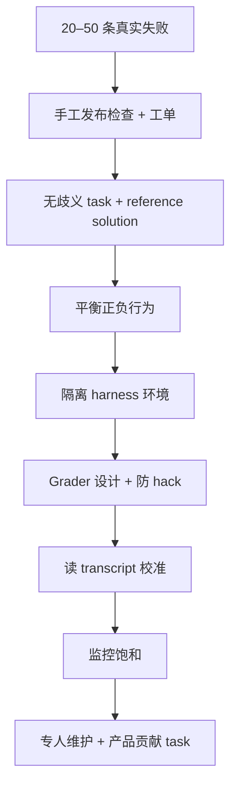

# AI Agent 评测

**AI agent evaluation** 指对 **agent harness（脚手架）+ 模型** 在固定 task 集上的自动化测量：不仅看最终自然语言，还看 **环境终态、工具轨迹与 transcript 约束**，并在开发期提供 **回归基线** 与 **能力 headroom**。

## 一句话定义

Agent 因 **多轮、改状态、路径多样** 而比单轮 LLM 更难评；可靠 eval 需要 **清晰 task、隔离 harness、正确 grader**，并把 **能力爬坡** 与 **回归保护** 分开维护。

## 英文缩写速查

| 缩写 | 英文全称 | 简要说明 |
|------|----------|----------|
| LLM | Large Language Model | 常作 grader 或对话用户模拟器 |
| CI/CD | Continuous Integration / Continuous Delivery | eval 常作为合并前门禁之一 |
| SDK | Software Development Kit | 如 Anthropic Agent SDK 构建 long-running harness |
| GUI | Graphical User Interface | computer-use agent 的评测环境 |
| SME | Subject Matter Expert | 人工 grader 金标准来源 |

## 为什么重要

- **规模化后「凭感觉」失效：** 用户报「变差」时，无 eval 无法区分回归与噪声；有 eval 则 **改一次、测数百 scenario**（Anthropic 内部 Claude Code 从 concision/file-edits 扩展到 over-engineering 等维度）。
- **新模型 adoption：** 有 eval 的团队可在 **数天** 内完成 prompt/harness 调优；无 eval 则 **数周** 手工试探。
- **与本库机器人线：** 仿真侧见 [仿真评测基础设施](./simulation-evaluation-infrastructure.md) 与 [hub-embodied-eval-benchmark](../overview/hub-embodied-eval-benchmark.md)；**coding agent** 测 **改训练代码/交付 artifact** 见 [RLE-Bench](../entities/rle-bench.md)；**真机 autoresearch** 的 verify 接口见 [ENPIRE](../methods/enpire.md) 与 [query](../queries/real-robot-policy-autoresearch-harness.md)——**同一「闭环判分」逻辑，不同 outcome 定义**。
- **Hillclimb 风险：** 在 eval 上改 prompt/skills/harness 易 **过拟合**；需 train/test 拆分、禁粘贴失败 transcript 进 prompt、答案不可被模型直接读取（[claude-api build-eval/hillclimb](../entities/anthropic-claude-api-skill.md) 工作流）。

- **从评测数据到训练闭环：** [LegoFlow](../entities/legoflow.md) 将 GitHub PR 筛成可执行 SWE task，生成 coding-agent 轨迹、训练模型，再把 benchmark 结果回流到下一轮采集策略；它建设的是数据工程管线，与 RLE-Bench 的机器人学习工程资格评测目标不同。

## 核心结构

### 术语（Anthropic 工程定义）

| 术语 | 含义 |
|------|------|
| Task | 单次测试用例 + 成功判据 |
| Trial | 对 task 的一次运行（需多次估计方差） |
| Grader | 对 transcript 或 **outcome** 的打分逻辑 |
| Transcript | 全轨迹（含 tool calls、推理块、API 往返） |
| Outcome | 环境终态（如 DB 记录、文件、仿真状态） |
| Eval harness | 并发跑 trial、录 transcript、聚合 |
| Agent harness | 生产/agent 开发用的编排（Claude Code、自定义 loop） |
| Suite | 测一类能力的 task 集合 |

### 三类 Grader

| 类型 | 适用 | 注意 |
|------|------|------|
| Code-based | 单测、静态分析、工具/状态检查 | 快但忌死板工具顺序 |
| Model-based | 开放输出、语气/质量 rubric | 需与人标定；结构化 claim 优于 1–5 分 |
| Human | 校准 judge、主观任务 | 贵；适合 spot-check |

**原则：** 优先评 **产出与 outcome**，而非唯一工具链；多组件 task 应 **部分得分**。

### 能力 eval vs 回归 eval

| 类型 | 通过率目标 | 用途 |
|------|------------|------|
| Capability | 低（有 headroom） | 爬坡、研究-产品对齐 |
| Regression | 近 100% | 防改坏；高通过率 capability 可「毕业」为回归套件 |

### 按 agent 类型的 proven 模式

| Agent 类型 | 典型 grader | 代表 benchmark / 备注 |
|------------|-------------|------------------------|
| Coding | 单测 + 可选 LLM 代码 rubric | SWE-bench Verified、Terminal-Bench |
| Conversational | 状态检查 + 轮数 + LLM rubric；常需 **用户模拟** | τ-Bench、τ2-Bench |
| Research | Groundedness、coverage、来源质量 | BrowseComp 类；开放合成需专家校准 |
| Computer use | 终态 URL/文件/OS artifact | WebArena、OSWorld；DOM vs 截图 tradeoff |

### 非确定性指标

- **pass@k：** k 次中至少 1 次成功（coding 常关注 pass@1）。  
- **pass^k：** k 次全部成功（用户-facing 一致性）。  
- 二者随 k 增大 **发散**——选型取决于产品要「一次做对」还是「每次都稳」。

### 好 eval 设计（claude.dev + 工程文对齐）

1. Task 分布像 **生产**（含「不应触发」负例）。  
2. 强模型 + 高 effort 应更好（否则查 task/grader）。  
3. 前沿配置 **显著低于 100%** 且非永远失败的坏题。  
4. **低 run 方差**（环境隔离、无 git/缓存泄漏、grader 双跑一致）。  
5. 避免 **对抗采样** 只挑当前模型 valleys。  
6. Hillclimb 时 **train/test**；test 平则怀疑过拟合。

### 从 0 到 1 路线图（摘要）

### 与其他信号（瑞士奶酪）

| 方法 | 强项 | 弱项 |
|------|------|------|
| 自动化 eval | 快、可 CI、可回归 | 前期建设成本、需防 drift |
| 生产监控 | 真实分布 |  reactive |
| A/B | 真实用户结果 | 慢、需流量 |
| 用户反馈 | 意外失败 | 稀疏、偏严重 |
| 人工读 transcript | 直觉与校准 | 难扩展 |

## 常见误区

- **0% pass@100 = 模型不行：** 更常是 **题面/grader/harness 约束** 错误（CORE-Bench、METR 时间地平线等公开案例）。  
- **只测工具调用顺序：** 惩罚模型合理解法；应评 outcome。  
- **Eval 100% 仍够用：** 饱和后失去改进信号；需更难 task 或新维度（Qodo 对 Opus 4.5 的 agentic eval 即例）。  
- **Hillclimb 在 eval 上加 OCR 等：**  benchmark 涨、生产不变——harness 过拟合。

## 与其他页面的关系

- [anthropic-claude-api-skill](../entities/anthropic-claude-api-skill.md) — `build-eval` / `hillclimb` 工具化  
- [Artificial Analysis](../entities/artificial-analysis.md) — 通用模型与推理服务商的能力、价格和速度对比，可用于候选模型初筛；不替代 agent harness 的任务级评测。  
- [RLE-Bench](../entities/rle-bench.md) — 机器人学习向 coding agent eval  
- [PPTBench](../entities/paper-pptbench.md) — 科学流程图→可编辑 PPTX 的视觉 coding 重建榜（arXiv:2609.29718）  
- [Agentic Coding 软件工程基础](./agentic-coding-software-fundamentals.md) — eval 不替代 SE 取舍  

## 推荐继续阅读

- [Demystifying evals for AI agents（Anthropic Engineering）](https://www.anthropic.com/engineering/demystifying-evals-for-ai-agents)  
- [Automating eval design and hillclimbing（claude.dev）](https://claude.dev/blog/automating-eval-design-and-hillclimbing/)  
- 框架附录：Harbor、Braintrust、LangSmith、Langfuse、Phoenix  

## 参考来源

- [Artificial Analysis 平台归档](../../sources/sites/artificial-analysis.md)
- [Demystifying evals 归档](../../sources/blogs/anthropic_demystifying_evals_ai_agents_2026-01-09.md)
- [Eval 自动化与 hillclimb 归档](../../sources/blogs/claude_dev_automating_eval_hillclimbing_2026-09-28.md)
