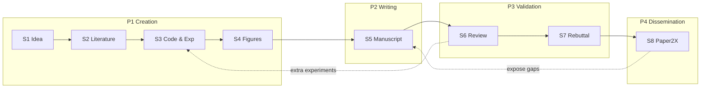

# AI Auto-Research（学术研究自动化）

**AI Auto-Research**：用大语言模型及其 **agentic 扩展**，在学术研究 **全生命周期** — 从假设与文献、代码与实验、图表与写作，到同行评议、答辩修订与 Paper2X 传播 — 提供辅助或自动化；其可信边界由 **任务是否结构化、可检索、可执行验证** 决定，而非单一模型规模。

## 一句话定义

AI 可以加速「研究形态」的产出，但 **科学实质**（证据、判断、溯源、问责）仍要求 **人机共治** 与 **跨阶段可验证的状态链**。

## 英文缩写速查

| 缩写 | 英文全称 | 简要说明 |
|------|----------|----------|
| RAG | Retrieval-Augmented Generation | 用外部文献/代码/日志 grounding 生成，降低幻觉 |
| E2E | End-to-End | 跨多阶段串联的自动化流水线（idea→paper 等） |
| P2X | Paper-to-X | 将论文转为 poster、slides、video、网页等传播形态 |
| LLM | Large Language Model | 各阶段生成与编排的核心模型 |
| SWE | Software Engineering | 通用代码 agent 基准语境；与研究级代码能力不等价 |

## 为什么重要（对本知识库读者）

- **本库即实例**：Robotics_Notebooks 采用 [Karpathy LLM Wiki 模式](../references/llm-wiki-karpathy.md) — `ingest` / `query` / `lint` 把资料 **编译进 wiki** 并强制 `## 参考来源`，对应综述中 S2（文献综合）与 **治理/溯源** 主张。
- **机器人 ML 研究栈**：S3（实验编排、paper-to-code、benchmark 复现）与 S4（图表）直接关联 sim2real、RL/IL 管线维护；综述列出的 **PaperBench、MLE-Bench、ResearchCodeBench** 等是评估「agent 能否做研究级实验」的通用标尺。
- **Agent 基础设施对照**：[Hermes Agent](../entities/hermes-agent.md)（常驻运行时）、[Agent Reach](../entities/agent-reach.md)（外网读搜）、[Superpowers](../entities/superpowers-obra.md)（交付流程技能）分别覆盖执行、检索与工程纪律 — 宜按生命周期阶段 **组合** 而非指望单 agent 端到端。

## 核心结构：四阶段八阶段

综述（arXiv:2605.18661）将学术流程组织为 **4 epistemological phases · 8 stages**（时间序为主，允许反馈环）：

| 阶段 | 阶段名 | 子阶段 | AI 相对成熟度 | 典型失效模式 |
|------|--------|--------|---------------|--------------|
| **P1** | Creation | S1 Idea · S2 Lit. Review · S3 Coding & Exp. · S4 Tables & Figures | 工具生态最丰富；S2 收敛最快 | 想法实施后退化；研究代码语义错误；图「好看但错」 |
| **P2** | Writing | S5 Paper Writing | 采用最广 | 流畅掩盖论证空洞；端到端自主难稳定达顶会线 |
| **P3** | Validation | S6 Peer Review · S7 Rebuttal | 工具多但 **高风险** | 单独 AI 审稿偏宽松；rebuttal 承诺未兑现 |
| **P4** | Dissemination | S8 Paper2X | 相对欠测 | 公众材料夸大/省略局限 |

## 方法族与端到端架构（概念层）

**跨阶段复用的五类方法**：prompt · RAG · training-free agentic · training-based · hybrid（当前主流端到端系统多为 hybrid）。

**端到端系统四类架构**（§7.1 归纳）：

| 架构 | 代表思路 | 优势 | 风险 |
|------|----------|------|------|
| Sequential pipeline | AI Scientist 式线性串联 | 可解释、易实现 | 阶段间 **未验证 handoff** 导致错误放大 |
| Search / self-improving | 树搜索、进化、自改进 | 更贴近迭代科研 | 无可靠 evaluator 时 Goodhart |
| Skill / tool-integrated | 可组合技能 + 工具注册 | 易插人类检查点 | 缺共享状态则 handoff 仍脆 |
| Multi-agent | 分工 + 模拟审稿/社区 | 减自证偏见 | 协调开销、共识幻觉 |

## 五项跨阶段规律（综述核心发现）

1. **结构化 + 可外部核验** → AI 强；开放新颖、隐式领域知识、长程判断 → 骤降。
2. **生成快于验证** — 各阶段皆可产出「可信外观」而实质错误。
3. **人机共治** 优于完全自主 — 人保留实验设计、论证、问责；AI 减机械摩擦。
4. **Explore → Execute → Verify 分层** — 搜索/检索、工具执行、执行反馈或人类检查缺一不可。
5. **治理重心** 从检测 AI 文本转向 **披露、归因、责任** — 作者对 claim、citation、rebuttal 承诺与公开摘要负责。

## 与本库维护的对照

| 综述阶段 | 本库对应实践 |
|----------|----------------|
| S2 文献综合 | `sources/` 收录 + `wiki/` 提炼；禁止 `[[wikilink]]`，强制 `[text](path)` 以利 lint |
| S3 实验/代码 | `make ci-preflight`、脚本与导出链；agent 改 wiki 需跑门禁 |
| S5 写作 | wiki 页结构（一句话定义、缩写速查、参考来源） |
| 跨阶段溯源 | 每页 `## 参考来源` + `log.md` 时间线；首页 `latest_wiki_nodes` 由日志驱动 |
| 人机共治 | LLM 维护 wiki，人类 curator 审阅 PR / 合并 |

详见 [schema/ingest-workflow.md](../../schema/ingest-workflow.md)。

## 常见误区

- **误区 1：SWE-bench 高就等于能做科研。** 熟悉 issue 修复 ≠ 实现论文中欠指定的算法；研究代码基准天花板仍低（语义错误为主）。
- **误区 2：端到端「一夜一篇」代表科学可信。** 低成本生成文稿不保证可复现、可接受、可问责；Validation 与 Dissemination 覆盖仍弱。
- **误区 3：更多 agent 自动更好。** 多 agent 仅在可分解、可并行子任务上增益；顺序推理与 handoff 验证不足时反而放大错误。
- **误区 4：AI 检测器可治理学术诚信。** 假阳性与规避手段使 **披露 + 责任链** 比检测更可持续。

## 与其他页面的关系

- [LLM Wiki（Karpathy 模式）](../references/llm-wiki-karpathy.md) — 知识 **预编译** 范式，对应 S2 深度综合而非每次 RAG。
- [Hermes Agent](../entities/hermes-agent.md) — 常驻 agent OS：工具、记忆、网关、cron。
- [Agent Reach](../entities/agent-reach.md) — 微信/ arXiv 等 **读搜上游** 聚合，偏 S2 资料获取。
- [Superpowers（obra）](../entities/superpowers-obra.md) — TDD、worktree、评审子代理等 **交付纪律**。
- [World Action Models（WAM）](./world-action-models.md) — 另一篇生命周期级综述（具身 AI）；可对照「领域综述 + Awesome 列表」维护模式。

## 参考来源

- [sources/papers/ai_auto_research_survey_2605_18661.md](../../sources/papers/ai_auto_research_survey_2605_18661.md)
- [sources/repos/awesome-ai-auto-research.md](../../sources/repos/awesome-ai-auto-research.md)
- [sources/sites/awesome-ai-auto-research.md](../../sources/sites/awesome-ai-auto-research.md)

## 关联页面

- [LLM Wiki（Karpathy 模式）](../references/llm-wiki-karpathy.md)
- [Hermes Agent](../entities/hermes-agent.md)
- [Agent Reach](../entities/agent-reach.md)
- [Superpowers（obra）](../entities/superpowers-obra.md)
- [World Action Models（WAM）](./world-action-models.md)
- [schema/ingest-workflow.md](../../schema/ingest-workflow.md)

## 推荐继续阅读

- Kong et al., *AI for Auto-Research: Roadmap & User Guide* — [arXiv:2605.18661](https://arxiv.org/abs/2605.18661) · [PDF](https://arxiv.org/pdf/2605.18661)
- **Awesome AI Auto-Research** — [GitHub](https://github.com/worldbench/awesome-ai-auto-research) · [项目站点](https://worldbench.github.io/awesome-ai-auto-research)
- Karpathy, [LLM Wiki Gist](https://gist.github.com/karpathy/442a6bf555914893e9891c11519de94f) — 与本库维护哲学同源
