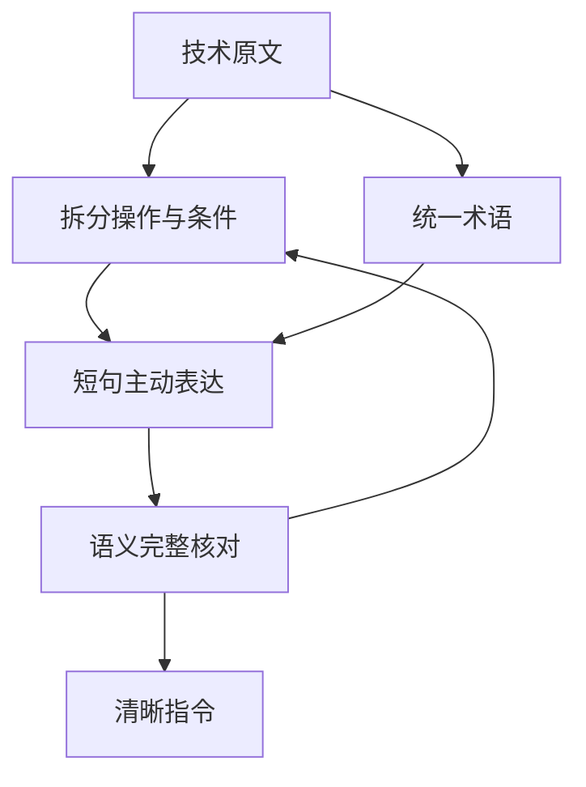

# ASD-STE100（简化技术英语）

## 一句话定义

**ASD-STE100 是为技术文档制定的受控英语规范，通过限定词汇与句式来减少误读。**

## 英文缩写速查

| 缩写 | 英文全称 | 简要说明 |
|------|----------|----------|
| ASD | Aerospace, Security and Defence Industries Association of Europe | 发布 ASD-STE100 规范的组织 |
| STE | Simplified Technical English | 受控英语标准的简称 |
| LLM | Large Language Model | 可按这些原则重写或生成说明的模型 |

## 为什么重要

航空维修手册面向多语言背景的技术人员。一条指令若有多种解释，可能造成返工或安全问题。标准通过限制表达方式，努力让技术文本的词语和句子更可预测。

这套方法也适用于模型生成的工具说明、错误信息和多步骤操作：接收者可能无法追问作者原意，因此明确说明“谁做什么、何时做、满足什么条件”很重要。

## 流程总览

以下按本页已归纳的机制与资料绘制，表示模块或阅读路径关系。

## 核心原则

- **一句话只做一件事**：把多个操作拆开写，避免把步骤、条件和例外塞进同一句。
- **明确执行者并优先主动语态**：写清哪个人、组件或工具执行动作。
- **术语保持稳定**：一个概念选定名称后持续使用，避免为了词汇变化频繁换同义词。
- **选择简单且具体的表达**：在不丢失必要技术含义时，优先选择直接动词和常见词。
- **保持限定条件**：短句不能删掉量值、条件、例外或安全约束。

文章引用的 Issue 9 有 53 条规则以及约 900 个批准基础词和约 1,200 个建议避免词。官方资料标注 Issue 9 于 2025 年 1 月发布，并在 2025 年成为国际标准。完整标准和词表应以[官方发布内容](https://www.asd-ste100.org/)为准；本页不复刻受版权保护的词表。

## 用于 LLM 的实际做法

1. 先判断内容是否需要严格无歧义，例如程序步骤、工具描述或错误处理。
2. 对高风险指令要求短句、单动作、明确主语和一致术语。
3. 对普通解释采用轻量版本，避免语言僵化或删掉关键限定。
4. 对改写结果检查事实、条件和安全要求是否完整。
5. 复杂主题再选择图示、交互页面或动画，帮助读者建立结构或动态直觉；参见[文章导读](../overview/karpathy-asd-ste100-llm-outputs.md)。

## 局限与风险

- 简化句子不等于提高事实正确性；模型仍可能生成错误信息。
- 规则过严会损伤语气、细微差别和创造性表达，不适合所有文体。
- 仅检查句长或语态的脚本不能证明改写保留了原意。
- 对机器人安全操作说明，不能为了简短而省略力矩、电流、速度、工作区或停止条件。

## 关联页面

- [ASD-STE100 与 LLM 输出的文章导读](../overview/karpathy-asd-ste100-llm-outputs.md)
- [ASD-STE100 Skill](../entities/asd-ste100-skill.md)
- [LLM Wiki（Karpathy 模式）](../references/llm-wiki-karpathy.md)

## 参考来源

- [ASD-STE100 官方站归档](../../sources/sites/asd-ste100.md)
- [机器之心文章归档](../../sources/blogs/karpathy-asd-ste100-clear-llm-outputs-2026-10-03.md)

## 推荐继续阅读

- [ASD-STE100 官方站](https://www.asd-ste100.org/)
- [ASD-STE100 Skill 规则说明](https://github.com/danyuchn/asd-ste100-skill/blob/master/references/writing-rules.md)
