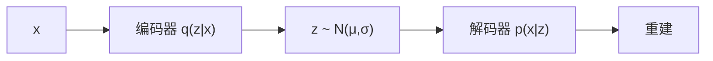

# Autoencoder / VAE（自编码器与变分自编码器）

**自编码器（AE）**：编码器把输入压到低维码，解码器重建输入，用重建损失训练。**VAE** 把码换成分布 \(q_\phi(z|x)\)，用 ELBO 同时做重建与先验对齐，从而能从先验采样新样本。

## 一句话定义

先学会「有损压缩」，VAE 再要求压缩码住在一个 **可抽样的连续潜空间** 里。

## 英文缩写速查

| 缩写 | 英文全称 | 简要说明 |
|------|----------|----------|
| AE | Autoencoder | 编码–解码重建网络 |
| VAE | Variational Autoencoder | 变分推断版自编码器 |
| ELBO | Evidence Lower Bound | VAE 的可优化下界 |
| KL | Kullback–Leibler | 后验对先验的惩罚项 |
| RSSM | Recurrent State-Space Model | Dreamer 类世界模型里的 VAE 后裔 |

## 为什么重要

- 确定性 AE 适合降维与去噪，但潜空间可能有「洞」，插值无意义。
- [Kingma & Welling, 2013](../../sources/papers/kingma_vae_arxiv_1312_6114.md) 用重参数化让变分推断能走反向传播，成为世界模型与运动 VAE 的标准起点。
- 机器人要的经常是 **平滑流形**（动作、下一观测），不是最锐利的像素。

## 核心原理

VAE 目标：

\[
\mathcal{L}=\mathbb{E}_{q_\phi(z|x)}[\log p_\theta(x|z)]-D_{KL}(q_\phi(z|x)\,\|\,p(z))
\]

重参数化 \(z=\mu_\phi(x)+\sigma_\phi(x)\odot\epsilon\)。KL 过强会后验坍缩（码不信息）；过弱则潜空间不可采样。

## 工程实践

| 场景 | 倾向 |
|------|------|
| 观测压缩 / Dreamer | VAE 或 RSSM，优先调 KL 退火 |
| 运动生成 | 条件 VAE；注意平均化步态 |
| 只要特征 | 确定性 AE 或 SSL 通常够用 |
| 锐利图像 | 不要逼 VAE，改 [扩散](./diffusion-model.md) |

## 局限与风险

- **均值效应**：像素级 \(L_2\) 重建偏模糊。
- **后验坍缩**：解码器太强时忽略 \(z\)。
- AE ≠ 生成模型：没有先验采样就只是压缩器。

## 关联页面

- [生成式模型基础](../formalizations/generative-foundations.md)
- [GAN](./generative-adversarial-network.md)
- [扩散模型](./diffusion-model.md)
- [潜空间想象](./latent-imagination.md)
- [AI 架构地图](../overview/ai-architecture-map.md)

## 参考来源

- [VAE（arXiv:1312.6114）](../../sources/papers/kingma_vae_arxiv_1312_6114.md)
- [AI 架构地图一手论文簇](../../sources/papers/ai_architecture_foundations.md)

## 推荐继续阅读

- [Understanding Deep Learning — VAEs](https://udlbook.github.io/udlbook/)
