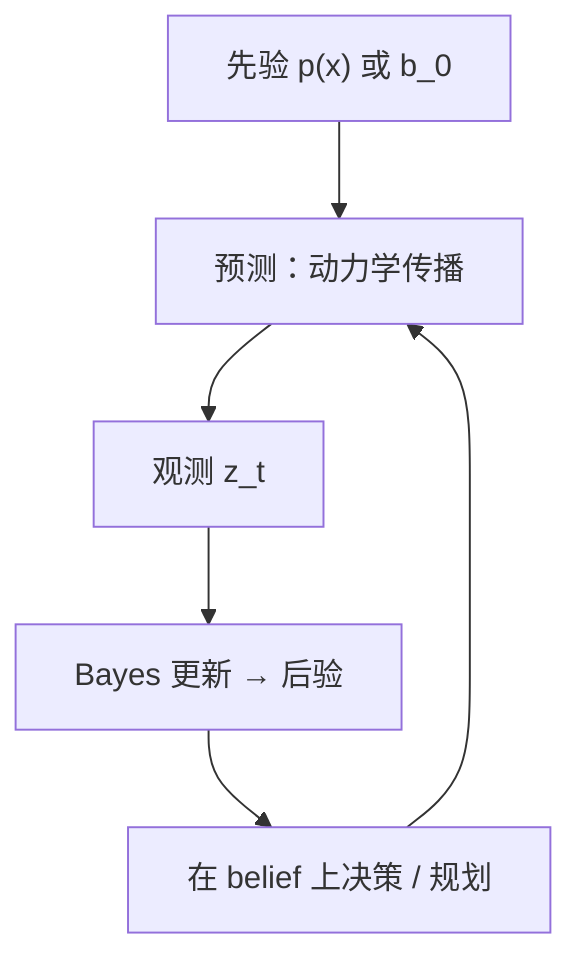

# Bayesian Belief Analysis（贝叶斯信念分析）

**贝叶斯信念分析**：在 **部分可观测** 或 **模型不确定** 的序贯决策中，用 **概率分布 $b_t$** 表示对隐状态（或参数）的信念，并按 **Bayes 规则** 随观测递推更新，再在 belief 空间上选动作或规划——涵盖 POMDP belief-MDP、Bayes 滤波（KF/EKF）与 Bayesian RL。

## 英文缩写速查

| 缩写 | 英文全称 | 简要说明 |
|------|----------|----------|
| POMDP | Partially Observable Markov Decision Process | 隐状态不可直接观测的 MDP 扩展 |
| BRL | Bayesian Reinforcement Learning | 对转移/奖励或价值/策略设先验的 RL |
| KF | Kalman Filter | 线性高斯下的最优 Bayes 递推估计 |
| EKF | Extended Kalman Filter | 非线性系统上一阶线性化的 Bayes 滤波 |
| PSRL | Posterior Sampling RL | 从模型后验采样以平衡探索–利用的 BRL 算法 |

## 为什么重要

- **真机几乎总是部分可观测**：部署策略往往只有 IMU、编码器、噪声视觉——必须处理 $P(s_t\mid o_{1:t})$，而非假设全状态 $s_t$ 已知（见 [POMDP](../formalizations/pomdp.md)、[具身 RL 最小闭环](./embodied-rl-minimal-closed-loop.md)）。
- **状态估计与控制统一语言**：[Kalman Filter](../formalizations/kalman-filter.md) / [EKF](../formalizations/ekf.md) 是 **连续空间高斯 belief** 的闭式 Bayes 更新；与 **belief-MDP** 离散 POMDP 求解共享「先预测、再用观测校正」结构。
- **探索–利用的形式化**：Bayesian RL 用先验–后验表达 **模型不确定性**，Thompson sampling / PSRL 等给出有理论支撑的探索策略（Ghavamzadeh et al. 2015 综述）。

## 核心原理

### Belief 更新（离散 POMDP）

Belief $b_t(s) = P(s_t=s \mid o_{1:t}, a_{1:t-1})$。收到观测 $o_{t+1}$ 后：

$$b_{t+1}(s') \propto O(o_{t+1}\mid s', a_t) \sum_{s} T(s'\mid s, a_t)\, b_t(s)$$

**Belief-MDP**：把 $b_t$ 当作宏状态，在 belief 空间上最大化期望折扣回报。Smallwood & Sondik (1973) 证明有限 horizon 最优值在 belief 单纯形上为 **分段线性凸（PWLC）**。

### Bayes 滤波（连续估计）

对动力系统 $x_{k+1}=f(x_k,u_k)+w_k$，观测 $z_k=h(x_k)+v_k$：

1. **预测**：$p(x_k\mid z_{1:k-1})$ 经动力学传播；
2. **更新**：用 Bayes 规则融合 $z_k$ 得后验 $p(x_k\mid z_{1:k})$。

线性高斯情形下退化为 [KF](../formalizations/kalman-filter.md)；一般非线性用 [EKF](../formalizations/ekf.md) 或粒子滤波。

### Bayesian RL 两条线

| 类型 | 先验对象 | 代表思路 |
|------|----------|----------|
| Model-based BRL | 转移 $P$、奖励 $R$ 参数 | 后验采样 → 乐观规划（PSRL） |
| Model-free BRL | 价值 $Q$ 或策略类 | 贝叶斯线性回归 / 高斯过程价值 |

POMDP 下常扩展为 **Bayes-adaptive POMDP**：同时对 **隐状态** 与 **模型参数** 维护 belief（Ross et al. 2011）。

### 流程总览

## 工程实践

| 层级 | 典型实现 | 机器人例 |
|------|----------|----------|
| 低层估计 | EKF / UKF / 因子图 | 足式 VIO、操作臂关节状态 |
| 策略学习 | 非对称 actor-critic（critic 见特权状态） | Humanoid-Gym、多数 sim-to-real 腿足策略 |
| 序列策略 | RNN / Transformer 编码历史观测 | 部署 POMDP 的默认工程近似 |
| 探索 | Thompson sampling / 集成动力学 (PETS) | 样本稀缺的真实机 RL |

**实践提示**：深度 RL 中很少显式维护 belief 粒子，但 **「历史编码 ≈ 隐式 belief」** 是常见隐含假设。

## 局限与风险

- **维数灾难**：belief 维数随隐状态空间指数增长；精确 POMDP 求解仅适用于小规模离散问题。
- **一步展开陷阱**：[Sutton *One-Step Trap*](../../sources/blogs/sutton_one_step_trap.md) 指出：在随机策略下对 belief **逐步展开再复合单步预测**，计算分支 **指数膨胀**——与 naive 单步转移 rollout 同族风险。长期预测可考虑 [GVF](./generalized-value-functions.md) 等 **span-independent** 路线。
- **高斯 / 单模态假设**：EKF 在强非线性、多模态接触下易 **不一致（inconsistent）**；需 UKF、粒子滤波或优化式估计。

## 关联页面

- [POMDP](../formalizations/pomdp.md) — belief 的形式化定义与六元组
- [State Estimation](./state-estimation.md) — 机器人状态估计总览
- [Kalman Filter](../formalizations/kalman-filter.md) — 线性高斯 Bayes 滤波
- [Generalized Value Functions](./generalized-value-functions.md) — 与 belief 展开相对照的预测性知识路线
- [Reinforcement Learning](../methods/reinforcement-learning.md) — POMDP 部署与 BRL 探索

## 参考来源

- [贝叶斯分析一手资料索引](../../sources/papers/bayesian_analysis_rl_primary_refs.md)
- [KF/EKF 一手资料索引](../../sources/papers/kalman_filter_ekf_primary_refs.md)
- [The One-Step Trap 原始资料](../../sources/blogs/sutton_one_step_trap.md)

## 推荐继续阅读

- Ghavamzadeh et al. (2015) [Bayesian RL Survey PDF](https://mohammadghavamzadeh.github.io/PUBLICATIONS/FoundationTrend-BRL.pdf)
- Kaelbling et al. (1998) [Planning in POMDPs](https://people.csail.mit.edu/lpk/papers/aij98-pomdp.pdf)
- Tedrake, [Underactuated Robotics — Estimation](https://underactuated.csail.mit.edu/estimation.html)
