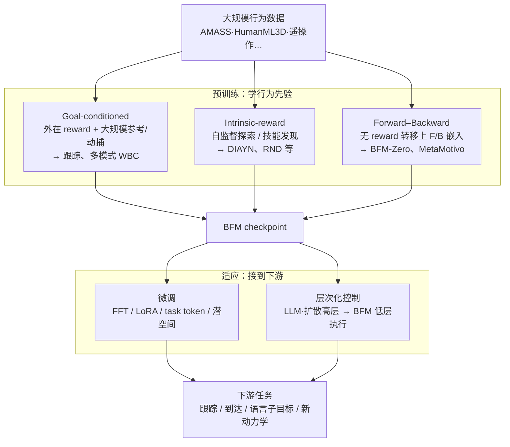

# Behavior Foundation Model（行为基础模型，BFM）

## 一句话定义

**Behavior Foundation Model（BFM）**：从 **大规模、多样化行为数据**（动捕、遥操作、自博弈交互等）学习 **可复用的全身行为先验**，使人形 **whole-body control（WBC）** 在换任务、换控制接口或换目标时 **少重训或零重训** 即可适应——是人形控制从「每任务一条 RL」走向「一个 checkpoint + 适应」的范式标签。

## 英文缩写速查

| 缩写 | 英文全称 | 简要说明 |
|------|----------|----------|
| BFM | Behavior Foundation Model | 大规模行为数据预训练的可复用全身行为先验 |
| WBC | Whole-Body Control | 人形多关节协调控制，BFM 主要服务层 |
| VLA | Vision-Language-Action | 高层语义策略，常与 BFM 低层执行叠加 |
| GC | Goal-conditioned Learning | 以外在目标/参考条件化全身技能扩展 |
| FB | Forward–Backward Representation | 无 reward 的转移表征，如 BFM-Zero 线 |
| DIAYN | Diversity Is All You Need | 内在奖励技能发现类预训练代表 |

## 为什么重要

- **填补 WBC 泛化缺口**：任务专用 RL/IL 在 DeepMimic、AMP、HOVER 等线上已能做出高难度动作，但 **换场景往往要重新奖励工程 + 重训**；BFM 把成本前移到 **一次预训练**。
- **与 VLA 基础策略分工明确**：[Foundation Policy](./foundation-policy.md) 主流解决 **操作向、多相机 + 语言** 的通用策略；BFM 解决 **全尺寸人形低层全身协调**（跟踪、locomotion、VR 遥操作、抗扰等），二者常在栈中 **上下叠加**（高层 VLA / 语言规划 → 低层 BFM）。
- **有系统化综述与活索引**：Yuan 等 TPAMI 2025 综述（arXiv:2506.20487）给出 **预训练三线 + 适应两线** taxonomy；[awesome-bfm-papers](https://github.com/friedrichyuan/awesome-bfm-papers) 持续维护论文表，便于跟踪 SONIC、BFM-Zero、SENTINEL 等快速迭代方向。

## 流程总览（taxonomy）

综述与精选列表共用的 **预训练 → 适应** 主干如下（实线=数据/训练流，虚线=推理时组合）：

## 预训练三线（怎么学先验）

| 路线 | 训练信号 | 典型能力 | 本库入口 |
|------|----------|----------|----------|
| **Goal-conditioned** | 外在 reward + 参考运动/目标状态 | Motion tracking、多模式 WBC、VR 遥操作 | [SONIC](../methods/sonic-motion-tracking.md)、[BFM 论文实体](../entities/paper-behavior-foundation-model-humanoid.md)（CVAE+掩码蒸馏） |
| **Intrinsic-reward** | $r^{int}$：好奇心、多样性、覆盖 | 无显式参考的技能发现 | 综述列为历史/辅助线；人形 WBC 列表条目较少 |
| **Forward–backward** | 无 reward 转移；F/B 嵌入 + 测试时 reward 组合 | 零样本到达、跟踪、奖励优化 | 与 CVAE-BFM 对照：[BFM 实体页](../entities/paper-behavior-foundation-model-humanoid.md) § 同期工作（BFM-Zero） |

### Goal-conditioned 子脉络（最贴近人形真机）

- **跟踪驱动**：逐步对齐参考关节/姿态（DeepMimic 系）→ ASE/CALM/CASE 潜空间 → MaskedMimic / HOVER **多模式统一**。
- **本库已深读代表**：[BFM](../entities/paper-behavior-foundation-model-humanoid.md) 把多接口写成 **位级掩码 + CVAE + 在线蒸馏**；[SONIC](../methods/sonic-motion-tracking.md) 强调 **MoCap 规模 + 网络/算力 scaling**；[Perceptive BFM](../entities/paper-perceptive-bfm.md) 在 **保留 raw 参考接口** 前提下用 **机器人中心感知** 闭合操作者–环境失配（楼梯/块/户外真机）；[ReactiveBFM](../entities/paper-reactivebfm.md) 把 BFM/SONIC 类 tracker 与 **自回归运动扩散规划器** 闭合成 **真机可部署 reactive 系统**，用 prefix curriculum 缓解开环级联的 exposure bias。

## 适应两线（怎么接到新任务）

| 路线 | 做法 | 代表（awesome 列表） |
|------|------|----------------------|
| **微调** | 全参 / LoRA / 修改潜任务向量、Task Tokens | Fast Adaptation with BFM、Zero-Shot Dynamics Adaptation |
| **层次化** | 高层生成子目标或 motion token，BFM 作低层 tracker | SENTINEL、BeyondMimic、LangWBC、LeVERB、CloSD、[ReactiveBFM](../entities/paper-reactivebfm.md)（闭环 AR 规划 + BFM 跟踪，真机 reactive WBC） |

与 [GR00T-WholeBodyControl](../entities/gr00t-wholebodycontrol.md) 叙事一致：**VLA / 语言 / 扩散规划** 与 **运动跟踪执行器** 分层的工程趋势。

## 与 Foundation Policy 的边界

| 维度 | Foundation Policy（本库概念） | BFM |
|------|------------------------------|-----|
| 主要平台 | 机械臂、移动底座、部分 wheeled humanoid | **全尺寸人形 WBC** |
| 输入模态 | 视觉 + 语言为主 | 本体感知 + **目标状态/掩码/潜变量** 为主 |
| 预训练数据 | 跨机器人操作演示、OXE 等 | **动捕、全身遥操作、仿真交互** |
| 代表 | RT-2、π₀、Octo、GR00T VLA 栈 | BFM4Humanoid、SONIC、BFM-Zero、HOVER |

二者可 **组合**：BFM 提供 **身体级 checkpoint**，Foundation Policy / VLA 提供 **任务级语义与感知**。

## 常见误区

1. **BFM ≠ 任意大规模 RL**：需具备 **跨任务行为先验 + 快速适应**；单任务专家策略不算 BFM。
2. **BFM ≠ VLA**：无语言/视觉条件也可是 BFM（如纯跟踪基础模型）；有语言的全身模型往往是 **层次栈上层**。
3. **同名不同法**：「BFM」同时指 **CVAE 掩码蒸馏**（arXiv:2509.13780）与 **BFM-Zero（FB+无监督 RL）**——读论文前先看 **预训练线**。

## 关联页面

- [Foundation Policy](./foundation-policy.md) — 操作向基础策略母概念
- [Whole-Body Control](./whole-body-control.md) — WBC 问题定义与 QP/学习法谱系
- [BFM（Behavior Foundation Model for Humanoid Robots）](../entities/paper-behavior-foundation-model-humanoid.md) — CVAE+掩码人形 WBC 单篇深读
- [Perceptive BFM](../entities/paper-perceptive-bfm.md) — raw 参考 + 地形感知 PMT/TCRS
- [ReactiveBFM](../entities/paper-reactivebfm.md) — 闭环 AR 规划 + BFM 跟踪，真机 reactive WBC
- [SONIC](../methods/sonic-motion-tracking.md) — goal-conditioned scaling 代表
- [人形运动跟踪方法选型](../queries/humanoid-motion-tracking-method-selection.md)
- [人形 RL 运动控制身体系统栈](../overview/humanoid-rl-motion-control-body-system-stack.md)
- [BFM 41 篇技术地图](../overview/bfm-41-papers-technology-map.md)
- [BFM 分类 01：Forward-backward 表征](../overview/bfm-category-01-forward-backward-representation.md)
- [BFM 分类 02：Goal-conditioned 学习](../overview/bfm-category-02-goal-conditioned-learning.md)
- [BFM 分类 03：Intrinsic reward 预训练](../overview/bfm-category-03-intrinsic-reward-pretraining.md)
- [BFM 分类 04：Adaptation](../overview/bfm-category-04-adaptation.md)
- [BFM 分类 05：Hierarchical control](../overview/bfm-category-05-hierarchical-control.md) — awesome 列表 + 公众号五类问题导读

## 参考来源

- [具身智能研究室 · BFM 41 篇专题（微信公众号）](../../sources/blogs/wechat_embodied_ai_lab_bfm_41_papers_survey.md)
- [BFM 综述（arXiv:2506.20487）](../../sources/papers/bfm_survey_arxiv_2506_20487.md)
- [awesome-bfm-papers 精选列表](../../sources/repos/awesome_bfm_papers.md)
- [BFM 论文 ingest（arXiv:2509.13780）](../../sources/papers/bfm_humanoid_arxiv_2509_13780.md)

## 推荐继续阅读

- [awesome-bfm-papers](https://github.com/friedrichyuan/awesome-bfm-papers) — 按 taxonomy 分类的论文表与数据集表
- [A Survey of Behavior Foundation Model（arXiv:2506.20487）](https://arxiv.org/abs/2506.20487) — TPAMI 2025 全文
- [BFM 项目页](https://bfm4humanoid.github.io/) — CVAE 路线真机/demo
- [BFM-Zero](https://lecar-lab.github.io/BFM-Zero/) — forward-backward + 无监督 RL 对照
