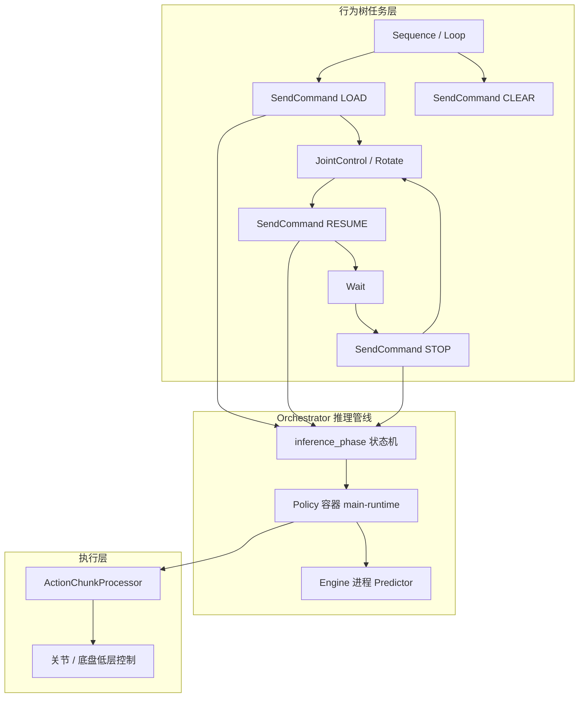

# 行为树 × VLA 编排

**行为树（Behaviour Tree, BT）与 VLA 结合**：把 **宏任务流程**（加载策略、复位姿态、移动底盘、循环 pick-and-place）交给 **可组合、可恢复** 的行为树；把 **语言条件下的连续操作** 交给 **VLA / 模仿学习策略** 以 action chunk 异步输出。二者通过 **显式生命周期 API** 解耦，而不是让 BT 直接内嵌模型前向。

## 一句话定义

BT 回答「**什么时候**跑哪段技能、失败如何恢复」；VLA 回答「**这一段**看到什么、听到什么指令时怎么动」——工程上常表现为 BT 节点触发 `LOAD / RESUME / STOP / CLEAR`，VLA 在 `INFERENCING` 相位内持续吐 chunk，低层控制器以更高频率跟踪。

## 英文缩写速查

| 缩写 | 英文全称 | 简要说明 |
|------|----------|----------|
| BT | Behaviour Tree | 行为树，组合控制/动作节点并带恢复语义的任务编排结构 |
| VLA | Vision-Language-Action | 视觉-语言-动作多模态策略，常以自然语言为任务接口 |
| IL | Imitation Learning | 模仿学习，Cyclo 栈中 LeRobot ACT/π₀ 等后端的数据来源 |
| ROS 2 | Robot Operating System 2 | 机器人中间件，BT 与推理状态常经 srv/topic 暴露 |
| BC | Behavior Cloning | 行为克隆，VLA 微调与部署前的常见训练路线 |

## 为什么重要

- **VLA 单独端到端难以覆盖长程任务**：多步搬运、间歇复位、底盘转向与「操作窗口」交替，需要 **确定性编排** 与 **可编辑任务图**（XML/可视化 BT Manager），而非全靠语言模型逐步规划。
- **与 Nav2、SayCan 同构的分层直觉**：Nav2 用 BT 调度全局/局部规划器；SayCan 用 LLM 过滤技能可行性；**BT+VLA** 把 **已训练 checkpoint** 当作可 `LOAD/RESUME` 的 **技能原语**，降低长程系统对单一黑盒策略的依赖。
- **部署侧痛点对准**：VLA 推理慢、需 chunk 缓冲；BT 可在 `STOP` 后插入 `JointControl` 复位，在 `Loop` 中重复「推理几秒 → 暂停 → 回初始位」，避免 chunk 边界与场景阶段错位。

## 核心结构

### 1. 生命周期而非「一次推理」

开源锚点 [Cyclo Intelligence](../entities/cyclo-intelligence.md) 的 `SendCommand` BT 节点将 VLA 接入 orchestrator 既有 UI 命令：

| 命令 | 语义 |
|------|------|
| **LOAD** | 加载 checkpoint 到内存后 **立即暂停**（`INFERENCING` → `PAUSED`），供后续 `RESUME` |
| **RESUME** | 开始按 `task_instruction` 与相机观测 **持续推理** |
| **STOP** | 暂停但不卸载，便于插入复位动作 |
| **CLEAR** | 结束会话并卸载 |

每一 stage **等待 `/task/inference_status` 到达目标相位**，避免 BT 下游节点在策略过渡中启动——这是 BT 与 **50–200 ms 级 VLA** 对接的实用同步模式。

### 2. VLA 仍占「语义技能」层

BT 节点可传入：

- **`task_instruction`**：自然语言子任务（如 "Pick up the paper cup."）
- **`model`**：后端选择（LeRobot ACT/SmolVLA/π₀/π₀.₅/diffusion、GR00T N1.7 等）
- **`inference_hz` / `control_hz` / `chunk_align_window_s`**：chunk 频率与对齐窗口

宏动作（头/臂/升降/旋转）由 **确定性 BT 动作**（`JointControl`、`Rotate`）完成；**接触丰富段** 交给 VLA chunk——与 [VLA 与低级控制器融合](../queries/vla-with-low-level-controller.md) 中「VLA 中高层、PD/WBC 低层」一致。

### 3. 与纯 LLM 规划的区别

| 维度 | LLM / VLM planner（如 SayCan、Vesta） | BT + VLA |
|------|----------------------------------------|----------|
| 技能来源 | 语言生成子任务 + affordance 过滤 | **预训练 checkpoint** 作为节点参数 |
| 可预测性 | 依赖模型采样与 grounding | BT 结构 **显式、可回放、可单步调试** |
| 长程组合 | 适合开放词汇推理 | 适合 **产线式重复流程**（循环、超时、复位） |
| 失败恢复 | 需额外监控与重规划 | BT **Sequence/Loop + STOP** 天然插入恢复支路 |

二者可叠加：BT 某一叶节点仍可调用 **VLM 重规划**；本概念页聚焦 **工程上已常见的「BT 管流程、VLA 管操作段」**。

## 常见误区或局限

- **误区：BT 可以替代 VLA 的语义泛化** — BT 只编排 **已选定的模型与指令**；换物体/换表述仍需 VLA 泛化或重训。
- **误区：LOAD 后应立即 RESUME** — Cyclo 模式故意 **LOAD 后 PAUSE**，先跑 `JointControl` 对齐场景，再 `RESUME`，否则 chunk 可能在错误姿态下开始。
- **局限：BT XML 维护成本** — 技能库增大时需 **Refresh Nodes**、版本化树文件；与 Nav2 类似，复杂树的可读性依赖工具（Cyclo 提供 React BT Manager）。
- **局限：仍依赖 orchestrator 状态机正确性** — phase 超时、异步 LOAD 失败需 BT 节点返回 `FAILURE` 并触发恢复支路。

## 参考来源

- [Cyclo Intelligence 仓库归档](../../sources/repos/cyclo_intelligence.md)
- [Cyclo Intelligence（实体页）](../entities/cyclo-intelligence.md)
- [ROBOTIS-GIT/cyclo_intelligence](https://github.com/ROBOTIS-GIT/cyclo_intelligence) — `orchestrator/orchestrator/bt/` 与 `ffw_sg2_rev1_example.xml`

## 关联页面

- [VLA（方法）](../methods/vla.md) — 策略层定义与工程瓶颈
- [Cyclo Intelligence（实体）](../entities/cyclo-intelligence.md) — ROBOTIS 全栈实现细节
- [Navigation2（实体）](../entities/navigation2.md) — 移动机器人域 BT 编排参照
- [SayCan（方法）](../methods/saycan.md) — LLM 高层 + 低层技能的分层对照
- [VLA 真机部署指南（Query）](../queries/vla-deployment-guide.md) — chunk 与延迟
- [VLA 与低级控制器融合（Query）](../queries/vla-with-low-level-controller.md) — 执行层接口
- [Action Chunking（方法）](../methods/action-chunking.md) — RESUME 阶段的 chunk 语义

## 推荐继续阅读

- [ROBOTIS AI Worker 文档](https://ai.robotis.com/ai_worker/introduction_ai_worker.html)
- [Nav2 Behavior Trees 文档](https://docs.nav2.org/behavior_trees/index.html) — BT 基础与恢复行为模式
