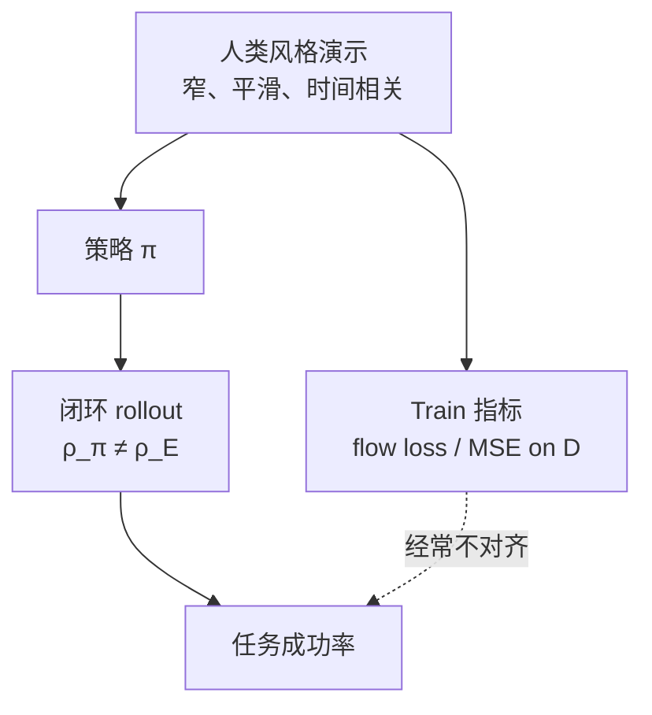

# Behavioral Cloning Mysteries（真机风格 BC 的四条反直觉）

## 一句话定义

**Behavioral Cloning Mysteries**：在统计性质接近人类演示（窄分布、时间强相关、平滑随机）的数据上训 BC 时，会出现标准 D4RL/OGBench 看不到的四条现象——过拟合往往不坏、开环 chunk 优于逐步闭环、状态任务也需要近十亿参数 MLP、无限数据下输入缩放仍改变成功率——它们共享同一根因：**测试时状态分布 ≠ 专家状态分布**。

## 英文缩写速查

| 缩写 | 英文全称 | 简要说明 |
|------|----------|----------|
| BC | Behavior Cloning | 把专家 (观测, 动作) 当监督学习；本页现象的宿主算法 |
| IL | Imitation Learning | 从演示学策略；BC 是其最简离线形态 |
| MLP | Multi-Layer Perceptron | 本复现用超大 residual MLP 做状态基 flow 策略 |
| VLA | Vision-Language-Action | 作者强调现象不依赖视觉架构，但 scaling 叙事指向 VLA |
| MSE | Mean Squared Error | 相对 flow 损失，验证动作 MSE 更接近成功率 |

## 为什么重要

- **评测谎言：** 验证 flow/BC 损失上升时成功率仍可上升；用训练分布上的 loss 做 early-stop 会砍掉真机里「看起来过拟合、其实更稳」的 checkpoint。
- **部署协议：** 「闭环一定更反应」在纯 BC 上不成立；chunk 开环可能是在补偿 **数据非马尔可夫**，而不只是在扛延迟。
- **容量与特征：** 简单 pick-and-place 也要极大 action 网络；特征缩放改变测试泛化——VLA 的「action expert 太小 / 本体特征未加权」可能是静默瓶颈。
- **证据级别：** 现象来自 [Seohong Park 2026-08 博客](../../sources/blogs/seohong_behavioral_cloning_mystery.md) 的 **仿真复现**（脚本策略模仿人类演示统计性质 + MJWarp 无限数据），不是新定理；目标是把一线民间观察做成可讨论的科学对象。基准计划 2026-10 发布，入库日 **未开源**。

## 核心原理

四条 mystery 都把「train 分布上拟合得好」和「闭环 rollout 成功」拆开。BC 只在 \(\rho_{\pi_E}\) 上最小化 \(\ell(\pi(s), a)\)；部署成功取决于策略自己滚出来的 \(\rho_{\pi}\) 上是否仍接近专家动作。

### Mystery 1：过拟合往往不坏

10K episode 的 block 任务上，验证 **flow loss 恶化** 时成功率仍升并稳住。同分布 50K 有时 **差于** 10K。

工程读法：

- 把轨迹记熟，测试时可沿「表征空间最近邻片段」走，减少一步踏出专家支撑集。
- flow matching 损失尤其容易与表现脱钩；至少同时看 **验证动作 MSE**。真正相关的是 **策略诱导状态** 上的动作误差——通常没有标签。
- **不要**把「更大 dataset + 更强正则」当默认正确；先确认新数据有没有把支撑集稀释到学不会精确复现。

### Mystery 2：开环优于纯闭环（含无限数据）

定义（本页沿用原文）：

- **开环：** \(\pi(a_{t:t+24}\mid s_t)\)，播完整 chunk。
- **闭环：** \(\pi(a_t\mid s_t)\)，每步重规划。

无限数据、简单 block-single 上，纯闭环可以 **碰不到方块**。作者给两条机制：

1. 更短 horizon → 更频繁查询 → 复合误差（随机 flow 头更明显）；该设定甜区约 **25 步**。
2. 环境可马尔可夫，**演示因时间相关而不是**；闭环被迫学「马尔可夫化」边际，测试一步就偏出数据流形。

**历史条件化并不自动修好：** \(\pi(a_t\mid s_{t-24:t})\) train loss 更好、成功率更差。假说包括因果混淆（抄上一动作）与更大输入空间更易偏移。

与 [Revisiting Open-Loop](../entities/paper-revisiting-open-loop-action-chunking.md) 的对读：后者主张 **加长观测上下文** 后 \(T_{\mathrm{exec}}\to 1\) 的 reactive 策略可以更好。本篇「把过去 24 帧状态拼进去」失败，说明 **乱加历史 ≠ 观测到专家隐状态**（暂停、接触意图、分段决策）。两条证据互补：开环是短记忆的补丁；要闭环赢，上下文必须是 **对的变量**，不是更长的关节角窗口。

### Mystery 3：策略必须非常大

固定任务、37 维状态、非目标条件：`[512]*3` 远不够；至少 **`[4096]*8` residual MLP**（约 **0.5B**），8192 维还继续涨。D4RL/OGBench 量级的 MLP 会让人误判「任务太简单、模型够了」。

含义：VLA 即使视觉与任务理解完美，**动作头容量** 仍可能是瓶颈；tokenized 自回归动作在作者对照里同样要大模型。

### Mystery 4：无限数据下特征仍重要

各维标准化 vs 手工缩放：train 指标几乎相同，成功率不同。把物体 \(xyz\) 放大、关节缩小，测试更好——策略被诱导去盯 **物体** 而非内部关节。这是测试分布上的归纳偏置，不是欠拟合。

对 [Bitter Lesson](./bitter-lesson.md) 的边界：在 BC 闭环里，「信息相同」不等于「测试度量相同」；缩放是在选 **哪一组坐标在偏移后仍可泛化**。

## 工程实践

| 场景 | 建议 |
|------|------|
| 选 checkpoint | 同时盯闭环成功率与测试分布代理（若可得）；不要只看验证 flow/NLL |
| 动作头 | 状态 BC 先按「过大」容量试；VLA 勿默认小 MLP action expert |
| chunk vs 逐步 | 默认 length-25 量级开环作基线；改闭环前先证明上下文真的编码专家隐状态 |
| 历史输入 | 加帧前做因果混淆检查（上一动作是否泄漏）；失败时优先物体/接触特征而非更长本体历史 |
| 特征 | 即使标准化，仍尝试物体/夹爪位姿相对缩放；无限数据不取消这一步 |
| 复现 | 等作者 2026-10 基准；在此之前把本页当 **假说清单**，不要当数字真理 |

## 局限与风险

- **仿真脚本 ≠ 真机遥操作。** 只匹配「窄、平滑、时间相关」；真实视觉、接触与失败模式未覆盖。
- **单一配方。** flow matching + length-25 chunk + 状态 MLP；换 diffusion / 视觉可能改甜区，不改「train 指标撒谎」这条主线。
- **与开环文献的表面矛盾** 若只引一条会误导部署：本页说开环赢，Revisiting 说够长 \(T_o\) 后闭环赢——合并结论是 **短上下文开环是补丁，不是终点**。
- **「scale 到一切 in-distribution」** 是作者热观点，不是已验证定律；与 [S1](../entities/skild-s1.md) / [GEN-1.5](../entities/generalist-gen15-one-shot.md) 的产业 scaling 叙事同向，但证据链独立。

## 关联页面

- [Behavior Cloning](../methods/behavior-cloning.md) — 本页是其真机数据现象的深挖
- [Behavior Cloning Loss](../formalizations/behavior-cloning-loss.md) — 为何 \(\mathcal{L}_{BC}\) 只保证 \(\rho_E\) 上的拟合
- [Action Chunking](../methods/action-chunking.md) — 开环执行与训练目标解耦
- [Revisiting Open-Loop Execution](../entities/paper-revisiting-open-loop-action-chunking.md) — 加长观测上下文后 reactive 可赢
- [Why Action Chunking Improves BC](../entities/paper-why-action-chunking-improves-bc.md) — Delay / RDE：不必播完整 chunk
- [DAgger](../methods/dagger.md) — 正视分布偏移的交互式解，而非「把数据记死」
- [The Bitter Lesson](./bitter-lesson.md) — Mystery 4 给出 BC 闭环下的特征反例边界
- [Imitation Learning](../methods/imitation-learning.md)
- [VLA](../methods/vla.md) — 作者把「极大 action expert + 规模化数据」外推到 VLA

## 参考来源

- [Behavioral cloning mystery（博客归档）](../../sources/blogs/seohong_behavioral_cloning_mystery.md)
- [Seohong Park 个人站点归档](../../sources/sites/seohong-me.md)

## 推荐继续阅读

- 原文：<https://seohong.me/blog/behavioral-cloning-mystery/>
- Park et al., *Revisiting Open-Loop Execution in Robotics*（[arXiv:2608.15938](https://arxiv.org/abs/2608.15938)）— 开环 vs 上下文长度
- Lazzati et al., [Why Does Action Chunking Improve BC?](https://action-chunking.github.io/) — 训练目标与执行协议
