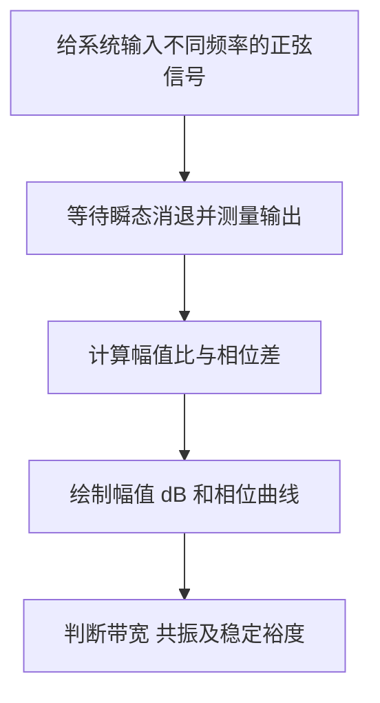

# Bode 图（Bode Plot）

**Bode 图**用两条曲线展示系统对不同频率正弦输入的响应：上图是幅值（通常用 dB），下图是相位（通常用度），横轴是对数频率。读它可以知道系统跟不跟得上快速变化、在哪些频率容易放大/共振，以及在标准负反馈条件下离失稳有多近。

## 英文缩写速查

| 符号/缩写 | 英文全称 | 简要说明 |
|---|---|---|
| LTI | Linear Time-Invariant | 线性时不变系统；稳态频率响应由传递函数在虚轴上的取值给出 |
| FRF | Frequency Response Function | 频率响应函数，常记为 $H(j\omega)$ |
| dB | Decibel | 分贝；幅值比常用 $20\log_{10}|H(j\omega)|$ 表示 |
| BW | Bandwidth | 带宽；在指定闭环响应定义下衡量系统可有效跟随的频率范围 |
| GM | Gain Margin | 增益裕度；标准负反馈环路在相位到达 −180° 时还能增加的环路增益 |
| PM | Phase Margin | 相位裕度；环路增益为 1（0 dB）时离 −180° 还差的相位 |

## 图上画的是什么

给系统输入一个频率为 $\omega$ 的正弦波，等瞬态消退后，稳定 LTI 系统的输出仍是同频率正弦波，只是幅值和相位改变。若传递函数为 $H(s)$，频率响应为：

$$H(j\omega)=\frac{Y(j\omega)}{U(j\omega)}$$

- **幅值曲线：** $20\log_{10}|H(j\omega)|$。0 dB 表示输出幅值与输入相同；−20 dB 表示输出约为输入的十分之一。
- **相位曲线：** $\angle H(j\omega)$，描述输出相对输入提前或滞后的角度。
- **横轴：** 通常是对数频率，可用角频率 rad/s 或频率 Hz。对数轴便于同时查看低频跟踪和高频变化。
- Bode 的 1940 年论文研究反馈放大器设计中的衰减–相位关系；其 1945 年著作系统整理网络分析与反馈放大器设计。现代教材再把这套图形方法用于一般控制系统。

## 从正弦扫频到两条曲线

实测 Bode 图可通过小幅正弦扫频得到；模型 Bode 图则把传递函数代入 $s=j\omega$ 计算。对于离散系统，要按采样周期在单位圆上评估，频率范围受 Nyquist 频率限制。

## 一个最简单的例子：一阶低通

$$H(s)=\frac{1}{1+s/\omega_c}$$

$\omega_c$ 是转折角频率：

- 远低于 $\omega_c$：幅值约为 0 dB，相位约为 0°，慢变化基本能跟上。
- 到 $\omega_c$：幅值约 −3 dB，相位 −45°。
- 远高于 $\omega_c$：幅值曲线约以 −20 dB/decade 下降，相位趋近 −90°，快速变化被压低。

极点、零点会改变转折点、斜率和相位；延迟会额外带来相位滞后。二阶欠阻尼系统可能在自然频率附近出现峰值，可结合[阻尼系统](../formalizations/damped-systems.md)中的 $\omega_n$ 与 $\zeta$ 理解。

## 看反馈稳定性：先分清开环与闭环

在常见单输入单输出（SISO）负反馈中，控制器为 $C(s)$、被控对象为 $G(s)$、反馈环节为 $H(s)$ 时，环路传递函数为 $L(s)=C(s)G(s)H(s)$。讨论经典增益/相位裕度时，通常看这个**开环环路传递函数**的 Bode 图：

| 读数 | 在图上找的位置 | 直觉 |
|---|---|---|
| 增益交越频率 $\omega_{gc}$ | 幅值穿过 0 dB | 环路从低频高增益转为高频低增益的附近；常用来理解响应快慢，但不是所有系统的闭环带宽 |
| 相位裕度 PM | 在 $\omega_{gc}$ 处看相位距离 −180° 还有多少 | 小扰动、延迟或模型误差再增加时，环路离临界振荡还有多少余量 |
| 相位交越频率 $\omega_{pc}$ | 相位穿过 −180° | 检查该处环路幅值离 0 dB 还有多远 |
| 增益裕度 GM | 在 $\omega_{pc}$ 处看幅值到 0 dB 的间隔 | 环路增益还能放大多少，才碰到临界条件 |

对负反馈环路，典型定义是 $PM=180^\circ+\angle L(j\omega_{gc})$；增益裕度的 dB 值是 $-20\log_{10}|L(j\omega_{pc})|$。存在多个交越点、开环不稳定极点或强共振时，不能只抄单个 margin 数字作结论；应核对完整 Nyquist/闭环极点和实际配置。

## 放到机器人控制里怎么用

- **辨识关节/电机：** 对位置、电流或速度环做合适的小信号激励，观察幅频/相频响应，可估算带宽、时延和未建模共振；激励幅度和安全边界需按设备协议设定。
- **整定 PID/PD：** 看目标频段是否有足够增益、交越附近相位是否充足，再调整 $K_p,K_i,K_d$；最终仍需用阶跃、扰动和真实负载测试核验。
- **分层控制：** 电机内环、关节位置环、机器人姿态/运动环带宽不同。某层带宽不能脱离采样率、通信延迟、滤波器和下一层闭环单独解释。
- **定位振荡：** 若峰值或相位骤降落在结构/传动共振频率附近，先检查柔性、齿隙、滤波和传感器延迟，再决定是否改控制增益。

## 易混淆点与局限

- **Bode 图不是时域轨迹。** 它描述线性化模型或特定工作点附近的稳态正弦响应，不能直接展示饱和、碰撞、摩擦死区或大幅姿态变化。
- **被控对象图不等于环路裕度图。** 对象 $G(s)$ 的响应可以说明被控对象特性；经典 GM/PM 应按闭环结构选取 $L(s)$，不能把 $G(s)$ 的曲线直接当作裕度。
- **裕度不等于稳定性全证明。** GM/PM 是有用的经典诊断量；多输入多输出、多个交越、右半平面极点/零点、强不确定性或非线性情形要配合更完整分析。
- **数字控制有上限。** 离散时间模型频率响应受采样率和 Nyquist 频率约束；数值上还要确保 Hz 与 rad/s、采样时间和单位一致。
- **单靠线性扫频不够。** 机器人实机还要验证阶跃跟踪、接触任务、负载变化、限流限矩和热状态。

## 关联页面

- [阻尼系统](../formalizations/damped-systems.md) — 一阶/二阶极点、自然频率与共振峰。
- [PID 控制](../methods/pid-control.md) — 控制器结构与关节级增益调节。
- [极点配置控制](../methods/pole-placement-control.md) — 与频域整定互补的极点方法。
- [关节系统辨识实验设计](../methods/sim2real-joint-sysid-experiment-design.md) — 用实验估计实际关节模型。

## 参考来源

- [H. W. Bode, “Relations Between Attenuation and Phase in Feedback Amplifier Design” (1940)](../../sources/papers/bode-1940-attenuation-phase-feedback.md)
- [H. W. Bode, *Network Analysis and Feedback Amplifier Design* (1945)](../../sources/books/bode-network-analysis-feedback-1945.md)
- [MIT 2.161 一阶与二阶传递函数讲义](../../sources/courses/mit_2161_first_second_order_transfer_functions.md) — 已归档的一手课程讲义。
- [MathWorks bodeplot 文档](../../sources/sites/mathworks-bodeplot-docs.md) — 连续/离散频率响应计算约定。
- [用户提供的公众号文章](https://mp.weixin.qq.com/s/7lcUQ4vqpnW9FMN9FKDoYQ) — 用户说明文章主题为 Bode 图；正文无法读取，未将其作为具体技术结论的依据。
