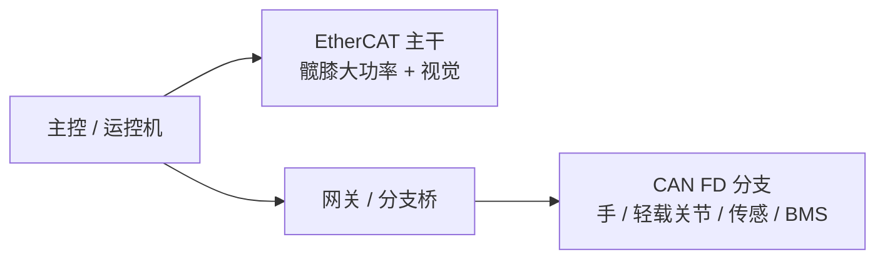

# CAN FD（Flexible Data Rate）

**CAN FD** 是对经典 CAN 的数据链路层扩展：由 Bosch 2011 年起与车企等推动，在 **ISO 11898-1** 框架下标准化。机器人新一代 **USB2CAN FD**、部分关节驱动固件已支持；全尺寸人形上常见作 **末端分支总线**。

## 一句话定义

同一帧内 **仲裁阶段** 仍按经典 CAN 时序竞争总线；进入数据阶段后，可通过 **BRS** 切换到更高比特率，并把数据场从 **8 byte 扩到 64 byte**。

## 英文缩写速查

| 缩写 | 英文全称 | 简要说明 |
|------|----------|----------|
| CAN | Controller Area Network | 多主差分现场总线；经典载荷 ≤8 B |
| CAN FD | CAN with Flexible Data-Rate | 数据段可提速；载荷 ≤64 B |
| BRS | Bit Rate Switch | FD 帧控制位：数据段是否切第二波特率 |
| FDF | FD Format | 区分经典 CAN 帧与 CAN FD 帧 |
| EtherCAT | Ethernet for Control Automation Technology | 人形主干硬实时工业以太网 |
| BMS | Battery Management System | 电池管理；常挂在末端 CAN FD 安全/电源回路 |
| STO | Safe Torque Off | 安全力矩切断；急停类高优先级报文场景 |

## 为什么重要

- **突破 8 byte 瓶颈**：多关节聚合状态、力矩+温度+故障码若挤在经典 CAN 里需拆多帧，FD 可减少帧数与软件组包开销。
- **提高有效吞吐**：CiA 指出在仲裁:数据比特率约 **1:8** 时，考虑扩展头与 CRC，整体吞吐可达经典 CAN 的约 **6×** 量级（依帧长与网络配置而异）。
- **与开源飞控生态对齐**：DroneCAN 规范明确支持 CAN FD，并规划 FDCAN 更高数据率。
- **人形分层通信**：大功率髋膝与视觉走 [EtherCAT](./ethercat-protocol.md)；灵巧手/轻载关节/分布式传感用 CAN FD 共线，兼顾线束体积与 MCU 成本——见下方工程实践。

## 核心机制

### 1. 双速率阶段

| 阶段 | 比特率 | 说明 |
|------|--------|------|
| 仲裁 | 通常 ≤ 1 Mbit/s | 与经典 CAN 兼容，多节点仍可仲裁 |
| 数据 | 受 **CAN FD 收发器** 限制，常见 2–8 Mbit/s | 仅单节点发送时提速，ACK 前需重同步 |

### 2. 关键标志位

- **FDF（FD frame）**：隐性 → 本帧为 CAN FD；显性 → 经典 CAN CC 帧。
- **BRS（bit rate switch）**：隐性 → 数据阶段启用第二比特率；显性 → 全程仲裁段时序。

### 3. 网络元件

- 需 **CAN FD 收发器**（ISO 11898-2 中 FD 变体，对称性更严）。
- 总线上 **不可混用** 仅经典 CAN 与 FD 节点而不做兼容设计——控制器与固件须显式支持 FD 帧格式。

## 工程实践：人形末端分支场景

第三方工程综述给出的**分层读法**（非厂商白皮书；量级需按整机验证）：

| 场景 | 典型载荷 | 为何倾向 CAN FD |
|------|----------|-----------------|
| 五指灵巧手 | 指角、力矩、指尖压力、电机温度 | 腔体极窄，双绞共线；64 B 可一次打包多指传感 |
| 腕/颈/踝等轻载关节 | 位置指令、力矩反馈、过热/抱闸 | 单总线串 8–12 模组量级；大功率主关节仍走 EtherCAT |
| 分布式传感 | 足底力、IMU、碰撞、机体温 | 周期上报，无图像/点云 |
| 电源与安全 | BMS、STO 急停 | 低 ID 抢占总线；差分抗干扰 |
| 诊断 / OTA | 故障码、固件块 | 大包缩短刷写往返 |

相对经典 CAN：少分包 → 总线利用率下降，更易维持 ~1 kHz 级末端环（具体取决于节点数与帧长）。相对 EtherCAT：末端无 ESC 芯片成本与星型/菊花链布线压力。完整选型轴见 [CAN vs EtherCAT](../comparisons/can-vs-ethercat-joint-bus.md)。

## 与 CANopen / DroneCAN

- **CANopen FD**：CiA 在 CAN FD 物理层上延续对象字典与 PDO 语义（见 [CANopen 来源](../../sources/sites/cia_canopen_overview.md)）。
- **DroneCAN**：传输层已声明支持 CAN CC 与 CAN FD；多段传输在首段带 CRC（见 [DroneCAN 来源](../../sources/sites/cia_dronecan_uavcan.md)）。

## 常见误区

- **「FD = 全程 8 Mbps」**：仅数据段提速；仲裁仍受拓扑与 1 Mbit/s 级约束。
- **「买 FD 适配器就自动更快」**：对端驱动器、终端电阻、线长与 **采样点** 必须整网一致，否则 CRC 错误飙升。
- **「人形全部用 CAN FD 即可」**：高轴数硬实时同步与大功率主关节仍优先 EtherCAT；FD 是末端补位而非替代主干。
- **与 EtherCAT 混淆**：EtherCAT 走以太网帧 on-the-fly；CAN FD 仍是 CAN 控制器语义——选型见 [对比页](../comparisons/can-vs-ethercat-joint-bus.md)。

## 关联页面

- [CAN 总线（经典）](./can-bus-protocol.md)
- [EtherCAT 协议基础](./ethercat-protocol.md)
- [CAN vs EtherCAT：关节总线选型](../comparisons/can-vs-ethercat-joint-bus.md)
- [电机驱动器底软通信协议总览](../overview/motor-drive-firmware-bus-protocols.md)

## 参考来源

- [CiA：CAN FD 基本思想](../../sources/sites/cia_can_fd_basic_idea.md)
- [CiA：CANopen 概览](../../sources/sites/cia_canopen_overview.md)
- [CiA / DroneCAN](../../sources/sites/cia_dronecan_uavcan.md)
- [微信：CAN/CAN FD 到人形底层总线](../../sources/blogs/wechat_ai_explore_yao_can_canfd_humanoid_bus.md)

## 推荐继续阅读

- CiA：[CAN FD – The basic idea](https://www.can-cia.org/can-knowledge/can-fd-the-basic-idea/)
- CiA：[CANopen FD](https://www.can-cia.org/can-knowledge/canopen-fd-the-art-of-embedded-networking/)
- 公众号原文：<https://mp.weixin.qq.com/s/UvjlH1bCsZwNHC2_z12cBg>
