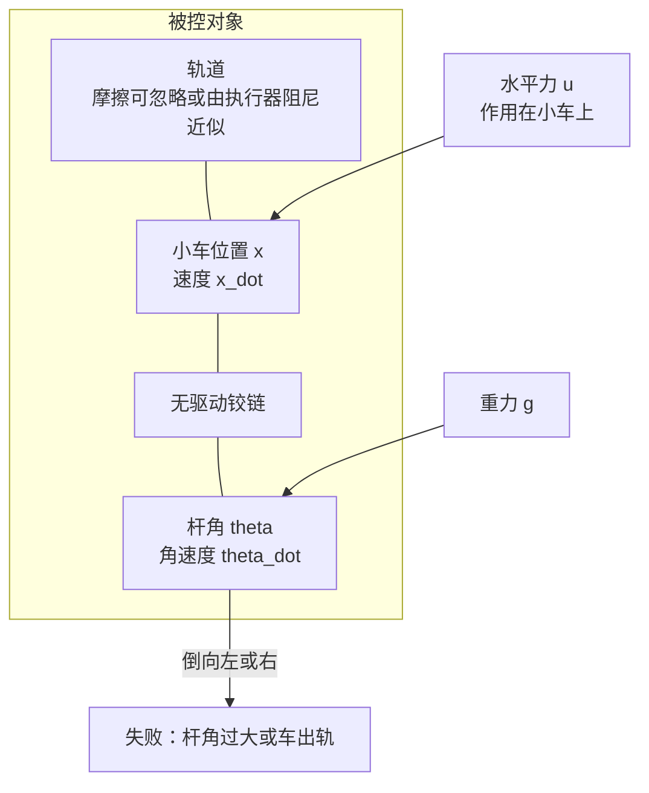
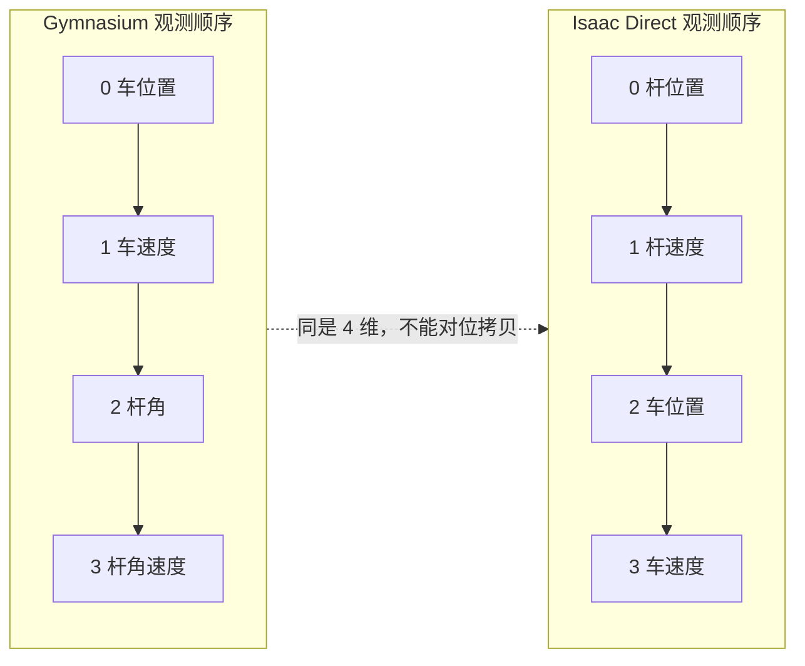
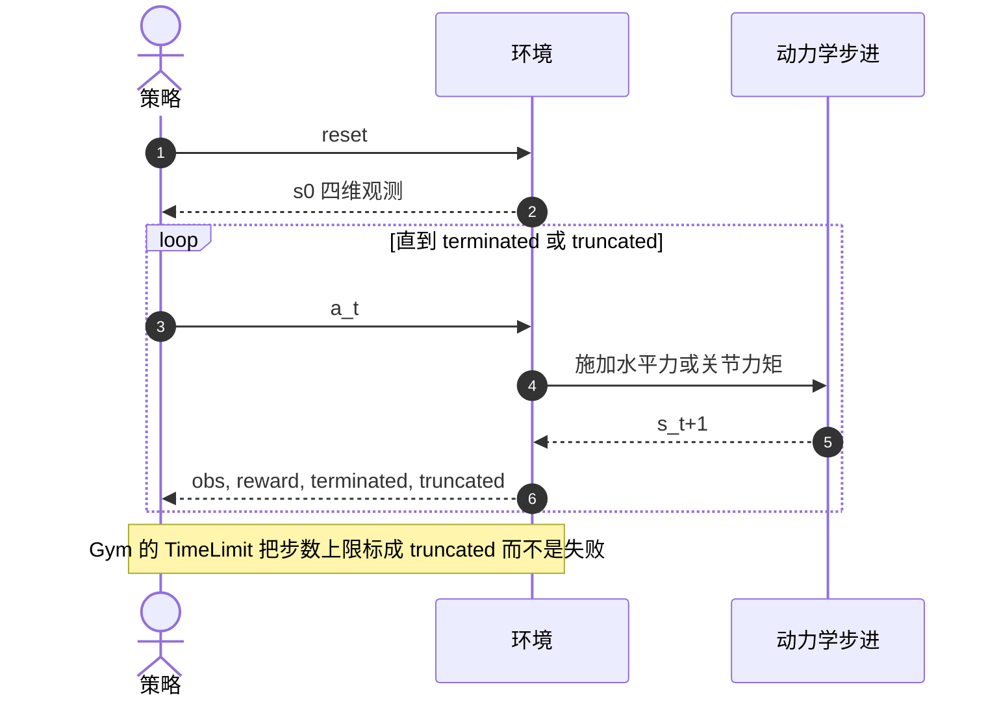
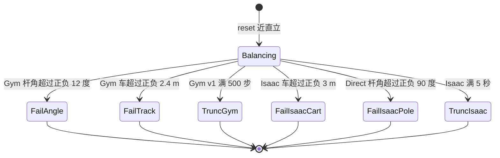
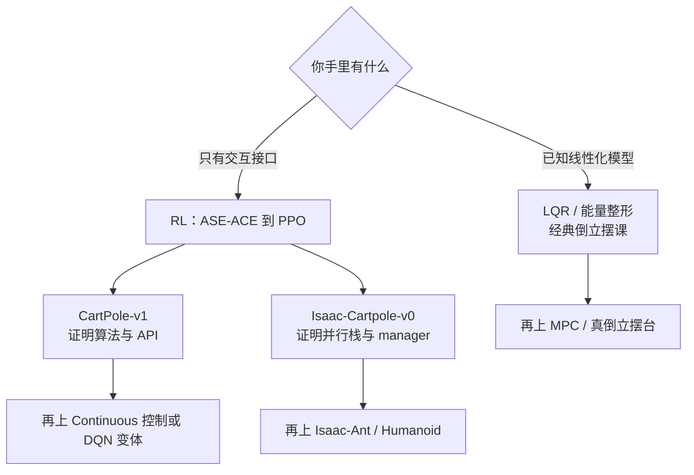
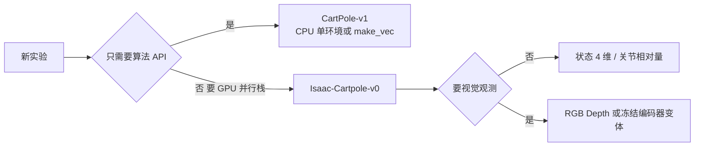
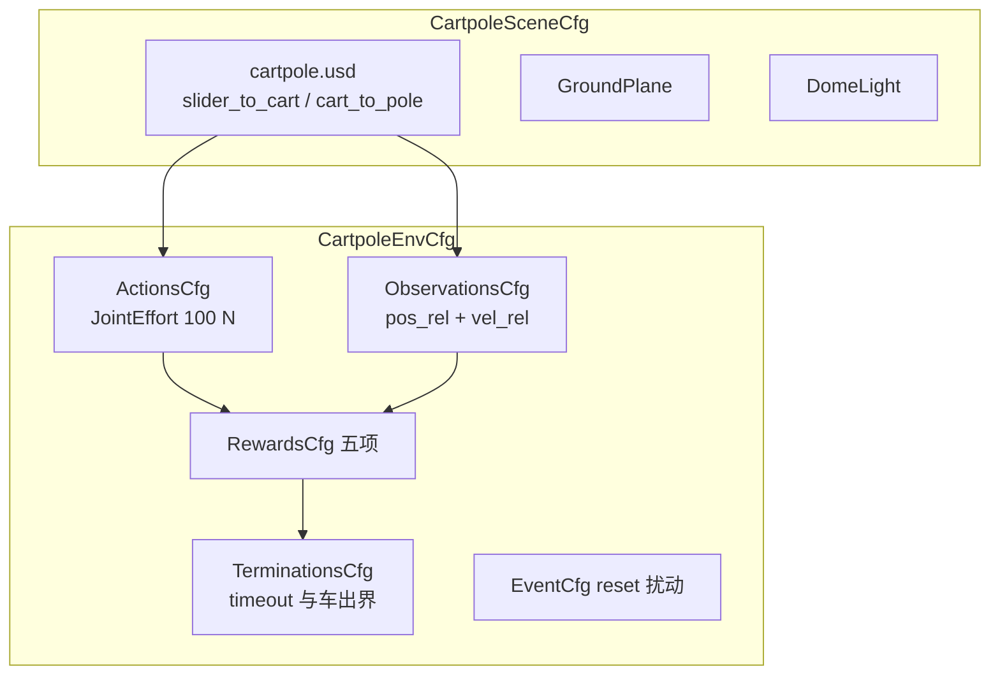
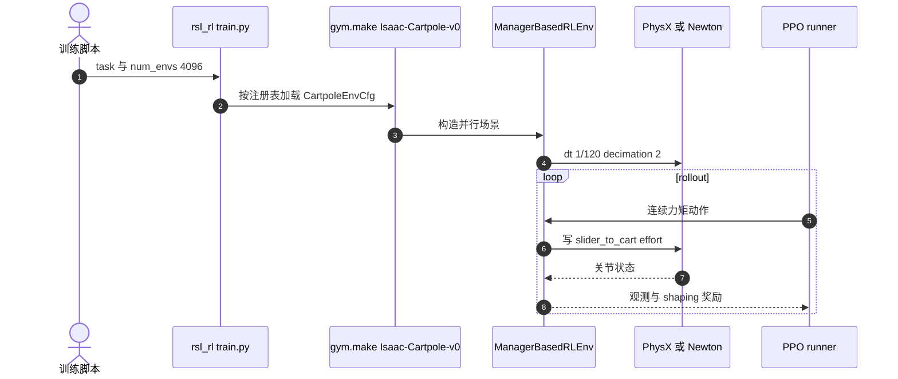
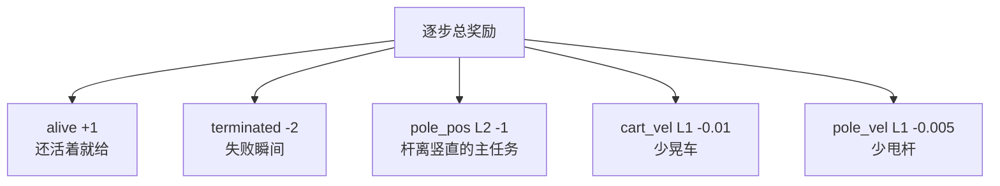

# Cartpole 问题

**Cartpole**（cart-pole / 倒立摆小车）是欠驱动平衡控制的最小实验对象：一根无驱动的杆铰接在可沿轨道平移的小车上，唯一执行器是作用在小车上的水平力，目标是让杆保持（或摆起后保持）竖直向上。

## 一句话定义

> 只会左右推车、却要让车上那根会倒的杆一直立着——这是 RL 与经典控制共用的最小闭环，不是「玩具物理」，而是失败信号、观测契约和并行训练栈的对照尺。

## 英文缩写速查

| 缩写 | 英文全称 | 简要说明 |
|------|----------|----------|
| CartPole | Cart-Pole / Inverted Pendulum on a Cart | 小车–倒立摆系统；Gymnasium 注册名 `CartPole-v1` |
| ASE | Associative Search Element | Barto 1983 的动作元件，后世 actor |
| ACE | Adaptive Critic Element | Barto 1983 的评价元件，后世 critic |
| MDP | Markov Decision Process | 用 \(S,A,P,R,\gamma\) 把平衡任务写成序贯决策 |
| PPO | Proximal Policy Optimization | Isaac-Cartpole-v0 文档默认对接的 on-policy 算法 |
| Direct | Direct Workflow | Isaac Lab 单类 `DirectRLEnv`；id 为 `Isaac-Cartpole-Direct-v0` |
| Manager | Manager-Based Workflow | Isaac Lab 模块化 MDP；id 为 `Isaac-Cartpole-v0` |

## 为什么重要

1. **RL 的第一块试金石。** [Gymnasium](../entities/gymnasium.md) 把 Barto–Sutton–Anderson 1983 的 cart-pole 做成 `CartPole-v1`；PPO / DQN 教程几乎都先在这里证明 `reset` / `step` 能跑通。见 [具身 RL 最小闭环](./embodied-rl-minimal-closed-loop.md)。
2. **Actor–Critic 的实验原点。** 1983 文不是「再做一个倒立摆仿真」，而是证明 **ASE（搜动作）+ ACE（学评价）** 可以只靠失败信号学会平衡。这是读 [Sutton & Barto 教材](../entities/sutton-barto-rl-book.md) 和现代 PPO critic 之前该记住的谱系。
3. **从 CPU 玩具跨到 GPU 训练栈的台阶。** [Isaac Lab](../entities/isaac-lab.md) 文档把 `Isaac-Cartpole-v0` / `Isaac-Cartpole-Direct-v0` 当作 Quickstart 任务：同一物理直觉，换成 4096 并行、连续力矩、manager 奖励项。过了这一步再上 Humanoid，才不会把「环境 id 里有 Cartpole」误当成 Gym 超参可以原样粘贴。
4. **奖励与终止的对照实验。** 同一「保持杆向上」，1983 / `sutton_barto_reward` 是稀疏失败；Gymnasium 默认逐步 +1；Isaac Lab 再加杆角 L2 与速度惩罚。这是 [Reward Design](./reward-design.md) 最小可复现案例。

## 核心原理

### 物理对象

小车沿水平轨道，杆绕车上铰链转动。重力要把杆拉离不稳定平衡点；控制只能水平推车，不能直接扭杆——这就是欠驱动。



Gymnasium 源码采用的解析积分（Florian 动力学，半长 \(l=0.5\,\mathrm{m}\)）把 \((x,\dot x,\theta,\dot\theta)\) 显式推进一步；Isaac Lab 则加载 Nucleus 上的 `cartpole.usd`，由 PhysX（或文档中的 Newton 后端）对 `slider_to_cart` / `cart_to_pole` 两个关节做刚体步进。

### 四维状态与观测陷阱

| 分量 | 物理含义 | Gymnasium `CartPole-v1` | Isaac Direct 观测拼接 |
|------|----------|-------------------------|----------------------|
| 1 | 平移 | 小车位置 \(x\) | **杆关节位置** |
| 2 | 平移速度 | 小车速度 \(\dot x\) | **杆关节速度** |
| 3 | 转角 | 杆角 \(\theta\) | 小车关节位置 |
| 4 | 角速度 | 杆角速度 \(\dot\theta\) | 小车关节速度 |

Manager 版 `Isaac-Cartpole-v0` 用 `joint_pos_rel` + `joint_vel_rel` 拼接，顺序由关节定义决定，**不要假设与 Gym 的 `[x, x_dot, theta, theta_dot]` 一致**。把一边训好的 MLP 权重接到另一边，会在静默中学反。



Gymnasium 还有第二层陷阱：**观测空间盒比未终止区间更宽**。位置盒 ±4.8 m，终止却在 ±2.4 m；杆角盒 ±24°，终止却在 ±12°。算法若把 `observation_space.high` 当成「还活着」，会在已经 `terminated=True` 的样本上继续 bootstrap。

### 写成 MDP

对齐 [MDP](../formalizations/mdp.md) 五元组，Cartpole 是完全可观测、低维、短回合的特例：

| 符号 | Gymnasium `CartPole-v1` | Isaac-Cartpole-v0 |
|------|-------------------------|-------------------|
| \(S\) | \(\mathbb{R}^4\) 解析状态 | 两关节位置/速度（相对默认） |
| \(A\) | `{左推, 右推}`，幅值 10 N | 连续关节力矩，scale 100 N |
| \(P\) | Euler，\(\tau=0.02\,\mathrm{s}\) | PhysX，`dt=1/120`，decimation 2 |
| \(R\) | 默认逐步 +1；或 1983 式 0/−1 | alive、失败、杆角、两路速度 shaping |
| 回合 | 终止或 500 步截断 | 5 s 超时或车出 ±3 m |



### 终止条件不是同一套阈值



要点：

- **Gymnasium** 把「杆倒」写成 terminated（12°），把 500 步写成 truncated。价值估计必须拆开：只有 terminated 才把后续价值置 0。
- **Isaac manager `Isaac-Cartpole-v0`** 的 `TerminationsCfg` **只有超时和车出界**；杆倒主要靠 `pole_pos` L2 惩罚，而不是 12° done。这是 shaping，不是 1983 的失败信号。
- **Isaac Direct** 额外在 \(|\theta|>\pi/2\) 时 done，比 Gym 的 12° 松得多，比「永远不因杆角结束」又严一档。

### 两条控制路线都可以解，但对照目标不同

Cartpole 也是 [最优控制](./optimal-control.md) 教材里的 LQR / 能量摆起例子。RL 并不「更正确」，只是 **不显式要 \(P\)**。



## 工程实践

### 先跑哪一个

| 目的 | 环境 | 入口 |
|------|------|------|
| 验证 RL 库与 `terminated`/`truncated` | `CartPole-v1` | `gymnasium.make("CartPole-v1")` |
| 对齐 1983 稀疏失败 | 同上，`sutton_barto_reward=True` | 官方环境页参数表 |
| 验证 Isaac Lab 安装与 PPO 后端 | `Isaac-Cartpole-v0` 或 Direct | `list_envs.py`；`rsl_rl/train.py --task ...` |
| 验证相机管线 | `Isaac-Cartpole-RGB-v0` 等 | 必须 `--enable_cameras` |
| 对照 MuJoCo 上的 swing-up | dm_control `cartpole` 的 balance / swingup | 见 [dm_control](../entities/dm-control.md) |



### Gymnasium：最小可运行闭环

```python
import gymnasium as gym
env = gym.make("CartPole-v1")
obs, info = env.reset(seed=0)
for _ in range(500):
    action = env.action_space.sample()  # 0 左 / 1 右
    obs, reward, terminated, truncated, info = env.step(action)
    if terminated or truncated:
        obs, info = env.reset()
env.close()
```

物理常数（源码）：\(m_c=1.0\)，\(m_p=0.1\)，\(l=0.5\)（半长），\(F=\pm 10\,\mathrm{N}\)，50 Hz。随机策略很难撑满 500 步；线性特征 + 简单策略梯度或小 MLP PPO 通常几分钟内「solved」（均值回报触及阈值）。

向量化不要和 Isaac 的 4096 GPU 环境混为一谈：`make_vec` 是 API 层批量 `step`，见 [Gymnasium](../entities/gymnasium.md) 的分层图。

### Isaac-Cartpole-v0：manager MDP 怎么拆



官方注册把同一 `ManagerBasedRLEnv` 挂上 PPO 配置入口（rl_games yaml、rsl_rl `CartpolePPORunnerCfg`、skrl、sb3）。训练时序与 Lab 通用脚本一致，任务名换成 Cartpole：



冒烟（文档）：`./isaaclab.sh -p scripts/environments/zero_agent.py --task Isaac-Cartpole-Direct-v0 --num_envs 128`。零动作下杆应倒下、车可因阻尼停在轨道上——用来确认 USD 与步进，而不是「已经学会平衡」。

### 奖励五项怎么读

Isaac manager / Direct 共用同一组尺度：



对照：

| 设定 | 活着 | 失败 | 姿态 | 速度 |
|------|------|------|------|------|
| Barto 1983 / `sutton_barto_reward` | 0 | −1 | 无 | 无 |
| Gym 默认 | +1 / 步 | 终止步仍 +1 | 无（用 12° done 代替） | 无 |
| Isaac-Cartpole-v0 | +1 | −2 | 杆角 L2 | 车/杆速度 |

**调试指标：** Gym 看回合长度是否逼近 500；Isaac 看 `pole_pos` 项是否下降、车是否在 ±3 m 内活满 5 s。若 Isaac 策略学会「在轨道中段高频抖车换 alive」，把 `cart_vel` 权重加大，或核对 Direct 的 \(\pi/2\) 终止是否被绕开。

### 执行器：Isaac 不是无摩擦解析小车

`CARTPOLE_CFG` 给 `slider_to_cart` 配了 **implicit** 执行器：`stiffness=0`、`damping=10`、`effort_limit_sim=400` N。杆侧 stiffness/damping 为 0。这与 Gym 的无摩擦解析车不同，也与腿足 RL 里「PD 追位置」的 implicit 用法不同——这里策略直接出力矩，阻尼是轨道摩擦的替代。切换 implicit/explicit 的一般原则见 [执行器建模](./implicit-explicit-actuator-modeling.md)。

### 视觉变体

状态版验证栈之后，同一 USD 可换成相机：RGB / Depth 原像素，或 ResNet18 / TheiaTiny **冻结**特征。文档要求 `--enable_cameras`。这是「Cartpole 问题」的感知扩展，不是新的动力学；先保证状态 PPO 收敛，再开相机，否则分不清是任务难还是渲染/特征坏了。

## 局限与风险

- **「CartPole」不是一个环境。** `CartPole-v1`、`Isaac-Cartpole-v0`、`Isaac-Cartpole-Direct-v0`、dm_control swingup 的动作类型、终止、奖励、积分器全不同。论文或聊天里只写 CartPole 时，先问注册 id。
- **Solved 不等于会控制。** Gym v1 阈值 500 是 TimeLimit；策略可以在阈值附近抖。Isaac 5 s 同样是截断。要看杆角分布和动作平滑，不要只看 cumulative reward。
- **离散力幅不是真机接口。** Gym ±10 N  bang-bang 会掩盖连续力矩饱和、延迟和执行器阻尼。真倒立摆台或把 Cartpole 当 sim2real 练习时，应走 Isaac 连续力矩或自建带延迟的环境。
- **Manager 版不因 12° 结束。** 从 Gym 带着「杆一斜就 done」的直觉读 Lab 日志，会误判 shaping 在「奖励还行但杆已经过 12°」。
- **观测顺序与相对量。** Direct 把杆放在前两维；manager 用 `*_rel`。抄网络结构可以，抄「第 0 维是 x」不行。
- **并行数不是算法超参的免费午餐。** 4096 环境改变 on-policy 的 batch 与方差；把 CartPole-v1 的 PPO clip/lr 原样搬到 Lab，常常不稳定或过拟合短回合。
- **相机任务依赖 Isaac Sim 渲染。** 文档写明需 `--enable_cameras`；无显示节点的云主机要按 Lab 的 headless + 相机说明走，否则会在「环境列表里有 RGB id」处卡住。

## 关联页面

- [MDP](../formalizations/mdp.md) — 本页是四维完全可观测 MDP 的对照实例
- [Reinforcement Learning](../methods/reinforcement-learning.md) — ASE/ACE 到 PPO 的方法主线
- [具身 RL 最小闭环](./embodied-rl-minimal-closed-loop.md) — 教学路径里「Gymnasium 玩具环境」所指即 CartPole
- [Reward Design](./reward-design.md) — 稀疏失败 vs 逐步 +1 vs Isaac shaping
- [Optimal Control](./optimal-control.md) — 同一对象的 LQR / 能量法路线
- [Gymnasium](../entities/gymnasium.md) — `CartPole-v1` 的 API 与向量化
- [Isaac Lab](../entities/isaac-lab.md) — `Isaac-Cartpole-v0` 所在训练框架
- [Isaac Gym / Isaac Sim / Isaac Lab 总览](../entities/isaac-gym-isaac-lab.md)
- [Sutton & Barto RL 教材](../entities/sutton-barto-rl-book.md) — `pole.c` 与 Actor–Critic 教材化
- [dm_control](../entities/dm-control.md) — 同一物理家族上的 balance / swingup 任务切分
- [Implicit / Explicit 执行器建模](./implicit-explicit-actuator-modeling.md) — Lab 资产里的 implicit 阻尼
- [Policy Optimization](../methods/policy-optimization.md) — 在 Cartpole 上跑通后再选型 PPO/SAC
- [Stable-Baselines3](../entities/stable-baselines3.md) / [CleanRL](../entities/cleanrl.md) — 消费 Gymnasium CartPole 的常见算法实现
- [具身大模型评测基准选型闭环](../queries/embodied-eval-benchmark-selection-loop.md) — 本页是其 ③ 策略任务成功率层的最小经典控制基准，不是具身大模型榜

## 参考来源

- [Barto, Sutton, Anderson 1983 论文归档](../../sources/papers/barto_sutton_anderson_1983_cartpole.md) — IEEE TSMC；ASE+ACE；失败信号设定
- [Gymnasium Cart Pole 官方环境页](../../sources/sites/gymnasium-cartpole.md) — `CartPole-v1` 契约与源码常数
- [Isaac Lab Cartpole 环境族](../../sources/sites/isaac-lab-cartpole.md) — `Isaac-Cartpole-v0` 文档表与 cfg 核对
- [Gymnasium 仓库归档](../../sources/repos/gymnasium.md)
- [Isaac Lab 仓库归档](../../sources/repos/isaac_lab.md)

## 推荐继续阅读

- Gymnasium 环境页：<https://gymnasium.farama.org/environments/classic_control/cart_pole/>
- Isaac Lab 环境总表：<https://isaac-sim.github.io/IsaacLab/main/source/overview/environments.html>
- 论文 PDF（镜像）：<http://www.derongliu.org/adp/adp-cdrom/refs/barto19830834.pdf>
- Sutton `pole.c`：<http://incompleteideas.net/sutton/book/code/pole.c>
- Florian 动力学订正：<https://coneural.org/florian/papers/05_cart_pole.pdf>
- Barto & Sutton 2021 回顾：*Looking Back on the Actor–Critic Architecture*

## 一句话记忆

> Cartpole 是「只会推车、却要杆不倒」的最小欠驱动问题：先用 `CartPole-v1` 对齐 1983 失败信号与 Gym 契约，再用 `Isaac-Cartpole-v0` 换上连续力矩、shaping 和几千并行——两个 id 都叫 Cartpole，数字几乎没有一项能直接共用。
