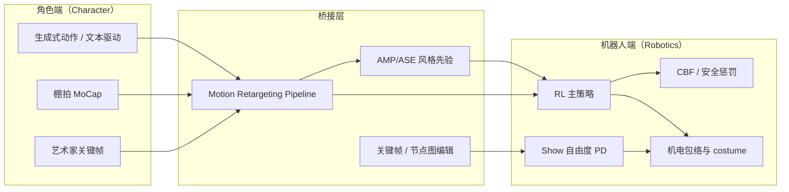

# Character Animation vs Robotics（角色动画与机器人控制的边界）

**一句话定义：** 当一个人形平台的目标函数里同时出现「表演可信度（character believability）」与「物理可控性（physical controllability）」时，工程取舍不再是纯粹的功能优化，而是**风格先验 × 机电包络 × 安全约束** 的三方博弈——这是「角色化人形（Character Humanoid）」与「研究/工业型人形」最容易混淆又最值得分清的一类边界问题。

## 英文缩写速查

| 缩写 | 英文全称 | 简要说明 |
|------|----------|----------|
| AMP | Adversarial Motion Prior | 用对抗判别约束状态转移接近专家运动分布的先验 |
| Retargeting | Motion Retargeting | 将人体/动物动作映射到目标机器人骨架 |
| G1 | Unitree G1 Humanoid | 宇树入门级教育科研人形平台 |
| RL | Reinforcement Learning | 通过与环境交互最大化长期回报来学习策略的范式 |
| Reward | Reward Function | 塑造强化学习策略行为的标量反馈 |
| DoF | Degrees of Freedom | 自由度，人形通常 20–50+ 关节 |
| MoCap | Motion Capture | 动作捕捉，参考动作与演示数据的主要来源 |
| URDF | Unified Robot Description Format | 统一机器人描述格式 |
| MJCF | MuJoCo XML Format | MuJoCo 的模型与场景描述格式 |
| ROS 2 | Robot Operating System 2 | 机器人系统集成与通信的常用中间件 |
| Isaac Lab | NVIDIA Isaac Lab | 基于 Omniverse 的机器人学习训练框架 |
| CBF | Control Barrier Function | 用前向不变集保证安全约束的控制屏障函数 |
| PD | Proportional–Derivative | 关节位置/阻抗底层控制，策略输出常为其 setpoint |
| IMU | Inertial Measurement Unit | 惯性测量单元，提供加速度与角速度 |
| Sim2Real | Simulation to Real | 把仿真中学到的策略迁移落地真机的工程主线 |
| ONNX | Open Neural Network Exchange | 跨框架神经网络模型交换格式 |
| MuJoCo | Multi-Joint dynamics with Contact | 接触丰富的刚体物理仿真引擎 |
| CAD | Computer-Aided Design | 计算机辅助设计，硬件结构建模 |
| GMR | General Motion Retargeting | 把人体/视频动作重定向为机器人可执行参考 |

## 为什么单独立一页

[Motion Retargeting](./motion-retargeting.md) 与 [Motion Retargeting Pipeline](./motion-retargeting-pipeline.md) 已经讲清楚「人怎么动 → 机器人怎么动」的几何与物理一致化链路；但仓库内仍混着多组**目标函数不同的人形平台**：

- **角色驱动型**（Disney Olaf、主题乐园型陪伴机器人）：可信度、机构隐藏、声学/热是一等公民；
- **研究型开源人形**（[Roboto Origin](../entities/roboto-origin.md)、[Asimov v1](../entities/asimov-v1.md)、[Unitree G1](../entities/unitree-g1.md) 等）：复现性、可拓展性与控制基线一等公民；
- **图形学起源的角色方法**（[DeepMimic](../methods/deepmimic.md)、[AMP](../methods/amp-reward.md)、[ASE](../methods/ase.md)）：本来面向**物理仿真角色**，后被搬到真实人形 RL；
- **工具链层**（[BotLab / MotionCanvas](../entities/botlab-motioncanvas.md)、[关键帧与运动编辑工具](../entities/robot-motion-keyframe-editors.md)）：把动画社区的「节点图 / 关键帧」语言塞进策略调试与示教后处理。

读者在跨页跳转时最容易把「角色动画语言」和「机器人控制语言」当成同一回事，本页给出**一组明确的张力维度与案例切片**，帮助选型与阅读时立刻定位上下文。

## 张力维度（六个最容易踩坑的轴）

| 维度 | 角色动画（Character Animation）一端 | 机器人控制（Robotics Control）一端 | 典型冲突 |
|------|--------------------------------------|-------------------------------------|----------|
| 目标函数 | 表演可信度、风格一致、艺术意图 | 任务成功率、能效、稳定裕度 | 「像 Olaf」≠ 物理最优；heel-toe 等艺术选择会增大力与声学挑战 |
| 时间尺度 | 离线单镜头、可重拍 | 在线连续部署、不许中断 | 动画里可手工修一帧；真机里必须自恢复 |
| 失败定义 | 「出戏」「不自然」 | 摔倒、超温、超力矩 | 风格惩罚和安全惩罚的权重必须分别建模（[Reward Design](./reward-design.md)） |
| 机构约束 | costume / 外观包络反向约束机构 | 任务功能反向约束机构 | Olaf 的非对称腿与泡沫裙：先有角色形象，再选 DoF |
| 数据来源 | 艺术家关键帧 / 棚拍 MoCap | 仿真 rollout / 真机日志 | 风格库通常没有物理一致版本，需要做 [Motion Retargeting Pipeline](./motion-retargeting-pipeline.md) |
| 工具生态 | DCC（Maya / [Blender](../entities/blender.md)）、节点图、动画引擎 | URDF / MJCF、ROS2、Isaac Lab | [BotLab / MotionCanvas](../entities/botlab-motioncanvas.md) 试图把两端拼到一张画布上 |

> 选型直觉：如果一段需求里「不像 X 角色 / 没有表演意图就算失败」，就应当把它放在 character 端，并显式增加 [CBF](./control-barrier-function.md) 风格的安全约束项；反之，研究/工业型人形可以把风格当成可选的奖励 shaping。

## 案例切片

### A. Disney Olaf（角色优先 + 物理硬约束）

参考 [Disney Olaf 角色机器人](../methods/disney-olaf-character-robot.md)：

- **机构服从角色**：非对称 6-DoF 双腿、泡沫雪球足、躯干内远端驱动，全部是为了在 costume 包络里隐藏机构。
- **奖励服从安全**：模仿项 + 正则 + **温度 / 关节限位的 CBF 风格惩罚** + **冲击降噪项**。
- **分层服从分工**：动力学敏感的主干 RL，低惯量「表演自由度」（眼 / 颌 / 臂）走经典 PD + 多项式映射。
- **接口服从演出**：策略切换、动画与音频触发由动画引擎统一生成 $g_t$，部署期就是「木偶手柄」。

### B. DeepMimic / AMP / ASE 谱系（图形学起源被借入机器人）

[Xue Bin Peng](../entities/xue-bin-peng.md) 主导的这条线起源于 **SIGGRAPH 物理角色**，后被 Cassie / G1 等真机 RL 大量借用：

- [DeepMimic](../methods/deepmimic.md)：以艺术家关键帧 / MoCap 为参考，靠**显式跟踪奖励**逼真模仿。
- [AMP](../methods/amp-reward.md)：把「像不像」交给判别器，避免手调跟踪权重；在真机上变成**风格先验**。
- [ASE](../methods/ase.md)：把多技能压成潜空间，分层控制时由上层选 latent。

> 迁移时易踩坑：图形学角色没有热模型、没有 IMU 噪声、没有传感延迟；同一套奖励直接搬上真机往往「仿真好看、真机抽搐」。是否需要补 [Sim2Real](./sim2real.md) 一层取决于目标平台。

**动作接口的前史（SCA 2017）：** [DeepRL 动作空间对比（SCA 2017）](../entities/paper-deeprl-locomotion-action-space-sca2017.md) 在平面物理角色上系统对比 **扭矩 / 肌肉激活 / 目标关节角（PD）/ 目标角速度** 四种参数化，结论与后续 Cassie / 四足真机路线一致——**带局部反馈的高层动作空间**（尤其 PD 目标角）通常比端到端扭矩 RL 学得更快、更鲁棒。这是「图形学角色 → 机器人控制」迁移链上 **最早的可复现对照实验之一**。

### C. BotLab / MotionCanvas（动画社区工具语言进入策略调试）

[BotLab / MotionCanvas](../entities/botlab-motioncanvas.md) 把动画社区熟悉的「节点图 / 时间线」搬到 **observation → ONNX → MuJoCo** 链路：

- **优势**：可视化、零安装、对齐 IsaacGym / IsaacLab 历史堆叠语义，适合教学与策略对照。
- **边界**：不是训练框架；浏览器 WebGL2/WebGPU 的能力限制了规模；**名称碰撞**（学术界另有同名视频生成项目）。
- **角色视角**：把 RL 策略当成「黑盒动画引擎」来 patch / 调参，是从动画工具语言反向理解策略行为的一条路径。

### D. 研究型开源人形（中性平台，既可做角色也可做研究）

[Roboto Origin](../entities/roboto-origin.md)、[Asimov v1](../entities/asimov-v1.md) 这类平台**本身并不偏角色化**，但因为可复现路径完整（CAD / URDF / 训练 / 部署 / 固件），常被社区用作：

- 角色 demo 的硬件载体（替换外观与表演动画即得到一台「家用陪伴角色」原型）；
- character animation 论文真机复现的目标平台（搬 DeepMimic / AMP 风格先验上来）。

> 这一类「中性平台」是判断「角色化是否会改写机构」的对照组：如果机构没有为角色形象做任何调整，那么落差完全由控制层吸收，参考 [Disney Olaf 角色机器人](../methods/disney-olaf-character-robot.md) 的「热 / 关节限位 / 声学」三类惩罚项。

### E. 关键帧 / 运动编辑工具（艺术家手工层）

[机器人关键帧与运动编辑工具](../entities/robot-motion-keyframe-editors.md) 与 DCC 软件构成的「手工编辑层」常见用法：

- 在 [Motion Retargeting Pipeline](./motion-retargeting-pipeline.md) 输出后做最后一公里**关键帧修整**（脚滑帧、自碰帧、非自然过渡帧）；
- 给真机演示视频做**可重复的剧本**，避免每次 RL rollout 都换味道；
- 与 ASE 等 latent 技能做「艺术家可拖动」的高层接口。

## 决策矩阵（什么时候应该用 character 视角）

| 场景特征 | 推荐视角 | 落地建议 |
|----------|----------|----------|
| 主题乐园 / 商场陪伴 / 教育表演 | character | 机构先于控制；加 CBF / 热 / 声学惩罚；分层 RL+经典 |
| 学术 RL benchmark（loco / manip） | robotics | 关注样本效率、稳定裕度；风格只在 reward shaping 选用 |
| 远程遥操作 + 美术回放 | mixed | 实时走 robotics，离线后处理走 character（关键帧修整） |
| 风格化短视频生成 → 真机回放 | character → robotics gate | 必须有物理可行性筛选（详见 pipeline 第 6 阶段） |
| 多技能潜空间高层控制 | mixed | 用 ASE / latent 选择器对接「动画导演」语言，下层仍是 RL tracking |

## 常见误区

- **把「像动画」当物理可行**：风格化步态的 heel-toe、夸张挥臂会显著放大冲击与力矩需求；要么补硬件余量，要么把这些选择改成可学的软约束。
- **把动画判别器（AMP）直接当真机控制器**：判别器只解决「像不像」，不会替你保证安全与稳定裕度，仍需 [Reward Design](./reward-design.md) 与 [CBF](./control-barrier-function.md) 配套。
- **混淆 character humanoid 与 character animation**：前者指**真机平台 + 角色目标**；后者指**纯仿真物理角色**。Olaf 是前者，DeepMimic 原始论文里的角色是后者。
- **名称碰撞**：本仓库的 [BotLab / MotionCanvas](../entities/botlab-motioncanvas.md) ≠ 学术界「MotionCanvas」视频生成项目；引用时务必锁定具体页面。
- **把开源研究人形误认为「角色化人形」**：Roboto Origin / Asimov v1 / Unitree G1 等机构上没有为某个角色形象做妥协，遇到角色化需求时需要**显式补一层 costume / 外观工程**，否则不应该套用 Olaf 一类的奖励模板。

## 流程总览：从「角色」到「机器人」的两条主路

## 与其他页面的关系

- 上游链路与方法谱系：[Motion Retargeting](./motion-retargeting.md)、[Motion Retargeting Pipeline](./motion-retargeting-pipeline.md)、[GMR vs NMR vs ReActor](../comparisons/gmr-vs-nmr-vs-reactor.md)。
- 安全与奖励配比：[Reward Design](./reward-design.md)、[Control Barrier Function](./control-barrier-function.md)。
- 实机案例：[Disney Olaf 角色机器人](../methods/disney-olaf-character-robot.md)；中性平台 [Roboto Origin](../entities/roboto-origin.md)、[Asimov v1](../entities/asimov-v1.md)。
- 风格先验方法：[DeepMimic](../methods/deepmimic.md)、[AMP](../methods/amp-reward.md)、[ASE](../methods/ase.md)；原作者索引 [Xue Bin Peng](../entities/xue-bin-peng.md)。
- **室内人–场景交互合成（运动学角色）：** [DIMOS](../entities/paper-dimos-human-scene-motion-synthesis.md)（ICCV 2023）用 RL 在 CVAE 运动基元潜空间上合成走–坐–躺序列，服务 AR/VR 与训练数据规模化；上真机需经重定向与接触动力学重建模，与 DeepMimic/AMP 的「仿真物理角色 → 机器人」迁移链正交。
- 工具层：[BotLab / MotionCanvas](../entities/botlab-motioncanvas.md)、[机器人关键帧与运动编辑工具](../entities/robot-motion-keyframe-editors.md)。

## 推荐继续阅读

- [Disney Olaf 论文（arXiv:2512.16705）](https://arxiv.org/abs/2512.16705) — 实机角色化人形最完整的工程报告
- [Peng et al., DeepMimic（arXiv:1804.06401）](https://arxiv.org/abs/1804.06401) — 物理角色 RL 模仿的奠基论文
- [Peng et al., AMP（SIGGRAPH 2021 主页）](https://xbpeng.github.io/projects/AMP/index.html) — 判别器驱动的风格保持

## 参考来源

- [sources/papers/disney_olaf_character_robot.md](../../sources/papers/disney_olaf_character_robot.md) — Olaf 实机角色（arXiv:2512.16705）
- [sources/papers/deepmimic.md](../../sources/papers/deepmimic.md) — DeepMimic 显式跟踪奖励
- [sources/papers/amp.md](../../sources/papers/amp.md) — AMP 判别器风格先验
- [sources/sites/botlab_motioncanvas.md](../../sources/sites/botlab_motioncanvas.md) — BotLab / MotionCanvas 浏览器节点图
- [sources/sites/xue-bin-peng.md](../../sources/sites/xue-bin-peng.md) — 角色动画 → 机器人控制研究脉络索引
- [sources/papers/deeprl_locomotion_action_space_sca2017.md](../../sources/papers/deeprl_locomotion_action_space_sca2017.md) — SCA 2017 四种动作空间对照
