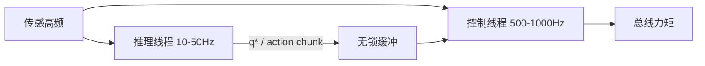

# 控制频率与推理频率解耦

## 一句话定义

**控制/推理频率解耦** 让 **慢模型**（策略、VLA、规划）以低频产出动作意图，由 **快控制器**（PD、WBC、阻抗）以高频执行，避免把推理延迟写进力矩周期。

## 英文缩写速查

| 缩写 | 英文全称 | 简要说明 |
|------|----------|----------|
| ZOH | Zero-Order Hold | 零阶保持，低频指令保持到下一次更新 |
| WBC | Whole-Body Control | 全身控制 |
| VLA | Vision-Language-Action | 视觉–语言–动作模型 |
| PD | Proportional-Derivative | 比例–微分关节伺服 |
| Hz | Hertz | 频率单位 |

## 为什么重要

- 端到端网络常 10–50 Hz；平衡与力控需要 200–1000 Hz。
- 强行同频要么欠稳定，要么 deadline miss——见 [延迟建模](../formalizations/control-loop-latency-modeling.md)。

## 核心原理

常见接口：

1. **目标位形/轨迹**：低频更新 $q^*$，高频 PD 跟踪。
2. **动作块 / chunk**：一次推理输出 $H$ 步动作，执行器按控制周期弹出。
3. **残差叠加**：高频基座控制器 + 低频残差修正。
4. **异步队列**：推理线程写 lock-free 缓冲，控制线程只读最新。

## 工程实践

- 例：Yobotics E3 模板约 **50 Hz 推理 / 500 Hz 发令**——见 [算法模板实体](../entities/jackhan-yobotics-e3-algorithm-template.md)。
- VLA + 底层控制器模式见 [VLA 与底层控制](../queries/vla-with-low-level-controller.md)；选型语境见 [具身大模型分类学选型闭环](../queries/embodied-fm-taxonomy-loop.md)。
- 推理超时：保持上一动作或切入安全 FSM，禁止阻塞控制线程。
- 度量：推理延迟、队列年龄、跟踪误差与控制 miss。

## 局限与风险

- Chunk 过长在接触丰富任务上会「开环太久」。
- 两边状态不同步（观测时刻 vs 执行时刻）会造成分布偏移。

## 关联页面

- [RTOS 与实时调度](./rtos-realtime-scheduling.md)
- [边缘–云端协同](./edge-cloud-robotics.md)
- [机器人安全状态机](./robot-safety-state-machine.md)

## 参考来源

- [DDS/RTOS/边云/OTA/安全 FSM 一手资料](../../sources/sites/dds_omg_rtos_edge_ota_safety_primary_refs.md)

## 推荐继续阅读

- [实时运控中间件配置指南](../queries/real-time-control-middleware-guide.md)
