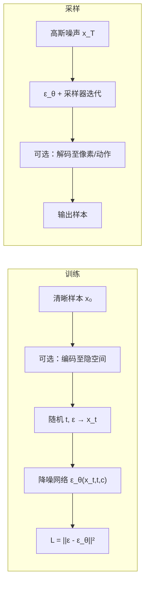

# Diffusion Model（扩散模型）

**扩散模型（Diffusion Model）**：人为定义从真实数据到高斯噪声的前向破坏过程，训练神经网络学习逆向降噪，使模型能从简单噪声分布经多步小幅修正生成结构化样本。

## 一句话定义

不一次性「画出」完整输出，而是 **反复执行「给定带噪状态 → 预测并去除少量噪声」**，从随机高斯噪声逐步还原到训练数据分布——训练目标稳定、可扩展，代价是采样阶段需多次网络前向。

## 英文缩写速查

| 缩写 | 英文全称 | 简要说明 |
|------|----------|----------|
| DDPM | Denoising Diffusion Probabilistic Models | 经典离散时间扩散：预测叠加噪声并迭代采样 |
| LDM | Latent Diffusion Model | 在自编码器隐空间执行降噪，降低高分辨率算力 |
| CFG | Classifier-Free Guidance | 采样时融合有/无条件预测以强化文本等约束 |
| DiT | Diffusion Transformer | 以 Transformer 替代 U-Net 的扩散骨干 |
| U-Net | U-shaped Convolutional Network | 编码–解码 + 跳跃连接的经典降噪架构 |

## 为什么重要

传统生成路线各有硬伤：**GAN** 对抗训练易不稳定且模式崩溃；**VAE** 重建损失偏平均导致样本平滑。扩散模型用 **确定性监督**（预测训练时人为添加的已知噪声）替代动态判别器博弈，训练损失简洁、规模化友好，已成为图像/视频/音频生成主流，并广泛迁移到机器人 **动作序列**（[Diffusion Policy](../methods/diffusion-policy.md)）、**全身运动**（[扩散运动生成](../methods/diffusion-motion-generation.md)）与世界模型等任务。

对机器人研究者：理解扩散 **不等于** 只会调 Stable Diffusion——关键是 **多步条件生成、多模态分布表达、调度与采样器权衡**，这些直接决定操作策略能否在接触丰富任务中稳定部署。

## 核心机制

### 1. 前向加噪（固定、无需学习）

对清晰样本 $x_0$，按调度表 $\beta_t$ 逐步叠加高斯噪声。任意时间步可 **一步采样**：

$$x_t = \sqrt{\bar\alpha_t}\, x_0 + \sqrt{1-\bar\alpha_t}\,\epsilon,\quad \epsilon \sim \mathcal{N}(0, I)$$

其中 $\bar\alpha_t = \prod_{s=1}^{t}(1-\beta_s)$ 为累积信号保留系数。训练时随机抽 $t$ 与 $\epsilon$，即得带噪样本与明确监督目标。

### 2. 逆向降噪（网络学习）

降噪网络 $\epsilon_\theta(x_t, t, c)$ 输入带噪状态、时间步 $t$、可选条件 $c$（文本、类别、观测等），最简 DDPM 范式 **预测噪声**：

$$\mathcal{L} = \mathbb{E}_{t, x_0, \epsilon}\big[\|\epsilon - \epsilon_\theta(x_t, t, c)\|^2\big]$$

同一损失在不同 $t$ 上同时覆盖 **局部细节修复**（低噪声）与 **全局结构推断**（高噪声）。

### 3. 时间步嵌入与骨干网络

标量 $t$ 经正弦嵌入映射为高维向量，注入 U-Net 残差块或 Transformer 调制层，使单套网络在全噪声强度区间切换行为。经典图像扩散用 **U-Net**（全局下采样 + 跳跃连接保细节）；现代高分辨率文生图转向 **隐扩散 + DiT/MM-DiT**，在压缩隐张量上以 patch token 做注意力。

### 4. 条件控制与引导

- **交叉注意力**：图像特征查询文本嵌入，逐步修正降噪轨迹
- **无分类器引导 (CFG)**：对比有/无条件双预测，$\hat\epsilon = \epsilon_\text{uncond} + w(\epsilon_\text{cond} - \epsilon_\text{uncond})$；$w$ 越大越贴提示词，但易损多样性与自然度
- **空间控制**：深度、边缘、姿态等结构化信号作为额外条件分支

### 5. 采样器（与网络分离）

降噪网络学 **修正方向**；**采样器** 决定如何用预测更新到下一噪声层级（DDPM 链式、DDIM、快速少步采样、蒸馏等）。同一训练网络可搭配不同采样器在速度–画质间取舍——机器人部署常追求 **极少步去噪**（如 TensorRT 2-step）以满足实时控制环。

## 流程总览

## 与 GAN / VAE 的对照

| 维度 | GAN | VAE | Diffusion |
|------|-----|-----|-----------|
| 训练信号 | 判别器对抗 | ELBO 重建 + KL | 回归已知噪声 |
| 生成方式 | 一步映射 | 隐变量解码 | 多步迭代降噪 |
| 多模态 | 模式崩溃风险 | 均值平滑 | 天然支持（随机噪声路径） |
| 采样成本 | 低 | 低 | 高（可多步蒸馏缓解） |

## 常见误区

1. **不是记忆每张训练图的还原路径**——学的是任意带噪状态下指向高概率数据区的通用修正规则
2. **初始噪声不含最终内容**——构图由随机种子 + 条件 + 采样轨迹共同决定
3. **提示词/条件非精确程序**——模型复现训练数据统计关联，计数与复杂空间关系易错
4. **CFG 系数非画质单调旋钮**——过高会损多样性与引入伪影
5. **扩散 ≠ 仅 DDPM**——Flow Matching、rectified flow、一致性模型等同族变体共享「噪声→数据迭代路径」思想；形式化见 [概率流](../formalizations/probability-flow.md)

## 现存局限（影响机器人迁移）

- **采样延迟**：多步前向是实时控制的硬约束；需蒸馏、少步采样或流匹配加速
- **细节与压缩**：隐扩散依赖自编码器，微小几何/接触细节可能丢失
- **条件精度**：文本等弱条件难以替代力/触觉等硬约束——操作任务常需 **观测条件 + 短视界动作块**
- **数据偏见**：降噪损失无法消除训练分布失衡

## 在机器人中的挂接

| 应用 | 条件 $c$ | 生成对象 | 代表页 |
|------|----------|----------|--------|
| 操作模仿 | 图像、点云、本体状态 | 动作序列块 | [Diffusion Policy](../methods/diffusion-policy.md) |
| 全身运动 | 地形、速度指令、文本 | 关节/笛卡尔轨迹 | [扩散运动生成](../methods/diffusion-motion-generation.md) |
| 世界模型 | 动作、历史观测 | 下一帧潜状态 | [生成式世界模型](../methods/generative-world-models.md) |

数学概率视角与 ELBO 对照见 [生成式模型基础](../formalizations/generative-foundations.md)。

## 关联页面

- [生成式模型基础](../formalizations/generative-foundations.md)
- [Diffusion Policy](../methods/diffusion-policy.md)
- [基于扩散的运动生成](../methods/diffusion-motion-generation.md)
- [概率流 (Probability Flow)](../formalizations/probability-flow.md)
- [模仿学习](../methods/imitation-learning.md)

## 参考来源

- [wechat_human_five_diffusion_model_intro.md](../../sources/blogs/wechat_human_five_diffusion_model_intro.md) — human five 微信公众号《Diffusion Model入门》（<https://mp.weixin.qq.com/s/P4SxYSBnxDjX5De1jxMxfA>）

## 推荐继续阅读

- Ho et al., *Denoising Diffusion Probabilistic Models* (NeurIPS 2020) — DDPM 原始论文
- Rombach et al., *High-Resolution Image Synthesis with Latent Diffusion Models* (CVPR 2022) — 隐扩散与交叉注意力条件
- Peebles & Xie, *Scalable Diffusion Models with Transformers* (ICCV 2023) — DiT 架构
