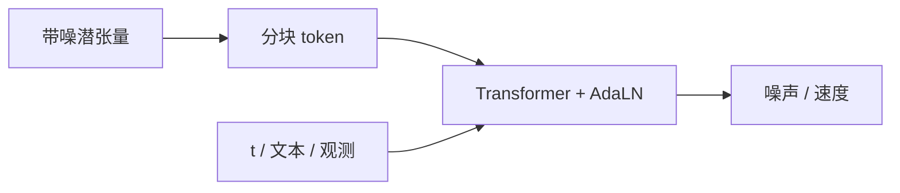

# DiT（Diffusion Transformer）

**DiT**：在隐扩散框架里，把带噪潜张量切成 patch token，用 **Transformer 块 + 条件调制**（时间步、类别、文本）预测噪声，从而用可扩展的注意力骨干替代经典 [U-Net](./unet.md)。

## 一句话定义

扩散的「怎么去噪」仍按 DDPM/flow 写，但「谁来去噪」换成与 ViT 同族的 Transformer。

## 英文缩写速查

| 缩写 | 英文全称 | 简要说明 |
|------|----------|----------|
| DiT | Diffusion Transformer | Transformer 扩散去噪骨干 |
| AdaLN | Adaptive LayerNorm | 把时间/条件注入每层的常用调制 |
| LDM | Latent Diffusion Model | 先压到隐空间再扩散 |
| FID | Fréchet Inception Distance | 图像生成质量指标 |
| VLA | Vision-Language-Action | 连续动作头大量采用 DiT/flow |

## 为什么重要

- [Peebles & Xie, 2023](../../sources/papers/peebles_dit_arxiv_2212_09748.md) 给出清晰的 **Gflops–FID** 缩放：更大 DiT 更强，不必死守 U 形跳跃。
- 机器人动作块是短序列，和 token 模型同构；公开 VLA（π、GR00T、Xiaomi 等）的连续头常写 **DiT + flow matching**。
- 读 VLA 论文 Method 时，「DiT 动作专家」指的是这条骨干，而不是新的扩散数学。

## 核心原理

1. VAE/AE 把图像（或动作）编到隐张量。
2. 按 [DDPM](../../sources/papers/ho_ddpm_arxiv_2006_11239.md) 或 flow 加噪。
3. 切 patch → Transformer（自注意力 + MLP），条件经 AdaLN / 交叉注意力进入。
4. 预测噪声或速度场，采样器迭代到干净样本。

## 工程实践

| 项 | 建议 |
|----|------|
| 图像生成 | 先用官方 DiT 权重复现 scaling，再改条件 |
| 动作头 | 观测走 VLM/CNN，动作块走小 DiT；步数压到实时预算 |
| 与 U-Net DP | 视觉操作仍可见 U-Net Diffusion Policy；全身/语言条件更常 DiT |
| 调试 | 分清「损失降了」与「控制环延迟炸了」 |

## 局限与风险

- 注意力随 token 数二次增长；高分辨率必须先隐压缩。
- 官方图像 DiT ≠ 即插即用的机器人策略。
- flow matching 与 DDPM 采样器不同，复现时不要混用训练目标。

## 关联页面

- [扩散模型](./diffusion-model.md)
- [Transformer](./transformer.md)
- [Diffusion Policy](../methods/diffusion-policy.md)
- [VLA](../methods/vla.md)
- [具身大模型分类学选型闭环](../overview/hub-embodied-foundation-model.md)
- [AI 架构地图](../overview/ai-architecture-map.md)

## 参考来源

- [DiT（arXiv:2212.09748）](../../sources/papers/peebles_dit_arxiv_2212_09748.md)
- [DDPM（arXiv:2006.11239）](../../sources/papers/ho_ddpm_arxiv_2006_11239.md)
- [AI 架构地图一手论文簇](../../sources/papers/ai_architecture_foundations.md)

## 推荐继续阅读

- 官方仓：<https://github.com/facebookresearch/DiT>
