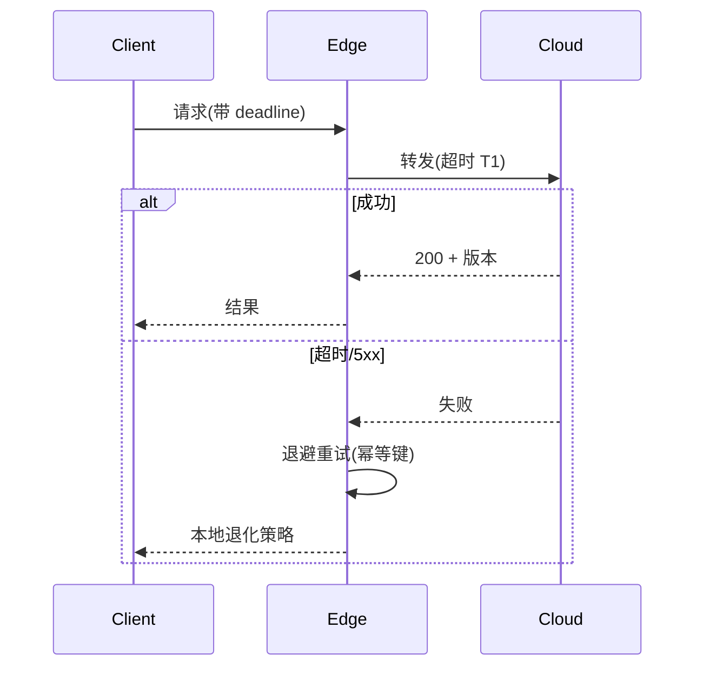

# 分布式系统基础（CAP / 选主 / 一致性 / 超时 / 重试）

## 一句话定义

**分布式系统基础** 给出多机协作时 **一致性、可用性、分区容忍** 的取舍，以及选主、超时与重试的工程默认值——并划清与机载安全 FSM 的边界。

## 英文缩写速查

| 缩写 | 英文全称 | 简要说明 |
|------|----------|----------|
| CAP | Consistency Availability Partition tolerance | 分区下一致性与可用性不可兼得的框架 |
| Raft | Raft Consensus Algorithm | 可理解的多数派共识/选主算法 |
| SLA | Service Level Agreement | 服务等级目标 |
| RTO | Recovery Time Objective | 恢复时间目标 |
| Quorum | Quorum | 多数派法定人数 |

## 为什么重要

- K8s 控制面、etcd、多区域数据复制都是分布式问题。
- 机器人队协同可容忍最终一致；**单机关节安全** 必须在本地确定性完成，不能等 Raft 选主。

## 核心原理

1. **CAP**：网络分区发生时，系统在 **线性一致** 与 **持续服务** 间二选一（简化叙述）。
2. **选主**：Raft 等用心跳与多数派选举 Leader；适合元数据服务，不适合力矩仲裁。
3. **一致性模型**：强一致 / 因果 / 最终一致——API 契约要写清。
4. **超时与重试**：无超时 = 无限阻塞；无抖动退避 = 重试风暴；无幂等 = 重复副作用。

## 工程实践

- 所有 RPC 设 **预算超时**（小于调用方 deadline）。
- 重试仅对幂等写；非幂等写用「创建一次」令牌。
- 机载 [安全状态机](./robot-safety-state-machine.md) 在总线超时后立即阻尼，不等云端。

## 局限与风险

- 把「K8s 高可用」误解为「机器人不会倒」——控制面可用 ≠ 物理安全。
- 时钟Skew 会破坏租约；分布式锁要谨慎。

## 关联页面

- [消息队列可靠性](./message-queue-reliability.md)
- [容器编排与 CI/CD](./container-orchestration-cicd.md)
- [机器人安全状态机](./robot-safety-state-machine.md)

## 参考来源

- [数据与分布式一手资料](../../sources/sites/systems_engineering_data_distributed_primary_refs.md)

## 推荐继续阅读

- Raft 论文：<https://raft.github.io/raft.pdf>
