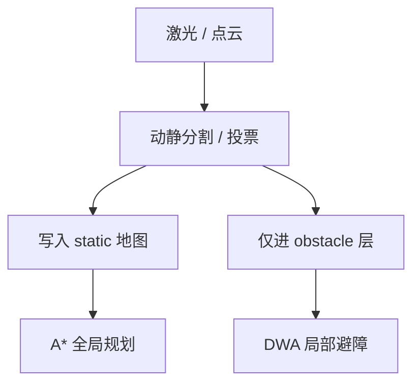

# 动态障碍物滤波（导航地图制作）

## 一句话定义

**动态障碍物滤波**在建图或代价地图流水线中识别并抑制 **非静态占用**（行人、临时堆物、扫描拖影），使二维导航地图主要表达墙体/家具等持久结构——对应课程第 4.1 节「动态障碍物剔除与二维导航地图制作」。

## 英文缩写速查

| 缩写 | 英文全称 | 简要说明 |
|------|----------|----------|
| Occupancy Grid | Occupancy Grid Map | 二维占据概率栅格 |
| Costmap | Cost Map | 规划用代价层（常含膨胀） |
| Static layer | Static Layer | 持久地图层 |
| Obstacle layer | Obstacle Layer | 实时障碍层 |
| Raycast | Ray Casting | 光束模型更新自由/占用 |
| Hit / Miss | Beam hit or free | 射线命中障碍或穿过自由 |

## 为什么重要

- **建图污染不可逆（几乎）**：人在激光前走过，若不滤波，地图留下「幽灵墙」；之后 [A\*](../methods/a-star.md) 会永远绕开或报不可达。
- **动静分层是工程常识**：运行时动态交给 obstacle 层 + [DWA](../methods/dwa.md)；静态层只服务长距离拓扑。课程把「先做干净 2D 图」放在全局规划之前，就是这个原因。
- **人形额外噪声**：行走晃动造成扫描拖影，易被误写成障碍条带。

## 核心原理

### 占据栅格更新（回顾）

激光束用 hit/miss 更新格子对数几率：短暂 hit 若无后续确认，不应把格子推到「确定占用」。

### 动态剔除常用手段（可组合）

| 手段 | 机制 | 适用 |
|------|------|------|
| 时序投票 | 多帧一致才写入 static | 建图阶段 |
| 高度/聚类 | 分离行人簇与墙面 | 3D→2D 投影前 |
| 运动一致性 | 与 odom 不符的扫描段标动态 | 有可靠里程计时 |
| 分层 costmap | static / obstacle / inflation 分离 | [Nav2](../entities/navigation2.md) 运行时 |
| 事后编辑 | 手工擦除幽灵 | 教学应急 |

### 与「二维导航地图制作」的关系

课程产出通常是：

1. 滤波后的占据栅格（`.pgm` + `.yaml` 或 toolbox 地图）；
2. 合理膨胀参数（≥ 机器人半径）；
3. 明确 **禁止** 把实时行人固化进该文件。

## 工程实践

### 建图阶段 SOP

1. 尽量空场慢速绕行；必要时限流。
2. 开启 toolbox/Cartographer 的动态相关选项或外置点云滤波节点。
3. 建完在 RViz 检查：走廊应笔直，无「人体切片」短墙。
4. 保存前用定位模式走一圈，确认 AMCL 粒子不在幽灵处炸开。

### 运行阶段 SOP

- Nav2：`static_layer` 只读地图；`obstacle_layer` 订阅实时扫描；inflation 作用在合成 costmap。
- 动态物体消失后，obstacle 层应在 clearing 射线下恢复自由——若不能，检查 `observation_sources` 与 raytrace 参数。

### 调试对照

| 症状 | 可能原因 |
|------|----------|
| A\* 绕空洞墙 | 建图未滤波 |
| 局部能过、全局说死路 | static 脏、obstacle 已空 |
| 地图「毛刺条带」 | 人形晃动/未去畸变 |
| 家具被抹掉 | 滤波过激进 |

## 局限与风险

- **可移动家具语义模糊**：办公椅算静还是动？需场景策略，而非单一阈值。
- **过保守 vs 过激进**：前者地图脏，后者丢真障碍。
- **误区**：「有 DWA 就不用干净地图」——远程目标与探索规划仍吃 static 层。

## 关联页面

- [A\*](../methods/a-star.md)
- [DWA](../methods/dwa.md)
- [里程计–激光融合](../methods/lidar-odometry-fusion.md)
- [Navigation2](../entities/navigation2.md)
- [slam_toolbox](../entities/slam-toolbox.md)
- [人形系统课程策展](../entities/humanoid-system-curriculum.md)

## 参考来源

- [深蓝学院人形系统课程大纲](../../sources/courses/shenlan_humanoid_system_theory_practice.md)
- [Navigation2 归档](../../sources/repos/navigation2.md)

## 推荐继续阅读

- Nav2 Costmap 2D：分层与插件文档 <https://docs.nav2.org/>
- *Probabilistic Robotics* 占据栅格建图章节
