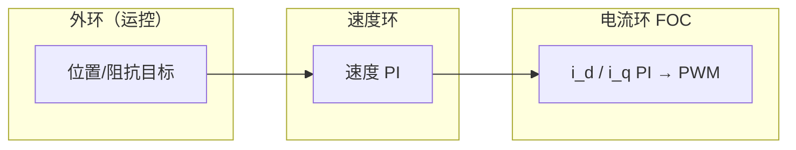

# 电机基础概念（Electric Motor Fundamentals）

**电机**把电能换成机械转矩；机器人关节选型与控制读法，需要先分清 **机型（有刷/BLDC/PMSM/步进/伺服）**、**控制层（FOC/V/F/三环）** 与 **负载匹配（TN 曲线、惯量比、工作制）**，再对接 [FOC 底软](./field-oriented-control.md) 与 [总线控制语义](../overview/motor-drive-firmware-bus-protocols.md)。

## 一句话定义

通电导体在磁场中受安培力产生转矩；旋转时绕组切割磁通产生 **反电动势**，与转速成正比，共同决定 **电流、转速、转矩与功率** 的可用区间。

## 英文缩写速查

| 缩写 | 英文全称 | 简要说明 |
|------|----------|----------|
| BLDC | Brushless DC Motor | 无刷直流，梯形反电势，常六步或 FOC 驱动 |
| PMSM | Permanent Magnet Synchronous Motor | 永磁同步，正弦反电势，适合 FOC 与伺服 |
| FOC | Field-Oriented Control | 磁场定向控制，$i_d/i_q$ 解耦转矩电流 |
| PWM | Pulse-Width Modulation | 脉宽调制调压/调流 |
| TN | Torque–Speed | 转矩–转速特性，含恒转矩区与恒功率区 |
| RPM | Revolutions Per Minute | 每分钟转数，与角速度 $\omega$ 换算 |

## 为什么重要

- **人形/四足关节** 几乎清一色 **永磁无刷 + 伺服驱动**（见 [Humanoid Hardware 101 电机节](../overview/humanoid-hardware-101-actuation-sensing-chain.md)）；误把 BLDC 方波机当理想力矩源会低估脉动与 [Sim2Real](./sim2real.md) 差距。
- **选型** 若只看额定功率而忽略 **峰值转矩、最高转速、惯量比与 S1/S2 工作制**，会出现过热、加速不足或振荡。
- **控制分工**：上层 RL/MPC 输出位置或阻抗目标，底层仍依赖 **电流环 FOC** 与 [PID/阻抗](../methods/pid-control.md) 跟踪。

## 核心机制

### 反电动势与功率

- 反电动势 $E \propto \omega$；给定母线电压下决定 **空载最高转速**；启动瞬间 $E\approx0$，需 **限流**。
- 机械功率 $P=T\omega$；常用 $T \approx 9550\,P/n$（$P$ 为 kW，$n$ 为 rpm）。
- 绕组稳态：$U = IR + E + L\,di/dt$；**电角度** = 机械角 × **极对数** $p$；同步转速 $n=60f/p$。

### 机型怎么选（压缩对照）

| 类型 | 换相/波形 | 何时考虑 |
|------|-----------|----------|
| 有刷 DC | 机械换向 | 极低成本、短寿命可接受（工具低端） |
| BLDC | 电子换向，梯形 EMF | 无人机桨、轮式底盘、成本敏感 BLDC |
| PMSM | 正弦 EMF + FOC | 工业机器人伺服、人形关节主流 |
| 异步电机 | 旋转磁场，转差 | 大功率风机水泵 + 变频器 |
| 步进 | 开环脉冲 | 3D 打印、轻载定位；**非**人形关节主选 |
| 伺服系统 | PMSM + 编码器 + 驱动器 | 高动态、宽调速、精确定位 |

现代商品常把「BLDC 硬件 + 正弦 FOC」混称；工程上应以 **反电势波形与控制策略** 为准，而非标签。

### 控制栈（与底软对齐）

- **[FOC](./field-oriented-control.md)**：在 dq 坐标系调节 $i_q$ 产转矩；机器人高性能关节默认路线。
- **V/F**：开环恒 $U/f$，适合异步风机类，**非**伺服关节主路径。
- **三环**：电流（最快）→ 速度 → 位置；带宽由内向外递减。
- **有感 / 无感**：零速满转矩、精定位 → 霍尔/编码器；高速、成本敏感 → 反电势或磁链观测（低速弱）。

### 选型检查单

1. **负载类型**：恒转矩（输送）/ 恒功率（主轴）/ 变转矩（风机 $T\propto n^2$）/ 定位往复（伺服）。
2. **峰值与 RMS 转矩、最高转速**（含加速惯量项）。
3. **惯量匹配**：$J_L/J_M$ 常取 $\lesssim 3\sim5$；过大则响应慢、易振。
4. **热与工作制**：S1 连续 vs S2/S3 断续；峰值力矩持续时间。
5. **编码器分辨率** vs 定位精度与成本。

## 常见误区

- **「伺服 = 某种电机型号」** — 伺服是 **电机 + 反馈 + 驱动器** 的系统概念。
- **「无刷 = 无感即可人形关节」** — 零速大转矩与精定位通常要有感反馈。
- **忽略反电动势** — 高速弱磁与母线电压上限由 $E$ 与逆变器能力共同决定（见 [TN 曲线](./motor-torque-speed-curve.md)）。

## 与其他页面的关系

- [Humanoid Hardware 101：电机/减速器/编码器](../overview/humanoid-hardware-101-actuation-sensing-chain.md) — 人形部件层结论
- [电机驱动器底软通信协议](../overview/motor-drive-firmware-bus-protocols.md) — MIT 紧凑帧与 CiA402 等 **L3 语义**
- [磁场定向控制 FOC](./field-oriented-control.md) — 电流环实现
- [人形关节电机拓扑选型](../queries/humanoid-joint-motor-topology-selection.md) — 减速比与 QDD 等纵深
- [执行器驱动链选型闭环](../queries/actuator-drive-chain-selection-loop.md) — 从电机到底软 FOC 的端到端链

## 推荐继续阅读

- 原文 FAQ（32 问）：[sources/blogs/wechat_motor_concepts_faq_2026-10-01.md](../../sources/blogs/wechat_motor_concepts_faq_2026-10-01.md)
- [SimpleFOC](../entities/simplefoc.md) — MCU 上复现 FOC 的原型路径

## 参考来源

- [电机相关概念常识的原理（微信公众号）](../../sources/blogs/wechat_motor_concepts_faq_2026-10-01.md)
