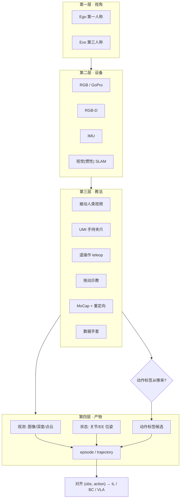

# 具身数据采集：四层术语地图

> 知识编译自 [具身智能前沿 · 四层读懂采集黑话（2026-09-05）](https://mp.weixin.qq.com/s/Eh2EWm9YSf0EgkksHIjVRQ)；原文为面向方案阅读的术语科普，本页提炼可交叉引用的判读骨架。

## 一句话定义

**具身数据采集术语** 常被混在同一句话里，但分别回答四个问题：**从谁的位置看（视角）**、**用什么传感（设备）**、**人怎样示范（教法）**、**最终记什么（产物）**；贯穿四层的主线是 **动作标签从哪来、能否直接用于训练**。

## 英文缩写速查

| 缩写 | 英文全称 | 简要说明 |
|------|----------|----------|
| Ego | Egocentric | 第一人称视角，从执行者自身位置观察 |
| Exo | Exocentric | 第三人称视角，从执行者外部观察 |
| UMI | Universal Manipulation Interface | 手持夹爪 + 腕部相机的无机器人示教接口（RSS 2024） |
| MoCap | Motion Capture | 动作捕捉，跟踪人体/标记点/骨架运动 |
| SLAM | Simultaneous Localization and Mapping | 同时定位与建图；视觉 SLAM / 视觉惯性 SLAM |
| IL | Imitation Learning | 从人类示范中学习策略 |
| BC | Behavior Cloning | 用观测直接回归示范动作的 IL 子类 |
| EE | End-Effector | 末端执行器（夹爪 TCP 等） |
| IK | Inverse Kinematics | 由任务空间目标反求关节角 |
| Episode | — | 有起止边界的一段交互记录（常含逐步 step） |

## 为什么重要

- **同一方案里名词层级不同**：「GoPro 拍 Ego + UMI 采 episode」混了品牌、视角、教法与产物；不拆层很难判断数据能否训练机器人策略。
- **视频 ≠ 机器人动作标签**：被动人类视频、Ego 生活片段与带对齐动作的 teleop 轨迹价值不同；[HumanNet 对比表](../comparisons/humannet-table1-human-video-corpora.md) 的 Direct / Indirect 划分与此一致。
- **教法决定标签形成成本**：UMI 用 SLAM 从手持端估计 6-DoF；遥操作记录真实机器人通道但指令≠执行；MoCap 需 [重定向](./motion-retargeting.md) 才接机器人。

## 四层阅读地图

| 层 | 回答的问题 | 典型名词 | 常见误区 |
|----|-----------|----------|----------|
| **视角** | 从谁的位置观察 | Ego、Exo | 视角不保证无遮挡、与部署相机一致，也不保证有动作标签 |
| **设备** | 用什么获取信号 | RGB、RGB-D、IMU、GoPro、SLAM | GoPro 是品牌；「只拍 RGB」≠ 设备不能输出 IMU |
| **教法** | 人怎样提供演示 | 被动视频、UMI、遥操作、拖动示教、MoCap、手套 | 设备（手套）与教法（遥操）可组合；UMI 是硬件+管线方案 |
| **产物** | 记录与组织什么 | 图像、位姿、关节角、力/触觉、episode、trajectory | 关节读数≠动作标签；小时数≠条数≠训练价值 |

> 四层是 **阅读地图**，不是互斥技术分类。

## 流程总览：从方案到可用训练对

## 各层要点

### 第一层：视角（Ego / Exo）

- **Ego**：执行者自身相机（头戴/胸挂/腕部），利于手–物关系，可能缺全局上下文。
- **Exo**：外部固定相机，利于人与场景布局，手指接触常被遮挡。
- **[Ego-Exo4D](https://ego-exo4d-data.org/)** 同步 ego+exo 互补；本库 [Ego4D](../entities/paper-ego4d.md) 页亦链到该生态后续。
- 同样是 Ego，可以是 **纯生活视频**，也可以来自 **UMI 手持夹爪**——后者才带可操作位姿标签。

### 第二层：设备（传感与几何）

- **RGB-D**：直接深度通道；仅有 RGB 时几何需多视角或模型估计（额外计算）。
- **IMU**：加速度/角速度；**不自动等于** 无漂移位姿——见 [IMU 原理与相机协同](./imu-principles-algorithms-camera-sync.md)。
- **SLAM**：估计自身运动与环境地图；UMI 用 **视觉惯性 SLAM + GoPro IMU** 得 **带真实尺度** 的夹爪 6-DoF 轨迹。
- 「用 GoPro 采集」只说明部分硬件；还需问 **安装位置、是否录 IMU、后续如何得动作**。

### 第三层：教法（演示如何变成标签）

| 教法 | 动作标签来源 | 代表系统 / 本库入口 |
|------|-------------|---------------------|
| 被动视频 | 通常 **无** 同步机器人动作；可用于表征/步骤 | Ego4D、人类活动视频 |
| UMI | SLAM 轨迹 + 视觉估夹爪宽度；需后处理与可行性筛选 | [UMI 论文](https://arxiv.org/abs/2402.10329)（**已开源** [`universal_manipulation_interface`](https://github.com/real-stanford/universal_manipulation_interface)）；[FastUMI](https://arxiv.org/abs/2409.19499) |
| 遥操作 | 真实机器人 obs + 命令/状态；**命令≠执行** | [Teleoperation](../tasks/teleoperation.md)、[DROID](../entities/droid-policy-learning.md)、ALOHA / Mobile ALOHA、GELLO |
| 拖动示教 | 手引导记录关节轨迹；需确认记录接口 | Universal Robots Freedrive 等 |
| MoCap | 人体/标记轨迹 → **重定向 + IK** → 机器人 | [HuMI](../entities/paper-notebook-humanoid-manipulation-interface.md)（UMI + Vive Ultimate ×5） |
| 数据手套 | 手指姿态；可录人体或接入灵巧手遥操 | [数据手套 vs 视觉遥操对比](../comparisons/data-gloves-vs-vision-teleop.md) |

**UMI 部署链（简化）**：手持示范 → SLAM/轨迹处理 → 机器人运动可行性筛选 → 策略训练（如 [Diffusion Policy](../methods/diffusion-policy.md)）→ 部署时 **延迟匹配**；非「采完即回放」。

**HuMI** 在 UMI 夹爪上叠加全身 Tracker，用 **在线 IK 预览** 保证 G1 可行域内示教——见已有实体页，本文不重复方法细节。

### 第四层：产物（episode 与统计口径）

- **Episode**：有起止边界的一段交互；RLDS 等格式按 **step** 组织时间序列。
- **Trajectory**：状态/观测/动作随时间的序列；口语里常把一条 episode 称为一条轨迹。
- **关节角 / EE 位姿**：要区分 **实测状态** 与 **作为监督的目标动作**。
- **DROID**：约 **7.6 万条** 与 **350 小时** 并存——条数计片段，小时计量时长，二者不可互换代表数据价值。
- **跨本体**：[Open X-Embodiment](./open-x-embodiment.md) 聚合 22 本体、100 万+ 轨迹；合并后仍需 **动作空间与坐标系** 处理。

## 读方案时的判读清单

1. **视角**：Ego 还是 Exo？与目标机器人相机布局是否一致？
2. **设备**：只有 RGB 还是 RGB-D/IMU？SLAM 或外部位姿跟踪是否参与？
3. **教法**：动作标签由 SLAM、teleop 记录、MoCap+重定向还是估计得到？失败/延迟如何处理？
4. **产物**：episode 含哪些字段？成功标记是否用于筛选？条数/小时/成功率各说明什么？
5. **训练接口**：数据给 [BC](../methods/behavior-cloning.md)、chunk 策略还是 [VLA](../methods/vla.md)？仿真数据是否涉及 [Sim2Real](./sim2real.md)？

## 局限与风险

- 原文为 **术语地图**，不替代各系统的标定、同步与 QA 文档；UMI/FastUMI/HuMI 工程细节以论文与官方仓库为准。
- **FastUMI**（arXiv:2409.19499）与国内 [FastUMI 开源生态](../entities/cn-os-fastumi-camera.md) 同名不同项目，选型时核对 arXiv 与机构。
- MoCap / 外骨骼 / VR 遥操均可能引入 **重定向误差、延迟与遮挡**；不能因「可穿戴」假设更低成本或更高质量。
- 被动视频与 Direct 机器人演示的 **训练用途不可互换**；跨本体聚合不等于免做动作对齐。

## 关联页面

- [Teleoperation（遥操作）](../tasks/teleoperation.md) — 教法层 teleop 谱系与 UMI 系无机器人采集对照
- [Imitation Learning](../methods/imitation-learning.md) — 演示 → 策略的学习范式
- [IMU：原理、算法与摄像头驱动协同](./imu-principles-algorithms-camera-sync.md) — 设备层 IMU 与视觉惯性 SLAM 上游
- [Motion Retargeting](./motion-retargeting.md) — MoCap / 人体示范到机器人的映射
- [Open X-Embodiment](./open-x-embodiment.md) — 跨本体产物聚合与训练叙事
- [HuMI](../entities/paper-notebook-humanoid-manipulation-interface.md) — MoCap + UMI 全身无机器人示范实例
- [DROID Policy Learning](../entities/droid-policy-learning.md) — 大规模 VR teleop 数据集
- [Query：操作演示数据采集指南](../queries/demo-data-collection-guide.md) — 实操向采集 checklist
- [具身数据从采集到飞轮（系列专辑 #1）](../overview/embodied-data-collection-to-flywheel-album.md)

## 参考来源

- [wechat_jushen_qianyan_embodied_data_collection_taxonomy_2026-09-05.md](../../sources/blogs/wechat_jushen_qianyan_embodied_data_collection_taxonomy_2026-09-05.md)
- [Ego、UMI、遥操作、动捕：四层读懂（微信公众号）](https://mp.weixin.qq.com/s/Eh2EWm9YSf0EgkksHIjVRQ)

## 推荐继续阅读

- Chi et al., *Universal Manipulation Interface* (RSS 2024) — [arXiv:2402.10329](https://arxiv.org/abs/2402.10329)
- FastUMI — [arXiv:2409.19499](https://arxiv.org/abs/2409.19499)
- Nai et al., *Humanoid Manipulation Interface* — [arXiv:2602.06643](https://arxiv.org/abs/2602.06643)
- [Ego-Exo4D 项目页](https://ego-exo4d-data.org/)
- [RLDS episode/step 格式](https://github.com/google-research/rlds)
