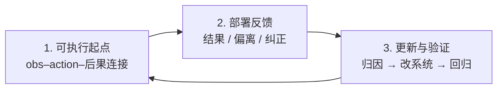

# 具身数据飞轮：最小闭环（避免空转）

> 知识编译自 [具身智能前沿 · 为什么飞轮仍会空转？（2026-09-12）](https://mp.weixin.qq.com/s?__biz=Mzg5OTY3ODkzNg==&mid=2247494430&idx=1&sn=a7590eafcec35ef4e52cbb18e738392e)；本页提炼 **最短信息链** 判据，与广义 [Data Flywheel](./data-flywheel.md) 互补。

## 一句话定义

**飞轮空转** 指只增加采集量却不改变下一版系统；**最小闭环** 要求：策略能在目标机器人上执行 → 每次执行留下可判定的结果与必要纠正 → 反馈触发可归因的更新并通过回归测试后再部署。

## 英文缩写速查

| 缩写 | 英文全称 | 简要说明 |
|------|----------|----------|
| VLA | Vision-Language-Action | 预训练后可作冷启动起点的多模态策略 |
| UMI | Universal Manipulation Interface | 无机器人手持示教，需 IK/可行性筛选后部署 |
| OXE | Open X-Embodiment | 跨本体轨迹聚合；非「倒进同一桶」即可 |
| RECAP | — | π*0.6 中自主 rollout + 纠正 + 结果回灌训练 |
| IK | Inverse Kinematics | UMI 部署时将末端轨迹映射到关节 |

## 为什么重要

- **「多部署就多数据」不完整**：无任务结果的视频只证明「动过」；缺场景/策略版本的失败无法复现与归因。
- **公开配方各异**：RT-2、OXE、GR00T、RECAP 数据组成不同，但共享 **执行—反馈—更新—再部署** 骨架。
- **加速器≠门票**：Ego、跨本体、仿真可扩覆盖，但不替代目标本体的执行验收（见系列 [#2](../overview/embodied-data-collection-to-flywheel-album.md) 金字塔与 [#4](./robot-data-supervision-signal-types.md) 监督分流）。

## 三节点最短链

### 1. 可执行起点（冷启动）

- **核心问题：** 观测、动作、时序、执行后果是否可靠连接？
- **真机 teleop：** 目标本体上同步记录画面、状态、指令、夹爪、任务结果（如 [DROID](../entities/droid-policy-learning.md) 7.6 万条 / 564 场景）。
- **UMI 路线：** 手持夹爪 + SLAM；训练前过滤不可行示范，部署时 IK/笛卡尔控制落实轨迹（见 [四层术语地图](./embodied-data-collection-four-layers-taxonomy.md)）。
- **Ego/Exo 仅 RGB：** 视觉与任务先验；**不能**自动替代目标机器人动作监督与真机验收。
- **VLA 预训练：** 通用经验在参数里；项目端仍要补任务、本体对齐与真机结果。

### 2. 部署反馈

试点阶段暴露训练集外失败（反光、时延、接触时机、假成功）。可用记录至少回答：

1. 任务是否完成？
2. 在哪一步偏离？
3. 是否有人接管/纠正？

**RECAP（π*0.6）** 样本：自主 rollout + 在线人工纠正 + 任务结果回灌——说明复杂任务里三类信号可同时存在，非「无人值守自学会一切」。

**Teleop 第二用途：** 冷启动采完整示范；部署时在将败时接管，留下 **偏离状态附近的修正** 样本。

### 3. 系统更新与验证

「上传日志 ≠ 回到能力里」。失败需归类并指向去处：

| 问题类型 | 典型去处 |
|----------|----------|
| 场景/物体未覆盖 | 补采数据 |
| 相机/动作/坐标未对齐 | 重标定、改 schema |
| 策略不懂任务 | 重训/后训练 |
| 接触/控制来不及 | 修控制器或延迟匹配 |
| 仿真资产/物理错误 | 改 sim + 回归用例 |

**例：** 杯面反光抓偏 → 保留画面+动作+**策略版本** → 判视觉 vs 控制 → 补样本或修模块 → **反光杯回归集** 通过后才再部署。

无版本与任务条件，失败只是录像；有之则成为下一轮 **必须跨过的门槛**。

## 闭环加速器（非必要）

| 加速器 | 作用 | 注意 |
|--------|------|------|
| [OXE](./open-x-embodiment.md) | 跨本体正迁移 | 动作空间/视角/任务分布仍需统一 |
| EgoMimic 类 | Ego+3D 手轨迹 + 真机 | 人类补广度、机器人锚物理 |
| 仿真 | 长尾/危险/重复初始条件 | 不能替代真机接触与时延验收 |

**最小底线三句：**（1）目标机器人可执行；（2）执行留结果/偏离/纠正；（3）反馈驱动更新且回归通过。

## 局限与风险

- 本文为 **信息链判据**，不替代具体项目的 RECAP/HG-DAgger/SOP 工程细节。
- 公开 blog/论文 **不代表** 完整生产系统；版本与 A/B 协议需自建。
- 与 [LWD](../methods/lwd.md) 等「失败也进 RL 飞轮」读法兼容：本页强调 **信号能否改变系统**，不否定失败轨迹价值。

## 关联页面

- [Data Flywheel（广义）](./data-flywheel.md)
- [监督信号分流](./robot-data-supervision-signal-types.md)
- [系列专辑地图](../overview/embodied-data-collection-to-flywheel-album.md)
- [Data Pyramid](../entities/paper-data-pyramid-embodied-manipulation.md)

## 参考来源

- [wechat_jushen_qianyan_data_flywheel_idle_spin_2026-09-12.md](../../sources/blogs/wechat_jushen_qianyan_data_flywheel_idle_spin_2026-09-12.md)
- [Ego、遥操、仿真都在采，为什么具身数据飞轮仍会空转？（微信公众号）](https://mp.weixin.qq.com/s?__biz=Mzg5OTY3ODkzNg==&mid=2247494430&idx=1&sn=a7590eafcec35ef4e52cbb18e738392e)

## 推荐继续阅读

- Khazatsky et al., *DROID* — [arXiv:2403.12945](https://arxiv.org/abs/2403.12945)
- Physical Intelligence, *π*0.6* — RECAP 流程
- [Arcadia](../entities/paper-arcadia.md) — 部署反馈同时写回资产与策略
