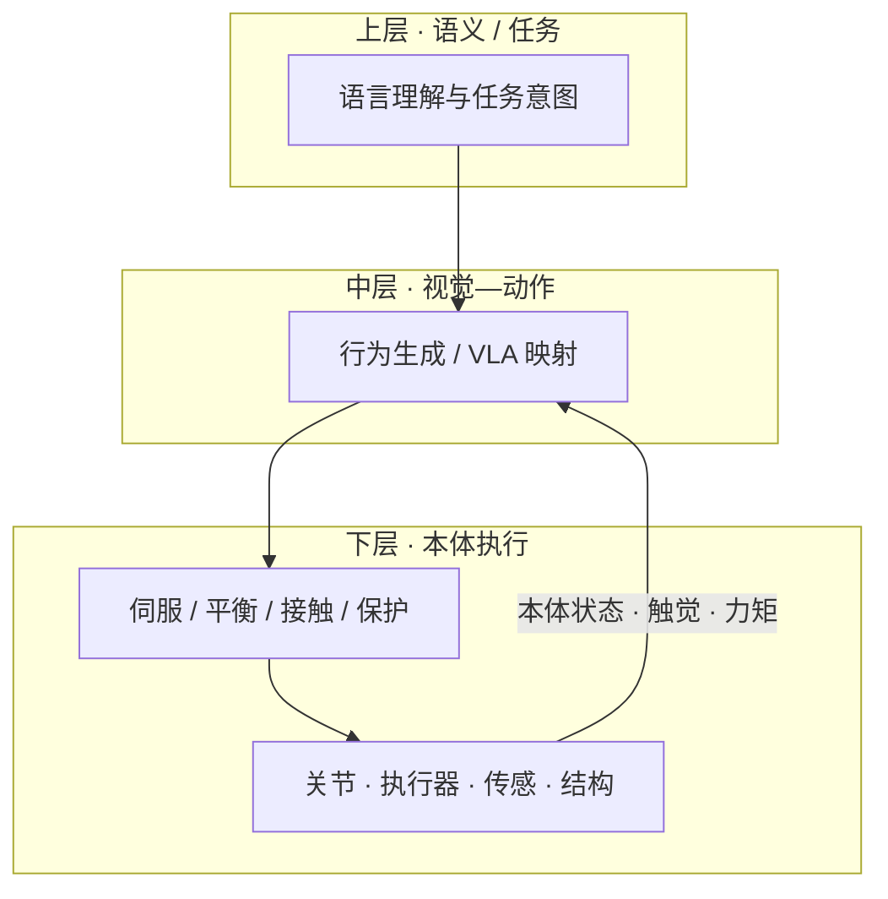

# 具身大模型与本体协同设计

## 一句话定义

**具身大模型与本体协同设计**指：具身智能的「通用」首先是 **在特定本体边界内扩大可执行任务覆盖面**，而非脱离硬件的万能模型；大模型公司下场自研执行器、传感与整机，是为了把 **数据闭环、分层控制带宽与仿真—标定—量产** 锁在同一条系统定义链上——这与强调模型泛化并不矛盾。

## 英文缩写速查

| 缩写 | 英文全称 | 简要说明 |
|------|----------|----------|
| EFM | Embodied Foundation Model | 具身基础/大模型，跨任务策略或 VLA 族 |
| DoF | Degrees of Freedom | 自由度，定义可达动作空间 |
| VLA | Vision-Language-Action | 视觉-语言-动作统一策略 |
| ISO/TS 15066 | ISO/TS 15066:2016 | 协作工业机器人系统与环境安全要求 |
| Sim2Real | Simulation to Reality | 仿真到真机迁移，依赖本体参数一致性 |
| DFM | Design for Manufacturing | 面向制造的设计，软硬件量产的共同语言 |

## 为什么重要

- **澄清「通用」两层含义**：模型层任务泛化（今天的主战场）与硬件层形态泛化（远未成熟）常被混谈，导致误判「自研本体 = 放弃通用」。
- **解释产业现象**：Figure、特斯拉等「大模型 + 自研人形」不是走回封闭软硬绑定老路，而是把 **物理闭环** 放回讨论中心。
- **给研发分阶段判据**：算法验证期可用成熟平台；产品交付期则本体、控制器、传感与售后须统一设计——见 [人形 practitioner 入场路线](../roadmaps/humanoid-practitioner-entry-roadmap.md)。

## 核心原理

### 有效通用性的工程分解

文内常用近似（任一因子偏弱都会把能力压回 demo 级）：

```
有效通用性 ≈ 模型泛化能力 × 本体可达动作空间 × 传感闭环质量 × 安全边界
```

- **动作空间**：关节能否到位、力矩是否够用、回差与热管理是否稳定（见 [机械布局设计](./humanoid-mechanical-layout-design.md)）。
- **传感闭环**：触觉/视觉/本体感知是否可信、标定是否可重复。
- **安全边界**：协作场景下受力、停止与故障降级是否可验证（**ISO/TS 15066** 等标准把结构、控制与感知绑成一体）。

### 案例：分层频率与本体绑定

公开产品信息中，**Figure Helix** 一类系统常呈现：**低频语义理解（约 7–9 Hz）+ 高频连续动作控制（约 200 Hz）+ 全上身多 DoF**。这说明「通用」建立在 **特定本体的控制栈** 上，而不是单一大模型直接驱动所有关节电流环。



与 [人形策略网络架构](./humanoid-policy-network-architecture.md)、[具身大模型分类学选型闭环](../overview/hub-embodied-foundation-model.md) 中的「大模型高层 + 实时低层」叙事同向。

### 为何大模型公司要定义本体

| 动机 | 机制 | 若本体非自研 |
|------|------|----------------|
| **数据资产** | 高质量示教数据带本体烙印（腕刚度、摩擦、编码器分辨率） | 数据闭环主导权不完整，跨批次难复现 |
| **控制分层** | 上层定意图，下层定捏/托/推抓与接触力 | 接口与延迟不匹配，泛化停在仿真 |
| **仿真—量产** | 质量/惯量/接触/延迟须与实机对齐 | 外购模组批次漂移，Sim2Real 失真 |
| **安全责任** | 协作标准要求可预测停止与传感布局 | 难以把标准、控制与量产设计合一 |

数据闭环典型链路：


### 模型通用 ≠ 硬件形态通用

- **模型层**：在固定本体上扩展未见物体、新指令、多机协同等任务覆盖——[Foundation Policy](./foundation-policy.md) 与 Open X-Embodiment 等路线的主战场。
- **硬件层**：「一套策略无差别驱动所有人形/臂/足」仍缺乏商品化条件；[跨具身迁移](../overview/hub-cross-embodiment.md) 研究的是 **有限接口下的迁移**，不是否认本体定义权。

## 工程实践

### 分阶段是否自研本体

| 阶段 | 目标 | 建议平台 |
|------|------|----------|
| 算法验证 | 感知、任务拆解、多模态交互 | 成熟机械臂、移动底盘、现成夹爪 |
| 产品交付 | 可重复作业、良率、售后、安全认证 | 统一本体 + 控制器 + 传感 + 工艺（见 [量产工程](./humanoid-mass-production-engineering.md)） |

### 自研本体的真实含义

- **不是** 从零制造每一颗螺丝。
- **是** 掌握系统级定义权：哪些外购、哪些定制、哪些参数与接口必须统一——与 [Hardware 101 技术地图](../overview/humanoid-hardware-101-technology-map.md) 中的执行器/传感链选型衔接。

### 选型自检（读后可用）

1. 本体的 **DoF 与力矩包络** 是否覆盖目标任务，而非只看模型参数量？
2. 数据采集—训练—部署是否 **同一套标定与维护口径**？
3. 仿真器中的 **接触与延迟** 是否与实机批次一致？
4. 若走协作部署，**ISO/TS 15066** 相关能力是否可追溯到结构设计？

## 局限与风险

- **本文为工程解读**，非厂商白皮书；Figure Helix、Optimus 等案例取自公开宣传，细节须以官方技术报告为准。
- **过度自研**：早期全栈自研会拖慢算法迭代；应匹配阶段目标。
- **过度外购**：产品化阶段关键模组批次不一致会导致数据与仿真双失效。
- **概念偷换**：把「跨具身数据集」误解为「无需固定本体即可交付」，会低估 [重定向与接口对齐](../overview/hub-cross-embodiment.md) 成本。

## 关联页面

- [具身大模型分类学选型闭环（知识链枢纽）](../overview/hub-embodied-foundation-model.md)
- [Foundation Policy（基础策略模型）](./foundation-policy.md)
- [人形策略网络架构](./humanoid-policy-network-architecture.md)
- [人形机器人量产工程能力](./humanoid-mass-production-engineering.md)
- [跨具身迁移（知识链汇总）](../overview/hub-cross-embodiment.md)
- [人形机械布局设计](./humanoid-mechanical-layout-design.md)

## 参考来源

- [wechat_zanehub_embodied_fm_why_self_develop_robot_body.md](../../sources/blogs/wechat_zanehub_embodied_fm_why_self_develop_robot_body.md) — Zane Hub 公众号：<https://mp.weixin.qq.com/s/Ao24KF_9mIt5qOwE7W92QA>

## 推荐继续阅读

- ISO/TS 15066:2016 — 协作工业机器人系统安全要求（与 ISO 10218 配套）
- [具身大模型分类学选型闭环](../overview/hub-embodied-foundation-model.md) — 模型族 I/O 边界与实时性取舍
